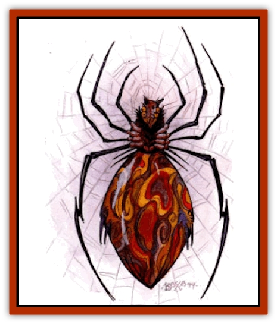

# Spider - Athas

| Statistic | **Dark** | **Mountain** | **Silt** |
| --- | --- | --- | --- |
| **Activity Cycle:** | Any | Any | Any |
| **Alignment:** | Neutral | Chaotic neutral | Neutral |
| **Armor Class:** | 2 | 2 | 7 |
| **Climate/Terrain:** | Subterranean | Any | Silt |
| **Damage/Attack:** | 1-10 (&times;2)/1-6 | 1-8 | 1-3 |
| **Diet:** | Carnivore | Carnivore | Carnivore |
| **Frequency:** | Very rare | Very rare | Common |
| **Hit Dice:** | 6 | 5+3 | 1+1 |
| **Intelligence:** | Highly to exceptional (13-16) | Exceptional (15-16) | Animal (1) |
| **Magic Resistance:** | Nil | Nil | Nil |
| **Morale:** | Elite (15) | Fanatic (18) | Average (9) |
| **Movement:** | 15 | 12 | 12, Sw 12 |
| **No. Appearing:** | 2-20 (1-4+2) | 5-20 | 6-36 |
| **No. of Attacks:** | 3 | 1 | 1 |
| **Organization:** | Tribe (patrol) | Pack | Swarm |
| **Size:** | M (4-6' long) | M (6' tall) | T (6&rdquo; long) |
| **Special Attacks:** | See below | Poison | Poison |
| **Special Defenses:** | Nil | Nil | Nil |
| **THAC0:** | 15 | 13 | 19 |
| **Treasure:** | Q&times;2 | E,N,Q | Nil |
| **XP Value:** | Warrior: 975 / Mage: 2,000 / Queen: 3,000 (8 HD) / Psionicist: +2,000 | 975 | 65 |

## Dark Spider

**Psionics Summary (Psionicist)**

| Level | Dis/Sci/Dev | Attack/Defense | Score | PSPs |
| --- | --- | --- | --- | --- |
| 9 | 2/3/10 | EW,MT,PsC/IF,MB,TS | 11 | 40 |

**Clairsentience -** *Sciences:* clairaudience, clairvoyance; *Devotions:* danger sense, feel sound, know direction, radial navigation, know location.

**Telepathy -** *Science:* mind link; *Devotions:* contact, ego whip, false sensory input, mind thrust, psionic crush.

**Psionics Summary (Queen)**

| Level | Dis/Sci/Dev | Attack/Defense | Score | PSPs |
| --- | --- | --- | --- | --- |
| 11 | 3/4/11 | EW,II,MT/IF,MBk,TW | 13 | 50 |

**Clairsentience -** *Sciences:* clairaudience, clairvoyance; *Devotions:* danger sense, feel sound, know direction, radial navigation, know location.

**Telepathy -** *Science:* mind link; *Devotions:* contact, ego whip, false sensory input, mind thrust, psionic crush.

**Psychometabolism -** *Science:* life draining; *Devotion:* expansion.

Dark spiders are intelligent, subterranean [[Spider|arachnids]] that live in small tribal units. Their race is divided among various functions - some have psionic powers and some can use defiler magic. Tribes are ruled by a powerful queen who is both a 6th-level psionicist and a 6th-level defiler.

Dark spiders are huge, disgusting spiders with oily black skin mottled with deep purple or red. They have somewhat humanoid faces and the more intelligent ones can actually speak the common tongue of merchants.

**Combat:** In melee, dark spiders attack with two forelegs and a poison bite The forelegs cause 1-10 (1d10) points of damage and the bite causes 1-6 (1d6) points of damage, plus poison. Their poison (type F) is deadly if the victim does not immediately successfully save vs. poison. A successful save prevents any damage to the victim, while a failed save causes immediate death.

The spiders often lay snares made from their webs to entrap their foes. They then descend upon their victims in one group attack. Their psionicists often lure potential victims into their webs.

The psionicists and defilers among them sometimes lead hunting parties of warrior dark spiders. They often sneak up on living creatures that are asleep. They usually attempt to bind them with their webbing and bring them back alive for their queen, but victims are poisoned and fed upon immediately if they put up a struggle.

**Habitat/Society:** There seem to be three types of spiders in a tribe. The first, and most common, is the warrior spider. One in five dark spiders is slightly more intelligent and has limited psionic powers. The second type of dark spider is the mage spider. These spiders also have slightly greater intelligence than other dark spiders. Defiler dark spiders are known to use as high as 6th-level defiler magic and 20% of them have psionics. These spiders share an elite position with the defiler dark spiders and act as leaders of warrior dark spiders. The last and most feared dark spider is the queen spider. The queen spider is an extremely powerful and skilled psionicist/defiler. She is considered a 7th-level defiler and a 6th-level psionicist. Her poison (type E) is even more deadly than that of other dark spiders and causes death if the victim does not make a successful save and 20 points of damage even if the save was successful.

**Ecology:** Dark spiders have no natural enemies, but often make enemies of beings living near their lairs. Their young are born in web sacks, located in the lair's hatchery.

The poison is highly prized by assassins. In rare cases, the spiders have been known to trade silk for live food. A number of merchant houses are rumored to trade slaves as food in exchange for valuable silk.

## Mountain Spider

**Psionics Summary**

| Level | Dis/Sci/Dev | Attack/Defense | Score | PSPs |
| --- | --- | --- | --- | --- |
| 13 | 3/4/12 | EW,II,MT,PB/IF,MB,TS,TW | 13 | 50 |

**Telepathy -** *Sciences:* domination, mass domination, psionic blast, mind link; *Devotions:* attraction, awe, contact, ego whip, empathy, id insinuation, invincible foes, mind thrust.

**Psychometabolism -** *Sciences:* nil; *Devotions:* body weaponry, catfall.

**Clairsentience -** *Sciences:* nil; *Devotions:* danger sense, sensitivity to observation.

There is a 10% chance that a mountain spider has psionic powers. Body weaponry: the weapons produced resemble insect parts

Mountain spiders are large creatures that resemble most other spiders except for their size and color. They blend in well with their surroundings, taking on the coloration of the rocks within the area shortly after birth.

They make their dens in small caves on cliff walls and mountain sides. They often prey upon birds and other creatures that get too close to then caves.

**Combat:** Mountain spiders prefer to attack by surprise. They attack by biting their opponents for 1-8 (1d8) points of damage and their bite carries with it a strong venom (type 0) that causes paralysis in a victim in 2-24 (2d12) minutes unless the victim makes a successful save vs. poison.

**Habitat/Society:** Mountain spiders are highly intelligent creatures and they use many tricks to lure in prey. They often place shiny metal objects just inside the entrances of their caves where the sun will shine on them, hoping the glare will attract the interest of travelers.

It is believed that many of their tunnels link together and that the mountain spiders have an almost tribal society composed of various smaller packs. Because no intelligent creature has crawled through the tunnels of these creatures, the truth remains unknown.

**Ecology:** Mountain spiders consume living flesh and blood, and they are especially fond of wounded [[Roc_Athas|rocs]].

The venom of mountain spiders is highly prized by assassins. A skilled priest, defiler, or preserver can transform it into a potion to cure paralysis.

## Silt Spiders

Silt spiders are small spiders that easily blend into silt-filled areas. They can swim through silt easily and often attack unseen, deep within the silt. They swarm all over anything that comes within their area. Worse than their bites is their poison. The poison causes no damage, but unless a victim makes a successful save vs. poison at +2, he becomes paralyzed and cannot move. Paralyzed victims are easily preyed upon by the swarming silt spiders. While the poison's effects wear off in 2-12 (2d6) rounds, most victims are bitten so many times they become food for the spiders long before the paralysis wears off.

---
## Discovery & Documentation

**Source Publication:** Dark Sun Appendix II - Terrors Beyond Tyr (1991)
**Campaign Setting:** Dark Sun
**Author(s):** Jim Atkiss, Steve Brown, Timothy B. Brown, Andrew P. Morris, Bruce Nesmith, Wes Nicholson, Bill Slavicsek

### Other Creatures Found in This Source Book
   * [[Aarakocra_Athas|Aarakocra (Athas)]]
   * [[Animal_Domestic_Athas_II|Animal, Domestic (Athas) II]]
   * [[Aviarag|Aviarag]]
   * [[Baazrag|Baazrag]]
   * [[Baazrag_Boneclaw|Baazrag, Boneclaw]]
   * [[Bloodgrass|Bloodgrass]]
   * [[Cactus_Hunting|Cactus, Hunting]]
   * [[Cactus_Rock|Cactus, Rock]]
   * [[Cilops|Cilops]]
   * [[Crodlu|Crodlu]]
   * [[Dagorran|Dagorran]]
   * [[Dhaot|Dhaot]]
   * [[Drake_Lesser_Athas_General_Information|Drake, Lesser (Athas), General Information]]
   * [[Drake_Lesser_Athas_Magma|Drake, Lesser (Athas), Magma]]
   * [[Drake_Lesser_Athas_Rain|Drake, Lesser (Athas), Rain]]
   * [[Drake_Lesser_Athas_Silt|Drake, Lesser (Athas), Silt]]
   * [[Drake_Lesser_Athas_Sun|Drake, Lesser (Athas), Sun]]
   * [[Dray|Dray]]
   * [[Drik|Drik]]
   * [[Dune_Reaper|Dune Reaper]]
   * [[Dwarf_Athas|Dwarf (Athas)]]
   * [[Elemental_Beast_Athas_Air|Elemental Beast (Athas), Air]]
   * [[Elemental_Beast_Athas_Earth|Elemental Beast (Athas), Earth]]
   * [[Elemental_Beast_Athas_Fire|Elemental Beast (Athas), Fire]]
   * [[Elemental_Beast_Athas_Water|Elemental Beast (Athas), Water]]
   * [[Elf_Athas|Elf (Athas)]]
   * [[Fael|Fael]]
   * [[Feylaar|Feylaar]]
   * [[Fordorran|Fordorran]]
   * [[Giant_Half-giant|Giant, Half-giant]]
   * [[Giant_Shadow|Giant, Shadow]]
   * [[Golem_Athas_Magma|Golem (Athas), Magma]]
   * [[Golem_Athas_Salt|Golem (Athas), Salt]]
   * [[Golem_Athas_General_Information|Golem (Athas), General Information]]
   * [[Gorak|Gorak]]
   * [[Halfling_Athas|Halfling (Athas)]]
   * [[Human_Athas|Human (Athas)]]
   * [[Jhakar|Jhakar]]
   * [[Kaisharga|Kaisharga]]
   * [[Kes'trekel|Kes'trekel]]
   * [[Klar|Klar]]
   * [[Krag|Krag]]
   * [[Kragling|Kragling]]
   * [[Lirr|Lirr]]
   * [[Mastyrial|Mastyrial]]
   * [[Meorty|Meorty]]
   * [[Mul|Mul]]
   * [[Nikaal|Nikaal]]
   * [[Paraelemental_Beast_General_Information|Paraelemental Beast, General Information]]
   * [[Paraelemental_Beast_Magma|Paraelemental Beast, Magma]]
   * [[Paraelemental_Beast_Rain|Paraelemental Beast, Rain]]
   * [[Paraelemental_Beast_Silt|Paraelemental Beast, Silt]]
   * [[Paraelemental_Beast_Sun|Paraelemental Beast, Sun]]
   * [[Pakubrazi|Pakubrazi]]
   * [[Psionocus|Psionocus]]
   * [[Psurlon|Psurlon]]
   * [[Raaig|Raaig]]
   * [[Retriever_Obsidian|Retriever, Obsidian]]
   * [[Ruktoi|Ruktoi]]
   * [[Ruvoka_Athas|Ruvoka (Athas)]]
   * [[Sand_Howler|Sand Howler]]
   * [[Scorpion_Athas|Scorpion (Athas)]]
   * [[Seed_Brain|Seed, Brain]]
   * [[Silt_Horror_Black|Silt Horror, Black]]
   * [[Silt_Horror_Magma|Silt Horror, Magma]]
   * [[Silt_Horror_Red|Silt Horror, Red]]
   * [[Silt_Spawn|Silt Spawn]]
   * [[Slig|Slig]]
   * [[Spinewyrm|Spinewyrm]]
   * [[Ssurran|Ssurran]]
   * [[Stalking_Horror|Stalking Horror]]
   * [[Tarek|Tarek]]
   * [[Tari|Tari]]
   * [[Thri-kreen|Thri-kreen]]
   * [[T'liz|T'liz]]
   * [[Tohr-kreen_II|Tohr-kreen II]]
   * [[Tohr-kreen_III|Tohr-kreen III]]
   * [[Trin|Trin]]
   * [[Tul'k|Tul'k]]
   * [[Undead_Athas_General_Information|Undead (Athas), General Information]]
   * [[Wraith_Athas|Wraith (Athas)]]
   * [[Xerichou|Xerichou]]
   * [[Zombie_Thinking|Zombie, Thinking]]
