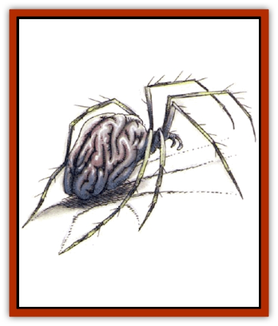

# Spider - Brain

| Statistic | **Spider, Brain** |
| --- | --- |
| **Activity Cycle:** | Any |
| **Alignment:** | Lawful evil |
| **Armor Class:** | 2 |
| **Climate/Terrain:** | Subtropical caverns |
| **Damage/Attack:** | 1d4/1d8 (&times;4) |
| **Diet:** | Brain fluid |
| **Frequency:** | Rare |
| **Hit Dice:** | 8 |
| **Intelligence:** | Semi (2-4) |
| **Magic Resistance:** | Nil |
| **Morale:** | Average (8-10) |
| **Movement:** | 9, Cl 15 |
| **No. Appearing:** | 1d6 |
| **No. of Attacks:** | 5 |
| **Organization:** | Pack |
| **Size:** | M (6' diameter, including legs) |
| **Special Attacks:** | Poison, graft weapons |
| **Special Defenses:** | Psionics |
| **THAC0:** | 13 |
| **Treasure:** | Z |
| **XP Value:** | 4,000 |

**Psionics Summary**

| Level | Dis/Sci/Dev | Attack/Defense | Score | PSPs |
| --- | --- | --- | --- | --- |
| 3 | 2/2/7 | EW/IF,MB | 15 | 90 |

**Telepathy -** *Science:* mind link; *Devotions:* contact, ego whip, intellect fortress, mind blank.

**Psychometabolism -** *Science:* shadow form; *Devotions:* body equilibrium, double pain, graft weapon.

The brain spider lives off the brain matter of intelligent creatures. Although it is not a true [[Spider|arachnid]], its exoskeleton is supported by eight hairy legs and it can climb walls and ceilings with ease. Its body resembles a gray, wrinkled mass of brain tissue, though in fact this is chitinous, not soft and pulpy. It has powerful mandibles capable of injecting venom, and it has four eyes. Brain spiders cannot spin webs.

They speak their own, sibilant language, but in combat with nonpsionic creatures they use telepathy to coordinate attacks.

**Combat:** Brain spiders generally attack from ambush, dropping onto their victims from a ceiling or other high ground, or suddenly appearing from their psionic shadow form, imposing a -2 penalty upon opponents' surprise rolls. They prefer to attack in groups, focusing their attacks on one or two victims and then leaving abruptly, hoping their poisonous bites do their work. They have been known to trail a party, waiting for one of the dead to be abandoned so they may feed.

The bite of the brain spider attacks the victim's central nervous system, first paralyzing and then killing. Unless a successful save vs. poison with a -4 penalty is rolled, the victim is immediately paralyzed and suffers 2d10 points of damage each round until death occurs. During this time, the poison runs rampant through the nerve paths and into the brain, permanently destroying 1 point of Intelligence or Dexterity each round (50% chance of either). When the venom has finished its work, the victim's nerves are liquified and the brain spider sucks out these juices for nourishment. If the saving throw is successful, the victim is merely paralyzed for one round, and then the effects are shaken off.

In addition to biting, brain spiders can rear up on their hind legs and attack with their four front legs. The sharp points and jagged backhooks on their forelimbs inflict 1d8 points of damage with each attack, and this damage can be greater if they use weapons. Brain spiders often employ their psionic graft weapon ability to bond magical weapons or other objects to their forelimbs. This bond is permanent until a brain spider mentally "rejects" a grafted item. Attacks with these weapons are made with a +1 bonus on attack and damage rolls (in addition to magical bonus). Bonded wands are hooked into the spider's nervous system and may be employed as well.

**Habitat/Society:** Brain spiders have a strict pack dominance hierarchy, and lower-ranked members are completely servile to higher-ranking members. The leader is a crude and brutish tyrant, usually referred to by pompous titles such as Master Thug or King Venom. Pack culture consists of retelling tales of particularly delicious kills, gruesome stallings, and clever prey. Brain spiders think double pain provides particularly good sport with weak prey. They are cowards at heart, quick to flee if one or more of the pack is slain.

Although brain spiders are crude and even stupid, they have remarkable cunning when hunting. One of their favorite tricks is to use their body equilibrium discipline to stand over quicksand, a pit trap, or wreak ledges, goading victims into approaching them, and then attacking the trapped prey.

**Ecology:** Brain spiders prefer to hunt and kill intelligent and psionic creatures, as these provide the richest cerebral nectar. They dwell underground, where solitary [[Elf_Drow|drow]] and [[Mind_Flayer|mind flayers]] sometimes fall into their clutches.

---
## Discovery & Documentation

**Source Publication:** Monstrous Compendium, 1994 Annual, Volume 1 (1995)
**Campaign Setting:** Advanced Dungeons & Dragons 2nd Edition
**Author(s):** David Wise

### Other Creatures Found in This Source Book
   * [[Abyss_Ant|Abyss Ant]]
   * [[Achaierai|Achaierai]]
   * [[Afanc|Afanc]]
   * [[Al-Jahar|Al-Jahar]]
   * [[Baelnorn|Baelnorn]]
   * [[Baneguard|Baneguard]]
   * [[Banelar|Banelar]]
   * [[Bird_Talking|Bird, Talking]]
   * [[Blazing_Bones|Blazing Bones]]
   * [[Campestri|Campestri]]
   * [[Caniquine|Caniquine]]
   * [[Cat_Winged|Cat, Winged]]
   * [[Crypt_Servant|Crypt Servant]]
   * [[Death's_Head_Tree|Death's Head Tree]]
   * [[Dog_Saluqi|Dog, Saluqi]]
   * [[Dragon_Electrum|Dragon, Electrum]]
   * [[Dragon_Fang|Dragon, Fang]]
   * [[Dragon_Linnorm_Corpse_Tearer|Dragon, Linnorm, Corpse Tearer]]
   * [[Dragon_Linnorm_Dread|Dragon, Linnorm, Dread]]
   * [[Dragon_Linnorm_Flame|Dragon, Linnorm, Flame]]
   * [[Dragon_Linnorm_Forest|Dragon, Linnorm, Forest]]
   * [[Dragon_Linnorm_Frost|Dragon, Linnorm, Frost]]
   * [[Dragon_Linnorm_Gray|Dragon, Linnorm, Gray]]
   * [[Dragon_Linnorm_Land|Dragon, Linnorm, Land]]
   * [[Dragon_Linnorm_Midgard|Dragon, Linnorm, Midgard]]
   * [[Dragon_Linnorm_Rain|Dragon, Linnorm, Rain]]
   * [[Dragon_Linnorm_Sea|Dragon, Linnorm, Sea]]
   * [[Dragon_Neutral_Jacinth|Dragon, Neutral, Jacinth]]
   * [[Dragon_Neutral_Jade|Dragon, Neutral, Jade]]
   * [[Dragon_Neutral_Pearl|Dragon, Neutral, Pearl]]
   * [[Dread|Dread]]
   * [[Dragon-kin|Dragon-kin]]
   * [[Elemental_Earth_Kin_Chrysmal|Elemental, Earth Kin, Chrysmal]]
   * [[Elemental_Earth_Kin_Earth_Weird|Elemental, Earth Kin, Earth Weird]]
   * [[Elemental_Fire_Kin_Azer|Elemental, Fire Kin, Azer]]
   * [[Elemental_Sandman|Elemental, Sandman]]
   * [[Elemental_Wind_Walker|Elemental, Wind Walker]]
   * [[Elemental_Vermin|Elemental Vermin]]
   * [[Feystag|Feystag]]
   * [[Flame_Skull|Flame Skull]]
   * [[Foulwing|Foulwing]]
   * [[Gambado|Gambado]]
   * [[Garbug|Garbug]]
   * [[Genie_Tasked_Administrator|Genie, Tasked, Administrator]]
   * [[Genie_Tasked_Deceiver|Genie, Tasked, Deceiver]]
   * [[Genie_Tasked_Harim_Servant|Genie, Tasked, Harim Servant]]
   * [[Genie_Tasked_Messenger|Genie, Tasked, Messenger]]
   * [[Genie_Tasked_Miner|Genie, Tasked, Miner]]
   * [[Genie_Tasked_Oathbinder|Genie, Tasked, Oathbinder]]
   * [[Gibbering_Mouther|Gibbering Mouther]]
   * [[Gnasher|Gnasher]]
   * [[Gnasher_Winged|Gnasher, Winged]]
   * [[Golem_Brain|Golem, Brain]]
   * [[Golem_Hammer|Golem, Hammer]]
   * [[Golem_Metagolem|Golem, Metagolem]]
   * [[Golem_Spiderstone|Golem, Spiderstone]]
   * [[Gorynych|Gorynych]]
   * [[Greelox|Greelox]]
   * [[Helmed_Horror|Helmed Horror]]
   * [[Jarbo|Jarbo]]
   * [[Laraken|Laraken]]
   * [[Lich_Psionic|Lich, Psionic]]
   * [[Living_Steel|Living Steel]]
   * [[Lock_Lurker|Lock Lurker]]
   * [[Loxo|Loxo]]
   * [[Lycanthrope_Loup_de_Noir|Lycanthrope, Loup de Noir]]
   * [[Lycanthrope_Werebadger|Lycanthrope, Werebadger]]
   * [[Lycanthrope_Werejaguar|Lycanthrope, Werejaguar]]
   * [[Lythlyx|Lythlyx]]
   * [[Magebane|Magebane]]
   * [[Marrashi|Marrashi]]
   * [[Metalmaster|Metalmaster]]
   * [[Mimic_House_Hunter|Mimic, House Hunter]]
   * [[Naga_Bone|Naga, Bone]]
   * [[Nautilus_Giant|Nautilus, Giant]]
   * [[Nightshade_Toril|Nightshade (Toril)]]
   * [[Nishruu|Nishruu]]
   * [[Noran|Noran]]
   * [[Opinicus|Opinicus]]
   * [[Ormyrr|Ormyrr]]
   * [[Parasite|Parasite]]
   * [[Pasari-Niml|Pasari-Niml]]
   * [[Plant_Vampire_Moss|Plant, Vampire Moss]]
   * [[Pteraman|Pteraman]]
   * [[Rautym|Rautym]]
   * [[Shadeling|Shadeling]]
   * [[Skum|Skum]]
   * [[Snake_Giant_Cobra|Snake, Giant Cobra]]
   * [[Snake_Stone|Snake, Stone]]
   * [[Spectral_Wizard|Spectral Wizard]]
   * [[Spell_Weaver|Spell Weaver]]
   * [[Suwyze|Suwyze]]
   * [[Tatalla|Tatalla]]
   * [[Tick_Heart|Tick, Heart]]
   * [[Tree_Dark|Tree, Dark]]
   * [[Tree_Singing|Tree, Singing]]
   * [[Tressym|Tressym]]
   * [[Troll_Snow|Troll, Snow]]
   * [[Tuyewera|Tuyewera]]
   * [[Ulitharid|Ulitharid]]
   * [[Undead_Dwarf|Undead Dwarf]]
   * [[Undead_Lake_Monster|Undead Lake Monster]]
   * [[Whipsting|Whipsting]]
   * [[Windghost|Windghost]]
   * [[Wolf_Dread|Wolf, Dread]]
   * [[Wolf_Stone|Wolf, Stone]]
   * [[Wolf_Vampiric|Wolf, Vampiric]]
   * [[Wraith_Shimmering|Wraith, Shimmering]]
   * [[Xantravar|Xantravar]]
   * [[Xaver|Xaver]]
