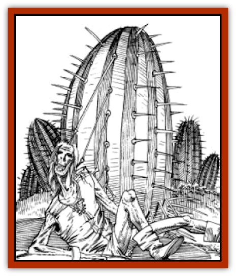

# Spider Cactus

| Statistic | **Spider Cactus** |
| --- | --- |
| **Activity Cycle:** | Day |
| **Alignment:** | Neutral |
| **Armor Class:** | 7 |
| **Climate/Terrain:** | Tablelands |
| **Damage/Attack:** | 1+ (see below) |
| **Diet:** | Carnivore |
| **Frequency:** | Uncommon |
| **Hit Dice:** | 3 |
| **Intelligence:** | Non (0) |
| **Magic Resistance:** | Nil |
| **Morale:** | Average (8-10) |
| **Movement:** | 0 |
| **No. Appearing:** | 2-8 |
| **No. of Attacks:** | 8 |
| **Organization:** | Patch |
| **Size:** | M (6-7' tall) |
| **Special Attacks:** | Needles cause paralysis |
| **Special Defenses:** | See below |
| **THAC0:** | 17 |
| **Treasure:** | Nil |
| **XP Value:** | 270 |

Spider cactus patches look like any patch of harmless cacti until a victim is showered by their needles. The victim is then dragged into the cactus, where the feeding needles make a slow feast of the hapless being.

The spider cactus has a barrel-shaped body, 2 to 3 feet across, and from 6 to 7 feet tall. It is bright green in color, with streaks of white along the barrel. The needles are purple and green.

**Combat:** The spider cactus sits unmoving until a victim or victims are within range. Anyone that moves within 15' of this deadly cactus is subject to attacks from its tethered projectile needles. Spider cacti can sense living creatures and anything with liquid.

The spider cactus has 5-8 (d4+4) sets of barbed purple projectile needles and 3d6 larger green feeding needles. It always attacks with a set of 8 purple needles. They attack only one victim at a time. It takes three rounds to pull strands which miss back in and a full day before they can fire again. If some of the strands are severed, it does not use that set again until all eight are restored. Damaged needles regrow at the rate of three per week.

In combat, the cactus first fires a set of purple needles, attempting to capture a victim. The victim is then dragged to the body and impaled on the feeding needles. The cactus feeds until it has drained all available liquid from the victim, and then releases the husk.

Each cactus in range attacks with its purple projectile needles. A normal attack roll is required for each needle. If the needles hit, they cause 1 point of damage. The victim must also save versus poison or be paralyzed, paralysis occurring in 2d4 rounds. The needles are coated with a weak poison, so saves receive a +2 bonus. A saving throw is required for each needle that hits. The projectile needles are retracted at a rate of five feet per round.

A being impaled on the green feeding needles takes 2d4 points plus its AC in damage. Shield adjustments do not count towards the victims AC, and if the victim is paralyzed, he also loses dexterity adjustments. Until then, he can squirm and try to avoid the feeding needles. The tethers are very strong and pull with a strength of 17. It requires a strength greater than 17 to have any chance to break free. If the victim has the required strength and spends a round doing nothing else, he can pull out a needle or break a strand. It requires an open doors roll to pull the needle out and a bend bars roll to break a strand. The strand can also be severed; each strand is AC 5 and takes 5 points of damage to cut. Blunt weapons have no effect on a strand. Since the needles are barbed, pulling one out causes an additional 1d4 points of damage to the victim. Note that the poison is administered on contact. Therefore, if a victim has failed its saving throw, the paralysis will occur even if the needle is pulled out immediately.

The spider cacti are competitive - if one victim is in range of several cacti, it is fought over by all of them. If one victim is snared by several cacti, the cactus with the most needles in him is the one that finally gets him. However, the other cacti pull as long as they can until their needles finally rip out, causing another 1d4 points of damage to the victim for each needle that is thus removed.

**Habitat/Society:** The spider cactus grows in patches, usually along roads where there is food. The spider cactus blooms when it rains, and within the same day thousands of eight-frond seeds are released. The first seed to hit the ground is the only one to sprout, quickly absorbing any liquid in the air. This means that a spider cactus patch usually only gains one new plant for every rainstorm. A young spider cactus grows at a rate of one foot a month until it reaches full growth

**Ecology:** Spider cacti have few natural enemies. It is perhaps the only creature that can even feed on [[Kank_Wild|kanks]].

If the needles are rendered ineffective (fire is the most likely way of doing this), the cactus can be tapped for its liquid. It produces a honey-like liquid, similar to the product of [[Animal_Domestic_Athas_I|erdlu]]  eggs. Up to a gallon of this liquid can be tapped from a spider cactus. This liquid provides both food and water. A gallon of this liquid can be used to replace one gallon of water, or it can be used to provide nourishment for up to four man-sized beings for one day.

---
## Discovery & Documentation

**Source Publication:** MC12 Dark Sun Appendix I - Terrors of the Desert (1991)
**Campaign Setting:** Dark Sun
**Author(s):** Tom Prusa, Louis J. Prosperi, Walter M. Baas

### Other Creatures Found in This Source Book
   * [[Animal_Herd_Athas|Animal, Herd (Athas)]]
   * [[Animal_Household_Athas|Animal, Household (Athas)]]
   * [[Antloid_Desert|Antloid, Desert]]
   * [[Banshee_Dwarf|Banshee, Dwarf]]
   * [[Beetle_Agony|Beetle, Agony]]
   * [[Bog_Wader|Bog Wader]]
   * [[Brambleweed|Brambleweed]]
   * [[B'rohg|B'rohg]]
   * [[Burnflower|Burnflower]]
   * [[Cat_Psionic|Cat, Psionic]]
   * [[Cha'thrang|Cha'thrang]]
   * [[Cistern_Fiend|Cistern Fiend]]
   * [[Clam_Giant|Clam, Giant]]
   * [[Cloud_Ray|Cloud Ray]]
   * [[Drake_Athas_Air|Drake (Athas), Air]]
   * [[Drake_Athas_Earth|Drake (Athas), Earth]]
   * [[Drake_Athas_Fire|Drake (Athas), Fire]]
   * [[Drake_Athas_Water|Drake (Athas), Water]]
   * [[Dune_Runner|Dune Runner]]
   * [[Dune_Trapper|Dune Trapper]]
   * [[Elemental_Athas_Greater_Air|Elemental (Athas), Greater, Air]]
   * [[Elemental_Athas_Greater_Earth|Elemental (Athas), Greater, Earth]]
   * [[Elemental_Athas_Greater_Fire|Elemental (Athas), Greater, Fire]]
   * [[Elemental_Athas_Greater_Water|Elemental (Athas), Greater, Water]]
   * [[Elemental_Athas_Lesser_Air_Earth|Elemental (Athas), Lesser, Air/Earth]]
   * [[Elemental_Athas_Lesser_Fire_Water|Elemental (Athas), Lesser, Fire/Water]]
   * [[Elemental_Athas_General_Information|Elemental (Athas), General Information]]
   * [[Erdland|Erdland]]
   * [[Esperweed|Esperweed]]
   * [[Flailer|Flailer]]
   * [[Floater|Floater]]
   * [[Giant_Athas|Giant (Athas)]]
   * [[Golem_Athas_I|Golem (Athas) I]]
   * [[Golem_Athas_II|Golem (Athas) II]]
   * [[Golem_Athas_III|Golem (Athas) III]]
   * [[Golem_Athas_General_Information|Golem (Athas), General Information]]
   * [[Halfling_Renegade|Halfling, Renegade]]
   * [[Hej-kin|Hej-kin]]
   * [[Id_Fiend|Id Fiend]]
   * [[Insect_Swarm_Athas|Insect Swarm (Athas)]]
   * [[Kank_Wild|Kank, Wild]]
   * [[Kirre|Kirre]]
   * [[Megapede|Megapede]]
   * [[Mul_Wild|Mul, Wild]]
   * [[Nightmare_Beast|Nightmare Beast]]
   * [[Plant_Carnivorous_Athas|Plant, Carnivorous (Athas)]]
   * [[Pterran|Pterran]]
   * [[Pterrax|Pterrax]]
   * [[Pulp_Bee|Pulp Bee]]
   * [[Pyreen|Pyreen]]
   * [[Rasclinn|Rasclinn]]
   * [[Razorwing|Razorwing]]
   * [[Roc_Athas|Roc (Athas)]]
   * [[Sand_Bride|Sand Bride]]
   * [[Sand_Cactus|Sand Cactus]]
   * [[Sand_Vortex|Sand Vortex]]
   * [[Scrab|Scrab]]
   * [[Silt_Horror|Silt Horror]]
   * [[Silt_Runner|Silt Runner]]
   * [[Sink_Worm|Sink Worm]]
   * [[Sloth_Athas|Sloth (Athas)]]
   * [[So-ut|So-ut]]
   * [[Spider_Crystal|Spider, Crystal]]
   * [[Spirit_of_the_Land|Spirit of the Land]]
   * [[T'Chowb|T'Chowb]]
   * [[Thrax|Thrax]]
   * [[Tohr-kreen_I|Tohr-kreen I]]
   * [[Villichi|Villichi]]
   * [[Zhackal|Zhackal]]
   * [[Zombie_Plant|Zombie Plant]]
