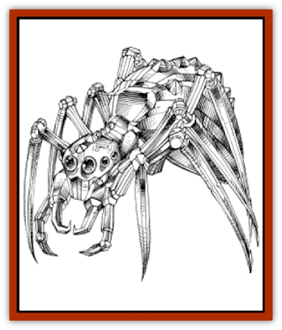

# Spider - Crystal

| Statistic | **Spider, Crystal** |
| --- | --- |
| **Activity Cycle:** | Any |
| **Alignment:** | Neutral |
| **Armor Class:** | 2 |
| **Climate/Terrain:** | Any |
| **Damage/Attack:** | 2-8/2-8/1-4 |
| **Diet:** | Omnivore |
| **Frequency:** | Very rare |
| **Hit Dice:** | 4 |
| **Intelligence:** | Semi (2-3) |
| **Magic Resistance:** | Nil |
| **Morale:** | Elite (13-14) |
| **Movement:** | 24 |
| **No. Appearing:** | 1 |
| **No. of Attacks:** | 3 |
| **Organization:** | Solitary |
| **Size:** | L (8' body) |
| **Special Attacks:** | Poison, grab, light beam |
| **Special Defenses:** | See below |
| **THAC0:** | 17 |
| **Treasure:** | Q&times;2 |
| **XP Value:** | 1,400 |

**Psionics Summary**

| Level | Dis/Sci/Dev | Attack/Defense | Score | PSPs |
| --- | --- | --- | --- | --- |
| 1 | 1/0/2 | -/- | 16 | 33 |

**Psychokinesis -** *Sciences:* nil; *Devotions:* control lights, inertial barrier.

The crystal [[Spider|spider]] is a voracious predator that spins a glass web. The web is very sharp and can focus a damaging beam of light at a potential victim.

The crystal spider is a beautiful creature, at least at first sight. It is made entirely of crystal and during the day the sunlight refracts through it, giving it a myriad of colors. The colors change as it moves. At night it reflects any light its opponents are using, so it is still colorful, but not as radiant as during the day. In the dark it often uses its control light power to make any light darker (the better to surprise its potential prey).

A crystal spider is incapable of making sounds, but can communicate with others of its kind by means of controlled light.

**Combat:** The crystal spider builds its web along trails and valleys, in suitable spots to suddenly surprise attackers. At night the glass webs are almost invisible, and an unsuspecting party may walk right into them. Usually, however, the spider prefers to attack during the day, using its complicated web and its ability to control light to make an attack on its intended prey.

When the crystal spider has a round to prepare, it can direct a light attack at a potential victim. An attack roll is required, but the crystal spider receives a +4 bonus to this roll. If it successfully hits, the victim takes 3d6 heat damage and must save versus wands or be blinded.

If someone walks unsuspecting into a crystal web (fails their surprise roll), they take 4d6 points of cutting damage. The webs are not sticky, but they are strong. A dexterity roll is required by anyone trapped in the webs; failure means that they take another 3d6 pulling themselves out.

In melee the crystal spider attacks with two sharp forelegs and a poisonous bite. The forelegs each do 2d4 points of damage, and the bite does 1d4. A victim of this bite must also save versus poison at a -2 penalty or suffer the effects of type E poison (save versus poison or die, save equals 20 points of damage). If both forelegs successfully hit with a natural 18 or better, the crystal spider has grasped its foe. Once grasped, the victim takes 4d6 points of damage every round, and the spider gains a +4 attack roll bonus for each bite attack thereafter. The crystal spider cannot grasp victims larger than four feet wide. This does not stop it from attacking, however.

A crystal spider is especially susceptible to a *shatter* spell. If such a spell is used, the spider takes 3d6 points of damage (a saving throw is allowed for half damage).

**Habitat/Society:** The crystal spider is a solitary creature, building its webs in some of the most remote areas of Athas. It survives on sunlight, although it does seem to need occasional liquids (preferring human blood). After a crystal spider has fed, it has a reddish tinge throughout its body. This disappears over the next several days. A crystal spider lives for about 150 years. Before it dies it lays its eggs in the center of a large web it builds just for that purpose. Up to 200 crystal spiders can hatch from a single laying. While the crystal spider can move about on its web without harming itself, it does not dangle from its web like a normal spider, preferring to stay on the ground. The crystal spider often weaves gems into its web. It has no knowledge of value; the only judgement is the shininess of the gem. A piece of brightly colored glass may be used in preference to a valuable, but dull, ruby.

**Ecology:** The crystal spider has no natural enemies, but many acquired ones. It is generally hunted for its webs, which make excellent edges for spears and knives. If transported to a marketplace, each intact 12" piece of web is worth 2 cp, 3 cp to a weapons maker. The crystal spider can "spin" 12 feet of web per day. A typical web is 20 feet across, although barroom tales report webs as big as 100 feet wide. Whether this refers to a hatching web, the web of a giant crystal spider, or is mere invention is not known.

---
## Discovery & Documentation

**Source Publication:** MC12 Dark Sun Appendix I - Terrors of the Desert (1991)
**Campaign Setting:** Dark Sun
**Author(s):** Tom Prusa, Louis J. Prosperi, Walter M. Baas

### Other Creatures Found in This Source Book
   * [[Animal_Herd_Athas|Animal, Herd (Athas)]]
   * [[Animal_Household_Athas|Animal, Household (Athas)]]
   * [[Antloid_Desert|Antloid, Desert]]
   * [[Banshee_Dwarf|Banshee, Dwarf]]
   * [[Beetle_Agony|Beetle, Agony]]
   * [[Bog_Wader|Bog Wader]]
   * [[Brambleweed|Brambleweed]]
   * [[B'rohg|B'rohg]]
   * [[Burnflower|Burnflower]]
   * [[Cat_Psionic|Cat, Psionic]]
   * [[Cha'thrang|Cha'thrang]]
   * [[Cistern_Fiend|Cistern Fiend]]
   * [[Clam_Giant|Clam, Giant]]
   * [[Cloud_Ray|Cloud Ray]]
   * [[Drake_Athas_Air|Drake (Athas), Air]]
   * [[Drake_Athas_Earth|Drake (Athas), Earth]]
   * [[Drake_Athas_Fire|Drake (Athas), Fire]]
   * [[Drake_Athas_Water|Drake (Athas), Water]]
   * [[Dune_Runner|Dune Runner]]
   * [[Dune_Trapper|Dune Trapper]]
   * [[Elemental_Athas_Greater_Air|Elemental (Athas), Greater, Air]]
   * [[Elemental_Athas_Greater_Earth|Elemental (Athas), Greater, Earth]]
   * [[Elemental_Athas_Greater_Fire|Elemental (Athas), Greater, Fire]]
   * [[Elemental_Athas_Greater_Water|Elemental (Athas), Greater, Water]]
   * [[Elemental_Athas_Lesser_Air_Earth|Elemental (Athas), Lesser, Air/Earth]]
   * [[Elemental_Athas_Lesser_Fire_Water|Elemental (Athas), Lesser, Fire/Water]]
   * [[Elemental_Athas_General_Information|Elemental (Athas), General Information]]
   * [[Erdland|Erdland]]
   * [[Esperweed|Esperweed]]
   * [[Flailer|Flailer]]
   * [[Floater|Floater]]
   * [[Giant_Athas|Giant (Athas)]]
   * [[Golem_Athas_I|Golem (Athas) I]]
   * [[Golem_Athas_II|Golem (Athas) II]]
   * [[Golem_Athas_III|Golem (Athas) III]]
   * [[Golem_Athas_General_Information|Golem (Athas), General Information]]
   * [[Halfling_Renegade|Halfling, Renegade]]
   * [[Hej-kin|Hej-kin]]
   * [[Id_Fiend|Id Fiend]]
   * [[Insect_Swarm_Athas|Insect Swarm (Athas)]]
   * [[Kank_Wild|Kank, Wild]]
   * [[Kirre|Kirre]]
   * [[Megapede|Megapede]]
   * [[Mul_Wild|Mul, Wild]]
   * [[Nightmare_Beast|Nightmare Beast]]
   * [[Plant_Carnivorous_Athas|Plant, Carnivorous (Athas)]]
   * [[Pterran|Pterran]]
   * [[Pterrax|Pterrax]]
   * [[Pulp_Bee|Pulp Bee]]
   * [[Pyreen|Pyreen]]
   * [[Rasclinn|Rasclinn]]
   * [[Razorwing|Razorwing]]
   * [[Roc_Athas|Roc (Athas)]]
   * [[Sand_Bride|Sand Bride]]
   * [[Sand_Cactus|Sand Cactus]]
   * [[Sand_Vortex|Sand Vortex]]
   * [[Scrab|Scrab]]
   * [[Silt_Horror|Silt Horror]]
   * [[Silt_Runner|Silt Runner]]
   * [[Sink_Worm|Sink Worm]]
   * [[Sloth_Athas|Sloth (Athas)]]
   * [[So-ut|So-ut]]
   * [[Spider_Cactus|Spider Cactus]]
   * [[Spirit_of_the_Land|Spirit of the Land]]
   * [[T'Chowb|T'Chowb]]
   * [[Thrax|Thrax]]
   * [[Tohr-kreen_I|Tohr-kreen I]]
   * [[Villichi|Villichi]]
   * [[Zhackal|Zhackal]]
   * [[Zombie_Plant|Zombie Plant]]
