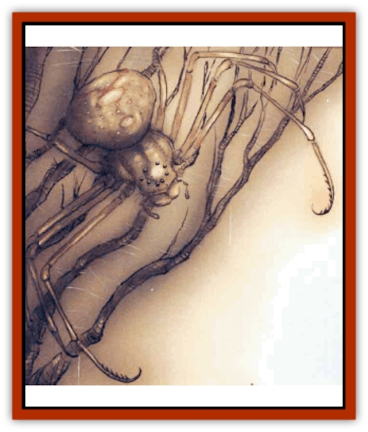

# Spider - Hook

| Statistic | **Spider, Hook** |
| --- | --- |
| **Activity Cycle:** | Any |
| **Alignment:** | Lawful evil |
| **Armor Class:** | 5 |
| **Climate/Terrain:** | Acheron, Baator, Gehenna |
| **Damage/Attack:** | 1d4/1d4/1d6 + poison |
| **Diet:** | Carnivore |
| **Frequency:** | Rare |
| **Hit Dice:** | 4+4 |
| **Intelligence:** | Low (5-7) |
| **Magic Resistance:** | None |
| **Morale:** | Elite (13-14) |
| **Movement:** | 9, Jp 6 |
| **No. Appearing:** | 2-8 |
| **No. of Attacks:** | 3 |
| **Organization:** | Nest |
| **Size:** | M (4' long body) |
| **Special Attacks:** | Hook, poison, psionics |
| **Special Defenses:** | Camouflage |
| **THAC0:** | 17 |
| **Treasure:** | A |
| **XP Value:** | 975 |

**Psionics Summary**

| Level | Dis/Sci/Dev | Attack/Defense | Score | PSPs |
| --- | --- | --- | --- | --- |
| 3 | 2/2/7 | -/MB,M- | 12 | 45 |

**Psychometabolism -** *Science:* shadow form; *Devotions:* body control, body equilibrium, chameleon power, reduction.

**Telepathy -** *Science:* mind link; *Devotions:* contact, attraction, invisibility.

[[Spider|Spiders]] of all kinds are fairly common throughout the Outlands and the Great Wheel. Normal-size hunters and web-spinners can be found in the strangest places, surviving where no other mundane animals can. Even the large, huge, and giant varieties're surprisingly successful, and there are more than a few minor fiends or [[Aasimon_General_Information|aasimon]] who've ended up as a spider's dinner on their own home plane. The creature known as the hook spider's simply a giant spider that's adapted to life in a particularly dangerous and desolate corner of the multiverse: the Lower Planes.

The body of a book spider's about the size of a goat's or large [[Dog|dog's]], but each of its legs is as long as a man is tall. The two forwardmost legs aren't used for walking, but are instead equipped with powerful, inward-curving claws or hooks to snag and hold prey. The spider's mandibles are powerful enough to pierce plate armor. Unlike those of many normal spiders, each of the hook spider's eight eyes are primary eyes. The eyes are arranged high on the creature's head, giving it 360-degree vision. The hook spider's naturally a dull yellow color with red markings, but it's rarely found in this coloration thanks to its psionic chameleon power (see "Combat" below).

Hook spiders are almost as intelligent as human beings, and demonstrate a diabolical patience and skill in hunting. They create traps made from materials on hand and their own webbing, they use stealth to surprise their prey, and packs of spiders operate wifb perfect coordination. Worse yet, hook spiders've developed some rudimentary psionic skills to help them take their prey.

**Combat:** Hook spiders make every effort possible to attack only from ambush or while the potential meal is helpless. When the time comes to strike, the hook spider can leap up to 60 feet from concealment, giving its target a -2 penalty to its surprise check. The spider attacks with its two hooked claws and a bite of its venomous mandibles. If it hits the same man-size or smaller target with both claws, the victim is held pinned and helpless, and the bite attack automatically succeeds. The victim can escape the spider's grasp with a successful open doors check.

A creature bitten by the hook spider must successfully save versus poison or suffer an additional 25 hp of damage, or 2 to 8 points of damage if the save is successful. The onset time is two rounds, so a victim suffers no immediate effect in the round he's bitten or in the following round. Hook spider venom quickly loses its potency if removed from the spider, becoming inert within 1d3 turns.

Hook spiders frequently use their psionic powers to ensure that they'll be able to surprise their opponents. They're especially fond of using chameleon power or invisibility to prevent their intended meal from noticing their presence, or using shadow form or reduction to creep within striking distance undetected. If the spider successfully uses its psionic powers to completely mask its presence, it gains automatic surprise when it strikes.

Hook spiders aren't web-spinners, but they do use their strong silk to create trap-door hatches or blinds to hunt from. They occasionally use their silk to create traps such as nets or lassoes that the spider tends with its front legs. There is a 20% chance (30% for rangers, druids, or other such characters) that the victim spots the trap before walking into it. The spider must make an attack roll to spring the trap, but only the victim's Dexterity and magical adjustments help him evade the spider's net - armor itself doesn't count. The victim may attempt a saving throw versus paralyzation to avoid being netted or bound, but if he fails he's securely trapped and can escape only with a bend hars/lift gates roll or a full turn of work with a dagger or other small edged weapon. Hook spiders love to trap as many members of a group as they can, and then attack the untrapped characters before returning to finish off the victims who were snared by their ambush.

**Habitat/Society:** Hook spiders live in small groups called nests or clutches. The adults of a nest are always siblings. Unlike most other spiders, hook spiders are social creatures that cooperate closely to catch their prey. They're careful to let powerful fiends or lower-planar denizens pass by unmolested, but any thing weaker than an [[Baatezu_Lesser_Abishai|abishai]] or [[Tanar'ri_Least_Rutterkin|rutterkin]]'s fair game.

The spiders like to choose a single small area and carefully build it into a complex lair and hunting ground. For example, a nest of hook spiders might take over a small grove, a rocky outcropping, or a spring or pond. A labyrinth of small burrows'll be dug beneath and around the area, providing the spiders with a number of bolt-holes and ambush sites. Traps'll be laid in places where meals are likely to come by. The hook spiders make sure that their presence is well-collcealed, and it's not uncommon for a band of bashers to walk right into the middle of the spiders' lair without realizing anything's wrong.

Hook spiders are capable of communicating with other creatures by means of their telepathic power, but they rarely do so. They're inclined to honor agreements or contracts, but they're very shortsighted - if a hook spider doesn't see an immediate gain for itself, it won't bother to strike a deal. In some cases, ambitious fiends've been known to lure meals into the spiders' den in exchange for the spiders' elimination of rivals, enemies, or troublemakers.

**Ecology:** A nest of hook spiders normally comprises 2 to 8 adults, and anywhere from 10 to 30 spiderlings equal to large spiders in all respects save intelligence. Spiderlings avoid large prey such as humans or fiends, preferring to let the adults deal with these meals and feeding on the leftovers. Unlike most spiders, hook spiders lay only 3 to 6 eggs at a time and invest a moderate amount of time and care in feeding and protecting their young.

Although hook spiders are certainly dangerous and cunning predators, they're often not very high on the food chain in some of their infernal habitats. They compensate hy cooperation against victims of moderate power, and they avoid contact with more powerful creatures. Typically, creatures such as [[Baatezu_Least_Nupperibo|nupperibo]], [[Baatezu_Lemure|lemures]], [[Baatezu_Least_Spinagon|spinagons]], ahishai, or petitioners are preyed upon, but greater haatezu and creatures of similar size are left alone.

---
## Discovery & Documentation

**Source Publication:** Planescape II (1996)
**Campaign Setting:** Planescape
**Author(s):** Rich Baker, Karen S. Boomgarden

### Other Creatures Found in This Source Book
   * [[Aasimar|Aasimar]]
   * [[Abrian|Abrian]]
   * [[Arcane|Arcane]]
   * [[Balaena|Balaena]]
   * [[Beholder-kin_Observer|Beholder-kin, Observer]]
   * [[Bloodthorn|Bloodthorn]]
   * [[Bonespear|Bonespear]]
   * [[Darkweaver|Darkweaver]]
   * [[Demarax|Demarax]]
   * [[Dhour|Dhour]]
   * [[Eater_of_Knowledge|Eater of Knowledge]]
   * [[Eladrin_Greater_Firre|Eladrin, Greater, Firre]]
   * [[Eladrin_Greater_Ghaele|Eladrin, Greater, Ghaele]]
   * [[Eladrin_Greater_Tulani|Eladrin, Greater, Tulani]]
   * [[Eladrin_Lesser_Bralani|Eladrin, Lesser, Bralani]]
   * [[Eladrin_Lesser_Coure|Eladrin, Lesser, Coure]]
   * [[Eladrin_Lesser_Noviere|Eladrin, Lesser, Noviere]]
   * [[Eladrin_Lesser_Shiere|Eladrin, Lesser, Shiere]]
   * [[Fhorge|Fhorge]]
   * [[Ghostlight|Ghostlight]]
   * [[Guardinal_Avoral|Guardinal, Avoral]]
   * [[Guardinal_Cervidal|Guardinal, Cervidal]]
   * [[Guardinal_General_Information|Guardinal, General Information]]
   * [[Guardinal_Equinal|Guardinal, Equinal]]
   * [[Guardinal_Leonal|Guardinal, Leonal]]
   * [[Guardinal_Lupinal|Guardinal, Lupinal]]
   * [[Guardinal_Ursinal|Guardinal, Ursinal]]
   * [[Hollyphant|Hollyphant]]
   * [[Incantifer|Incantifer]]
   * [[Ironmaw|Ironmaw]]
   * [[Keeper|Keeper]]
   * [[Khaasta|Khaasta]]
   * [[Leomarh|Leomarh]]
   * [[Monster_of_Legend|Monster of Legend]]
   * [[Mortai|Mortai]]
   * [[Noctral|Noctral]]
   * [[Quill|Quill]]
   * [[Razorvine|Razorvine]]
   * [[Reave|Reave]]
   * [[Retriever|Retriever]]
   * [[Rilmani_Abiorach|Rilmani, Abiorach]]
   * [[Rilmani_General_Information|Rilmani, General Information]]
   * [[Rilmani_Argenach|Rilmani, Argenach]]
   * [[Rilmani_Aurumach|Rilmani, Aurumach]]
   * [[Rilmani_Cuprilach|Rilmani, Cuprilach]]
   * [[Rilmani_Ferrumach|Rilmani, Ferrumach]]
   * [[Rilmani_Plumach|Rilmani, Plumach]]
   * [[Shadowdrake|Shadowdrake]]
   * [[Spellhaunt|Spellhaunt]]
   * [[Sunfly|Sunfly]]
   * [[Sword_Spirit|Sword Spirit]]
   * [[Tanar'ri_Lesser_Bulezau|Tanar'ri, Lesser, Bulezau]]
   * [[Tanar'ri_Lesser_Maurezhi|Tanar'ri, Lesser, Maurezhi]]
   * [[Tanar'ri_Lesser_Yochlol|Tanar'ri, Lesser, Yochlol]]
   * [[Tanar'ri_General_Information|Tanar'ri, General Information]]
   * [[Tanar'ri_True_Alkilith|Tanar'ri, True, Alkilith]]
   * [[Terlen|Terlen]]
   * [[Tso|Tso]]
   * [[T'uen-rin|T'uen-rin]]
   * [[Vaporighu|Vaporighu]]
   * [[Vorr|Vorr]]
   * [[Wastrel|Wastrel]]
   * [[Wraithworm|Wraithworm]]
   * [[Yugoloth_Lesser_Canoloth|Yugoloth, Lesser, Canoloth]]
   * [[Zoveri|Zoveri]]
