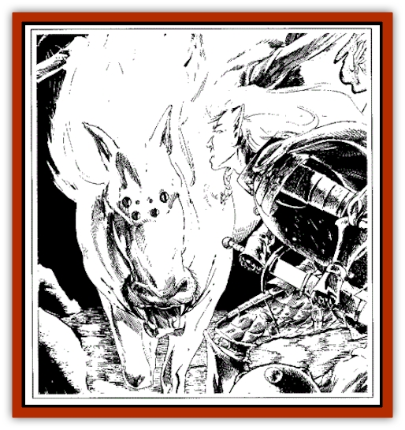

# Spider Horse

| Statistic | **Spider Horse** |
| --- | --- |
| **Activity Cycle:** | Nocturnal |
| **Alignment:** | Neutral |
| **Armor Class:** | 2 |
| **Climate/Terrain:** | Subterranean caverns |
| **Damage/Attack:** | 1-6/1-6/2-8 |
| **Diet:** | Carnivore |
| **Frequency:** | Very rare |
| **Hit Dice:** | 5+5 |
| **Intelligence:** | Semi- (2-4) |
| **Magic Resistance:** | 5% |
| **Morale:** | Steady (12) |
| **Movement:** | 12, Wb 9 |
| **No. Appearing:** | 1-6 |
| **No. of Attacks:** | 3 (2 hooves, 1 bite) |
| **Organization:** | Herd |
| **Size:** | L |
| **Special Attacks:** | Slow, paralysis |
| **Special Defenses:** | See below |
| **THAC0:** | 15 |
| **Treasure:** | Nil |
| **XP Value:** | 1,400 |

The spider horse is prized as a steed by the [[Elf_Drow|drow]] of the Deathdark. Bred long ago by the priestesses of [[Handmaiden_of_Takhisis|Jiathuli, Princess of the Abyss]], the spider horse is a bizarre hybrid of [[Horse|horse]] and [[Spider|spider]]. It has a horse's head and body, four horse legs, four spider legs, spider's eyes, and fangs instead of teeth in its muzzle. It is a versatile steed, capable of riding on the ground like a horse and climbing webs like a spider. It is faithful to its master until death.

**Combat:** The spider horse attacks with its hooves and its venomous fangs. Anyone who is struck by its fangs must roll a successful saving throw vs. poison or be paralyzed for 2d4 hours. Those who successfully roll this saving throw are only slowed (as if affected by a *slow* spell) for 1d4 turns.

If a spider horse's master knows that an enemy is approaching, the spider horse may be used to ambush the opponents. In this case, the spider horse will lurk above the entrance, hanging on a web strand and fall on the foes, surprising them on a 1-5 on 1d6.

**Habitat/Society:** The spider horse dwells in the subterranean world of the Deathdark of the drow, the demi-plane where Jiathuli, Queen of the drow, was exiled. Within the caverns of the Deathdark are large web pastures, where the webs of spiders have accumulated over centuries. It is on these webs that the spider horses roam.

Spider horses roam in herds; their social organization is identical to that of horses. An expert animal trainer can teach them to serve as mounts.

**Ecology:** The spider horse is a predator that roams the Deathdark. Its normal victims are small herbivores that live in the cavernous underworld; in times of famine it devours its own weak and young.

---
## Discovery & Documentation

**Source Publication:** Wild Elves (1991)
**Campaign Setting:** Dragonlance
**Author(s):** Scott Bennie

### Other Creatures Found in This Source Book
   * [[Curotai|Curotai]]
   * [[Dragon_Spider|Dragon, Spider]]
   * [[Handmaiden_of_Takhisis|Handmaiden of Takhisis]]
   * [[Ice_Vampire|Ice Vampire]]
   * [[Weapon_Living|Weapon, Living]]
