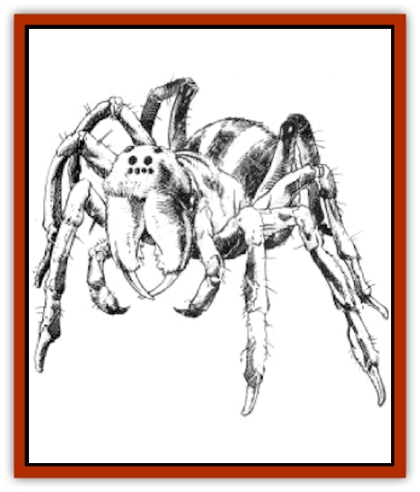

# Spider - Krynn

| Statistic | **Giant Trap Door Spider** | **Whisper Spider** |
| --- | --- | --- |
| **Activity Cycle:** | Any | Any |
| **Alignment:** | Nil | Chaotic evil |
| **Armor Class:** | 3, Wb 12 | 9, Wb 12 |
| **Climate/Terrain:** | Tropical, subtropical, and temperate/Plain, forest, and jungle | Tropical, subtropical, and temperate/Plain, forest, hill, mountain, and jungle |
| **Damage/Attack:** | Webs, poison | Webs, poison |
| **Diet:** | Carnivore | Carnivore |
| **Frequency:** | Very rare | Very rare |
| **Hit Dice:** | 15 | 11 |
| **Intelligence:** | Animal (1) | Low (5-7) |
| **Magic Resistance:** | Nil | Nil |
| **Morale:** | Average (9) | Elite (14) |
| **Movement:** | 4+4 | 8+8 |
| **No. Appearing:** | 4 | 4 |
| **No. of Attacks:** | 2-8 | 2-12 |
| **Organization:** | Family | Family |
| **Size:** | L (8' long) | H (15' long) |
| **Special Attacks:** | Nil | Jumps |
| **Special Defenses:** | Nil | Nil |
| **THAC0:** | 1 | 1 |
| **Treasure:** | C | C |
| **XP Value:** | 420 | 1,400 |

## Whisper Spider

The whisper [[Spider|spider]] has a plump abdomen, multiple eyes, and four pairs of segmented legs. Its body is covered with short, black bristles. Two gray stripes run the length of its back. Its eyes are bright red. The whisper spider moves quite rapidly on its webs and can also make six-foot leaps in any direction.

**Combat:** The whisper spider uses lures and misdirection to capture prey. It can create a false spider, a flapping banner, a filmy barrier to hide behind, or any other shape it has seen. It creates ten-foot-square web sheets to trap prey and gain a better chance to inflict a killing bite. It also shoots web strands up to two feet away to bind foes (treat as if the target is AC 10), though it cannot make a melee attack in the same round it shoots webbing. A victim in contact with a web must roll a saving throw vs. wand; if he fails, he is stuck fast as if caught in a *web* spell.

If a whisper spider makes a successful bite attack, the victim must roll a saving throw vs. poison with a -2 penalty. If the roll fails, the victim tails into a stupor for 2d4 turns, the victim can take no actions until the poison wears off.

A whisper spider can flatten itself against the ground and become 80% undetectable. It moves so silently that opponents have a -5 penalty to their surprise rolls.

**Habitat/Society:** The whisper spider's lair is a large web, usually concealed in tree branches or inside a cave. It keeps treasure items taken from consumed victims in a hole in the ground near its web, or in hollow trees.

The females of both species eat their mates 50% of the time; the more fortunate males are able to scramble to safety. Females lay about 100 eggs at once, but fewer than 20% actually hatch. The whisper spider keeps her babies on her back until they mature, a period of about three to four months.

**Ecology:** Most predators avoid these dangerous spiders, though spider babies are eaten by birds, frogs, bats, and small mammals. Giant snakes sometimes eat adult spiders.

Both spider species eat any warm-blooded creature they can ensnare. Favorites include monkeys, wild boars, herd animals and humans.

## Giant Trap Door Spider

Like the whisper spider, the trap door spider has a plump abdomen, multiple eyes, and four pairs of segmented legs. Its body is covered with long, silky hairs, either brown or gold in color. Its legs are banded with red stripes.

**Combat:** The trap door spider lives at the bottom of a deep tunnel. It covers the entrance to the tunnel with a door of sticks, weeds, webbing, and mud, then waits at the bottom for victims. The spider can detect the vibrations of approaching creatures up to 50 yards away. When a victim comes within ten feet of the trap door, the spider scrambles out of the tunnel and attacks. Because the spider moves quickly and silently, the intended victim has a -5 penalty to his surprise roll. The spider attempts to grab its victim by making a normal attack roll; if successful, the spider drags the victim back into the tunnel and starts to eat him. A grabbed victim can free himself with a successful Strength check (with a -2 penalty). At least two characters whose Strength totals 20 or more can wrench a companion loose. While the spider has a hold on a victim, it can make no other attacks.

If a trap door spider makes a successful bite attack, the victim must roll a successful saving throw vs. poison or suffer an additional 1d6 points of damage. The trap door spider can shoot web strands up to three feet away.

**Habitat/Society:** Trap door spiders live in their underground tunnels. A tunnel is usually about ten feet in diameter and can be as much as 100 feet deep. The bottom of the tunnel sometimes contains two chambers, the second used to store treasure items.

The female trap door spider creates a silken web sack on the side of the tunnel to hold her eggs. When the eggs hatch, the young spiders crawl from the tunnel to make their own way in the world.

**Ecology:** See above.

---
## Discovery & Documentation

**Source Publication:** MC4 Dragonlance Appendix (w/binder #2) (1989)
**Campaign Setting:** Dragonlance
**Author(s):** Rick Swan

### Other Creatures Found in This Source Book
   * [[Anemone_Giant_Sea|Anemone, Giant Sea]]
   * [[Bear_Ice|Bear, Ice]]
   * [[Beast_Undead|Beast, Undead]]
   * [[Bird_Krynn|Bird (Krynn)]]
   * [[Disir|Disir]]
   * [[Draconian_Aurak|Draconian, Aurak]]
   * [[Draconian_Baaz|Draconian, Baaz]]
   * [[Draconian_Bozak|Draconian, Bozak]]
   * [[Draconian_Kapak|Draconian, Kapak]]
   * [[Draconian_General_Information|Draconian, General Information]]
   * [[Draconian_Sivak|Draconian, Sivak]]
   * [[Draconian_Proto-_Traag|Draconian, Proto-, Traag]]
   * [[Dragon_Amphi|Dragon, Amphi]]
   * [[Dragon_Astral|Dragon, Astral]]
   * [[Dragon_Kodragon|Dragon, Kodragon]]
   * [[Dragon_Krynn_Othlorx_General_Information|Dragon (Krynn), Othlorx, General Information]]
   * [[Dragon_Krynn_General_Information|Dragon (Krynn), General Information]]
   * [[Dragon_Sea|Dragon, Sea]]
   * [[Dreamshadow|Dreamshadow]]
   * [[Dreamwraith|Dreamwraith]]
   * [[Dwarf_Daergar|Dwarf, Daergar]]
   * [[Dwarf_Hill_Neidar|Dwarf, Hill, Neidar]]
   * [[Dwarf_Mountain_Hylar|Dwarf, Mountain, Hylar]]
   * [[Dwarf_Theiwar|Dwarf, Theiwar]]
   * [[Dwarf_Zakhar|Dwarf, Zakhar]]
   * [[Elf_Half-|Elf, Half-]]
   * [[Elf_High_Qualinesti|Elf, High, Qualinesti]]
   * [[Elf_High_Silvanesti|Elf, High, Silvanesti]]
   * [[Elf_Sea_Dargonesti|Elf, Sea, Dargonesti]]
   * [[Elf_Sea_Dimernesti|Elf, Sea, Dimernesti]]
   * [[Elf_Wild_Kagonesti|Elf, Wild, Kagonesti]]
   * [[Eyewing|Eyewing]]
   * [[Fetch|Fetch]]
   * [[Fire_Minion|Fire Minion]]
   * [[Fireshadow|Fireshadow]]
   * [[Gnome_Tinker|Gnome, Tinker]]
   * [[Gurik_Cha'ahl|Gurik Cha'ahl]]
   * [[Haunt_Knight|Haunt, Knight]]
   * [[Horax|Horax]]
   * [[Human_Krynn|Human (Krynn)]]
   * [[Imp_Blood_Sea|Imp, Blood Sea]]
   * [[Kalothagh|Kalothagh]]
   * [[Kani_Doll|Kani Doll]]
   * [[Kender|Kender]]
   * [[Kyrie|Kyrie]]
   * [[Lizard_Man_Krynn|Lizard Man (Krynn)]]
   * [[Minotaur_Krynn|Minotaur, Krynn]]
   * [[Ogre_High|Ogre, High]]
   * [[Ogre_Krynn|Ogre (Krynn)]]
   * [[Phaethon|Phaethon]]
   * [[Saqualaminoi|Saqualaminoi]]
   * [[Shadowperson|Shadowperson]]
   * [[Shimmerweed|Shimmerweed]]
   * [[Skrit|Skrit]]
   * [[Spectral_Minion|Spectral Minion]]
   * [[Stag|Stag]]
   * [[Tayling|Tayling]]
   * [[Thanoi|Thanoi]]
   * [[Tylor|Tylor]]
   * [[Wichtlin|Wichtlin]]
   * [[Wyndlass|Wyndlass]]
   * [[Yaggol|Yaggol]]
