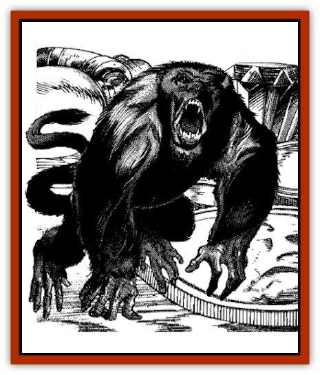

# Spider - Monkey

| Statistic | **Spider, Monkey** |
| --- | --- |
| **Activity Cycle:** | Day |
| **Alignment:** | Neutral good |
| **Armor Class:** | 6 |
| **Climate/Terrain:** | Tropical rain forest, southern cities |
| **Damage/Attack:** | 1 point |
| **Diet:** | Frugivore |
| **Frequency:** | Rare |
| **Hit Dice:** | 1 hp |
| **Intelligence:** | Average to high (8-14) |
| **Magic Resistance:** | Nil |
| **Morale:** | Fanatic (17-18) |
| **Movement:** | Cl 18 |
| **No. Appearing:** | 20-60 (In wild) |
| **No. of Attacks:** | 1 |
| **Organization:** | Tribal |
| **Size:** | T (1&rdquo; long) |
| **Special Attacks:** | Eyebite |
| **Special Defenses:** | None |
| **THAC0:** | 18 |
| **Treasure:** | Nil |
| **XP Value:** | 1 |

Though an ancient species in the Forgotten Realms, monkey spiders' tiny size and harmlessness have kept them unnoticed until now. Measuring only an inch from their simian noses to their prehensile tails, these gangly creatures have been swatted for years, mistaken as [[Spider|spiders]]. Eventually a southern sage who swatted one counted its limbs, discovering the breed.

But for their size, monkey spiders look exactly like monkeys. They are gaunt and fur-covered, with gangly limbs, a prehensile tail, and have strikingly human-like faces and hands. Because of their size, they look like spiders from any distance greater than two feet.

**Combat:** Though they are fierce combatants against creatures such as wasps and bees, monkey spiders avoid battling anything larger than they are. If forced to battle such creatures, though, a monkey spider tries to leap down and bite the eyes of its assailant. If successful, the monkey spider does not blind the character, but its saliva stings fiercely enough that the character must stop all action for one round to rub his eyes. In that time, the monkey spider makes an escape.

If a monkey spider cannot attack a character's eyes, it bites whatever is within reach causing 1 point of damage. The caustic saliva in the wound raises a small welt.

Monkey spiders can jump up to five feet upward or 10 feet down, and can climb anything a typical gray spider can climb.

**Habitat/Society:** In the wild, monkey spiders roam the jungles in tightly-knit family groups that number about 40. They consist of five families of eight members each. A male prime and a female prime, the oldest members of each gender, make decisions for the group. The male and female primes communicate these decisions through a complex language of sibilants, chirps, hoots, and gestures. Sages who study monkey spiders believe this language to be as sophisticated as Common.

As a family group moves through the jungle, the male prime releases a "long call", a cry that can reach 20 yards, to tell other monkey spider groups that a new family has entered the area. Male primes of opposing groups avoid each other rather than fight. However, if forced into confrontation, male primes must fight to the death. These contests are usually quite lack-luster, though, because male primes are generally the oldest and feeblest members of their packs. Such battles often end in exhaustion, at which time the female primes bear up their counterparts and lead their family groups off in opposite directions.

Monkey spiders build no nests, sleeping upon most any broad leaf, and using a second leaf to provide protection from rain.

**Ecology:** As frugivores, monkey spiders spend most of their days questing for berries, dates, bananas, and other fruits as well as mounting occasional raids on honeycombs. Their chief natural enemies are all insect-eating birds, rain-forest ants, who are competitors for food, and rain-forest savages, who consider monkey spiders a delicacy when roasted until crunchy.

With their discovery, monkey spiders have found their way into southern cities in the Realms, becoming very handy familiars for wizards, or animal companions for rangers and druids. In addition to their native intellect, good alignment, and loyalty to friends, monkey spiders make good companions because of their ability to learn Common. The only problem is that monkey spiders must use their "long calls" to be heard at any distance.

The popularity of monkey spiders as companions has produced odd ramifications in some southern cities. In the regions of Samarach, Thindol, Lapaliiya, Halruaa, Dambrath, and Estagund, filthy slave auctions of the tiny creatures have arisen in back alleys and even some market places. Some monkey spiders, once purchased, escape their masters. Rumors tell that in southern regions, escaped monkey spiders have united to form an underworld of powerful, though diminutive, despots. Purportedly, monkey spider spies listen in on every critical council and court, then relay their knowledge to monkey spider kings. These rulers in turn enlist the aid of human and demihuman sympathizers to exert their influence, even in the highest courts of the land.

---
## Discovery & Documentation

**Source Publication:** MC11 Forgotten Realms Appendix II (1991)
**Campaign Setting:** Advanced Dungeons & Dragons 2nd Edition
**Author(s):** Tim Beach, Tim Brown, William W. Connors, Dale Donovan, Ed Greenwood, Jeff Grubb, Bruce Heard, Slade Henson, Rob King, Colin McComb, Roger E. Moore, Bruce Nesmith, Jon Pickens, Jean Rabe, Dori Watry, Skip Williams

### Other Creatures Found in This Source Book
   * [[Alaghi|Alaghi]]
   * [[Alguduir|Alguduir]]
   * [[Beguiler|Beguiler]]
   * [[Bird_Toril|Bird (Toril)]]
   * [[Cantobele|Cantobele]]
   * [[Carapace|Carapace]]
   * [[Cat_Toril|Cat (Toril)]]
   * [[Chitine|Chitine]]
   * [[Cildabrin|Cildabrin]]
   * [[Dimensional_Warper|Dimensional Warper]]
   * [[Dragon_Deep|Dragon, Deep]]
   * [[Fachan_Toril|Fachan (Toril)]]
   * [[Fael|Fael]]
   * [[Feyr|Feyr]]
   * [[Firetail|Firetail]]
   * [[Frost|Frost]]
   * [[Gaund|Gaund]]
   * [[Gloomwing|Gloomwing]]
   * [[Golden_Ammonite|Golden Ammonite]]
   * [[Golem_Lightning|Golem, Lightning]]
   * [[Hamadryad|Hamadryad]]
   * [[Harrier|Harrier]]
   * [[Harrla|Harrla]]
   * [[Haun|Haun]]
   * [[Haundar|Haundar]]
   * [[Hendar|Hendar]]
   * [[Inquisitor|Inquisitor]]
   * [[Lhiannan_Shee|Lhiannan Shee]]
   * [[Loxo|Loxo]]
   * [[Manni|Manni]]
   * [[Manscorpion|Manscorpion]]
   * [[Mara|Mara]]
   * [[Morin|Morin]]
   * [[Naga_Dark|Naga, Dark]]
   * [[Orpsu|Orpsu]]
   * [[Plant_Carnivorous_Black_Willow|Plant, Carnivorous, Black Willow]]
   * [[Plant_Carnivorous_Toril|Plant, Carnivorous (Toril)]]
   * [[Plant_Dangerous_I|Plant, Dangerous I]]
   * [[Ring-Worm|Ring-Worm]]
   * [[Rohch|Rohch]]
   * [[Sand_Cat|Sand Cat]]
   * [[Saurial|Saurial]]
   * [[Sha'az|Sha'az]]
   * [[Silver_Dog|Silver Dog]]
   * [[Simpathetic|Simpathetic]]
   * [[Skuz|Skuz]]
   * [[Tren|Tren]]
