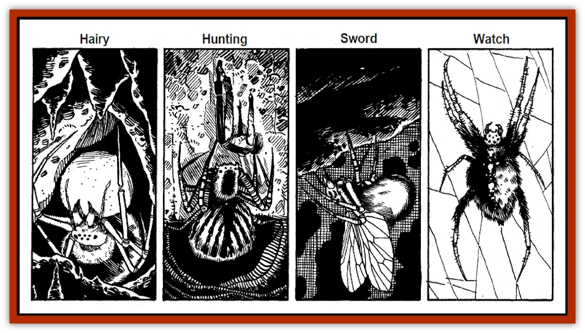

# Spider - Subterranean

| Statistic | **Hairy** | **Hunting** | **Sword** | **Watch** |
| --- | --- | --- | --- | --- |
| **Activity Cycle:** | Any | Any | Any | Any |
| **Alignment:** | Neutral evil | Lawful neutral | Chaotic evil | Lawful neutral |
| **Armor Class:** | 8 | 4 | 3 | 6 |
| **Climate/Terrain:** | Any non-arctic/any | Any/Any subterranean | Any/any (prefers jungles) | Any temperate/any |
| **Damage/Attack:** | 1 (bite) | 1-3 | 2-8 (bite)/2-12x8 (legs) | 1-6 |
| **Diet:** | Omnivore | Omnivore | Carnivore | Carnivore |
| **Frequency:** | Common | Rare | Very rare | Rare |
| **Hit Dice:** | 1-1 | 3+3 | 5+5 | 2+2 |
| **Intelligence:** | Low (5-7) | Average (8-10) | Average (8-10) | Low (5-7) |
| **Magic Resistance:** | Nil | Nil | Nil | Nil |
| **Morale:** | Average (10) | Elite (13) | Elite (13) | Fanatic (17) |
| **Movement:** | 14, Wb 9 | 8, Fl 10 | 6, Wb 8 (also in trees) | 18 |
| **No. Appearing:** | 1-20 (familiar: 1) | 1 | 1 (2-5 in drow pens or emplacements) | Varies; usually 1-6 |
| **No. of Attacks:** | 1 | 1 | 9 | 1 |
| **Organization:** | swarms | Solitary | Solitary | As trained and deployed |
| **Size:** | T (6" or less in diameter) | L (10' in dia.) | L (12' in dia.) | M (6' in dia.) |
| **Special Attacks:** | Poison | Poison | Leap impalement | Poison (see below) |
| **Special Defenses:** | Nil | Nil | Nil | Nil |
| **THAC0:** | 20 | 17 | 15 | 19 |
| **Treasure:** | Nil (except as familiars) | Nil | Nil | All possible (guardian) |
| **XP Value:** | 65 | 650 | 2,000 | 420 |

This entry details four arachnid species common in the Underdark, or at least in [[Elf_Drow|drow]] habitations there. The reverence of most drow for Lolth causes them to at least refrain from attacking spiders out of hand, and this relative safety, plus the large amounts of ready food that large settlements generate, has caused spiders to gather and live in the drow communities and drow-controlled areas all over the Underdark.

**Hairy spider**

"Hairy" spiders get their name from their appearance: they're the little, hand-sized, viciously biting hairy black things found in jungles, the Underdark, tombs, and caverns all over the Realms. They bite chunks out of victims' flesh as they crawl and swarm (hunting in groups). They can't spin webs, but can readily move in the webs of other spiders. They are immune to all known spider venoms.

Their weak venom (save at +2, to avoid all effects) causes a temporary l-point armor class penalty to the victim, as well as -1 on attack rolls, and -3 on dexterity scores when checks are made. These effects take hold on the round after a bite, and last for 2-5 rounds.

Hairy spiders are sometimes used by wizards (especially drow mages) as familiars, as they are able to carry small items, walk on walls and ceilings, have no fear of fire, and have 60' infravision. Some (40%) of hairy spiders can *detect invisibility* (a 4 in 6 chance, each round).

Up to forty hairy spiders can swarm on an average-sized human, all biting at +5 to hit, once attached. Hairy spiders are remarkably resistant to crushing damage; to be detached, they must be individually struck or tom away - rolling or crashing about into walls, et cetera is usually ineffective at removing or destroying clinging spiders.

**Hunting spider**

Hunting spiders, also known as "Chasm spiders" in the Underdark due to the usual location of their lairs, are giant versions of the flying spider known in Undermountain (beneath the city of Waterdeep). Like their smaller cousins, hunting spiders have translucent, gossamer wings. They can use these to aid and steer in prodigious leaps, traveling up to 70' horizontally, and can fall any distance without harm upon landing (so long as their wings are intact, and have room to beat).

Hunting spiders never sleep, and are never surprised. Their vision gives them the natural ability of *true seeing*.

The bite of a hunting spider forces a save against ("Type A") poison at +2. If the throw fails, the victim takes 15 hp of damage, 1 per minute, the loss starting 10-30 minutes after the bite. If the save is made, no damage is suffered.

A hunting spider can be trained as a guardian. If fed regularly, it need not use its poison to hunt prey, and can remain in one place—a patient, alert and attentive guard, which can recognize a master (and other approved persons) by smell, voice, and gestures, and will remain loyal. Many serve wizards (especially drow mages) as familiars.

**Sword spider**

This large, non-webspinning hunter is native to the Mhair jungles. It can tolerate a wide variety of temperatures, and was long ago introduced into the Underdark by drow traders. It has a sleek, hairy black body, striped with dark brown fur, and its legs have bony, segmented plates, with raised, sharp ridges that cut like sword-blades.

Against formidable prey, a sword spider uses a "leap impalement" attack, bounding up to 30' horizontally to land atop an opponent, with its legs together in a forest of impaling blades. It gets only one attack roll - but if successful, the victim suffers full damage from 3 leg-blades if S or smaller, 4 blades if M-sized, 5 blades if L, 6 if H, and all 8 if G. If the sword spider descends more than 20' in its leap, +1 point of damage is added to each leg. Any upward attack made by the target of such a leap strikes at the descending sword spider at -4 to hit, due to the difficulty in getting past the forest of blades.

**[[Watchspider|Watch spider]]**

Watchspiders are fairly common in guild and rich merchants’ cellars and warehouses in Sword Coast cities, from Neverwinter (north of that is too cold) to Lantan. They are a specially-bred subspecies of <a href="spider">Huge Spiders</a> (detailed in Volume 1 of the Monstrous Compendium, under "Spider"), raised and trained as guardians by the Mhairuun merchant family of Waterdeep, and other folk native to Tharsult. Drow have secretly purchased these arachnids in great numbers from these breeders, and have begun their own training programs and power-augmentation experiments.

Trained to obey a single master, and not to attack certain other beings designated by the master, watchspiders are schooled in disabling spellcasters and avoiding piercing weapons in battle. (They have acquired Low intelligence through breeding, over centuries.)

Their venom has also been magically altered, to cause 2d4-turn paralysis, not death, with an onset time of 1-2 rounds, if a victim’s save vs. poison at +1 fails. They are otherwise identical to huge spiders, including their inability to spin webs. If starved for long periods, they tend to devour paralyzed prey.

---
## Discovery & Documentation

**Source Publication:** The Drow of the Underdark (1991)
**Campaign Setting:** Forgotten Realms
**Author(s):** Ed Greenwood

### Other Creatures Found in This Source Book
   * [[Bat_Deep|Bat, Deep]]
   * [[Dragon_Deep|Dragon, Deep]]
   * [[Myrlochar|Myrlochar]]
   * [[Pedipalp|Pedipalp]]
   * [[Rothe_Deep|Rothe, Deep]]
   * [[Solifugid|Solifugid]]
   * [[Spitting_Crawler|Spitting Crawler]]
   * [[Yochlol_Underdark|Yochlol (Underdark)]]
