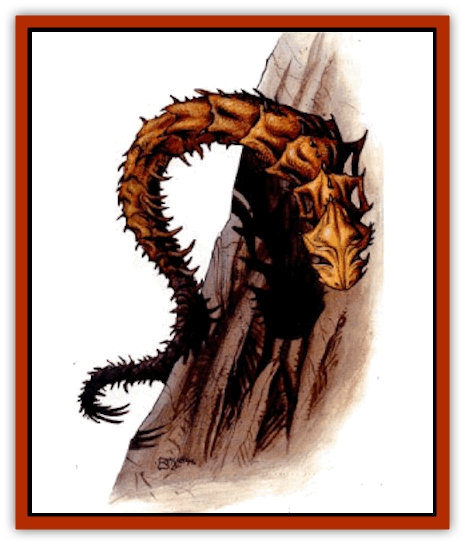

# Spinewyrm

| Statistic | **Spinewyrm** |
| --- | --- |
| **Activity Cycle:** | Any |
| **Alignment:** | Neutral |
| **Armor Class:** | 2 |
| **Climate/Terrain:** | Tablelands |
| **Damage/Attack:** | 2-12 |
| **Diet:** | Carnivore |
| **Frequency:** | Uncommon |
| **Hit Dice:** | 8 |
| **Intelligence:** | Low (5-7) |
| **Magic Resistance:** | Nil |
| **Morale:** | Very steady (13-14) |
| **Movement:** | 12, F1 15 (B) |
| **No. Appearing:** | 1 |
| **No. of Attacks:** | 1 |
| **Organization:** | Solitary |
| **Size:** | L (30' long) |
| **Special Attacks:** | See below |
| **Special Defenses:** | Nil |
| **THAC0:** | 13 |
| **Treasure:** | Nil |
| **XP Value:** | 2,000 |

**Psionics Summary**

| Level | Dis/Sci/Dev | Attack/Defense | Score | PSPs |
| --- | --- | --- | --- | --- |
| 4 | 1/1/3 | -/MBk | 7 | 20 |

**Psychometabolism -** *Science:* shadow form; *Devotions:* chameleon power, displacement, ectoplasmatic form.

The spinewyrm is closely related to the [[Silk_Wyrm|silk wyrm]] and kills its victims by constriction.

Like the silk wyrm, the spinewyrm has chitinous shell. The hard shell makes it very difficult to damage these creatures. Bony plates run from head to tail. In addition to this shell, rows of cruel spikes adorn the plates. These spines impale a victim caught by the vice-like grip of the spinewyrm's constriction. Though these serpents have no wings, they can fly because of a special organ unique to the wyrms of Athas.

**Combat:** This creature flies over the Tablelands of Athas in search of prey, but it rarely attacks before dusk. Because the spinewyrm swallows its food whole, it often takes a great deal of time for digestion to be complete, particularly with large quarry. Even after the meal is consumed it can take as long as 12 hours for enough of the food to be digested to make movement practical.

When a spinewyrm spots a likely candidate for its next meal, it favors using its ectoplasmic form and chameleon power to blend into the background. Using these two powers in conjunction makes the spinewyrm 90% undetectable to the naked eye. When a potential victim is within range, the creature dives, still in its camouflaged form, to attack its opponent. Such attacks are made at +4 if the wrym goes undetected.

On a successful attack roll, an opponent is caught in the death grip of the spinewyrm's constriction and receives 2-12 (2d6) points of damage that round unless the intended victim makes a successful Dexterity check at -4. Each successive round the victim suffers another 2-8 (2d4) points of damage. The victim must make a save vs. death magic every round after the third in the spinewyrm's grip. If the victim fails the save, he loses consciousness. At this point the spinewyrm flies off, carrying its victim to some remote bluff or spire to feed.

If the spinewyrm loses 75% of its hit points, it releases its prey and shoots some of its spines at its opponents. The wyrm can launch as many as eight (2d4) such spines at no more than two targets that are within 10 feet of each other. Each spine requires a separate attack roll and causes 1-6 (1d6) points of damage each. These spines grow back in six weeks.

**Habitat/Society:** The spinewyrm is a solitary creature that roams the countryside searching for food. Occasionally groups of two to six spinewyrms are seen traveling together. Since this generally happens during the same time of year, it is believed to be some type of mating migration.

The spinewyrm is fascinated by any shiny objects and collects these things in its lair. Often gems, coins, jewelry. and any other object that glistens can be found in the spinewyrm's nest.

**Ecology:** Spinewyrms keep a nest on some remote peak where they pefer to take their prey. The usually build these nests into a shallow cave that allows them to hide when they sleep and feed.

When feeding, the spinewyrm disconnects its lower jaw and envelopes its prey whole. Depending on the size of the meal, it could take from 1-6 hours to ingest the entire being. Sufficient digestion to allow flight could take another one to six hours.

---
## Discovery & Documentation

**Source Publication:** Dark Sun Appendix II - Terrors Beyond Tyr (1991)
**Campaign Setting:** Dark Sun
**Author(s):** Jim Atkiss, Steve Brown, Timothy B. Brown, Andrew P. Morris, Bruce Nesmith, Wes Nicholson, Bill Slavicsek

### Other Creatures Found in This Source Book
   * [[Aarakocra_Athas|Aarakocra (Athas)]]
   * [[Animal_Domestic_Athas_II|Animal, Domestic (Athas) II]]
   * [[Aviarag|Aviarag]]
   * [[Baazrag|Baazrag]]
   * [[Baazrag_Boneclaw|Baazrag, Boneclaw]]
   * [[Bloodgrass|Bloodgrass]]
   * [[Cactus_Hunting|Cactus, Hunting]]
   * [[Cactus_Rock|Cactus, Rock]]
   * [[Cilops|Cilops]]
   * [[Crodlu|Crodlu]]
   * [[Dagorran|Dagorran]]
   * [[Dhaot|Dhaot]]
   * [[Drake_Lesser_Athas_General_Information|Drake, Lesser (Athas), General Information]]
   * [[Drake_Lesser_Athas_Magma|Drake, Lesser (Athas), Magma]]
   * [[Drake_Lesser_Athas_Rain|Drake, Lesser (Athas), Rain]]
   * [[Drake_Lesser_Athas_Silt|Drake, Lesser (Athas), Silt]]
   * [[Drake_Lesser_Athas_Sun|Drake, Lesser (Athas), Sun]]
   * [[Dray|Dray]]
   * [[Drik|Drik]]
   * [[Dune_Reaper|Dune Reaper]]
   * [[Dwarf_Athas|Dwarf (Athas)]]
   * [[Elemental_Beast_Athas_Air|Elemental Beast (Athas), Air]]
   * [[Elemental_Beast_Athas_Earth|Elemental Beast (Athas), Earth]]
   * [[Elemental_Beast_Athas_Fire|Elemental Beast (Athas), Fire]]
   * [[Elemental_Beast_Athas_Water|Elemental Beast (Athas), Water]]
   * [[Elf_Athas|Elf (Athas)]]
   * [[Fael|Fael]]
   * [[Feylaar|Feylaar]]
   * [[Fordorran|Fordorran]]
   * [[Giant_Half-giant|Giant, Half-giant]]
   * [[Giant_Shadow|Giant, Shadow]]
   * [[Golem_Athas_Magma|Golem (Athas), Magma]]
   * [[Golem_Athas_Salt|Golem (Athas), Salt]]
   * [[Golem_Athas_General_Information|Golem (Athas), General Information]]
   * [[Gorak|Gorak]]
   * [[Halfling_Athas|Halfling (Athas)]]
   * [[Human_Athas|Human (Athas)]]
   * [[Jhakar|Jhakar]]
   * [[Kaisharga|Kaisharga]]
   * [[Kes'trekel|Kes'trekel]]
   * [[Klar|Klar]]
   * [[Krag|Krag]]
   * [[Kragling|Kragling]]
   * [[Lirr|Lirr]]
   * [[Mastyrial|Mastyrial]]
   * [[Meorty|Meorty]]
   * [[Mul|Mul]]
   * [[Nikaal|Nikaal]]
   * [[Paraelemental_Beast_General_Information|Paraelemental Beast, General Information]]
   * [[Paraelemental_Beast_Magma|Paraelemental Beast, Magma]]
   * [[Paraelemental_Beast_Rain|Paraelemental Beast, Rain]]
   * [[Paraelemental_Beast_Silt|Paraelemental Beast, Silt]]
   * [[Paraelemental_Beast_Sun|Paraelemental Beast, Sun]]
   * [[Pakubrazi|Pakubrazi]]
   * [[Psionocus|Psionocus]]
   * [[Psurlon|Psurlon]]
   * [[Raaig|Raaig]]
   * [[Retriever_Obsidian|Retriever, Obsidian]]
   * [[Ruktoi|Ruktoi]]
   * [[Ruvoka_Athas|Ruvoka (Athas)]]
   * [[Sand_Howler|Sand Howler]]
   * [[Scorpion_Athas|Scorpion (Athas)]]
   * [[Seed_Brain|Seed, Brain]]
   * [[Silt_Horror_Black|Silt Horror, Black]]
   * [[Silt_Horror_Magma|Silt Horror, Magma]]
   * [[Silt_Horror_Red|Silt Horror, Red]]
   * [[Silt_Spawn|Silt Spawn]]
   * [[Slig|Slig]]
   * [[Spider_Athas|Spider (Athas)]]
   * [[Ssurran|Ssurran]]
   * [[Stalking_Horror|Stalking Horror]]
   * [[Tarek|Tarek]]
   * [[Tari|Tari]]
   * [[Thri-kreen|Thri-kreen]]
   * [[T'liz|T'liz]]
   * [[Tohr-kreen_II|Tohr-kreen II]]
   * [[Tohr-kreen_III|Tohr-kreen III]]
   * [[Trin|Trin]]
   * [[Tul'k|Tul'k]]
   * [[Undead_Athas_General_Information|Undead (Athas), General Information]]
   * [[Wraith_Athas|Wraith (Athas)]]
   * [[Xerichou|Xerichou]]
   * [[Zombie_Thinking|Zombie, Thinking]]
