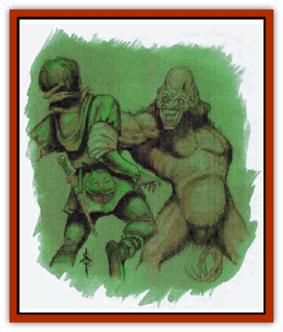

# Spirit - Forest - Uthraki

| Statistic | **Spirit, Forest, Uthraki** |
| --- | --- |
| **Activity Cycle:** | Special |
| **Alignment:** | Chaotic evil |
| **Armor Class:** | 4 |
| **Climate/Terrain:** | Forests (Rashemen) |
| **Damage/Attack:** | 1d6/1d6 |
| **Diet:** | Carnivore |
| **Frequency:** | Rare |
| **Hit Dice:** | 5 |
| **Intelligence:** | High (11-12) |
| **Magic Resistance:** | Nil |
| **Morale:** | Steady (12) |
| **Movement:** | 18 |
| **No. Appearing:** | 1 |
| **No. of Attacks:** | 2 |
| **Organization:** | Solitary |
| **Size:** | M (5'4&rdquo; tall) |
| **Special Attacks:** | Strangle |
| **Special Defenses:** | See below |
| **THAC0:** | 15 |
| **Treasure:** | Nil (F) |
| **XP Value:** | 420 |

Uthraki are malevolent, shapechanging spirits that haunt the dark woods and lonely roads of Rashemen. Uthraki are said to take the form of harmless companions to befriend lone travelers, and then kill and devour them.

No one is certain what an uthraki looks like in its natural form, hut they are said to be hideous, twisted, hairy creatures with eyes all around their heads, so they are never surprised.

The tales are true, hut few can confirm them since uthraki leave few survivors. They resemble bent, hunchbacked apes with long, snarled gray fur and small, humanlike faces. Their eyes are entirely black, with no visible iris or pupil.

**Combat:** Uthraki speak Common and are capable of changing into the form of any human, demihuman, or humanoid creature. The disguise is magical and cannot he detected save through *true seeing* or similar spells. *Detect magic* reveals an aura about the creature but nothing more.

Uthraki usually remain disguised when attacking, preferring to change to true form immediately before the victims' deaths to further terrorize the prey. They attack with powerful hands, slashing with claws. If both claw attacks hit, the uthraki has latched onto its victim's throat and automatically inflicts an additional 2d8 points of damage each round after that. The victim may attempt to dislodge the uthraki by making a Strength check with a -4 penalty. A successful roll breaks the uthraki's stranglehold.

Uthraki are strong during the day, but prefer to attack at night, for once the sun has set they regenerate 2 hp per turn.

Although they are dangerous, terrifying creatures, uthraki have vulnerabilities. They take double damage from heat-based spells. Earth-based weapons such as stone or wooden clubs and flint-tipped arrows automatically inflict maximum damage. No one can be certain why this is, but some have theorized that uthraki are of a spirit form that is inimical to earth-based substances.

**Habitat/Society:** Lone, spiteful creatures that hate all other living things, even their own kind, uthraki live in distant wilderness areas, roaming isolated roads and highways seeking victims. Their lairs aw in deep burrows beneath tree roots or between rocks.

**Ecology:** Uthraki are natural shapechangers and prefer to take a familiar and comforting form - a lost child, friendly minstrel, jolly merchant, merry elf travelers, gruff but friendly dwarf warriors, cute halflings, gnome acrobats, and the like. Such forms are intended to win a victim's confidence, for the uthraki wants to wait until dark to unleash its deadly attacks.

Uthraki avoid settled areas, preferring to stalk their prey in isolated wilderness areas. Hunting in cities is far too hazardous, for the shapechangers can be detected through true seeing or similar spells, and the Witches of Rashemen will hunt down and destroy uthraki wherever they can be found.

Uthraki also feed on small mammals such as rats, rabbits, squirrels, and the occasional carcass found deep in the woods. More cunning uthraki masquerade as prey animals, then turn on predators expecting an easy meal.

---
## Discovery & Documentation

**Source Publication:** Monstrous Compendium, 1996 Annual, Volume 3 (1995)
**Campaign Setting:** Advanced Dungeons & Dragons 2nd Edition
**Author(s):** Jon Pickens

### Other Creatures Found in This Source Book
   * [[Alaghi|Alaghi]]
   * [[Alhoon|Alhoon]]
   * [[Aranea_Savage_Coast|Aranea (Savage Coast)]]
   * [[Arcane_Head|Arcane Head]]
   * [[Banedead|Banedead]]
   * [[Banelich|Banelich]]
   * [[Bat_Bonebat|Bat, Bonebat]]
   * [[Beetle|Beetle]]
   * [[Belgoi|Belgoi]]
   * [[Bladeling|Bladeling]]
   * [[Braxat|Braxat]]
   * [[Bunyip|Bunyip]]
   * [[Burbur|Burbur]]
   * [[Bvanen|Bvanen]]
   * [[Cat_Great_Snow_Tiger|Cat, Great, Snow Tiger]]
   * [[Chosen_One|Chosen One]]
   * [[Chronovoid|Chronovoid]]
   * [[Cildabrin|Cildabrin]]
   * [[Coffer_Corpse|Coffer Corpse]]
   * [[Disenchanter|Disenchanter]]
   * [[Dog_Temporal|Dog, Temporal]]
   * [[Dragon_Cerilia|Dragon (Cerilia)]]
   * [[Dragon_Ghost|Dragon, Ghost]]
   * [[Dragon_Lesser_Undead|Dragon, Lesser Undead]]
   * [[Dragon_Neutral_Amber|Dragon, Neutral, Amber]]
   * [[Dread_Warrior|Dread Warrior]]
   * [[Dreamweaver|Dreamweaver]]
   * [[Dream_Spawn_Greater_Ennui|Dream Spawn, Greater, Ennui]]
   * [[Dream_Spawn_Lesser_Morph|Dream Spawn, Lesser, Morph]]
   * [[Dwarf_Arctic|Dwarf, Arctic]]
   * [[Dwarf_Urdunnir|Dwarf, Urdunnir]]
   * [[Eel_Giant_Moray|Eel, Giant Moray]]
   * [[Elemental_Fire_Kin_Tome_Guardian|Elemental, Fire Kin, Tome Guardian]]
   * [[Elf_Rockseer|Elf, Rockseer]]
   * [[Ethyk|Ethyk]]
   * [[Faerie_Faerie_Fiddler|Faerie, Faerie Fiddler]]
   * [[Faerie_Petty_Bramble|Faerie, Petty, Bramble]]
   * [[Faerie_Petty_Gorse|Faerie, Petty, Gorse]]
   * [[Faerie_Petty|Faerie, Petty]]
   * [[Firenewt|Firenewt]]
   * [[Formian|Formian]]
   * [[Gargoyle_II|Gargoyle II]]
   * [[Giant_Cerilia|Giant (Cerilia)]]
   * [[Goblin_Cerilia|Goblin (Cerilia)]]
   * [[Golem_Magic|Golem, Magic]]
   * [[Golem_Shaboath|Golem, Shaboath]]
   * [[Hag_Bheur|Hag, Bheur]]
   * [[Hamadryad|Hamadryad]]
   * [[Hound_of_Ill-Omen|Hound of Ill-Omen]]
   * [[Human_Cerilia|Human (Cerilia)]]
   * [[Hybsil|Hybsil]]
   * [[Ibrandlin|Ibrandlin]]
   * [[Imp_Chaos|Imp, Chaos]]
   * [[Ixitxachitl_Ixzan|Ixitxachitl, Ixzan]]
   * [[Jabberwock|Jabberwock]]
   * [[Kyton|Kyton]]
   * [[Kyuss_Son_of|Kyuss, Son of]]
   * [[Lillend|Lillend]]
   * [[Life-Shaped_Creation_Guardian|Life-Shaped Creation, Guardian]]
   * [[Life-Shaped_Creation_Transport|Life-Shaped Creation, Transport]]
   * [[Lycanthrope_Werecrocodile|Lycanthrope, Werecrocodile]]
   * [[Lycanthrope_Werespider|Lycanthrope, Werespider]]
   * [[Magedoom|Magedoom]]
   * [[Manotaur|Manotaur]]
   * [[Mastiff_Shadow|Mastiff, Shadow]]
   * [[Meazel|Meazel]]
   * [[Mist_Scarlet_Dancer|Mist, Scarlet Dancer]]
   * [[Needleman|Needleman]]
   * [[Orc_Neo-Orog|Orc, Neo-Orog]]
   * [[Orc_Ondonti|Orc, Ondonti]]
   * [[Owlbear_II|Owlbear II]]
   * [[Pegataur|Pegataur]]
   * [[Phaerimm|Phaerimm]]
   * [[Reggelid|Reggelid]]
   * [[Render|Render]]
   * [[Saurial|Saurial]]
   * [[Scalamagdrion|Scalamagdrion]]
   * [[Sharn|Sharn]]
   * [[Snake_Messenger|Snake, Messenger]]
   * [[Spirit_Forest_Wood_Man|Spirit, Forest, Wood Man]]
   * [[Spirit_Ice_Orglash|Spirit, Ice, Orglash]]
   * [[Spirit_Rock_Thomil|Spirit, Rock, Thomil]]
   * [[Strider_Giant|Strider, Giant]]
   * [[Tembo|Tembo]]
   * [[Temporal_Glider|Temporal Glider]]
   * [[Temporal_Stalker|Temporal Stalker]]
   * [[Tether_Beast|Tether Beast]]
   * [[Thessalmonster|Thessalmonster]]
   * [[Time_Dimensional|Time Dimensional]]
   * [[Tomb_Tapper|Tomb Tapper]]
   * [[Undead_Dragon_Slayer|Undead Dragon Slayer]]
   * [[Unicorn_Black_Toril|Unicorn, Black (Toril)]]
   * [[Vaath|Vaath]]
   * [[Vortex_Spider|Vortex Spider]]
   * [[Weredragon|Weredragon]]
   * [[Zhentarim_Spirit|Zhentarim Spirit]]
