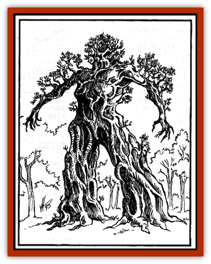

# Spirit - Forest - Wood Man

| Statistic | **Spirit, Forest, Wood Man** |
| --- | --- |
| **Activity Cycle:** | Any |
| **Alignment:** | Chaotic good |
| **Armor Class:** | 4 |
| **Climate/Terrain:** | Forests (Rashemen) |
| **Damage/Attack:** | 3d10/3d10 |
| **Diet:** | Special |
| **Frequency:** | Very rare |
| **Hit Dice:** | 20 |
| **Intelligence:** | Genius (18) |
| **Magic Resistance:** | Regeneration, immune to fire and electricity |
| **Morale:** | Fearless (20) |
| **Movement:** | 24 |
| **No. Appearing:** | 1 |
| **No. of Attacks:** | 2 |
| **Organization:** | Solitary |
| **Size:** | G (50' tall) |
| **Special Attacks:** | Crush, throw |
| **Special Defenses:** | 50% |
| **THAC0:** | 3 |
| **Treasure:** | Nil |
| **XP Value:** | 20,000 |

Of all the nature spirits of Rashemen, the most powerful is the great being known as the wood man. Towering 50 feet in height, the wood man resembles a vast, oversized humanoid made of living wood, with great root-bound feet and gnarled, clublike hands, all sprouting branches, leaves, and needles of a dozen different tree species.

The Rashemaar fear this mighty creature, as its thirst for vengeance is said to occasionally extend to Rashemaar who have not been unswerving in their dedication to the land and its people. Cautionary tales warn commoners and nobles alike to maintain their respect and love for both the land and the Witches of Rashemen, lest the wood man be sent to correct their behavior.

The wood man appears to defend Rashemen against foreign invaders. Terrifying in combat, the wood man serves as a potent morale-builder for Rashemaar forces. Though its combat ability is formidable, the wood man is not invincible. The Tuigan Horde is said to have destroyed one during the invasion of 1359-60 DR, and a unit of Thayan bombards damaged a wood man sufficiently to force it into retreat in one of the Red Wizards' many campaigns against Rashemen. The bombards were later overrun and destroyed by berserkers. Though these weapons are highly effective against the Rashemaar in general, and the wood man in particular, their extreme value and the difficulty of dragging them to Rashemen have prevented the Red Wizards from using bombards since then.

**Combat:** The wood man attacks by smashing its foes with great, clublike hands, each hit causing 3d10 points of damage. If both hands hit, the wood man automatically inflicts another 5d10 points of crushing damage.

An opponent held with both hands can also be thrown: The victim flies 10d10 yards and suffers 6d8 points of damage when he strikes the ground.

A wood man has a 50% resistance to most magic, but this rises to 80% resistance against the evil magic of the Red Wizards. A wood man is also immune to all fire- and electricity-based attacks.

Literally rooted to the land of Rashemen, a wood man is a growing creature. It regenerates 4 hp per round and must be reduced to -50 hp in order to be destroyed. Thus, a wood man is virtually immortal and very difficult to kill.

**Habitat/Society:** A wood man (usually there is only one, though legend holds that several can be summoned if the need is great enough) appears in times of great need or crisis - the very glimpse of one is enough to convince most Rashemaar that doomsday is at hand. Exactly how they are called is not known. Some claim they may be summoned by the Witches, though a few who are aware of the existence of the *vremyonni* believe that these powerful, old male sorcerers are responsible for calling up the wood man; still others believe they are servants of the gods.

The Red Wizards and their troops are terrified of wood men, and the mere sight of one is enough to send a Thayan army fleeing. Fortunately for the Thayans, the wood man (or men) is very rare, putting in an appearance only when the entire land is in deadly peril. So far, the Rashemaar have become so skillful in dealing with Thayan invasions that the wood man seems almost unnecessary.

**Ecology:** The wood man is a literal extension of the land. Rather than affecting the nation's ecology, it is the living embodiment of the ecology. Though its passage is always destructive - trees torn up, hills displaced, valleys devastated and rivers redirected - all damage magically heals itself within a matter of days. Soon all is as if the wood man had never been there.

---
## Discovery & Documentation

**Source Publication:** Monstrous Compendium, 1996 Annual, Volume 3 (1995)
**Campaign Setting:** Advanced Dungeons & Dragons 2nd Edition
**Author(s):** Jon Pickens

### Other Creatures Found in This Source Book
   * [[Alaghi|Alaghi]]
   * [[Alhoon|Alhoon]]
   * [[Aranea_Savage_Coast|Aranea (Savage Coast)]]
   * [[Arcane_Head|Arcane Head]]
   * [[Banedead|Banedead]]
   * [[Banelich|Banelich]]
   * [[Bat_Bonebat|Bat, Bonebat]]
   * [[Beetle|Beetle]]
   * [[Belgoi|Belgoi]]
   * [[Bladeling|Bladeling]]
   * [[Braxat|Braxat]]
   * [[Bunyip|Bunyip]]
   * [[Burbur|Burbur]]
   * [[Bvanen|Bvanen]]
   * [[Cat_Great_Snow_Tiger|Cat, Great, Snow Tiger]]
   * [[Chosen_One|Chosen One]]
   * [[Chronovoid|Chronovoid]]
   * [[Cildabrin|Cildabrin]]
   * [[Coffer_Corpse|Coffer Corpse]]
   * [[Disenchanter|Disenchanter]]
   * [[Dog_Temporal|Dog, Temporal]]
   * [[Dragon_Cerilia|Dragon (Cerilia)]]
   * [[Dragon_Ghost|Dragon, Ghost]]
   * [[Dragon_Lesser_Undead|Dragon, Lesser Undead]]
   * [[Dragon_Neutral_Amber|Dragon, Neutral, Amber]]
   * [[Dread_Warrior|Dread Warrior]]
   * [[Dreamweaver|Dreamweaver]]
   * [[Dream_Spawn_Greater_Ennui|Dream Spawn, Greater, Ennui]]
   * [[Dream_Spawn_Lesser_Morph|Dream Spawn, Lesser, Morph]]
   * [[Dwarf_Arctic|Dwarf, Arctic]]
   * [[Dwarf_Urdunnir|Dwarf, Urdunnir]]
   * [[Eel_Giant_Moray|Eel, Giant Moray]]
   * [[Elemental_Fire_Kin_Tome_Guardian|Elemental, Fire Kin, Tome Guardian]]
   * [[Elf_Rockseer|Elf, Rockseer]]
   * [[Ethyk|Ethyk]]
   * [[Faerie_Faerie_Fiddler|Faerie, Faerie Fiddler]]
   * [[Faerie_Petty_Bramble|Faerie, Petty, Bramble]]
   * [[Faerie_Petty_Gorse|Faerie, Petty, Gorse]]
   * [[Faerie_Petty|Faerie, Petty]]
   * [[Firenewt|Firenewt]]
   * [[Formian|Formian]]
   * [[Gargoyle_II|Gargoyle II]]
   * [[Giant_Cerilia|Giant (Cerilia)]]
   * [[Goblin_Cerilia|Goblin (Cerilia)]]
   * [[Golem_Magic|Golem, Magic]]
   * [[Golem_Shaboath|Golem, Shaboath]]
   * [[Hag_Bheur|Hag, Bheur]]
   * [[Hamadryad|Hamadryad]]
   * [[Hound_of_Ill-Omen|Hound of Ill-Omen]]
   * [[Human_Cerilia|Human (Cerilia)]]
   * [[Hybsil|Hybsil]]
   * [[Ibrandlin|Ibrandlin]]
   * [[Imp_Chaos|Imp, Chaos]]
   * [[Ixitxachitl_Ixzan|Ixitxachitl, Ixzan]]
   * [[Jabberwock|Jabberwock]]
   * [[Kyton|Kyton]]
   * [[Kyuss_Son_of|Kyuss, Son of]]
   * [[Lillend|Lillend]]
   * [[Life-Shaped_Creation_Guardian|Life-Shaped Creation, Guardian]]
   * [[Life-Shaped_Creation_Transport|Life-Shaped Creation, Transport]]
   * [[Lycanthrope_Werecrocodile|Lycanthrope, Werecrocodile]]
   * [[Lycanthrope_Werespider|Lycanthrope, Werespider]]
   * [[Magedoom|Magedoom]]
   * [[Manotaur|Manotaur]]
   * [[Mastiff_Shadow|Mastiff, Shadow]]
   * [[Meazel|Meazel]]
   * [[Mist_Scarlet_Dancer|Mist, Scarlet Dancer]]
   * [[Needleman|Needleman]]
   * [[Orc_Neo-Orog|Orc, Neo-Orog]]
   * [[Orc_Ondonti|Orc, Ondonti]]
   * [[Owlbear_II|Owlbear II]]
   * [[Pegataur|Pegataur]]
   * [[Phaerimm|Phaerimm]]
   * [[Reggelid|Reggelid]]
   * [[Render|Render]]
   * [[Saurial|Saurial]]
   * [[Scalamagdrion|Scalamagdrion]]
   * [[Sharn|Sharn]]
   * [[Snake_Messenger|Snake, Messenger]]
   * [[Spirit_Forest_Uthraki|Spirit, Forest, Uthraki]]
   * [[Spirit_Ice_Orglash|Spirit, Ice, Orglash]]
   * [[Spirit_Rock_Thomil|Spirit, Rock, Thomil]]
   * [[Strider_Giant|Strider, Giant]]
   * [[Tembo|Tembo]]
   * [[Temporal_Glider|Temporal Glider]]
   * [[Temporal_Stalker|Temporal Stalker]]
   * [[Tether_Beast|Tether Beast]]
   * [[Thessalmonster|Thessalmonster]]
   * [[Time_Dimensional|Time Dimensional]]
   * [[Tomb_Tapper|Tomb Tapper]]
   * [[Undead_Dragon_Slayer|Undead Dragon Slayer]]
   * [[Unicorn_Black_Toril|Unicorn, Black (Toril)]]
   * [[Vaath|Vaath]]
   * [[Vortex_Spider|Vortex Spider]]
   * [[Weredragon|Weredragon]]
   * [[Zhentarim_Spirit|Zhentarim Spirit]]
