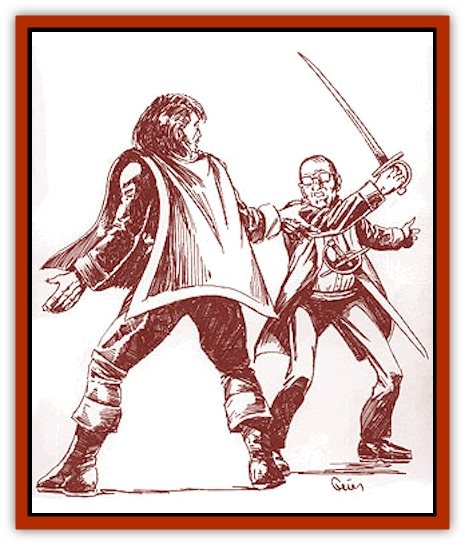

# Spirit - Heroic

| Statistic | **Spirit, Heroic** |
| --- | --- |
| **Activity Cycle:** | Any |
| **Alignment:** | Any |
| **Armor Class:** | See below |
| **Climate/Terrain:** | Any |
| **Damage/Attack:** | Nil |
| **Diet:** | Nil |
| **Frequency:** | Very rare |
| **Hit Dice:** | Nil |
| **Intelligence:** | Low to Genius (5-18) |
| **Magic Resistance:** | Nil |
| **Morale:** | Fearless (20) |
| **Movement:** | See below |
| **No. Appearing:** | 1 |
| **No. of Attacks:** | 0 |
| **Organization:** | Solitary |
| **Size:** | M(4-7' tall) |
| **Special Attacks:** | See below |
| **Special Defenses:** | See below |
| **THAC0:** | Nil |
| **Treasure:** | Nil |
| **XP Value:** | See below |

The heroic spirit is an undead entity who died while attempting to perform some especially heroic deed or defeat some dastardly villain. It remains in the living world to accomplish its "unfinished business". This entails either completing the heroic deed or dishonoring the villain.

The heroic spirit retains whatever alignment it had while living. The spirit first occupies a living victim, who remains mostly free willed and unharmed throughout the process.

The heroic spirit can only communicate through empathy. The host should eventually realize it is haunted (through DM clues) and should then begin to investigate the circumstances behind the spirit's death and discover its goal.

The heroic spirit only rarely manifests a visible form, usually only to wave adieu when it leaves its host.

**Combat:** Most of the time, the heroic spirit remains dormant. It awakens when its host faces deadly peril. In either case, the heroic spirit automatically makes a successful suggestion that its host leap into battle, regardless of the odds. The spirit then utters a battle cry through its host, such as *"La fortune sourit aux audacieux"* (fortune favors the brave) or *"qui ne risque rien n'a rien"* (nothing ventured, nothing gained).

During combat, the heroic spirit acts as a *potion of super-heroism* on the host, regardless of class. While in combat, the host must act in the flashiest, bravest manner possible. Panache is the key here, more so than combat efficiency.

Combat under the effect of the heroic spirit lasts as many rounds as there are foes (with a minimum of 4 rounds and a maximum of 15). The host may then chose whether to withdraw or continue the battle. If withdrawing, the host must still show flair and elegance with the departure.

In addition, the heroic spirit may also allow a host the effects of a Luck Legacy if the host adopts the spirit's flamboyant ways. Once activated, this luck factor remains active even though the heroic spirit is dormant.

The heroic spirit cannot be attacked or turned directly, although it could be forced out by an exorcism. A good-aligned heroic spirit will leave its host voluntarily if the host truly wishes the spirit to leave.

**Habitat/Society:** The heroic spirit remains in its host either until its goal is reached or until the host gains an experience level. In the latter case (or if the host dies), the heroic spirit then moves on to another host.

Heroic spirits rarely choose a swashbuckler as a host. Heroic spirits like to change the life of a quiet or a shy person, sometimes even a notorious coward. A heroic spirit will never chose the host of a legacy leech. When two such hosts encounter each other, the heroic spirit and the legacy leech instantly recognize each other. If the host of the heroic spirit does not voluntarily attack the host of the legacy leech, the heroic spirit will attempt to temporarily take over the host's body with *magic jar*. The host might very well be forced to fight to the death.

**Ecology:** As an undead creature, the heroic spirit has little effect on the ecology.

The first time the heroic spirit activates, the host receives a one-time bonus of 450 experience points. The bonus comes from the actions the heroic spirit causes its host to perform. A host that actually helps a heroic spirit achieve its goal receives an additional award of 1,000 experience points.

---
## Discovery & Documentation

**Source Publication:** Monstrous Compendium Savage Coast Appendix (Online Exclusive) (1995)
**Campaign Setting:** Mystara
**Author(s):** Loren L Coleman, Ted James, Thomas Zuvich, Cindi M. Rice

### Other Creatures Found in This Source Book
   * [[Aranea_Savage_Coast|Aranea (Savage Coast)]]
   * [[Arashaeem|Arashaeem]]
   * [[Batracine|Batracine]]
   * [[Cat_Marine|Cat, Marine]]
   * [[Cinnavixen|Cinnavixen]]
   * [[Clockwork_Swordsman|Clockwork Swordsman]]
   * [[Critter_Temple|Critter, Temple]]
   * [[Cursed_One|Cursed One]]
   * [[Deathmare|Deathmare]]
   * [[Dragon_Savage_Coast_Crimson|Dragon (Savage Coast), Crimson]]
   * [[Dragon_Savage_Coast_Red_Hawk|Dragon (Savage Coast), Red Hawk]]
   * [[Echyan|Echyan]]
   * [[Ee'aar|Ee'aar]]
   * [[Enduk|Enduk]]
   * [[Fachan_Savage_Coast|Fachan (Savage Coast)]]
   * [[Feliquine|Feliquine]]
   * [[Fiend_Narvaezan|Fiend, Narvaezan]]
   * [[Frelôn|Frelôn]]
   * [[Ghriest|Ghriest]]
   * [[Glutton_Sea|Glutton, Sea]]
   * [[Goatman|Goatman]]
   * [[Golem_Naâruk|Golem, Naâruk]]
   * [[Golem_Savage_Coast|Golem (Savage Coast)]]
   * [[Grudgling|Grudgling]]
   * [[Heraldic_Servant_I|Heraldic Servant I]]
   * [[Heraldic_Servant_II|Heraldic Servant II]]
   * [[Heraldic_Servant_III|Heraldic Servant III]]
   * [[Heraldic_Servant_IV|Heraldic Servant IV]]
   * [[Heraldic_Servant_V|Heraldic Servant V]]
   * [[Heraldic_Servant_General_Information|Heraldic Servant, General Information]]
   * [[Hermit_Sea|Hermit, Sea]]
   * [[Jorri|Jorri]]
   * [[Juhrion|Juhrion]]
   * [[Kla'a-tah|Kla'a-tah]]
   * [[Leech_Legacy|Leech, Legacy]]
   * [[Lich_Inheritor|Lich, Inheritor]]
   * [[Lizard_Kin_Savage_Coast|Lizard Kin (Savage Coast)]]
   * [[Lupasus|Lupasus]]
   * [[Lupin|Lupin]]
   * [[Lyra_Bird_Saragón|Lyra Bird, Saragón]]
   * [[Malfera|Malfera]]
   * [[Manscorpion_Nimmurian|Manscorpion, Nimmurian]]
   * [[Mythuínn_Folk|Mythuínn Folk]]
   * [[Neshezu|Neshezu]]
   * [[Nikt'oo|Nikt'oo]]
   * [[Nosferatu|Nosferatu]]
   * [[Omm-wa|Omm-wa]]
   * [[Omshirim|Omshirim]]
   * [[Parasite_Savage_Coast|Parasite (Savage Coast)]]
   * [[Phanaton|Phanaton]]
   * [[Plant_Savage_Coast|Plant (Savage Coast)]]
   * [[Pudding_Vermilion|Pudding, Vermilion]]
   * [[Rakasta|Rakasta]]
   * [[Ray_Forest|Ray, Forest]]
   * [[Shedu_Greater_Savage_Coast|Shedu, Greater (Savage Coast)]]
   * [[Shimmerfish|Shimmerfish]]
   * [[Skinwing|Skinwing]]
   * [[Spawn_of_Nimmur|Spawn of Nimmur]]
   * [[Spider-spy|Spider-spy]]
   * [[Spirit_Walleran|Spirit, Walleran]]
   * [[Succulus|Succulus]]
   * [[Swampmare|Swampmare]]
   * [[Symbiont_Shadow|Symbiont, Shadow]]
   * [[Tortle|Tortle]]
   * [[Troll_Legacy|Troll, Legacy]]
   * [[Trosip|Trosip]]
   * [[Tyminid|Tyminid]]
   * [[Utukku|Utukku]]
   * [[Voat|Voat]]
   * [[Voat_Herathian|Voat, Herathian]]
   * [[Vulturehound|Vulturehound]]
   * [[Wallara|Wallara]]
   * [[Wurmling|Wurmling]]
   * [[Wynzet|Wynzet]]
   * [[Yeshom|Yeshom]]
   * [[Zombie_Red|Zombie, Red]]
