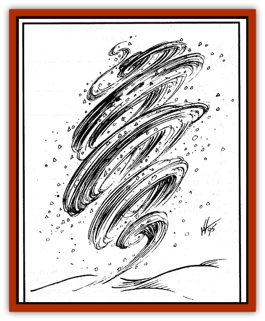

# Spirit - Ice - Orglash

| Statistic | **Spirit, Ice, Orglash** |
| --- | --- |
| **Activity Cycle:** | Any |
| **Alignment:** | Chaotic neutral |
| **Armor Class:** | 0 |
| **Climate/Terrain:** | Mountains, icy regions (Rashemen) |
| **Damage/Attack:** | 1d8/1d8 |
| **Diet:** | Unknown |
| **Frequency:** | Verv rare |
| **Hit Dice:** | 8 |
| **Intelligence:** | Average (10) |
| **Magic Resistance:** | See below |
| **Morale:** | Fanatic (18) |
| **Movement:** | 12, Fl 24 (D) |
| **No. Appearing:** | 1 |
| **No. of Attacks:** | 2 |
| **Organization:** | Solitary |
| **Size:** | M (5'4&rdquo; tall) |
| **Special Attacks:** | Cone of cold |
| **Special Defenses:** | Immune to cold spells, regeneration |
| **THAC0:** | 13 |
| **Treasure:** | Nil |
| **XP Value:** | 2,000 |

Orglash are Rashemaar ice spirits that protect high mountain peaks but descend to lower levels in winter. They are chaotic and unpredictable but valued for their role as protectors. They can exist in temperatures above freezing and are sometimes summoned by Rashemaar Witches during the spring. In summer and fall, orglash are vulnerable and actually suffer damage at higher temperatures.

Orglash are spirit creatures, wispy and insubstantial, small whirls of wind and snow. If stared at long enough, a tiny pair of black eyes can be faintly seen in the midst of the whirlwind, shifting in and out of view as the wind whips chips of ice and thick flakes of snow.

Like the [[Spirit_Rock_Thomil|rock spirits (*thomil*)]], orglash are viewed with mixed emotions by the Rashemaar themselves. Although they defend the land against the Red Wizards and other foreign invaders, they have also been known to set upon a lone Rashemaar or small parties of travelers. Fickle creatures with little apparent regard for other living things, orglash are a source of great fear and apprehension.

The Witches say that the orglashs' link is to the land, not to the people. By defending Rashemen against alien assaults, the orglash are looking out for their own and the humans of Rashemen are merely the accidental beneficiaries.

**Combat:** Orglash attack with tendrils of icy force, lashing their opponents with razor-sharp shards of ice, flung by the swirling winds that form their bodies.

Three times a day, an orglash can unleash a freezing blast of ice equivalent to a *cone of cold*.

Orglash are immune to all cold-based spells, but suffer double damage from all heat-based spells, such as *fireball*. In freezing weather, orglash regenerate 1 hp per round. In temperatures above 60� Fahrenheit, orglash take 1 point of damage per round. They cannot exist at temperatures over 100� Fahrenheit and automatically dissipate. Dissipated orglash do not die, they are reduced to an insubstantial form. They must returm to an area where the temperature is 40�F or lower, where they revert to their original form in 24 hours.

Orglash are highly resistant to Thayan magic. They have a 50% magic resistance to spells cast by Red Wizards and never check morale in direct combat with Red Wizards.

**Habitat/Society:** Solitary creatures, orglash are viewed as the protectors of Rashemen despite the fact that their hostility to other living things sometimes extends to the Rashemaar.

A single orglash roams a single mountain peak, valley, or other cold place. When winter spreads its icy net across Rashemen, however, they wander the entire land. Most of the time orglash stand at a distance and watch passersby, their black eyes fading in and out of whirling nimbuses.

Orglash seem capable of sensing the presence of foreigners, and outsiders are invariably attacked by orglash.

**Ecology:** Most of orglash existence remains a mystery. Unlike the thomil, which are specifically created or summoned, orglash are natural creatures bound to the land itself. They are apparently sexless, though some observers claim to have seen them giving "birth" to smaller versions of themselves, but this has never been confirmed. They seem to derive sustenance from cold weather, ice, and snow, and they have never been seen eating or consuming anything.

---
## Discovery & Documentation

**Source Publication:** Monstrous Compendium, 1996 Annual, Volume 3 (1995)
**Campaign Setting:** Advanced Dungeons & Dragons 2nd Edition
**Author(s):** Jon Pickens

### Other Creatures Found in This Source Book
   * [[Alaghi|Alaghi]]
   * [[Alhoon|Alhoon]]
   * [[Aranea_Savage_Coast|Aranea (Savage Coast)]]
   * [[Arcane_Head|Arcane Head]]
   * [[Banedead|Banedead]]
   * [[Banelich|Banelich]]
   * [[Bat_Bonebat|Bat, Bonebat]]
   * [[Beetle|Beetle]]
   * [[Belgoi|Belgoi]]
   * [[Bladeling|Bladeling]]
   * [[Braxat|Braxat]]
   * [[Bunyip|Bunyip]]
   * [[Burbur|Burbur]]
   * [[Bvanen|Bvanen]]
   * [[Cat_Great_Snow_Tiger|Cat, Great, Snow Tiger]]
   * [[Chosen_One|Chosen One]]
   * [[Chronovoid|Chronovoid]]
   * [[Cildabrin|Cildabrin]]
   * [[Coffer_Corpse|Coffer Corpse]]
   * [[Disenchanter|Disenchanter]]
   * [[Dog_Temporal|Dog, Temporal]]
   * [[Dragon_Cerilia|Dragon (Cerilia)]]
   * [[Dragon_Ghost|Dragon, Ghost]]
   * [[Dragon_Lesser_Undead|Dragon, Lesser Undead]]
   * [[Dragon_Neutral_Amber|Dragon, Neutral, Amber]]
   * [[Dread_Warrior|Dread Warrior]]
   * [[Dreamweaver|Dreamweaver]]
   * [[Dream_Spawn_Greater_Ennui|Dream Spawn, Greater, Ennui]]
   * [[Dream_Spawn_Lesser_Morph|Dream Spawn, Lesser, Morph]]
   * [[Dwarf_Arctic|Dwarf, Arctic]]
   * [[Dwarf_Urdunnir|Dwarf, Urdunnir]]
   * [[Eel_Giant_Moray|Eel, Giant Moray]]
   * [[Elemental_Fire_Kin_Tome_Guardian|Elemental, Fire Kin, Tome Guardian]]
   * [[Elf_Rockseer|Elf, Rockseer]]
   * [[Ethyk|Ethyk]]
   * [[Faerie_Faerie_Fiddler|Faerie, Faerie Fiddler]]
   * [[Faerie_Petty_Bramble|Faerie, Petty, Bramble]]
   * [[Faerie_Petty_Gorse|Faerie, Petty, Gorse]]
   * [[Faerie_Petty|Faerie, Petty]]
   * [[Firenewt|Firenewt]]
   * [[Formian|Formian]]
   * [[Gargoyle_II|Gargoyle II]]
   * [[Giant_Cerilia|Giant (Cerilia)]]
   * [[Goblin_Cerilia|Goblin (Cerilia)]]
   * [[Golem_Magic|Golem, Magic]]
   * [[Golem_Shaboath|Golem, Shaboath]]
   * [[Hag_Bheur|Hag, Bheur]]
   * [[Hamadryad|Hamadryad]]
   * [[Hound_of_Ill-Omen|Hound of Ill-Omen]]
   * [[Human_Cerilia|Human (Cerilia)]]
   * [[Hybsil|Hybsil]]
   * [[Ibrandlin|Ibrandlin]]
   * [[Imp_Chaos|Imp, Chaos]]
   * [[Ixitxachitl_Ixzan|Ixitxachitl, Ixzan]]
   * [[Jabberwock|Jabberwock]]
   * [[Kyton|Kyton]]
   * [[Kyuss_Son_of|Kyuss, Son of]]
   * [[Lillend|Lillend]]
   * [[Life-Shaped_Creation_Guardian|Life-Shaped Creation, Guardian]]
   * [[Life-Shaped_Creation_Transport|Life-Shaped Creation, Transport]]
   * [[Lycanthrope_Werecrocodile|Lycanthrope, Werecrocodile]]
   * [[Lycanthrope_Werespider|Lycanthrope, Werespider]]
   * [[Magedoom|Magedoom]]
   * [[Manotaur|Manotaur]]
   * [[Mastiff_Shadow|Mastiff, Shadow]]
   * [[Meazel|Meazel]]
   * [[Mist_Scarlet_Dancer|Mist, Scarlet Dancer]]
   * [[Needleman|Needleman]]
   * [[Orc_Neo-Orog|Orc, Neo-Orog]]
   * [[Orc_Ondonti|Orc, Ondonti]]
   * [[Owlbear_II|Owlbear II]]
   * [[Pegataur|Pegataur]]
   * [[Phaerimm|Phaerimm]]
   * [[Reggelid|Reggelid]]
   * [[Render|Render]]
   * [[Saurial|Saurial]]
   * [[Scalamagdrion|Scalamagdrion]]
   * [[Sharn|Sharn]]
   * [[Snake_Messenger|Snake, Messenger]]
   * [[Spirit_Forest_Uthraki|Spirit, Forest, Uthraki]]
   * [[Spirit_Forest_Wood_Man|Spirit, Forest, Wood Man]]
   * [[Spirit_Rock_Thomil|Spirit, Rock, Thomil]]
   * [[Strider_Giant|Strider, Giant]]
   * [[Tembo|Tembo]]
   * [[Temporal_Glider|Temporal Glider]]
   * [[Temporal_Stalker|Temporal Stalker]]
   * [[Tether_Beast|Tether Beast]]
   * [[Thessalmonster|Thessalmonster]]
   * [[Time_Dimensional|Time Dimensional]]
   * [[Tomb_Tapper|Tomb Tapper]]
   * [[Undead_Dragon_Slayer|Undead Dragon Slayer]]
   * [[Unicorn_Black_Toril|Unicorn, Black (Toril)]]
   * [[Vaath|Vaath]]
   * [[Vortex_Spider|Vortex Spider]]
   * [[Weredragon|Weredragon]]
   * [[Zhentarim_Spirit|Zhentarim Spirit]]
