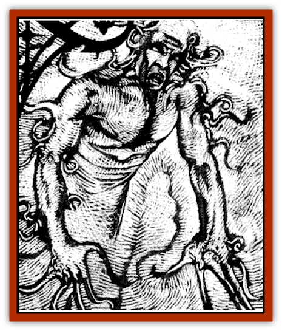

# Spirit - Psionic

| Statistic | **Spirit, Psionic** |
| --- | --- |
| **Activity Cycle:** | Night |
| **Alignment:** | Neutral evil |
| **Armor Class:** | 0 |
| **Climate/Terrain:** | Ravenloft |
| **Damage/Attack:** | Nil |
| **Diet:** | Nil |
| **Frequency:** | Very rare |
| **Hit Dice:** | 9 |
| **Intelligence:** | Exceptional (15-16) |
| **Magic Resistance:** | Nil |
| **Morale:** | Fearless (19-20) |
| **Movement:** | 9 |
| **No. Appearing:** | 1 |
| **No. of Attacks:** | 0 |
| **Organization:** | Solitary |
| **Size:** | M (6' tall) |
| **Special Attacks:** | Psionics |
| **Special Defenses:** | +1 or better to hit |
| **THAC0:** | 11 |
| **Treasure:** | Nil |
| **XP Value:** | 7,000 |

**Psionics Summary**

| Level | Dis/Sci/Dev | Attack/Defense | Score | PSPs |
| --- | --- | --- | --- | --- |
| 9 | 3/5/14 | PsC/All | 15 | 300 |

**Psychometabolism -** *Sciences:* nil; *Devotions:* aging, cause decay.

**Psychokinesis -** *Sciences:* telekinesis, project force; *Devotions:* animate object, control body, control sound, control lights.

**Telepathy -** *Sciences:* mind link, mind wipe, probe; *Devotions:* attraction, aversion, contact, ESP, false sensory input, phobia amplification, post-hypnotic suggestion, psionic crush.

The psionic spirit is an unusual form of [[Ghost|ghost]] with great psionic abilities that it employs instead of the normal magical abilities most often associated with such creatures. Although perhaps more subtle in its methods than some ghosts, the psionic spirit is still a dangerous foe.

Always found in ectoplasmic form, the psionic spirit usually appears as a faintly shimmering human or demihuman. The limbs of the psionic spirit are indistinct, trailing off into wispy, ectoplasmic tendrils. Occasionally, an ectoplasmic tendril drifts away from the spirit. Such pieces gradually solidify into a putrid, jellylike substance.

Psionic spirits know only the languages that they did in life. As one might expect, psionicists can use psychic means to communicate with them.

**Combat:** The psionic spirit's sole source of pleasure is tormenting the minds of living creatures. It particularly detests psionicists and will go out of its way to first destroy the psionicist's mind and finally his body.

Before attacking more directly, the spirit will often use one of more of its psionic disciplines to frighten and confuse its intended victims. Only when it feels its foes are sufficiently disoriented and terrified will the spirit attack more directly.

When attacking, the psionic spirit usually uses its control body devotion to cause confusion among its enemies. The spirit will then attack spell users or psionicists with its psychic crush or aging powers.

The spirit can also attempt to drive a character mad. Whenever the ghost successfully uses its telepathic probe it can force a character to look inside its demented mind. The character must then make a madness check. The psionic spirit can cause madness in a character of any class, not just psionicists.

A psionic spirit can only be hit by weapons of +1 enchantment or greater. It is immune to *sleep*, *charm*, *hold*, poison, and cold-based attacks. A priest can turn the spirit as a ghost. Holy water harms the creature doing 2-8 (2d4) points of damage per vial.

**Habitat/Society:** A psionic spirit is more likely than most spirits to roam from place to place. It spends much of its time searching for, and attempting to destroy, the psionicists it loathes.

Two theories exist as to the origin of psionic spirits. The first states that such monsters are actually psionicists who somehow become trapped within their shadow form. Eventually the torment of their hideous half-existence drives such individuals into madness, evil, and at the last into the arms of the Dark Powers, who grant the psionicist its ghostly form. The second theory simply asserts that psionic spirits were once evil psionicists who suffered a violent death while using their mental powers. Somehow the spirits of such psionicists remain in the world in the form of psionic ghosts.

**Ecology:** Psionic spirits care little for treasure or other material possessions. Treasure found in such a spirit's lair will simply be the incidental goods of previous victims.

Psionicists who use retrospection while in Ravenloft would do best to take care, for psionic spirits can sense the use of this power. Any psionicist using retrospection has a 5% chance of calling such a spirit to himself.

---
## Discovery & Documentation

**Source Publication:** Ravenloft Appendix III (1991)
**Campaign Setting:** Ravenloft
**Author(s):** Kirk Botulla

### Other Creatures Found in This Source Book
   * [[Akikage|Akikage]]
   * [[Animator_Common|Animator, Common]]
   * [[Animator_Greater|Animator, Greater]]
   * [[Animator_Minor|Animator, Minor]]
   * [[Animator_General_Information|Animator, General Information]]
   * [[Bakhna_Rakhna|Bakhna Rakhna]]
   * [[Baobhan_Sith|Baobhan Sith]]
   * [[Beetle_Scarab|Beetle, Scarab]]
   * [[Boneless|Boneless]]
   * [[Boowray|Boowray]]
   * [[Bruja|Bruja]]
   * [[Carrionette|Carrionette]]
   * [[Carrion_Stalker|Carrion Stalker]]
   * [[Cat_Midnight|Cat, Midnight]]
   * [[Cat_Skeletal|Cat, Skeletal]]
   * [[Cloaker_Resplendent|Cloaker, Resplendent]]
   * [[Cloaker_Shadow|Cloaker, Shadow]]
   * [[Cloaker_Undead|Cloaker, Undead]]
   * [[Corpse_Candle|Corpse Candle]]
   * [[Death's_Head_Tree|Death's Head Tree]]
   * [[Doppelganger_Ravenloft|Doppelganger (Ravenloft)]]
   * [[Familiar_Pseudo-|Familiar, Pseudo-]]
   * [[Familiar_Undead|Familiar, Undead]]
   * [[Feathered_Serpent|Feathered Serpent]]
   * [[Fenhound|Fenhound]]
   * [[Figurine_Ceramic|Figurine, Ceramic]]
   * [[Figurine_Crystal|Figurine, Crystal]]
   * [[Figurine_Ivory|Figurine, Ivory]]
   * [[Figurine_Obsidian|Figurine, Obsidian]]
   * [[Figurine_Porcelain|Figurine, Porcelain]]
   * [[Figurine_General_Information|Figurine, General Information]]
   * [[Fleas_of_Madness|Fleas of Madness]]
   * [[Furies|Furies]]
   * [[Geist|Geist]]
   * [[Ghost_Animal|Ghost, Animal]]
   * [[Golem_Flesh_Ravenloft|Golem, Flesh (Ravenloft)]]
   * [[Golem_Mist_Ravenloft|Golem, Mist (Ravenloft)]]
   * [[Golem_Wax_Ravenloft|Golem, Wax (Ravenloft)]]
   * [[Gremishka|Gremishka]]
   * [[Hag_Spectral|Hag, Spectral]]
   * [[Head_Hunter|Head Hunter]]
   * [[Hearth_Fiend|Hearth Fiend]]
   * [[Hebi-No-Onna|Hebi-No-Onna]]
   * [[Hound_Phantom|Hound, Phantom]]
   * [[Hound_Skeletal|Hound, Skeletal]]
   * [[Imp_Wishing|Imp, Wishing]]
   * [[Ivy_Crawling|Ivy, Crawling]]
   * [[Jack_Frost|Jack Frost]]
   * [[Jolly_Roger|Jolly Roger]]
   * [[Kizoku|Kizoku]]
   * [[Lashweed|Lashweed]]
   * [[Leech_Magical|Leech, Magical]]
   * [[Leech_Psionic|Leech, Psionic]]
   * [[Lich_Defiler|Lich, Defiler]]
   * [[Lich_Drow|Lich, Drow]]
   * [[Lich_Elemental|Lich, Elemental]]
   * [[Lich_Psionic|Lich, Psionic]]
   * [[Living_Tattoo|Living Tattoo]]
   * [[Lycanthrope_Loup-garou|Lycanthrope, Loup-garou]]
   * [[Lycanthrope_Werejackal|Lycanthrope, Werejackal]]
   * [[Lycanthrope_Werejaguar_Ravenloft|Lycanthrope, Werejaguar (Ravenloft)]]
   * [[Lycanthrope_Wereleopard|Lycanthrope, Wereleopard]]
   * [[Lycanthrope_Wereray|Lycanthrope, Wereray]]
   * [[Mist_Ferryman|Mist Ferryman]]
   * [[Moor_Man|Moor Man]]
   * [[Obedient|Obedient]]
   * [[Odem|Odem]]
   * [[Paka|Paka]]
   * [[Plant_Blood_Rose|Plant, Blood Rose]]
   * [[Plant_Fearweed|Plant, Fearweed]]
   * [[Radiant_Spirit|Radiant Spirit]]
   * [[Recluse|Recluse]]
   * [[Remnant_Aquatic|Remnant, Aquatic]]
   * [[Rushlight|Rushlight]]
   * [[Sea_Spawn_Master|Sea Spawn, Master]]
   * [[Sea_Spawn_Minion|Sea Spawn, Minion]]
   * [[Shadow_Asp|Shadow Asp]]
   * [[Shattered_Brethren|Shattered Brethren]]
   * [[Skeleton_Archer|Skeleton, Archer]]
   * [[Skeleton_Insectoid|Skeleton, Insectoid]]
   * [[Skin_Thief|Skin Thief]]
   * [[Strahd_Skeleton|Strahd Skeleton]]
   * [[Strahd_Zombie|Strahd Zombie]]
   * [[Unicorn_Shadow|Unicorn, Shadow]]
   * [[Vampire_Drow|Vampire, Drow]]
   * [[Vampire_Nosferatu|Vampire, Nosferatu]]
   * [[Vampire_Oriental|Vampire, Oriental]]
   * [[Virus_General_Information|Virus, General Information]]
   * [[Virus_I|Virus I]]
   * [[Virus_II|Virus II]]
   * [[Virus_III|Virus III]]
   * [[Vorlog|Vorlog]]
   * [[Will_O'Dawn|Will O'Dawn]]
   * [[Will_O'Deep|Will O'Deep]]
   * [[Will_O'Mist|Will O'Mist]]
   * [[Will_O'Sea|Will O'Sea]]
   * [[Zombie_Cannibal|Zombie, Cannibal]]
   * [[Zombie_Desert|Zombie, Desert]]
   * [[Zombie_Wolf|Zombie Wolf]]
   * [[Zombie_Fog|Zombie Fog]]
