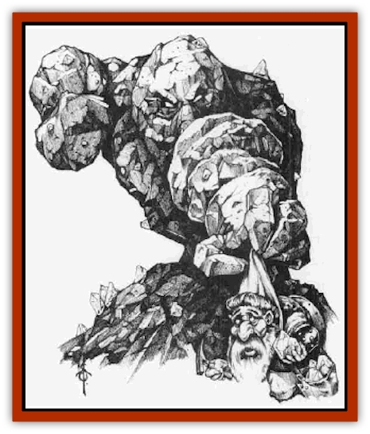

# Spirit - Rock - Thomil

| Statistic | **Spirit, Rock, Thomil** |
| --- | --- |
| **Activity Cycle:** | Any |
| **Alignment:** | Chaotic neutral |
| **Armor Class:** | -3 |
| **Climate/Terrain:** | Mountains/rocky terrain (Rashemen) |
| **Damage/Attack:** | 1d10/1d10 |
| **Diet:** | Mineral |
| **Frequency:** | Very rare |
| **Hit Dice:** | 5 |
| **Intelligence:** | Average (10) |
| **Magic Resistance:** | 25% or 50% |
| **Morale:** | Fanatic (17-18) |
| **Movement:** | 5 |
| **No. Appearing:** | 1 (see below) |
| **No. of Attacks:** | 2 |
| **Organization:** | Solitary |
| **Size:** | M |
| **Special Attacks:** | Envelopment, smash |
| **Special Defenses:** | Block |
| **THAC0:** | 15 |
| **Treasure:** | Nil (Q&times;4,X) |
| **XP Value:** | 975 |

Thomil are spirit creatures that inhabit and guard rocky and mountainous places in Rashemen. Rocks inhabited by thomil radiate magic but are otherwise indistinguishable from other rocks until the thomil becomes active. Then the rock rises, flowing into rough human form - two arms, chest and head. The torso rises out of the ground, remaining connected to it while moving and fighting.

The thomil are part of a pantheon of spirits and enchanted creatures that populate Rashemaar folklore. While the common people of Rashemen hold the thomil in high regard, they also fear them, for although they defend the land from foreign invaders, the thomil also punish those Rashemaar who are so greedy or short-sighted that they neglect to pay proper homage to the land and its spirits.

Legend maintains that the thomil were sent (or summoned) to Rashemen in response to the evil, unnatural magic of the Red Wizards of Thay. Resistant to all forms of magic, the thomil emerged from the earth to throw back the invaders.

**Combat:** Thomil guardians attack despoilers of the land. They rise out of the ground to batter opponents with rocky fists. If both attacks hit, the thomil envelops its opponent and inflicts an additional 2d10 points of crushing damage.

Though thomil normally adopt a semihumanoid appearance, they are amorphous, capable of taking shapes appropriate to their opponents. Thomil may take the form of a massive club or battering ram, smashing opponents with one devastating attack, inflicting 3d10 points of damage but with a -3 attack roll penalty if they do so.

When defending, thomil can transform into solid blocks of stone that give them an AC of -10. In block form, however, they can neither move nor attack. They often take block form against missile weapons or magic.

Like most of the spirit creatures native to Rashemen, thomil have an inherent resistance to magic. The resistance is normally 25%, but against the evil and corrupt nature of the spells cast by the Red Wizards of Thay it goes up to 50%.

**Habitat/Society:** The origin of the thomil is uncertain - perhaps they were created by the ancient gods or summoned by the vremyonni, the ancient male wizards who live in isolated caves in Rashemen, to defend the realm.

Most thomil are solitary. Anyone who tries to mine, destroy natural formations, or invade with hostile intent against Rashemen triggers attack by the thomil. Should the Rashemaar themselves wish to build or mine in an area of the thomil, Rashemaar witches of 10th level or higher petition a thomil to begone; they have a 50% chance of success.

Larger or more important sites such as mountains, sacred valleys, and territory near the caves of the vremyonni are defended by larger numbers of thomil. In such places as many as 20 thomil may be found.

**Ecology:** Thomil were not originally native to Rashemen, they were apparently created or summoned from another plane to act as guardians. They derive their sustenance from the land itself, absorbing minerals and necessary elements. They spend most of their time in a dormant state, inhabiting natural rock formations, and become active only if called upon to defend their districts.

---
## Discovery & Documentation

**Source Publication:** Monstrous Compendium, 1996 Annual, Volume 3 (1995)
**Campaign Setting:** Advanced Dungeons & Dragons 2nd Edition
**Author(s):** Jon Pickens

### Other Creatures Found in This Source Book
   * [[Alaghi|Alaghi]]
   * [[Alhoon|Alhoon]]
   * [[Aranea_Savage_Coast|Aranea (Savage Coast)]]
   * [[Arcane_Head|Arcane Head]]
   * [[Banedead|Banedead]]
   * [[Banelich|Banelich]]
   * [[Bat_Bonebat|Bat, Bonebat]]
   * [[Beetle|Beetle]]
   * [[Belgoi|Belgoi]]
   * [[Bladeling|Bladeling]]
   * [[Braxat|Braxat]]
   * [[Bunyip|Bunyip]]
   * [[Burbur|Burbur]]
   * [[Bvanen|Bvanen]]
   * [[Cat_Great_Snow_Tiger|Cat, Great, Snow Tiger]]
   * [[Chosen_One|Chosen One]]
   * [[Chronovoid|Chronovoid]]
   * [[Cildabrin|Cildabrin]]
   * [[Coffer_Corpse|Coffer Corpse]]
   * [[Disenchanter|Disenchanter]]
   * [[Dog_Temporal|Dog, Temporal]]
   * [[Dragon_Cerilia|Dragon (Cerilia)]]
   * [[Dragon_Ghost|Dragon, Ghost]]
   * [[Dragon_Lesser_Undead|Dragon, Lesser Undead]]
   * [[Dragon_Neutral_Amber|Dragon, Neutral, Amber]]
   * [[Dread_Warrior|Dread Warrior]]
   * [[Dreamweaver|Dreamweaver]]
   * [[Dream_Spawn_Greater_Ennui|Dream Spawn, Greater, Ennui]]
   * [[Dream_Spawn_Lesser_Morph|Dream Spawn, Lesser, Morph]]
   * [[Dwarf_Arctic|Dwarf, Arctic]]
   * [[Dwarf_Urdunnir|Dwarf, Urdunnir]]
   * [[Eel_Giant_Moray|Eel, Giant Moray]]
   * [[Elemental_Fire_Kin_Tome_Guardian|Elemental, Fire Kin, Tome Guardian]]
   * [[Elf_Rockseer|Elf, Rockseer]]
   * [[Ethyk|Ethyk]]
   * [[Faerie_Faerie_Fiddler|Faerie, Faerie Fiddler]]
   * [[Faerie_Petty_Bramble|Faerie, Petty, Bramble]]
   * [[Faerie_Petty_Gorse|Faerie, Petty, Gorse]]
   * [[Faerie_Petty|Faerie, Petty]]
   * [[Firenewt|Firenewt]]
   * [[Formian|Formian]]
   * [[Gargoyle_II|Gargoyle II]]
   * [[Giant_Cerilia|Giant (Cerilia)]]
   * [[Goblin_Cerilia|Goblin (Cerilia)]]
   * [[Golem_Magic|Golem, Magic]]
   * [[Golem_Shaboath|Golem, Shaboath]]
   * [[Hag_Bheur|Hag, Bheur]]
   * [[Hamadryad|Hamadryad]]
   * [[Hound_of_Ill-Omen|Hound of Ill-Omen]]
   * [[Human_Cerilia|Human (Cerilia)]]
   * [[Hybsil|Hybsil]]
   * [[Ibrandlin|Ibrandlin]]
   * [[Imp_Chaos|Imp, Chaos]]
   * [[Ixitxachitl_Ixzan|Ixitxachitl, Ixzan]]
   * [[Jabberwock|Jabberwock]]
   * [[Kyton|Kyton]]
   * [[Kyuss_Son_of|Kyuss, Son of]]
   * [[Lillend|Lillend]]
   * [[Life-Shaped_Creation_Guardian|Life-Shaped Creation, Guardian]]
   * [[Life-Shaped_Creation_Transport|Life-Shaped Creation, Transport]]
   * [[Lycanthrope_Werecrocodile|Lycanthrope, Werecrocodile]]
   * [[Lycanthrope_Werespider|Lycanthrope, Werespider]]
   * [[Magedoom|Magedoom]]
   * [[Manotaur|Manotaur]]
   * [[Mastiff_Shadow|Mastiff, Shadow]]
   * [[Meazel|Meazel]]
   * [[Mist_Scarlet_Dancer|Mist, Scarlet Dancer]]
   * [[Needleman|Needleman]]
   * [[Orc_Neo-Orog|Orc, Neo-Orog]]
   * [[Orc_Ondonti|Orc, Ondonti]]
   * [[Owlbear_II|Owlbear II]]
   * [[Pegataur|Pegataur]]
   * [[Phaerimm|Phaerimm]]
   * [[Reggelid|Reggelid]]
   * [[Render|Render]]
   * [[Saurial|Saurial]]
   * [[Scalamagdrion|Scalamagdrion]]
   * [[Sharn|Sharn]]
   * [[Snake_Messenger|Snake, Messenger]]
   * [[Spirit_Forest_Uthraki|Spirit, Forest, Uthraki]]
   * [[Spirit_Forest_Wood_Man|Spirit, Forest, Wood Man]]
   * [[Spirit_Ice_Orglash|Spirit, Ice, Orglash]]
   * [[Strider_Giant|Strider, Giant]]
   * [[Tembo|Tembo]]
   * [[Temporal_Glider|Temporal Glider]]
   * [[Temporal_Stalker|Temporal Stalker]]
   * [[Tether_Beast|Tether Beast]]
   * [[Thessalmonster|Thessalmonster]]
   * [[Time_Dimensional|Time Dimensional]]
   * [[Tomb_Tapper|Tomb Tapper]]
   * [[Undead_Dragon_Slayer|Undead Dragon Slayer]]
   * [[Unicorn_Black_Toril|Unicorn, Black (Toril)]]
   * [[Vaath|Vaath]]
   * [[Vortex_Spider|Vortex Spider]]
   * [[Weredragon|Weredragon]]
   * [[Zhentarim_Spirit|Zhentarim Spirit]]
