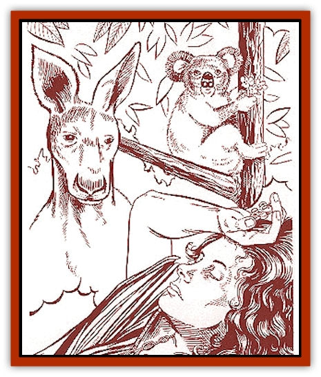

# Spirit - Walleran

| Statistic | **Kangaroo** | **Koala** | **Kookaburra** |
| --- | --- | --- | --- |
| **Activity Cycle:** | Any | Any | Nocturnal |
| **Alignment:** | Neutral or good, usually lawful | Neutral or good, usually lawful | Neutral or good, usually lawful |
| **Armor Class:** | 0 | 0 | 0 |
| **Climate/Terrain:** | Dreamlands | Dreamlands | Dreamlands |
| **Damage/Attack:** | 1d3/1d3/2d4 | 1d2 | 1 |
| **Diet:** | Nil | Nil | Nil |
| **Frequency:** | Very rare | Very rare | Very rare |
| **Hit Dice:** | 10 | 10 | 10 |
| **Intelligence:** | Supra-Genius (19-20) | Supra-Genius (19-20) | Supra-Genius (19-20) |
| **Magic Resistance:** | 95% | 95% | 95% |
| **Morale:** | Special | Special | Special |
| **Movement:** | 18 | 6 | 6, Fly 18 (A) |
| **No. Appearing:** | 1 | 1 | 1 |
| **No. of Attacks:** | 3 | 1 | 1 |
| **Organization:** | Solitary | Solitary | Solitary |
| **Size:** | M (5' tall) | S (2½' tall) | T (18&rdquo; tall) |
| **Special Attacks:** | Nil | Nil | Nil |
| **Special Defenses:** | See below | See below | See below |
| **THAC0:** | 11 | 11 | 11 |
| **Treasure:** | Nil | Nil | Nil |
| **XP Value:** | 1,000 | 1,000 | 1,000 |

Wallaran spirits are dream-world creatures of the Wallaroo grasslands that function as spirit guides and totems to the [[Wallara|wallaras]]. Wallaran spirits do not inhabit the waking world and will never be found there. Their domain is exclusively the Dreamworld, the world occasionally visited by sleeping mortals when they have a dream that is so detailed it is difficult to tell apart from reality.

Wallaran spirits take the form of various animals from the wallaran grasslands. Many different types exist, but three of the most common forms are the kangaroo, the koala, and the kookaburra. Each animal totem has specific abilities and areas of influence, which are discussed below.

Wallaran spirits speak directly to the dreaming mind. They can even speak with nonwallaras if they want to.

**Combat:** Combat with a wallaran spirit creature would be a tricky affair at best, although it is theoretically possible. These spirit creatures appear only in the Dreamworld, where they are masters of reality. Any mortal who sees one of these creatures must be asleep and dreaming. If a dreaming creature attempts to attack a wallaran spirit, the spirit either disappears or the attackers may find that they are suddenly wielding something other than their weapons (such as eucalyptus leaves or pieces of fruit).

So great is the spirit-creature's control of the Dreamworld that spellcasters who attempt to confront a wallaran spirit creature in the Dreamworld will find that their spells simply do not work about 95% of the time.

Wallaran spirits may be hit only by magical weapons that are physically present in the Dreamworld, which is almost impossible. People get to the Dreamworld by dreaming, and anything they have with them in the Dreamworld is merely a reflection of the item, not the real item. To fight a wallaran spirit, the characters would have to find a way to physically travel to the Dreamworld.

A wallaran spirit can impose its will on anyone that visits the Dreamworld. The wallaran spirit effectively has the spell-casting abilities of an 18th-level mage, but it can activate its spells at will, with no casting times or components. It rarely uses offensive, damage-causing spells. If confronted by a violent attacker, the wallaran spirit would use a *polymorph other* to change the attacker into a nonthreatening, peaceful creature.A creature that has a peaceful dream-encounter with a wallaran spirit receives the 1,000 experience points. No experience points are awarded for fighting a wallaran spirit.

**Habitat/Society:** Wallaran philosophy states that two worlds exist: the waking world, and the Dreamworld. The wallaras are not sure which world is more real.

In the Dreamlands, wallaran spirits appear only in the deepest of dreams. The spirit will usually give a bit of cryptic advice, sometimes in the form of a vision, poem, euphemism, or riddle. When the advice has been given, something happens to cause a distraction (a noise or rustling in the Dreamworld underbrush), and then the spirit creature disappears. The spirit creature usually leaves the dreamer with a sign in the real world that the vision was true, such as a eucalyptus leaf, feather, or a bit of sand.

These Dreamworld creatures may or may not have a society of their own, but they do have a significant effect on wallaran society. Individual wallaras with the same spirit-creature guide identify with the totem animal and see themselves as part of a group. All wallaras with a kangaroo guide, for example, will regard each other as brothers.

Most wallaras see their spirit guide at two periods during their life: during their walkabout and when they are about to die. Each time, the spirit guide gives the wallara some advice or reassurance about what is to come.

Wallaran priests, or mendoo, see their spirit guides often and have complex relationships with their totems. The spirit guide is regarded as a companion, helper, and teacher.

**Ecology:** Each wallara is prohibited from killing, eating, touching, or harming the animal that has the shape of his spirit guide. The wallaran taboo against killing these animals acts as a conservation device.

Legends state that once the wallaras were wise and powerful, walking with the gods themselves. It is possible that the wallaran spirits of today are actually some of those ancient wallaras, attempting to aid their fallen brethren.

**Kangaroo**

Kangaroos are ordinarily quite timid, but they are dangerous when angered, pummeling attackers with their forepaws and slashing with their powerful hind legs. The long, muscular tail is used as a support when the animal sits or walks and for balance when it leaps. Kangaroos are usually gray or dull red in color.

Wallaras who have a kangaroo spirit-guide are the closest thing to warriors that can be found in the peaceful wallaran society. Wallaras of the kangaroo totem are prone to action and are considered hasty by wallaran standards.

**Koala**

The koala reaches a maximum length of about two and a half feet. It has a large, round head, a vestigial tail, and a stout body covered with thick, ash-gray fur. Its legs are short, and its feet are large. Koalas live high in eucalyptus trees, feeding only on the leaves and flowers of a certain species of eucalyptus. They are lethargic and often remain in the same tree for days. A koala will not relax its hold on a tree, even when it is mortally wounded.

Wallaras with a koala as a spirit guide are sedentary by nature. They are primarily concerned with providing food for the community. These wallaras are extremely loyal, peaceful, and contemplative.

**Kookaburra**

The kookaburra is stocky grayish bird in the [[Bird_Krynn|kingfisher]] family. It is about 18 inches long. It has a loud, raucous call, which inspired its common nickname of "laughing jackass". It rarely catches fish, living mainly on large insects, mice, small birds, and snakes.

Wallaras who see the kookaburra have a dual nature. These wallaras are about as deceptive and tricky as a wallara can get. They tend to be jokers and pranksters. They are outgoing and often act as a contact with outsiders. Kookaburra-wallaras are also the ones that are primarily responsible for rearing wallaran children, since they are friendly and interact well with youngsters. The wallaras take these duties very seriously and will never abandon a child. These wallaras will also join with the kangaroo-wallaras to help defend their communities if necessary.

---
## Discovery & Documentation

**Source Publication:** Monstrous Compendium Savage Coast Appendix (Online Exclusive) (1995)
**Campaign Setting:** Mystara
**Author(s):** Loren L Coleman, Ted James, Thomas Zuvich, Cindi M. Rice

### Other Creatures Found in This Source Book
   * [[Aranea_Savage_Coast|Aranea (Savage Coast)]]
   * [[Arashaeem|Arashaeem]]
   * [[Batracine|Batracine]]
   * [[Cat_Marine|Cat, Marine]]
   * [[Cinnavixen|Cinnavixen]]
   * [[Clockwork_Swordsman|Clockwork Swordsman]]
   * [[Critter_Temple|Critter, Temple]]
   * [[Cursed_One|Cursed One]]
   * [[Deathmare|Deathmare]]
   * [[Dragon_Savage_Coast_Crimson|Dragon (Savage Coast), Crimson]]
   * [[Dragon_Savage_Coast_Red_Hawk|Dragon (Savage Coast), Red Hawk]]
   * [[Echyan|Echyan]]
   * [[Ee'aar|Ee'aar]]
   * [[Enduk|Enduk]]
   * [[Fachan_Savage_Coast|Fachan (Savage Coast)]]
   * [[Feliquine|Feliquine]]
   * [[Fiend_Narvaezan|Fiend, Narvaezan]]
   * [[Frelôn|Frelôn]]
   * [[Ghriest|Ghriest]]
   * [[Glutton_Sea|Glutton, Sea]]
   * [[Goatman|Goatman]]
   * [[Golem_Naâruk|Golem, Naâruk]]
   * [[Golem_Savage_Coast|Golem (Savage Coast)]]
   * [[Grudgling|Grudgling]]
   * [[Heraldic_Servant_I|Heraldic Servant I]]
   * [[Heraldic_Servant_II|Heraldic Servant II]]
   * [[Heraldic_Servant_III|Heraldic Servant III]]
   * [[Heraldic_Servant_IV|Heraldic Servant IV]]
   * [[Heraldic_Servant_V|Heraldic Servant V]]
   * [[Heraldic_Servant_General_Information|Heraldic Servant, General Information]]
   * [[Hermit_Sea|Hermit, Sea]]
   * [[Jorri|Jorri]]
   * [[Juhrion|Juhrion]]
   * [[Kla'a-tah|Kla'a-tah]]
   * [[Leech_Legacy|Leech, Legacy]]
   * [[Lich_Inheritor|Lich, Inheritor]]
   * [[Lizard_Kin_Savage_Coast|Lizard Kin (Savage Coast)]]
   * [[Lupasus|Lupasus]]
   * [[Lupin|Lupin]]
   * [[Lyra_Bird_Saragón|Lyra Bird, Saragón]]
   * [[Malfera|Malfera]]
   * [[Manscorpion_Nimmurian|Manscorpion, Nimmurian]]
   * [[Mythuínn_Folk|Mythuínn Folk]]
   * [[Neshezu|Neshezu]]
   * [[Nikt'oo|Nikt'oo]]
   * [[Nosferatu|Nosferatu]]
   * [[Omm-wa|Omm-wa]]
   * [[Omshirim|Omshirim]]
   * [[Parasite_Savage_Coast|Parasite (Savage Coast)]]
   * [[Phanaton|Phanaton]]
   * [[Plant_Savage_Coast|Plant (Savage Coast)]]
   * [[Pudding_Vermilion|Pudding, Vermilion]]
   * [[Rakasta|Rakasta]]
   * [[Ray_Forest|Ray, Forest]]
   * [[Shedu_Greater_Savage_Coast|Shedu, Greater (Savage Coast)]]
   * [[Shimmerfish|Shimmerfish]]
   * [[Skinwing|Skinwing]]
   * [[Spawn_of_Nimmur|Spawn of Nimmur]]
   * [[Spider-spy|Spider-spy]]
   * [[Spirit_Heroic|Spirit, Heroic]]
   * [[Succulus|Succulus]]
   * [[Swampmare|Swampmare]]
   * [[Symbiont_Shadow|Symbiont, Shadow]]
   * [[Tortle|Tortle]]
   * [[Troll_Legacy|Troll, Legacy]]
   * [[Trosip|Trosip]]
   * [[Tyminid|Tyminid]]
   * [[Utukku|Utukku]]
   * [[Voat|Voat]]
   * [[Voat_Herathian|Voat, Herathian]]
   * [[Vulturehound|Vulturehound]]
   * [[Wallara|Wallara]]
   * [[Wurmling|Wurmling]]
   * [[Wynzet|Wynzet]]
   * [[Yeshom|Yeshom]]
   * [[Zombie_Red|Zombie, Red]]
