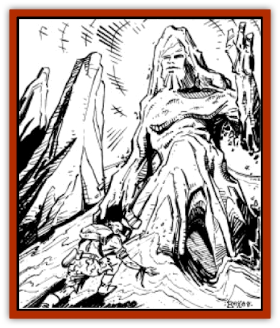

# Spirit of the Land

| Statistic | **Spirit of the Land** |
| --- | --- |
| **Activity Cycle:** | Any |
| **Alignment:** | Neutral |
| **Armor Class:** | 2 |
| **Climate/Terrain:** | Any |
| **Damage/Attack:** | 4-32/4-32(4d8) |
| **Diet:** | Nil |
| **Frequency:** | Common |
| **Hit Dice:** | 20 |
| **Intelligence:** | Supra-Genius (20) |
| **Magic Resistance:** | 65% (see below) |
| **Morale:** | Fearless (19-20) |
| **Movement:** | 48 |
| **No. Appearing:** | 1 |
| **No. of Attacks:** | 2 |
| **Organization:** | Solitary |
| **Size:** | L to H (10-20' tall) |
| **Special Attacks:** | See below |
| **Special Defenses:** | +3 or better weapon to hit, see below |
| **THAC0:** | 5 |
| **Treasure:** | Nil |
| **XP Value:** | 25,000 |

A Spirit of the Land is a powerful being that inhabits the various geological features (mountains, hills, rock formations, hot springs, river beds, winds, skies, etc.) of Athas. They are virtually invulnerable, but they also have little direct contact with the world. They prefer to work through the druid who watches over the natural phenomena that they inhabit. Few except druids have ever seen or had any contact with a spirit.

Spirits of the land are almost never seen. On the extremely rare occasions when they do manifest, they appear as huge [[Elemental_Athas_General_Information|elementals]] with the properties of their inhabited lands.

Spirits of the land communicate only with druids and clerics, although, if they wish, they can speak the language of any creature that inhabits their land feature.

**Combat:** Spirits of the land almost never enter combat directly. A spirit in normal (non-material) form is totally immune to magic, psionics, or physical attacks. Indeed, in normal form, the only way a spirit can be harmed is if the natural phenomena it inhabits is utterly destroyed.

Spirits prefer to work through a druid guarding their land feature. As long as there is a druid present to protect and guard the land feature, a spirit very rarely takes material form. The only time a spirit manifests is when the existence of their terrain feature is threatened. This is entirely dependent on what type of spirit is being dealt with. An oasis is more easily threatened than a stretch of desert, and the north wind that blows out of a mountain valley can only be threatened if the entire valley is filled in, or the mountains removed, so that the wind no longer blows. In all cases, consider the type of spirit and the chance that someone can actually destroy that section of Athas.

If such a case exists, a spirit can materialize into a huge elemental. Such beings appear from the formations they inhabit, and resemble them very closely. Thus, a spirit of a rock formation appears as a large rocky elemental, a spirit of a hot spring appears as a column of steaming water, the spirit of the winds is an invisible being resembling a [[Genie|genie]], etc. Each of these different types of spirits has special attacks and defenses which are listed below.

In combat, all spirits are able to punch twice with their massive fists, doing 4d8 points of damage. They attempt to attack with surprise - a spirit of a desert would appear from the sand behind an opponent, a spirit of air appears above and behind an opponent, a spirit of a oasis rises out of the water. This generally means that an opponent receives a -4 penalty to his surprise roll. The exceptions must be decided on an individual basis; for instance, a spirit of an oasis cannot appear behind the opponent unless the opponent has his back to the oasis or is actually standing in the water. Remember the spirits. intelligence and judge accordingly.

Spirits that manifest themselves are also able to use all spells from their particular sphere - air, earth, fire, or water. Such spells are all treated as innate abilities and have an initiative factor of two. Also, since they are innate abilities, they cannot be disrupted by the spirit taking damage, and they require no verbal, material, or somatic components.

A spirit in material form is highly resistant to hostile magic. They are 65% resistant to most forms of magic, the exception being magic from a diametrically opposed sphere. Air spirits have no resistance to magic of the earth sphere, fire spirits have no immunity to water magic, etc.

In material form the spirit cannot truly be "killed". It can conceivably be brought to zero hit points, causing it to return to non-material form. It cannot resume its material form for one full day thereafter. After the one day, the spirit may manifest again. It will have regenerated to full hit points and have regained all its powers. Should a spirit be brought to zero hit points in this manner, the druid guarding that land feature receives no spells above 2nd level for that day.

**Air Spirit**

Spirits of the air include the spirits of open skies over certain stretches of desert, spirits of the south wind, and the like. They only manifest if the existence of the wind/sky is threatened. A spirit of the sky almost never manifests; the only exception might be if someone is raising enough dust to block out the sky, and only if such a condition persists for months, or even years. Another case might be if someone was killing all of the fliers in an area. A spirit of a canyon wind might manifest if the mouth of the valley was blocked off, thereby shutting off the wind. Decide exactly how much damage is being done, and if the feature (sky or wind) is actually threatened. In no case is the chance of a spirit manifesting greater than 10%, and it is that high only in the face of widespread damage to the land feature.

In material form, the air spirits have several special powers. They can gate in air and create a hurricane force wind, capable of knocking all creatures of less than gargantuan size down. The wind lasts for up to an hour and can sweep away creatures of size M or smaller. A spirit of the air receives a +2 attack and damage roll bonus while fighting creatures not touching anything but air.

Spirits of air can summon their druids by means of a *whispering wind* spell, and only their druids can hear this whisper. A spirit of the air always attempts this option before manifesting.

**Earth Spirit**

A spirit of the earth is perhaps the strongest of the spirits, since the earth is always present. On an individual basis, a spirit of a rocky outcropping in a sandy waste may be threatened if someone begins to break up the rock. A spirit of a mountain may be threatened if a templar casts several earthquake spells and begins to break up the mountain. The maximum chance for a spirit of the earth to manifest if threatened by widespread, continuing damage is 10%.

In combat a spirit of earth has two special powers. They can gate in earth, in the form of a large wall that falls on the offender. Such a wall does 10d6 points of damage to a normal man-sized opponent and has a 50% chance of burying said opponent. The spirit's other special power is an the ability to cast an *earthquake*. The earthquake has an effect radius of 100. and is always centered on the destroyers of the land feature. Large cracks appear in the ground, possibly causing affected creatures to fall in and be crushed to death. The chance that this occurs is 1 in 4 for small creatures, 1 in 6 for man-sized creatures, and 1 in 8 for creatures of large size.

Spirits of earth summon their resident druids by several means. The favorite method is to send a burrowing animal to speak to the druid, although in extreme cases spirits of earth can actually send very faint vibrations through the earth, transmitting a message that only their druid can understand.

**Fire Spirit**

A spirit of fire is more easily threatened than either air or earth spirits, since fire features it inhabits are more easily destroyed than others. It is theorized that if a dry parched grassland is destroyed by fire, the spirit transforms itself, perhaps becoming a spirit of a hot wind, or a spirit of smoke drifting through the desert. In other cases, the maximum chance for a spirit of fire to manifest is 10%.

In combat the spirit has two special powers. It can gate in fire directly from the elemental plane of fire. This appears as a wall of fire doing damage as though cast by a 20th-level druid. This fire can move with the opponent and can follow it anywhere for the full duration of the spell. The fire cannot cross water and cannot harm anyone completely buried in earth. If the opponent takes to the air, the flames merely consolidate and rise higher, following the foe up into the air. The maximum height of such a fire is 100'. The second special power is a hot, sulfuric wind. This wind has no real force to speak of (that is a power of air). However, the sulfuric gases are not breathable as normal air and cause choking and gagging unless the victim saves vs. poison every round. This sulfuric wind also dehydrates the victim; each round of exposure has the same effect as though the opponent went a whole day without water. There is no saving throw against this effect. If the opponent does not require air to breath, say through a *necklace of adaptation* or other magical effect, he is not subject to the choking effect, although the dehydration still occurs.

Spirits of fire communicate with their resident druids by means of a version of the *fire charm* spell. A campfire will dance and form images that can only be interpreted by the spirit's guardian druid. If no campfire is available, they can communicate with the druid by means of images in smoke, or even by altering the reflection of sunlight from a shiny surface.

**Water Spirit**

Spirits of water are some of the most important, and, at the same time, some of the most vulnerable spirits of Athas. Spirits of water are not as rare as one might think on Athas, since almost all of the various forests located in the Forest Ridge are inhabited by spirits of water.

Like the other spirits, they very rarely assume material form. Even a forest fire would not cause a spirit to manifest, unless the fire threatens the whole forest. As long as enough of the forest survives to allow new growth, the water spirit is not concerned. Likewise, if an oasis is completely dried out, but the spring that feeds it is not destroyed, the spirit does not feel threatened. If faced with the total destruction of their land feature, a spirit of water has at most a 10% chance to assume material form.

In combat the spirits of water are the weakest, able to exist only in their element. This is the actual water of an oasis, or perhaps the sap flowing through the trees of a forest. In a forest, they are able to animate a tree and use it to attack. The tree uses the spirit's THAC0 and hit points and has an Armor Class of 6. It is able to strike twice a round, for 4d8 points of damage per strike. The spirit of a spring or oasis attempts to grab its opponent and drag it into the water to be drowned. This requires a successful attack by both of the watery "arms", and the victim is allowed a Bend Bars roll to escape. A spirit of a forest is not concerned with drowning its victim, using an *entangle* spell to hold its victim fast while a tree lumbers over to bash the opponent to death.

Spirits of water communicate either through swirling patterns in a pool or oasis.

**Habitat/Society:** Spirits of the land inhabit nearly all the terrain features of Athas. They are completely solitary creatures, being concerned only with their inhabited area. However, they do coexist with the other spirits in the area. A hot spring, for instance, may be inhabited by both a spirit of fire and water, co-existing peacefully, even though they are diametrically opposed.

**Ecology:** Spirits either have no effect on the ecology, or they are the ecology, depending on how you look at it. They are revered and worshipped by druids, respected by the common folk, and ignored or abused by defilers. A spirit does not need to be worshipped by a druid to survive. It is content simply to exist in its chosen terrain feature. Spirits whose resident land feature is destroyed either die or return to the elemental plane, no one is certain which. This is a mystery even the great druids cannot answer. Neither does anyone know where the spirits originated. The popular theory is that Athas was once a world so filled with life energy that the spirits may have been responsible for the creation of life itself.

---
## Discovery & Documentation

**Source Publication:** MC12 Dark Sun Appendix I - Terrors of the Desert (1991)
**Campaign Setting:** Dark Sun
**Author(s):** Tom Prusa, Louis J. Prosperi, Walter M. Baas

### Other Creatures Found in This Source Book
   * [[Animal_Herd_Athas|Animal, Herd (Athas)]]
   * [[Animal_Household_Athas|Animal, Household (Athas)]]
   * [[Antloid_Desert|Antloid, Desert]]
   * [[Banshee_Dwarf|Banshee, Dwarf]]
   * [[Beetle_Agony|Beetle, Agony]]
   * [[Bog_Wader|Bog Wader]]
   * [[Brambleweed|Brambleweed]]
   * [[B'rohg|B'rohg]]
   * [[Burnflower|Burnflower]]
   * [[Cat_Psionic|Cat, Psionic]]
   * [[Cha'thrang|Cha'thrang]]
   * [[Cistern_Fiend|Cistern Fiend]]
   * [[Clam_Giant|Clam, Giant]]
   * [[Cloud_Ray|Cloud Ray]]
   * [[Drake_Athas_Air|Drake (Athas), Air]]
   * [[Drake_Athas_Earth|Drake (Athas), Earth]]
   * [[Drake_Athas_Fire|Drake (Athas), Fire]]
   * [[Drake_Athas_Water|Drake (Athas), Water]]
   * [[Dune_Runner|Dune Runner]]
   * [[Dune_Trapper|Dune Trapper]]
   * [[Elemental_Athas_Greater_Air|Elemental (Athas), Greater, Air]]
   * [[Elemental_Athas_Greater_Earth|Elemental (Athas), Greater, Earth]]
   * [[Elemental_Athas_Greater_Fire|Elemental (Athas), Greater, Fire]]
   * [[Elemental_Athas_Greater_Water|Elemental (Athas), Greater, Water]]
   * [[Elemental_Athas_Lesser_Air_Earth|Elemental (Athas), Lesser, Air/Earth]]
   * [[Elemental_Athas_Lesser_Fire_Water|Elemental (Athas), Lesser, Fire/Water]]
   * [[Elemental_Athas_General_Information|Elemental (Athas), General Information]]
   * [[Erdland|Erdland]]
   * [[Esperweed|Esperweed]]
   * [[Flailer|Flailer]]
   * [[Floater|Floater]]
   * [[Giant_Athas|Giant (Athas)]]
   * [[Golem_Athas_I|Golem (Athas) I]]
   * [[Golem_Athas_II|Golem (Athas) II]]
   * [[Golem_Athas_III|Golem (Athas) III]]
   * [[Golem_Athas_General_Information|Golem (Athas), General Information]]
   * [[Halfling_Renegade|Halfling, Renegade]]
   * [[Hej-kin|Hej-kin]]
   * [[Id_Fiend|Id Fiend]]
   * [[Insect_Swarm_Athas|Insect Swarm (Athas)]]
   * [[Kank_Wild|Kank, Wild]]
   * [[Kirre|Kirre]]
   * [[Megapede|Megapede]]
   * [[Mul_Wild|Mul, Wild]]
   * [[Nightmare_Beast|Nightmare Beast]]
   * [[Plant_Carnivorous_Athas|Plant, Carnivorous (Athas)]]
   * [[Pterran|Pterran]]
   * [[Pterrax|Pterrax]]
   * [[Pulp_Bee|Pulp Bee]]
   * [[Pyreen|Pyreen]]
   * [[Rasclinn|Rasclinn]]
   * [[Razorwing|Razorwing]]
   * [[Roc_Athas|Roc (Athas)]]
   * [[Sand_Bride|Sand Bride]]
   * [[Sand_Cactus|Sand Cactus]]
   * [[Sand_Vortex|Sand Vortex]]
   * [[Scrab|Scrab]]
   * [[Silt_Horror|Silt Horror]]
   * [[Silt_Runner|Silt Runner]]
   * [[Sink_Worm|Sink Worm]]
   * [[Sloth_Athas|Sloth (Athas)]]
   * [[So-ut|So-ut]]
   * [[Spider_Cactus|Spider Cactus]]
   * [[Spider_Crystal|Spider, Crystal]]
   * [[T'Chowb|T'Chowb]]
   * [[Thrax|Thrax]]
   * [[Tohr-kreen_I|Tohr-kreen I]]
   * [[Villichi|Villichi]]
   * [[Zhackal|Zhackal]]
   * [[Zombie_Plant|Zombie Plant]]
