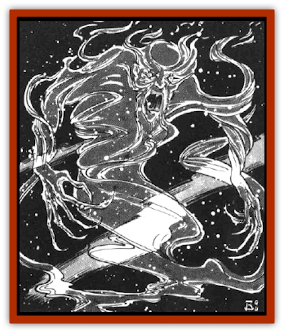

# Spiritjam

| Statistic | **Spiritjam** |
| --- | --- |
| **Activity Cycle:** | Special |
| **Alignment:** | Any evil |
| **Armor Class:** | 0 |
| **Climate/Terrain:** | Any space |
| **Damage/Attack:** | 1-8/1-8 |
| **Diet:** | Nil |
| **Frequency:** | Very rare |
| **Hit Dice:** | 10 |
| **Intelligence:** | Exceptional (15-16) |
| **Magic Resistance:** | 25% |
| **Morale:** | Champion (16) |
| **Movement:** | Fl 24 (E) |
| **No. Appearing:** | 1 |
| **No. of Attacks:** | 2 |
| **Organization:** | Solitary |
| **Size:** | M (5-6' tall) |
| **Special Attacks:** | Intelligence drain, spells |
| **Special Defenses:** | +1 edged weapon to hit |
| **THAC0:** | 11 |
| **Treasure:** | Nil |
| **XP Value:** | 13,000 |

A spiritjam is the soul of an evil cleric or wizard who died while spelljamming. The spirit of the cleric or wizard remained behind when the physical body perished. The spiritjam in life could have beed a [[Elf_Drow|drow]], [[Elf_Half-|half-elf]], or human. It moves easily through space.

A spiritjam appears as a floating, diaphanous form resembling its former human or demihuman body. A spiritual can be easily differentiated from other undead because of its eyes, which sparkle like stars, and its hands, which have abnormally long fingers ending in claws. The hair of a spiritjam appears as a cloud-like mist that surrounds the undead creature's head.

**Combat:** Spiritjams envy and hate all life, especially spacefarers. They pass through the wally of ships to attack those inside. Their primary targets are a ship's spelljamming wizard or cleric and the ship's captain. By disabling these people, spiritjams hope to cripple the ship and then feeding on the rest at their leisure.

A spiritjam prefers to move through a ship's walls, remaining hidden and observing the crew until it has selected its first targets. Then it comes up behind its target and attacks with its claws. Each claw hit drains 1d3 points of Intelligence from the victim. When a victim's Intelligence reaches 0, he dies. Lost Intelligence is regained at a rate of 2 points per day.

Spiritjams prefer to attack physically because of their Intelligence-draining ability. However, when they are threatened or outnumbered, they attack with spells to put the odds in their favor. Spiritjams retain the spellcasting ability they had in life. The spiritjam has access to the spells its original form had memorized on the day of its death; the spiritjam cannot memorize additional spells. Spiritjams were usually spellcasters of 7th level or higher. To randomly determine the spellcasting level, roll 1d6 and add 6.

Spiritjams also possess a gaze weapon. Creatures meeting the gaze of a spiritjam must roll successful saving throws vs. petrification or stand paralyzed with fear for 1d4 rounds. Spiritjams are immune to petrification and *fear* spells.

Blunt weapons, even magical ones, cannot harm spiritjams. Only magical edged weapons can deal them any damage. Further, their magic resistance makes them terrible foes. They are turned as special undead. If a *dispel evil* spell breaches their magic resistance, a spiritjam is driven away for 1d12 hours.

Spiritjams can sense life within a 500-mile radius of themselves, and they can sense someone spelljamming within a 5,000-mile radius. They can attack in space at anytime, as a spiritjam is undead and therefore never rests. However, if a spiritjam travels to a planet, its activity cycle is restricted to the evening. It is further hampered because it can only attack when stars are visible outside. For this reason, most spiritjams restrict their travels to space.

A few spiritjams seek out enemies their former selves faced in life.

**Habitat/Society:** Spiritjams hate all life because they detest their own undead state. They make their homes on moons or barren planets near populated worlds. The spiritjams observe these worlds and the comings and goings of ships. When they have gathered enough information, they begin their attacks on the shipping lanes.

The land around the lair of a spiritjam is littered with bits of ships and the personal possessions of its victims. Once a lair is established, the spiritjam is loathe to leave it. Only driving the spiritjam away or eliminating ship travel to nearby worlds can cause it to seek another home.

Spiritjams are exceptionally intelligent and understand many languages. Many of them appreciate the finer things in life, collecting art objects and valuables from their victims.

Frequently a spiritjarn's lair will have from one to three spelljamming helms. Usually these helms are damaged. The lairs sometimes resemble trophy rooms, containing objects from the ships the spiritual attacked.

**Ecology:** The only pleasure spirituals have is in killing. They are like a disease, killing without reason or discretion. As they are undead, they do not eat or gain sustenance. They have no natural predators.

---
## Discovery & Documentation

**Source Publication:** MC7 Spelljammer Appendix I (1990)
**Campaign Setting:** Advanced Dungeons & Dragons 2nd Edition
**Author(s):** various

### Other Creatures Found in This Source Book
   * [[Aartuk|Aartuk]]
   * [[Albari|Albari]]
   * [[Ancient_Mariner|Ancient Mariner]]
   * [[Argos|Argos]]
   * [[Beholder_Abomination_Astereater|Beholder (Abomination), Astereater]]
   * [[Blazozoid|Blazozoid]]
   * [[Chattur|Chattur]]
   * [[Chevall|Chevall]]
   * [[Clockwork_Horror|Clockwork Horror]]
   * [[Colossus|Colossus]]
   * [[Delphinid|Delphinid]]
   * [[Dizantar|Dizantar]]
   * [[Dog|Dog]]
   * [[Dog_Bog_Hound|Dog, Bog Hound]]
   * [[Esthetic|Esthetic]]
   * [[Focoid|Focoid]]
   * [[Fractine|Fractine]]
   * [[Giant_Spacesea|Giant, Spacesea]]
   * [[Golem_Furnace|Golem, Furnace]]
   * [[Golem_Radiant|Golem, Radiant]]
   * [[Gravislayer|Gravislayer]]
   * [[Grommam|Grommam]]
   * [[Hadozee|Hadozee]]
   * [[Hamster_Giant_Space|Hamster, Giant Space]]
   * [[Jammer_Leech|Jammer Leech]]
   * [[Lakshu|Lakshu]]
   * [[Lumineaux|Lumineaux]]
   * [[Lutum|Lutum]]
   * [[Mimic_Space|Mimic, Space]]
   * [[Misi|Misi]]
   * [[Moon_Rogue|Moon, Rogue]]
   * [[Mortiss|Mortiss]]
   * [[Murderoid|Murderoid]]
   * [[Nay-Churr|Nay-Churr]]
   * [[Phlog-Crawler|Phlog-Crawler]]
   * [[Plasman|Plasman]]
   * [[Plasmoid_DeGleash|Plasmoid, DeGleash]]
   * [[Plasmoid_DelNoric|Plasmoid, DelNoric]]
   * [[Plasmoid_General_Information|Plasmoid, General Information]]
   * [[Plasmoid_Ontalak|Plasmoid, Ontalak]]
   * [[Puffer|Puffer]]
   * [[Q'nidar|Q'nidar]]
   * [[Rastipede|Rastipede]]
   * [[Reigar|Reigar]]
   * [[Rock_Hopper|Rock Hopper]]
   * [[Slinker|Slinker]]
   * [[Spider_Asteroid|Spider, Asteroid]]
   * [[Survivor|Survivor]]
   * [[Syllix|Syllix]]
   * [[Symbiont_Power|Symbiont, Power]]
   * [[Vine_Infinity|Vine, Infinity]]
   * [[Wiggle|Wiggle]]
   * [[Wizshade|Wizshade]]
   * [[Wryback|Wryback]]
   * [[Zard|Zard]]
   * [[Zodar|Zodar]]
