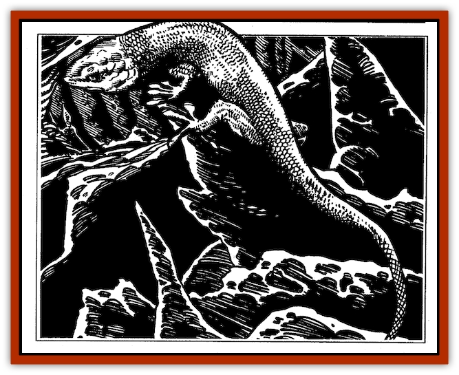

# Spitting Crawler

| Statistic | **Spitting Crawler** |
| --- | --- |
| **Activity Cycle:** | Any |
| **Alignment:** | Lawful neutral |
| **Armor Class:** | 6 |
| **Climate/Terrain:** | Any non-arctic/subterranean |
| **Damage/Attack:** | 1-2 |
| **Diet:** | Omnivore |
| **Frequency:** | Rare |
| **Hit Dice:** | 2 |
| **Intelligence:** | Low (7) |
| **Magic Resistance:** | 30% |
| **Morale:** | Steady (12); see below |
| **Movement:** | 16 |
| **No. Appearing:** | 1 |
| **No. of Attacks:** | 1 |
| **Organization:** | Solitary |
| **Size:** | S (averages 3' long) |
| **Special Attacks:** | Acid spit |
| **Special Defenses:** | cling to vertical + upside-down |
| **THAC0:** | 19 |
| **Treasure:** | Nil |
| **XP Value:** | 175 |

Spitting crawlers are lizards of the Underdark, often used as familiars by subterranean-dwelling wizards (such as the mages of the [[Elf_Drow|drow]]). Subterranean crawlers are slim, lithe, darting [[Lizard|lizards]] with frog-like toes on their feet - they rather resemble the surface-dwelling skink, equipped with a creeper frog's large, splayed, bulbous toes. These sticky toes enable a spitting crawler to silently climb and walk on ceilings, to better reach food. Spitting crawlers are gray-green in hue, with a lighter, mottled grey underside. They can remain motionless for long periods if being watched, to appear part of the rock they are clinging to.

**Combat:** A spitting crawler can run about on walls and ceilings at a movement rate of 12, in silence. Its toothed bite does only 1-2 points of damage, but three times a day, a spitting crawler can spit a stream of acid up to 20' with great accuracy (+5 to hit).

Its green, acrid discharge is corrosive to metal and flesh alike, and does 2d4 hp of damage to any creature hit, as well as causing skin disfigurement and an ongoing, itching burning (victim suffers -1 on attack rolls, a 1-point armor class penalty, and cannot rest or study, for 3d12 turns). If diluted with water or wine within 4 rounds of striking, the duration of its effects drops to 2d8 turns.

Against metal, the acid burns an ever-widening hole. If not diluted with water or wine, this reaction will continue, until a shield, for example, is reduced to powder. Affected metal spreads the reaction to adjacent, touching metal - a chainmail shirt to gauntlets, for example. If the affected armor is removed, and a Dexterity Check succeeds, the reaction does not spread to other metal worn or carried. (The victim's armor class suffers by at least 1 point, depending on the severity of the acid's destruction.) Water or wine halts the metal-destroying reaction immediately.

Spitting crawlers cannot be stunned or affected by *charm*, *sleep*, or *hold*. They are immune to all known spider and insect venoms, and to the attacks of all known oozes, slimes, jellies, and mold spores (including deadly, monstrous sorts).

Spitting crawlers who serve as familiars gain the morale of their companion wizard if it is greater than their own. Over time, they become close to their masters, and will fight to the death to protect or avenge them. Spitting crawlers can tolerate a wide range of temperatures, but enjoy soaking up the body heat of a master by riding about against the master's skin, curled up around the back of the neck, or perched inside a shirt or tunic. An angry spitting crawler hisses loudly; cunning crawlers can also mimic human coughing or muttering noises, to lead beings away or lure them into traps.

A spitting crawler can leap upwards 10 plus 1d4 feet, and spring horizontally up to 18'. Crawlers have elastic bodies, which absorb the shock of landing - if a crawler falls or leaps down 30' or less, it takes no damage; if it falls a greater distance, apply 1d4 falling damage per 10' fallen only in addition to this 30' “safe” distance.

**Habitat/Society:** Spitting crawlers avoid larger creatures, lurking in fissures and cracks until such dangers have passed. Their favorite food is sleeping bats, and their most common fare the centipedes and other insects that scuttle and roam through the Underdark. Spitting crawlers usually come in contact with adventurers only through a wizard's use of a *find familiar* spell. Spitting crawlers and the most intelligent sorts of spiders are perhaps the most highly prized familiars of drow wizards.

**Ecology:** Spitting crawlers eat lichens, [[Ooze_Slime_Jelly_II|slimes]] (including the deadly green slime, and monstrous oozes such as the grey ooze), small rodents, and insects. They can go for long periods without eating. If a master keeps a spitting crawler well fed, gives it lots of water to drink and the occasional treat (strong-smelling cheeses are a favorite), it will not be distracted from assigned tasks by food.

---
## Discovery & Documentation

**Source Publication:** The Drow of the Underdark (1991)
**Campaign Setting:** Forgotten Realms
**Author(s):** Ed Greenwood

### Other Creatures Found in This Source Book
   * [[Bat_Deep|Bat, Deep]]
   * [[Dragon_Deep|Dragon, Deep]]
   * [[Myrlochar|Myrlochar]]
   * [[Pedipalp|Pedipalp]]
   * [[Rothe_Deep|Rothe, Deep]]
   * [[Solifugid|Solifugid]]
   * [[Spider_Subterranean|Spider, Subterranean]]
   * [[Yochlol_Underdark|Yochlol (Underdark)]]
