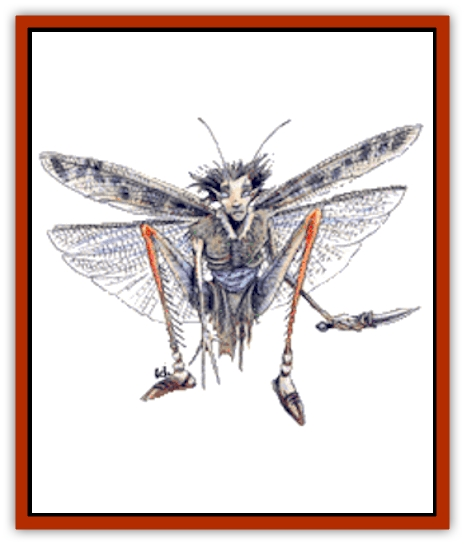
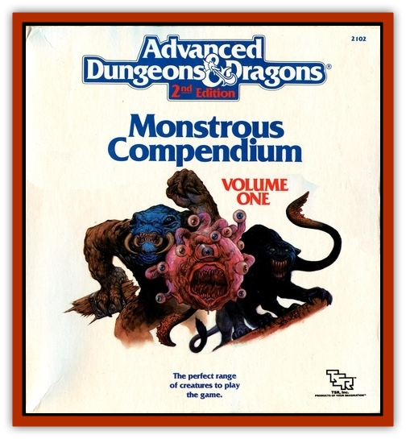

# Sprite

| Statistic | **Atomie** | **Grig** | **Nixie** | **Pixie** | **Sea Sprite** | **Sprite** |
| --- | --- | --- | --- | --- | --- | --- |
| **Activity Cycle:** | Night | Night | Day | Night | Day | Day |
| **Alignment:** | Chaotic neutral | Neutral (good) | Neutral | Neutral | Chaotic neutral | Neutral (good) |
| **Armor Class:** | 4 | 2 | 7 | 5 | 6 | 6 |
| **Climate/Terrain:** | Temperate forests | Temperate forests | Temperate lakes | Temperate forests | Tropical coral reefs | Meadows and woods |
| **Damage/Attack:** | By weapon | By weapon | By weapon | By weapon | By weapon | By weapon |
| **Diet:** | Herbivore | Herbivore | Fish | Herbivore | Omnivore | Omnivore |
| **Frequency:** | Rare | Very rare | Rare | Very rare | Rare | Rare |
| **Hit Dice:** | ½ | ½+1 | ½ | ½ | 1 | 1 |
| **Intelligence:** | Average to very (8-12) | Low to average (5-10) | Very (12) | Exceptional (15-16) | Very (11-12) | Very (11-12) |
| **Magic Resistance:** | 20% | 30% | 25% | 25% | Nil | Nil |
| **Morale:** | Steady (11-12) | Steady (11-12) | Average (8-10) | Steady (11) | Elite (13-14) | Steady (11-12) |
| **Movement:** | 12, Fl 24 (A) | 6, leap 12 | 6, Sw (12) | 6, Fl 12 (B) | 6, Sw 24 | 9, Fl 18 (B) |
| **No. Appearing:** | 30-120 (3d4&times;10) | 2-12 | 20-80 (2d4&times;10) | 5-20 | 5-40 (5d8) | 10-100 |
| **No. of Attacks:** | 2 | 3 (darts) or 2 (swords) | 1 | 1 | 1 | 1 |
| **Organization:** | Tribe | Band | Tribe | Community | Community | Tribe |
| **Size:** | T (1' tall) | T (1½' tall) | S (4' tall) | S (2½' tall) | T (2' tall) | S (2' tall) |
| **Special Attacks:** | See below | See below | Charm | See below | See below | See below |
| **Special Defenses:** | See below | See below | See below | See below | See below | See below |
| **THAC0:** | 18 (see below) | 20 | 20 | 20 | 19 | 19 |
| **Treasure:** | M (X) | M (X,Y) | Q (C) | R,S,T,X | (D) | C |
| **XP Value:** | 270 | 270 | 270 | 650 | 270 | 270 |

Sprites are shy and reclusive faerie people, related to other faerie-folk, like [[Brownie|brownies]] and [[Leprechaun|leprechauns]]. There are several varieties, including pixies and nixies. Most have small, semitransparent wings, and [[Elf|elven]] features. Normal sprites have distinctly elven features and live in meadows and wooded glens. The wingless sea sprites make their homes on colorful coral reefs, living in harmony with the sea creatures, protecting the reefs' delicate environment, and frolicking in the waves. The naturally invisible pixies are perhaps the most intelligent and mischievous of the faeries; they dwell in idyllic woodlands and delight in harassing travelers with their pranks. Nixies are water sprites that live in freshwater lakes, and, while they harbor no grudges against humankind, they delight in enslaving men as their beasts of burden. Other sylvan creatures related to sprites include the swift atomies and the mischievous grigs, both forest-dwellers.

**Combat:** Sprites hate evil and ugliness, and are capable of stout militancy, should their secluded homes be invaded by [[Orc|orcs]] or worse. They fight with long, slim swords which do damage as a human-sized dagger, or their own special bows. Bows have a range half that of a human short bow and do only half as much damage (1-3 points). The tips of their arrows are coated with a special ointment concocted by the sprites. Any creature struck by the drugged arrows, regardless of level, race, or magic resistance, must make a saving throw vs. poison or fall into a deep sleep lasting 1d6 hours. Normally sprites do nothing more than take their victims to safe a place very far away (often confiscating their weapons in the process), though evil creatures may be slain.

**Habitat/Society:** Sprites prefer to avoid other intelligent beings and live in places where they can have many celebrations, parties, and gatherings. They gather on most moonlit nights for singing and dancing, land sprites in the glens, and water sprites in the surf. Land sprites live in sylvan woodlands, they monitor and protect forests and secluded glens. Water sprites protect their watery territories equally well.

Most land-dwelling species of sprite are immortal, and never die unless killed. The sprites' diminutive size and their dangerous environments keep sprite populations low.

## Sprite (standard)

Sprites usually speak only their own language, common, and elven, but seem to get along with woodland mammals and other creatures anyway. Humans often mistake sprites for butterflies at a distance, and it is guessed that the majority of forest creatures also think of the fair sprites in this way.

**Combat:** Sprites can become *invisible* at will and *detect good/evil* within 50 yards, so they are hard to deceive, evade, or capture. When invisible, sprites get +2 to attack rolls against opponents, who suffer a -4 penalty to hit the sprites.

**Habitat/Society:** Sprites are very flighty, and find even elves much too serious about most woodland affairs. Only druids deal with sprites regularly. Some druids even receive a little of their training in the company of a few sprites. Most sprites love druids, for their neutral alignment and love for nature make them see the forest in much the same way. On rare occasions, sprites associate with rangers as well.

Sprites are loosely tribal, electing the best warrior among the group (male or female) as the group spokesperson. This leader is recognized as the one who makes major decisions and bargains with druids and elves. Sprites rarely wait for their leader's decision, often attacking an evil creature before the leader can issue any command.

**Ecology:** Sprite sleep ointment is concocted from forest mushrooms. The ointment must be left to cure in the sun for seven days. Sprites hollow out tree stumps to serve as containers for this rare substance.

Sprites keep watch on their fellow sprites, so they know who to invite to their frequent gatherings. A deserted meadow or glen is never empty for more than a decade before a new clan of sprites moves in.

## Sea Sprites

Sea sprites have fine, cheerful faces, with rounded cheeks and wide, fish-like eyes. Their hair is the color and texture of seaweed, and reaches down to the gills on their necks, which enable sea sprites to breathe water as well as air. Their skin is light blue, smooth, and slick. Sea sprites have no wings, but webbing grows between their toes and fingers. Sea sprites wear bright, eelskin jerkins, and often adorn themselves with ornaments crafted from treasures found in the ocean.

**Combat:** About half of the sea sprites encountered carry special crossbows. In the hands of sea sprites, these crossbows function like light crossbows above and below water. Sea sprites coat their crossbow bolts in sprite sleep ointment.

Sea sprites hate and fear [[Sahuagin|sahuagin]], and kill those they put to sleep. Air breathers are left on a nearby beach provided they have neither harmed nor attempted to harm the coral reef.

Sea sprites can turn *invisible* at will and *detect good/evil* within 50 yards. Three times per day, a sea sprite may cast *slow*, by touch, at the 5th level of ability. Once per day, a sea sprite can cast *airy water* as a 10th-level spellcaster.

Sea sprites are 45% likely to be accompanied by 1d6 large carnivorous fish, such as [[Barracuda|barracudas]]. These fish act as guards and pets, attacking any creature that threatens the sprites.

**Habitat/Society:** Sea sprites live in natural caves in coral reefs, or amid large wrecks. Though sea sprites can breathe air, they rarely set foot on land. Their homes are cheerfully decorated with a mishmash of seashells, bones, pearls, free-swimming and colorful pet fish, and artifacts taken from sunken ships. Sea sprites live in small communities of four or five families.While each community is led by the eldest male, the true power often rests in the hands of his mate.

**Ecology:** Sea sprites eat seaweeds, small crustaceans, and fish. They raise fish and never deplete the reefs where they live. The only natural enemies of sea sprites are sahuagin. Sea sprites usually live for several centuries. They sometimes trade with [[Elf_Aquatic|sea elves]] but never mix socially with them.

## Pixie

Pixies stand about 2 ½ feet tall. When visible, they resemble small elves, but with longer ears. Pixies have two silver wings, like those of moths. They wear bright clothing, often with a cap and a pair of shoes with curled and pointed toes. Pixies speak their own language, Common, and the language of sprites.

**Combat:** Pixies carry sprite-sized swords and bows. They use three types of arrows, and shoot them with a +4 bonus to the attack roll. Besides standard sprite sleep-arrows, pixies use a war arrow, which inflicts 1d4+1 points of damage, and an arrow which does no physical harm to the target. Those hit by this arrow must make a successful saving throw vs. spell, or suffer complete loss of memory which can be restored only by a *heal* or a *limited wish*.

Pixies can, once per day, use each of the following magical powers, as if they were 8th-level mages: *polymorph self*, *know alignment*, *dispel magic*, *dancing lights*, and *ESP*. They can also do the following once per day: become visible for as long as they desire; create illusions with both audial and visual components; and cause *confusion* by touch. Their illusions require no concentration and last until magically dispelled. A creature attacked with confusion must make a successful saving throw vs. spell, or suffer its effects until a *remove curse* is applied. One pixie in 10 can use Otto's *irresistible dance*, also once per day.

Because pixies are normally invisible, opponents suffer a -4 penalty to attack rolls. A successful *dispel magic* against 8th-level magic makes any pixies, in its area of effect, visible for one round, then they automatically become invisible again. They attack while invisible without penalty.

**Habitat/Society:** Pixies live in deep forest caves, dancing in moonlit glades to the music of crickets and frogs. They are pranksters and they love to lead travelers astray. They use their illusion powers to accomplish this, hence the expression "pixie-led" for one who has lost his way. They like to frighten maidens, rap on walls, blow out candles, and play in water.

Pixies love to trick misers into giving away their treasure, especially by convincing them that something horrible will happen to them if they do not. Pixies carry no treasure, but sometimes have a hoard in their lair to impress visitors. Pixies use treasure to taunt greedy people, and then play merciless pranks on them until they abandon their search for the pixies' fortune. If the victim shows no greed and exhibits a good sense of humor about their pranks, the pixies may allow that individual to choose one item from their hoard.

Pixies dwell together in a community of clans or families that seem to mimic human customs. Each family has a last name, and family and community loyalty is very important to pixies. Their life span is about 300 years.

**Ecology:** Pixies eat fruits and nectar. The most famous by-product of pixies is pixie dust, also known as *dust of disappearance*. Crushing 50 pixie wings into a fine powder creates one dose of *dust of disappearance*. Naturally, pixies frown on this use of their wings.

## Nixie

Nixies have webbed fingers and toes, pointed ears, and wide silver eyes. Most are slim and comely, and they have lightly scaled, pale green skin and dark green hair. Females are attractive, often twining shells and pearl strings in their thick hair, and they modestly dress in tight-fitting wraps woven from colorful seaweeds.

Males wear loincloths of the same materials. Nixies can breathe both water and air; travel on land is possible, but they prefer not to leave their lakes. Nixies speak their own language and the Common tongue.

**Combat:** If one or more humans approach within 30 feet of a group of nixies, the nixies pool their magic to create a powerful *charm* spell, one such spell per every 10 nixies. The victim must make a saving throw vs. spell at -2 on the die roll. Before a *charmed* humans enters the water, there is a 75% chance that a *dispel magic* will break the charm. Once the victim is in the water, the chance of *dispelling* the magic drops to 10%.

Nixies keep each *charmed* slave for one full year, forcing him to do all their heavy labor, but thereafter the *charm* wears off and the victim is set free. During this enslavement, the nixies keep a *water breathing* spell on the human captive. Nixies can cast this spell on any creature, or dispel it, once per day; the spell's duration is one day.

Male nixies carry daggers and javelins. The javelins are used to spear things in the water, or can be thrown. A group of 10 nixies can use a large fishing net against adversaries who are in the water with them. Nixies make one net attack against AC 10 to ensnare a single man-sized creature, -2 AC for each additional victim, up to five total victims (and AC 0). Nixies sometimes employ guardian fish in battle.

Even with 25% magic resistance, nixies fear fire and very bright lights, so a *flaming sword* or a *light* spell keeps them at bay. Nixies try to negate a *continual light* spell by summoning small fish to crowd around the light and dim it.

**Habitat/Society:** Nixie dwellings are woven from living seaweed and difficult to detect (5% chance within 20 feet, impossible from farther away). Nixies keep giant fish as guards, either 1-2 gar (20%) or 2-5 pike (80%); these are taught to obey simple commands. Small bright, ornamental fish are kept as pets and trained to perform elaborate tricks. Trout, bass, and catfish are herded as food. Nixies can also summon 10-100 small fish, which takes 1-3 rounds.

Nixie tribes have 20-80 members, about one third are youth. Families have 4-8 members, and the tribe usually includes 10-15 families, all related through common ancestors. A nixie tribe controls an area with a radius of 3-5 miles; when a tribe gets too large, 2-3 families split off to form a new tribe. Nixies live for several centuries.

Nixie tribes are ruled by the Acquar (water mother), a hereditary position held by a direct descendant of the original founding ancestor. She decides major disputes and chooses the most apt warrior to be the S'oquar, the warlord responsible for hunting and defense. The Acquar is advised by a council of elders, whose spokesperson is called the L'uquar, the keeper of the tribe's oral history. Treasures, whether the spoils of war or the results of work or luck, are divided equally by the Acquar. Intertribal rivalries are often fierce, and females are sometimes kidnapped as brides, for nixies are polygamists, keeping 2-3 wives. Nixies worship water and nature powers.

**Ecology:** Lakes with nixie tribes are kept clean and well stocked; often, human slaves work to improve the environment through the removal of trash and obstructions. Nixie artifacts include jewelry of shells, pearls and opals, silk from water spiders, and *potions of water breathing*.

## Atomie

Atomies avoid most serious-minded creatures, but mix freely with grigs, and are 20% likely to be found in their company. The lightest and quickest of all the sprites, atomies are less than 1-foot tall. Atomies have four dragonfly-like wings. Their features are elven, their skin is pale with a hint of woodland green. Atomie clothing is innately magical, bright and festive while at the same time blending with woodland surroundings.

Atomies have twice the hearing range of humans, and they have infravision to 90 feet. Their voices are high-pitched, almost a bee-like buzz. Atomies speak their own language and often the languages of sprites, pixies, and some broken Common. They can also speak with plants and animals.

**Combat:** Atomies attack as 3rd-level fighters. About 20% of atomies carry tiny crossbows and spears. Atomie crossbows have a 3-foot range and inflict 1d3 points of damage. Atomie spears cause 1d4 points of damage. The remaining atomies are armed with either spears (40%) or sprite swords (40%). Atomies have the following magical abilities, usable once per round at 5th-level ability: *blink*, *invisibility*, *pass plant*, *speak with animals*, and *summon insects*.

Atomies are surprised only on a 1; opponents suffer a -6 penalty to surprise rolls. Upon hearing an intruder, atomies hide and try to make the intruder go away, using false lights, clattering voices, and pesky, summoned insects. Repeat intruders are warned with crossbow bolts. If combat is inevitable, or the intruders are orcs, the atomies regroup and attack. Atomies with spears fly in and dive on surprised opponents (usually aiming at their posteriors). Diving attacks inflict double damage (2d4).

**Habitat/Society:** Atomies live in the upper branches of old hardwood trees (usually oaks), one family per tree. Each family hollows out a series of tiny rooms, decorating with walnut chairs, woven pine needle rugs, acorn dishes, and the like. A network of balconies, landings, and rope bridges connects the dwellings, forming a village high above the forest floor. A typical atomie village houses 3d4x10 adults and 4d6 children.

Atomies seldom bother with outsiders, even standard sprites (whom they view as tedious and too serious), but they will sometimes help a lost child. A rescued child is well cared for and entertained before being returned to the outside world.

The concept of pets is unknown, but atomies often grow mushroom "friends" in their living rooms.

Atomies have loose leadership, choosing a chieftain based on storytelling and singing ability.

**Ecology:** Atomies are herbivores and find the eating habits of their cousins repulsive. They favor nuts above fruit, and prefer honey when they can trick bees into giving them some.

Atomies make a perfect, bite-sized morsels for most creatures, and sometimes fall prey to evil animals, such as [[Wolf|worgs]].

Atomies view magic as a force connected with life and are fascinated by inanimate magical items. Atomies collect magical items and display them in their homes or communities. Non-magical treasures are considered clutter and are either thrown away or given to forest creatures who value such things.

## 

Grigs

Grigs are mischievous and lighthearted. They have no fear of big people and take great joy in playing tricks upon them.

A grig has the head, torso, and arms of a sprite, with the wings, antennae, and legs of a cricket. They can leap great distances. Grigs have light blue skin, forest green hair, and brown hairy legs. They usually wear tunics or brightly colored vests with buttons made from tiny gems. Grigs speak atomie, brownie, pixie, sprite, and Common. They have double normal hearing range and 180-foot infravision. The origin of the grigs remains a mystery.

**Combat:** Fierce (by sprite standards), each grig carries six small darts and a sprite sword. Grigs gain a +2 bonus to attack rolls with darts. Darts and swords do normal damage when used by grigs, but only 1 point of damage when used by non-grigs.

Grigs have the following spell-like abilities, usable once per round at 6th-level ability: *change self*, *entangle*, *invisibility*, *pyrotechnics*, *trip*, and *ventriloquism*. Grigs move silently in woodlands; they are surprised only on a 1, while opponents suffer a -6 penalty to surprise rolls. Some grigs throw darts, while others leap to attack, and one grig fiddler (grigs never go anywhere without a fiddle), plays a song with the same effect as *Otto's irresistible dance*. All non-sprites within 30 feet of the fiddler must make a successful saving throw vs. spell or dance until the grig ceases playing. Grigs can play for hours.

**Habitat/Society:** Grigs roam the forests in small bands. They have no permanent homes but often sleep in the limbs of [[Treant|treants]], or near [[Unicorn|unicorns]] (who protect grigs even unto death).

Grigs are cautious but trusting. They delight in playing pranks on big people. Common ploys include stealing food, collapsing a tent, and using *ventriloquism* to make objects talk. Once a prank is set, the grigs sit back and watch, laughing at the unfortunate person. People who make fools of themselves are apt to be plagued by harmless jokes until they reach the forest edge. At that point, one of the grigs comes out of hiding and makes amends with a gift, either a harmless bauble such as a 1d6x100 gp gem (25%) or a precious jar of really fresh honey (75%).

**Ecology:** Grigs live on nuts, berries and honey, like their atomie cousins.

---
## Discovery & Documentation

**Source Publication:** MC1 Volume I (w/binder #1) (1991)
**Campaign Setting:** Advanced Dungeons & Dragons 2nd Edition
**Author(s):** Jay Batista, Scott Bennie, Grant Boucher, William W. Connors, Steve Gilbert, Heike Kubasch, James Lowder, David Edward Martin, Bruce Nesmith, Jean Rabe, Rick Swan, John J. Terra, Gary L. Thomas

### Other Creatures Found in This Source Book
   * [[Bat|Bat]]
   * [[Bear|Bear]]
   * [[Behir|Behir]]
   * [[Boar|Boar]]
   * [[Bookworm|Bookworm]]
   * [[Brownie|Brownie]]
   * [[Bugbear|Bugbear]]
   * [[Carrion_Crawler|Carrion Crawler]]
   * [[Cat_Great|Cat, Great]]
   * [[Catoblepas|Catoblepas]]
   * [[Dragon_General_Information|Dragon, General Information]]
   * [[Dragonfish|Dragonfish]]
   * [[Elemental_Air_Kin_Aerial_Servant|Elemental, Air Kin, Aerial Servant]]
   * [[Elemental_Earth_Kin_Sandling|Elemental, Earth Kin, Sandling]]
   * [[Elephant|Elephant]]
   * [[Gnoll|Gnoll]]
   * [[Hobgoblin|Hobgoblin]]
   * [[Homunculus|Homunculus]]
   * [[Hornet_Giant|Hornet, Giant]]
   * [[Horse|Horse]]
   * [[Hyena|Hyena]]
   * [[Jackal|Jackal]]
   * [[Jackalwere|Jackalwere]]
   * [[Korred|Korred]]
   * [[Lich|Lich]]
   * [[Lizard|Lizard]]
   * [[Lizard_Man|Lizard Man]]
   * [[Lycanthrope_General_Information|Lycanthrope, General Information]]
   * [[Lycanthrope_Seawolf|Lycanthrope, Seawolf]]
   * [[Lycanthrope_Werebear|Lycanthrope, Werebear]]
   * [[Lycanthrope_Weretiger|Lycanthrope, Weretiger]]
   * [[Lycanthrope_Werewolf|Lycanthrope, Werewolf]]
   * [[Manticore|Manticore]]
   * [[Medusa|Medusa]]
   * [[Mind_Flayer|Mind Flayer]]
   * [[Minotaur|Minotaur]]
   * [[Mudman|Mudman]]
   * [[Mummy|Mummy]]
   * [[Nixie|Nixie]]
   * [[Nymph|Nymph]]
   * [[Ogre|Ogre]]
   * [[Ooze_Slime_Jelly_I|Ooze/Slime/Jelly I]]
   * [[Ooze_Slime_Jelly_II|Ooze/Slime/Jelly II]]
   * [[Orc|Orc]]
   * [[Owl|Owl]]
   * [[Owlbear_I|Owlbear I]]
   * [[Pegasus|Pegasus]]
   * [[Piercer|Piercer]]
   * [[Pudding_Deadly|Pudding, Deadly]]
   * [[Rakshasa|Rakshasa]]
   * [[Rat|Rat]]
   * [[Ray|Ray]]
   * [[Remorhaz|Remorhaz]]
   * [[Satyr|Satyr]]
   * [[Scorpion|Scorpion]]
   * [[Selkie|Selkie]]
   * [[Shadow|Shadow]]
   * [[Skeleton|Skeleton]]
   * [[Skunk|Skunk]]
   * [[Snake|Snake]]
   * [[Spectre|Spectre]]
   * [[Spider|Spider]]
   * [[Toad_Giant|Toad, Giant]]
   * [[Treant|Treant]]
   * [[Troll|Troll]]
   * [[Umber_Hulk|Umber Hulk]]
   * [[Unicorn|Unicorn]]
   * [[Vampire|Vampire]]
   * [[Wight|Wight]]
   * [[Will_O'Wisp|Will O'Wisp]]
   * [[Wolf|Wolf]]
   * [[Wolfwere|Wolfwere]]
   * [[Wraith|Wraith]]
   * [[Wyvern|Wyvern]]
   * [[Yeti|Yeti]]
   * [[Yuan-ti|Yuan-ti]]
   * [[Zombie|Zombie]]
