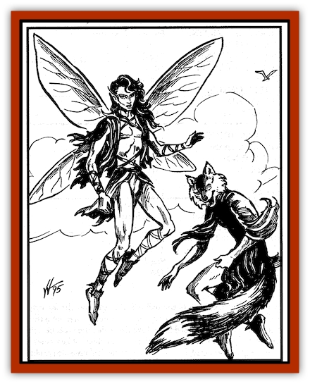

# Sprite - Seelie Faerie

| Statistic | **Sprite, Seelie Faerie** |
| --- | --- |
| **Activity Cycle:** | Any |
| **Alignment:** | Chaotic neutral |
| **Armor Class:** | 5 |
| **Climate/Terrain:** | Forests, sylvan setting |
| **Damage/Attack:** | By weapon |
| **Diet:** | Omnivore |
| **Frequency:** | Very rare |
| **Hit Dice:** | 1-1 |
| **Intelligence:** | Average to Very (10-12) |
| **Magic Resistance:** | 25% |
| **Morale:** | Steady (11-12) |
| **Movement:** | 6, Fl 18 (B) |
| **No. Appearing:** | 10-100 |
| **No. of Attacks:** | 1 |
| **Organization:** | Community |
| **Size:** | T (1&rdquo; to 1' tall) |
| **Special Attacks:** | Spell, sleep poison |
| **Special Defenses:** | Invisibility |
| **THAC0:** | 20 |
| **Treasure:** | Nil (D) |
| **XP Value:** | 270 / Noble: 420 / Monarch: 650 |

In the mystical reaches of sylvan woodlands, where ancient [[Elf|elves]] once walked and worshiped strange gods, live faeries of a most unusual type.

These are the seelie faeries. Furtive and shy, reluctant to make contact with the outside world, the seelie faeries are often mischievous and annoying when they are found.

Seelie faeries vary greatly in appearance. Most resemble diminutive humans of great beauty and grace. Though some are distorted or implike, they still possess an otherworldly aura. Some have animal heads, tails, or limbs, while still others are entirely alien in appearance, though still strangely beautiful. All seelie faeries can fly, though some have translucent, membranous wings. They range in size from one inch to one foot in height and seem to have control over their actual size - individuals have been encountered at one size, then seen later in larger or small forms.

**Combat:** Seelie faeries are mischievous and have little stomach for direct combat. They can become *invisible* at will, and use this power to ambush foes. They wield tiny swords (1d2 points of damage) or bows (1 point of damage) treated with sleep poison. Anyone hit by these weapons must save vs. spell or fall into a deep sleep for 2d4 hours. Victims must successfully save each time they are hit, making mass attacks by seelie faeries surprisingly effective.

Seelie faeries are also known to ride [[Insect_Giant|giant insects]] such as [[Dragonfly|dragonflies]], bumblebees, and [[Hornet_Giant|hornets]]. They carry small lances (1d4 points of damage) that are sometimes treated with sleep poison.

The seelie faeries' most popular forms of attack, however, are magical. All seelie faeries have innate magical abilities. Each can cast at least one spell, which may be of *any* level, once per day. Each seelie faerie's spell is fixed (and must be determined by the DM). Most are nonlethal but annoying, such as *sleep*, *dancing lights*, *shocking grasp*, *fog cloud*, *irritation*, *improved phantasmal force*, *stinking cloud*, *slow*, etc. Spells such as *Tasha's uncontrollable hideous laughter*, *polymorph other*, and *Otto's irresistible dance* are popular, for to the seelie faeries they have hilarious results.

**Habitat/Society:** Seelie society is divided into commoners, nobility, and royalty. Seelie nobles can cast hvo spells per day, while royals can cast ar least three.

Seelie faeries claim to live in fanciful palaces invisible to the normal eye - these may in fact exist on small demiplanes connected to the Prime Material Plane at places steeped in faerie magic. The days of the seelie faeries are dedicated to feasting and reveling, and they never seem to work.

The only thing the seelie faeries seem to take seriously is the threat posed by their chaotic evil cousins, the [[Sprite_Unseelie_Faerie|unseelie faeries]]. The wicked unseelie are locked in a centuries-long war with the seelie faeries, a war neither seems capable of winning. Their hatred is strong and they will attack one another on sight.

**Ecology:** Seelie faeries seem to have very little effect on the outside world. They appear to derive sustenance from the tiny demiplanes where they keep their palaces and homes, and they rarely hunt or forage for food on the Prime Material Plane.

---
## Discovery & Documentation

**Source Publication:** Monstrous Compendium, 1995 Annual, Volume 2 (1995)
**Campaign Setting:** Advanced Dungeons & Dragons 2nd Edition
**Author(s):** Jon Pickens

### Other Creatures Found in This Source Book
   * [[Aboleth_Savant|Aboleth, Savant]]
   * [[Addazahr|Addazahr]]
   * [[Amiq_Rasol|Amiq Rasol]]
   * [[Arch-Shadow|Arch-Shadow]]
   * [[Automaton_Scaladar|Automaton, Scaladar]]
   * [[Automaton_Trobriand's|Automaton, Trobriand's]]
   * [[Bat_Sporebat|Bat, Sporebat]]
   * [[Beetle_Dragon|Beetle, Dragon]]
   * [[Bi-nou|Bi-nou]]
   * [[Boggle|Boggle]]
   * [[Brownie_Dobie|Brownie, Dobie]]
   * [[Brownie_Quickling|Brownie, Quickling]]
   * [[Cat_Crypt|Cat, Crypt]]
   * [[Cat_Great_Cath_Shee|Cat, Great, Cath Shee]]
   * [[Centaur-kin_Dorvesh|Centaur-kin, Dorvesh]]
   * [[Centaur-kin_Gnoat|Centaur-kin, Gnoat]]
   * [[Centaur-kin_Ha'pony|Centaur-kin, Ha'pony]]
   * [[Centaur-kin_Zebranaur|Centaur-kin, Zebranaur]]
   * [[Chronolily|Chronolily]]
   * [[Curst|Curst]]
   * [[Darktentacles|Darktentacles]]
   * [[Dinosaur_Aquatic|Dinosaur, Aquatic]]
   * [[Dinosaur_II|Dinosaur II]]
   * [[Dinosaur_III|Dinosaur III]]
   * [[Doppelganger_Greater|Doppelganger, Greater]]
   * [[Dragon_Brine|Dragon, Brine]]
   * [[Dragon_Half-|Dragon, Half-]]
   * [[Dragon-kin_Sea_Wyrm|Dragon-kin, Sea Wyrm]]
   * [[Dwarf_Wild|Dwarf, Wild]]
   * [[Ekimmu|Ekimmu]]
   * [[Elemental_Nature|Elemental, Nature]]
   * [[Elf_Winged|Elf, Winged]]
   * [[Fish_Great_Glacier|Fish (Great Glacier)]]
   * [[Fish_Subterranean|Fish, Subterranean]]
   * [[Fish_Toril|Fish (Toril)]]
   * [[Flareater|Flareater]]
   * [[Flumph|Flumph]]
   * [[Froghemoth|Froghemoth]]
   * [[Ghost_Casurua|Ghost, Casurua]]
   * [[Ghost_Ker|Ghost, Ker]]
   * [[Ghul|Ghul]]
   * [[Ghul-Kin|Ghul-Kin]]
   * [[Giant_Half-giant|Giant, Half-giant]]
   * [[Golem_Burning_Man|Golem, Burning Man]]
   * [[Golem_Phantom_Flyer|Golem, Phantom Flyer]]
   * [[Gulguthhydra|Gulguthhydra]]
   * [[Hakeashar|Hakeashar]]
   * [[Horse_Moon-|Horse, Moon-]]
   * [[Human_Dragonslayer|Human, Dragonslayer]]
   * [[Human_Vistana|Human, Vistana]]
   * [[Jellyfish_Giant|Jellyfish, Giant]]
   * [[Kalin|Kalin]]
   * [[Kholiathra|Kholiathra]]
   * [[Laerti|Laerti]]
   * [[Leucrotta_Greater|Leucrotta, Greater]]
   * [[Lich_Suel|Lich, Suel]]
   * [[Lurker_Shadow|Lurker, Shadow]]
   * [[Lycanthrope_Werepanther|Lycanthrope, Werepanther]]
   * [[Lycanthrope_Wereshark|Lycanthrope, Wereshark]]
   * [[Mammal_Herd_II|Mammal, Herd II]]
   * [[Marl|Marl]]
   * [[Meenlock|Meenlock]]
   * [[Mimic_Greater|Mimic, Greater]]
   * [[Mold_II|Mold II]]
   * [[Mummy_Creature|Mummy, Creature]]
   * [[Nyth|Nyth]]
   * [[Ooze_Slime_Jelly_Ghaunadan|Ooze/Slime/Jelly, Ghaunadan]]
   * [[Palimpsest|Palimpsest]]
   * [[Peltast|Peltast]]
   * [[Plant_Dangerous_II|Plant, Dangerous II]]
   * [[Pleistocene_Animal|Pleistocene Animal]]
   * [[Pudding_Subterranean|Pudding, Subterranean]]
   * [[Raggamoffyn|Raggamoffyn]]
   * [[Snake_Serpent|Snake, Serpent]]
   * [[Snake_Serpent_Vine|Snake, Serpent Vine]]
   * [[Sphinx_Draco-|Sphinx, Draco-]]
   * [[Sprite_Unseelie_Faerie|Sprite, Unseelie Faerie]]
   * [[Squealer|Squealer]]
   * [[Turtle_Giant|Turtle, Giant]]
   * [[Umpleby|Umpleby]]
   * [[Vizier's_Turban|Vizier's Turban]]
   * [[Wall_Walker|Wall Walker]]
   * [[Webbird|Webbird]]
   * [[Yak-Man|Yak-Man]]
   * [[Zorbo|Zorbo]]
