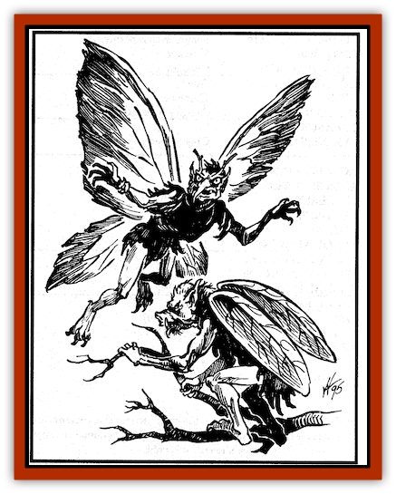

# Sprite - Unseelie Faerie

| Statistic | **Sprite, Unseelie Faerie** |
| --- | --- |
| **Activity Cycle:** | Night |
| **Alignment:** | Chaotic evil |
| **Armor Class:** | 6 |
| **Climate/Terrain:** | Forests, sylvan setting |
| **Damage/Attack:** | By weapon |
| **Diet:** | Omnivore |
| **Frequency:** | Very rare |
| **Hit Dice:** | 1-1 |
| **Intelligence:** | Average (10) |
| **Magic Resistance:** | 25% |
| **Morale:** | Steady (12) |
| **Movement:** | 6, Fl 18 (B) |
| **No. Appearing:** | 10-100 |
| **No. of Attacks:** | 1 |
| **Organization:** | Tribe |
| **Size:** | T (1&rdquo; to 1' tall) |
| **Special Attacks:** | Fear, spell, sleep poison |
| **Special Defenses:** | Invisibility |
| **THAC0:** | 20 |
| **Treasure:** | Nil (D) |
| **XP Value:** | 420 |

Twisted and evil cousins of the [[Sprite_Seelie_Faerie|seelie faeries]], the unseelie faeries are ugly, dark-skinned creatures. They have tattered insect wings, long thin arms, and broad, large-nosed faces. Like their cousins, the unseelie faeries vary greatly in appearance, often with the faces or limbs of beasts with claws, fangs, or oversized, monstrous eyes. Individuals are able to manipulate their size, ranging from one inch to one foot in height.

The unseelie faeries fight an endless war against the seelie. However, while the seelie faeries are merely mischievous, the unseelie faeries are sadistic and murderous. Seelie faeries merely taunt and annoy intruders, unseelie faeries take delight in the infliction of pain and killing.

**Combat:** Unseelie faeries can become *invisible* at will, and use this ability to follow, terrorize, and eventually ambush foes. The mere sight of an unseelie faerie is terrifying to ordinary mortals and has the effect of a *fear* spell on all observers.

Unseelie faeries fight with tiny weapons (swords inflict 1d2 points of damage, bows inflict 1 point). The weapons are sometimes treated with the same sleep poison used by their seelie cousins (those hit must save vs. spell or fall asleep for 2d4 hours). Victims often waken to find themselves bound and tormented by dozens of wicked unseelie faeries, who derive great amusement from the pain and suffering of others. Unseelie faeries also ride [[Bat|bats]] or [[Stirge|stirges]] into battle, attacking with small lances (1d4 points of damage) that are sometimes treated with sleep poison.

Each unseelie faerie can cast at one spell, once per day (noble and royal unseelie faeries are unknown). This spell can be of any level, but is fixed (and must be determined by the DM). Most are damaging and painful, such as *magic missile*, *lightning bolt*, *cloudkill*, or *monster summoning*.

**Habitat/Society:** Unseelie faeries live in tribal communities located in dark, twisted places, like gnarled trees, grim swamps, and dreary, weed-infested meadows. Their palaces, located on small demiplanes, are ugly black structures bristling with spikes, carved skulls, and images of horrifying monsters.

They live under a malevolent anarchy, each individual doing as he or she pleases, usually the behest or under the control of the individual with the most powerful magical abilities. These individuals often style themselves king, queen, or emperor, but they are just as often deposed.

The unseelie faeries have always fought their seelie cousins and will attack them on sight. Their battles rage the length and breadth of any sylvan area they share, and woe be unto any travelers caught in the middle.

Grief comes to anyone caught in unseelie territory after nightfall. They are merciless with captives, often inflicting evil torments before finally killing the victims. Even those who escape have problems - they are often *polymorphed*, with the head of a goat and the legs of a beetle, dancing, itching, or laughing uncontrollably.

**Ecology:** Though the unseelie faeries seem to gain their sustenance from the tiny demiplanes where their palaces are located, they have a significant effect on the surrounding lands: hunting animals for the fun of it, despoiling pleasant glades, felling trees, and attacking travelers. Experienced explorers know the signs of nearby unseelie activity: twisted and blackened vegetation, animals killed and left to rot, smashed trees, and poisoned water. Those familiar with sylvan woodlands are always careful to avoid such regions.

---
## Discovery & Documentation

**Source Publication:** Monstrous Compendium, 1995 Annual, Volume 2 (1995)
**Campaign Setting:** Advanced Dungeons & Dragons 2nd Edition
**Author(s):** Jon Pickens

### Other Creatures Found in This Source Book
   * [[Aboleth_Savant|Aboleth, Savant]]
   * [[Addazahr|Addazahr]]
   * [[Amiq_Rasol|Amiq Rasol]]
   * [[Arch-Shadow|Arch-Shadow]]
   * [[Automaton_Scaladar|Automaton, Scaladar]]
   * [[Automaton_Trobriand's|Automaton, Trobriand's]]
   * [[Bat_Sporebat|Bat, Sporebat]]
   * [[Beetle_Dragon|Beetle, Dragon]]
   * [[Bi-nou|Bi-nou]]
   * [[Boggle|Boggle]]
   * [[Brownie_Dobie|Brownie, Dobie]]
   * [[Brownie_Quickling|Brownie, Quickling]]
   * [[Cat_Crypt|Cat, Crypt]]
   * [[Cat_Great_Cath_Shee|Cat, Great, Cath Shee]]
   * [[Centaur-kin_Dorvesh|Centaur-kin, Dorvesh]]
   * [[Centaur-kin_Gnoat|Centaur-kin, Gnoat]]
   * [[Centaur-kin_Ha'pony|Centaur-kin, Ha'pony]]
   * [[Centaur-kin_Zebranaur|Centaur-kin, Zebranaur]]
   * [[Chronolily|Chronolily]]
   * [[Curst|Curst]]
   * [[Darktentacles|Darktentacles]]
   * [[Dinosaur_Aquatic|Dinosaur, Aquatic]]
   * [[Dinosaur_II|Dinosaur II]]
   * [[Dinosaur_III|Dinosaur III]]
   * [[Doppelganger_Greater|Doppelganger, Greater]]
   * [[Dragon_Brine|Dragon, Brine]]
   * [[Dragon_Half-|Dragon, Half-]]
   * [[Dragon-kin_Sea_Wyrm|Dragon-kin, Sea Wyrm]]
   * [[Dwarf_Wild|Dwarf, Wild]]
   * [[Ekimmu|Ekimmu]]
   * [[Elemental_Nature|Elemental, Nature]]
   * [[Elf_Winged|Elf, Winged]]
   * [[Fish_Great_Glacier|Fish (Great Glacier)]]
   * [[Fish_Subterranean|Fish, Subterranean]]
   * [[Fish_Toril|Fish (Toril)]]
   * [[Flareater|Flareater]]
   * [[Flumph|Flumph]]
   * [[Froghemoth|Froghemoth]]
   * [[Ghost_Casurua|Ghost, Casurua]]
   * [[Ghost_Ker|Ghost, Ker]]
   * [[Ghul|Ghul]]
   * [[Ghul-Kin|Ghul-Kin]]
   * [[Giant_Half-giant|Giant, Half-giant]]
   * [[Golem_Burning_Man|Golem, Burning Man]]
   * [[Golem_Phantom_Flyer|Golem, Phantom Flyer]]
   * [[Gulguthhydra|Gulguthhydra]]
   * [[Hakeashar|Hakeashar]]
   * [[Horse_Moon-|Horse, Moon-]]
   * [[Human_Dragonslayer|Human, Dragonslayer]]
   * [[Human_Vistana|Human, Vistana]]
   * [[Jellyfish_Giant|Jellyfish, Giant]]
   * [[Kalin|Kalin]]
   * [[Kholiathra|Kholiathra]]
   * [[Laerti|Laerti]]
   * [[Leucrotta_Greater|Leucrotta, Greater]]
   * [[Lich_Suel|Lich, Suel]]
   * [[Lurker_Shadow|Lurker, Shadow]]
   * [[Lycanthrope_Werepanther|Lycanthrope, Werepanther]]
   * [[Lycanthrope_Wereshark|Lycanthrope, Wereshark]]
   * [[Mammal_Herd_II|Mammal, Herd II]]
   * [[Marl|Marl]]
   * [[Meenlock|Meenlock]]
   * [[Mimic_Greater|Mimic, Greater]]
   * [[Mold_II|Mold II]]
   * [[Mummy_Creature|Mummy, Creature]]
   * [[Nyth|Nyth]]
   * [[Ooze_Slime_Jelly_Ghaunadan|Ooze/Slime/Jelly, Ghaunadan]]
   * [[Palimpsest|Palimpsest]]
   * [[Peltast|Peltast]]
   * [[Plant_Dangerous_II|Plant, Dangerous II]]
   * [[Pleistocene_Animal|Pleistocene Animal]]
   * [[Pudding_Subterranean|Pudding, Subterranean]]
   * [[Raggamoffyn|Raggamoffyn]]
   * [[Snake_Serpent|Snake, Serpent]]
   * [[Snake_Serpent_Vine|Snake, Serpent Vine]]
   * [[Sphinx_Draco-|Sphinx, Draco-]]
   * [[Sprite_Seelie_Faerie|Sprite, Seelie Faerie]]
   * [[Squealer|Squealer]]
   * [[Turtle_Giant|Turtle, Giant]]
   * [[Umpleby|Umpleby]]
   * [[Vizier's_Turban|Vizier's Turban]]
   * [[Wall_Walker|Wall Walker]]
   * [[Webbird|Webbird]]
   * [[Yak-Man|Yak-Man]]
   * [[Zorbo|Zorbo]]
