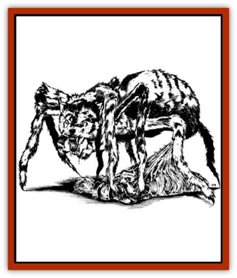
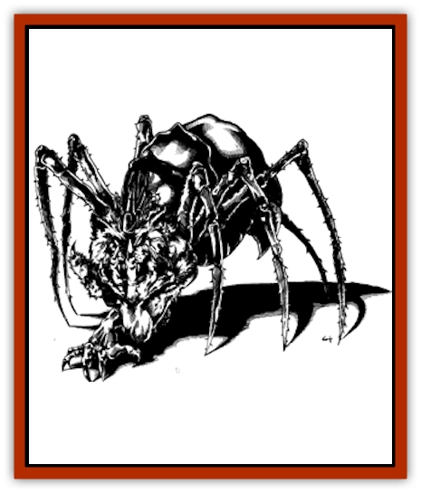
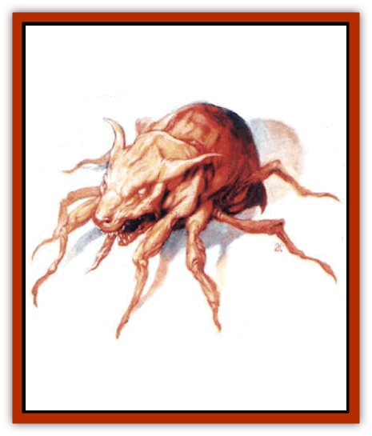
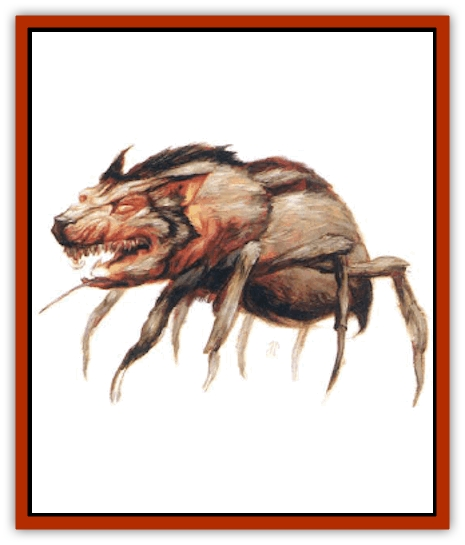
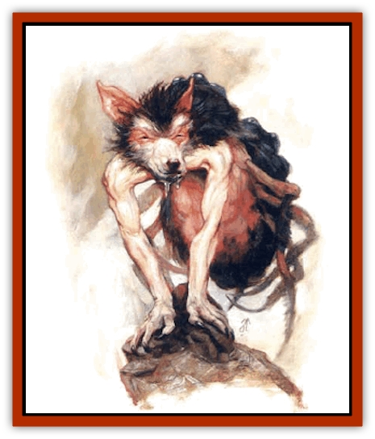
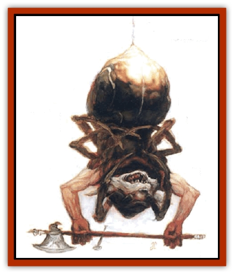
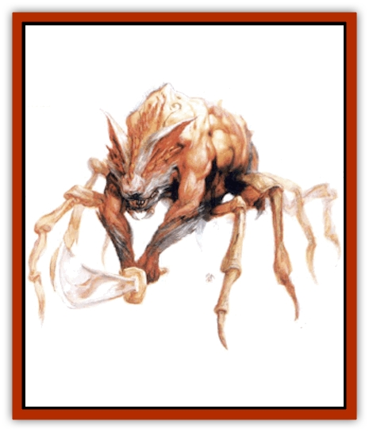

# Spyder Fiend

| Statistic | **Kakkuu** | **Lycosidilith** | **Phisarazu** | **Raklupis** | **Spithriku** |
| --- | --- | --- | --- | --- | --- |
| **Activity Cycle:** | Any | Any | Any | Any | Any |
| **Alignment:** | Chaotic evil | Chaotic evil | Chaotic evil | Chaotic evil | Chaotic evil |
| **Armor Class:** | 2 | -4 | -3 | -6 | 0 |
| **Climate/Terrain:** | Any | Any | Any | Any | Any |
| **Damage/Attack:** | 2d4 | 2d8/1d4/1d4 or 2d8/by weapon +6/by weapon +6 | 2d6/1d3/1d3 or 2d6/by weapon/by weapon | 2d10/1d6/1d6 or 2d10/by weapon +8/by weapon +8 | 2d6 |
| **Diet:** | Carnivore | Carnivore | Carnivore | Carnivore | Carnivore |
| **Frequency:** | Uncommon (very rare outside the Steaming Fen) | Very rare | Uncommon (very rare outside the Steaming Fen) | Very rare | Uncommon (very rare outside the Steaming Fen) |
| **Hit Dice:** | 4 | 10+6 | 9+1 | 12+8 | 7+1 |
| **Intelligence:** | Semi- (2-4) | Exceptional (15-16) | Very (11-12) | Genius (17-18) | Average (8-10) |
| **Magic Resistance:** | 15% | 60% | 50% | 70% | 35% |
| **Morale:** | Steady (11-12) | Champion (15-16) | Champion (15-16) | Fanatic (17-18) | Elite (13-14) |
| **Movement:** | 18, Wb 15, Cl 9 | 18, Wb 15, Cl 9 | 18, Wb 15, Cl 9 | 18, Wb 15, Cl 9 | 18, Wb 15, Cl 9 |
| **No. Appearing:** | 2d10 | 1d4 | 2d4 | 1 | 2d6 |
| **No. of Attacks:** | 1 | 3 | 3 | 3 | 1 |
| **Organization:** | Pack | Solitary | Pack | Solitary | Pack |
| **Size:** | M (5' long) | L (8' long) | L (7½' long) | L (10' long) | M (6' long) |
| **Special Attacks:** | Poison, see below | Poison, see below | Poison, see below | Poison, see below | Poison, see below |
| **Special Defenses:** | Webs, immunities | Webs, immunities, +2 or better magical weapons to hit | Webs, immunities, +2 or better magical weapons to hit | Webs, immunities, +3 or better magical weapons to hit | Webs, immunities, +1 or better magical weapons to hit |
| **THAC0:** | 17 | 9 | 11 | 7 | 13 |
| **Treasure:** | Nil | Z (Nil) | U (Nil) | Z (C) | Nil |
| **XP Value:** | 5,000 | 22,000 | 18,000 | 25,000 | 12,000 |

The spyder-fiends are a subrace of [[Tanar'ri_General_Information|tanar'ri]] that serve the [[The_Queen_of_Chaos|Queen of Chaos]]. Sages speculate that the original spyder-fiends were the spawn of the Queen of Chaos and [[Miska_the_Wolf-Spider|Miska the Wolf-spider]], the queen's lover and general. Most spyder-fiends combine the worst attributes of a [[Wolf|wolf]] and a [[Spider|spider]]. The smallest ones have spider bodies about the size of ponies; larger fiends may have bodies the size of heavy warhorses. All spyder-fiends have lupine heads and necks growing from the front of the body. The mouth is full of yellow, dog-like teeth, with a pair of spider fangs next to the primary canines. The spider body has eight legs, each tipped with pads and claws that allow the creature to climb vertical surfaces.

The head and neck usually are covered with matted, dirty fur. Under all the grime, the fur is gray with lighter patches around the eyes and snout. Most spyder-fiends' bodies are covered with coarse, stiff hair, which is typically dark or sandy brown and covered with spots, stripes, or bands of another color.

Less intelligent spyder-fiends are bloodthirsty and animalistic; they have the dispositions of rabid wolves. All are cruel and wickedly cunning.

**Combat:** A spyder-fiend's primary attack is its venomous bite. The poison has an onset time of 1d4 rounds, and if the victim fails a saving throw vs. poison, he collapses into a semi-conscious stupor, unable to move, think, or act. The victim can attempt a Constitution check every 2d4 hours to shake off the venom's effects. Even if the saving throw succeeds, the victim suffers a -2 penalty to Dexterity for 2d4 rounds. Additional bites do not increase the penalty, but they extend its duration. A *slow poison* spell applied before the onset time expires negates the penalty. The more powerful spyder-fiends carry even more potent venom.

A spyder-fiend's bulbous abdomen is equipped with spinnerets that can produce strands of silk. Spyder-fiends do not actually spin webs like normal or giant spiders do, but they can use their silk in various ways. Most commonly, a spyder-fiend uses its silk to suspend itself in the air, so that it can drop on unsuspecting prey. The creature also can lay a network of strands throughout an area to allow itself movement in three dimensions. A spyder-fiend can throw out silk up to 30 yards to bridge gaps.

Most spyder-fiend silk is not sticky, but the individual strands are effectively invisible unless touched. (Opponents who suspect presence of a strand can attempt a saving throw to see it, as noted in the description for the 2nd level wizard spell *invisibility*.) All spyder-fiends can use their silk to protect themselves from falling. A spyder-fiend suffers no falling damage if there is a surface within 30 yards that is strong enough to anchor a strand of silk. Also, if a victim is immobilized by the venom, a spyder-fiend can use its silk to bind the creature. The process takes three rounds. Bound victims who recover from the venom have one chance to break free with a successful band bars roll. For every additional round the fiend spends binding a victim in silk, there is a -10% penalty to the victim's bend bars chance, but the chance can never be reduced by more than half.

The individual types of spyder-fiends can create additional effects with their silk.

Although powerful, spyder-fiends prefer ambush to frontal attacks. They typically lie in wait for prey or enemies, dropping from above by means of their silk or rushing the foes' rear and flanks from concealment. When attacking from concealment or invisibility, a spyder-fiend imposes a -5 penalty to opponents' surprise rolls.

Spyder-fiends can use a silk ability while attacking physically, but not while using a spell-like ability. The creature can fire silk in any direction.

Spyder-fiends with the ability to alter their forms are fully able to use their spell-like abilities while in assumed forms. The fiend can retain its venomous bite and silk producing abilities if it chooses, but a close examination might reveal the creature's fangs and spinnerets. (If the fiend chooses to forgo any abilities, the assumed form can conceal the fangs or spinnerets or both.) If a chosen form does not have a bite attack, the fiend's bite delivers only one point of damage.

As tanar'ri, all spyder-fiends have the following spell-like abilities: *darkness 15' radius*, *infravision* (always active, range varies with type), and *teleport without error*. Spyder-fiends can *gate* in other spyder-fiends (the details vary by type) and are affected by various attack forms as noted below:

| Attack Form | Damage |
| --- | --- |
| Acid | Full |
| Cold | Half1 |
| Electricity (lightning) | None |
| Fire (magical) | Half1 |
| Fire (nonmagical) | None |
| Gas (poisonous, etc.) | Half1 |
| Iron Weapon | Full2 |
| Magic Missile | Full3 |
| Poison | None |
| Silver Weapon | Full4 |

1 The spyder-fiend suffers only half damage even if its saving throw fails. If the saving throw succeeds, the spyderfiend suffers quarter damage. A successful magic resistance roll, if applicable, negates all damage.
2 Even if the spyder-fiend is normally harmed only by magical weapons.
3 A successful magic resistance roll negates all damage.
4 Even if the spyder-fiend is normally harmed only by magical weapons; lycosidiliths and raklupises suffer only half damage.

**Habitat/Society:** Spyder-fiends are the primary residents of the Steaming Fen, a layer of the Abyss that consists of a vast salt marsh and a turbulent ocean. Both marsh and ocean are studded with outcroppings of rock, some covered with jungle vegetation. The whole plane is dank and smells of decay. The air is thick with biting and stinging insects, and the ground and water seethe with crawling insects and other vermin.

Spyder-fiends pay homage to the Queen of Chaos, who rules the plane. The queen sends spyder-fiends on errands throughout the multiverse, so they can be encountered almost anywhere. Less intelligent fiends sometimes accidentally stumble through a gate or conduit to another world, where they immediately take up the hunt. More intelligent spyder-fiends sometimes roam the planes on errands of their own.

**Ecology:** Spyder-fiends eat any living thing they can catch, but they always consume their prey live and eat only what they catch themselves. The more powerful and intelligent spyder-fiends derive more nourishment from their prey's life force and fear, but they retain a taste for fresh meat, too. Spyder-fiends have little to fear in their home layer of the Abyss, except for occasional hunting parties of [[Yugoloth_General_Information|yuguloths]] and [[Tanar'ri_True_Balor|balors]]. In tanar'ri fashion, the weaker spyder-fiends also serve as prey for the more powerful ones.

## 

Kakkuu

The kakkuu (pronounced Kah-KOO) are the weakest and least intelligent of the spyder-fiends. They have bloated spider bodies and mangy, filthy wolf heads. Kakkuu are bloodthirsty and animalistic; they can communicate with each other by means of fierce snarls, barks, and howls. The more intelligent tanar'ri can order them about with their telepathic abilities.

A kakkuu weighs about 300 pounds.

**Combat:** A kakkuu has infravision with a 60-foot range and the standard tanar'ri spell-like abilities as a 4th level caster. Its *gate* ability allows it to summon 1d8 kakkuu once a day with a 35% chance of success.

When left on their own, kakkuu behave very much like huge spiders, lying in wait for prey. A kakkuu can flatten its body and blend with its surroundings. Its markings provide natural camouflage, and if the kakkuu has even a small amount of cover (foliage, rocks, etc.) it is 80% undetectable until it moves.

A kakkuu can produce strands of silk for movements as described above. A kakkuu can also create an adhesive glob of silk about the size of a fist. Usually, the kakkuu perches over a trail or passage and drops a strand of silk with the glob attached to the free end. The creature  swings the glob like a pendulum over the area beneath, and any creature touching it becomes stuck. Creatures along the path of a swinging glob (usually a straight line from 5 to 25 feet long) must save vs. breath weapon or become stuck. If a group of creatures are in the path, only the first creature that fails the saving throw is stuck. When it catches a creature, the kakkuu reels in its victim at a rate of 15. A single strand of kakkuu silk can support about 1,000 pounds before breaking. It can be cut with an edged weapon (AC 0, 5 hp) or burned away in one round. A kakkuu, however, can only lift about 500 pounds when pulling in a strand. A kakkuu cannot fire a glob of silk as a missile; it must be dropped from above.

**Habitat/Society:** Kakkuu seldom harass each other, but they attack anything that isn't larger than themselves. They are cunning enough to avoid other fiends more powerful than they are. If commanded by a more intelligent tanar'ri, kakkuu are capable of hunting or fighting cooperatively, much as wolves do.

## 

Spithriku

These tanar'ri look like larger, more fearsome kakkuu, which is what they are (though they resent the fact if anyone points it out). In addition to its eight legs, a spithriku has a pair of pedipalps (leglike appendages) growing from the base of its wolf neck. The pedipalps cannot manipulate objects, but they are covered with sensitive hairs that can detect even the slightest vibration.

Spithriku are as bloodthirsty as their lesser kin, but more intelligent and cunning. They can communicate with any intelligent creature via telepathy. They are unable to speak, but can voice all manner of snarls, grunts, barks, and howls. Spithriku can understand and communicate in the animalistic snarling of kakkuu.

A spithriku weighs about 350 pounds.

**Combat:** Spithriku have venomous bites, infravision with a 90-foot range, and the standard tanar'ri spell-like abilities. Their *gate* ability allows them to summon 2d8 kakkuu or 1d4 spithriku three times a day with a 40% chance of success. In addition, spithriku can use *telekinesis* three times a day, and at will can cause *fear* (as the 4th level wizard spell) in a single creature by touch. Their spell-like abilities function at 7th level.

A spithriku can produce and employ silk just as a kakkuu can. Every three rounds, it can shoot a spray of webbing from its body (range 0) that creates an *entangle* effect in a cone 10 feet wide, 30 feet long, and 20 wide at the far end. The effect is similar to the 1st level priest spell *entangle* except that the effect remains for a full week or until burned away (which causes 1d8 points of fire damage to creatures caught within it). A spithriku also can fire a lightweight ball of silk with a fine strand of silk attached up to 30 yards. The strand is too weak to trap creatures, but it can transmit the spithriku's fear attack to the target.

Spithriku cannot be trapped in webs of any kind. The sensory hairs on their pedipalps allow them to *detect invisible* creatures within 30 feet; this ability is continuously active and is never foiled by *nondetection* spells or items that foil divination spells. Spithriku never suffer melee or movement penalties for darkness.

Spithriku are 80% undetectable when motionless and in cover, just as kakkuu are. Their greater intelligence allows them to employ more sophisticated tactics than kakkuu use. A typical spithriku attack begins with *darkness* spells. While the opponents deal with the darkness, the spithriku use their *teleport* abilities to surround the foe. Once in place, half the fiends attack from one direction while the others use their *fear* or *entangle* effects from the other direction. If the opponents negate the darkness, the fiends that are not fighting cast *darkness* again. If faced with physically dangerous opponents, the spithriku use their *teleport* abilities to stay out of reach and to maneuver to the opponents' rear.

**Habitat/Society:** Many spithriku prefer to haunt the lairs of more powerful fiends, fawning over their masters and hoping for advancement or a simple handout. They are as chaotic and untrustworthy as any other tanar'ri, however, and never hesitate to abandon or turn against their superiors in a moment of weakness. Other spithriku roam the Steaming Fen, stalking weaker creatures and occasionally gathering up packs of kakkuu to form hunting parties bound for other layers of the Abyss or the planes beyond.

While kakkuu form the rank and file of the Queen of Chaos's armies, the spithriku serve as her primary servants and messengers. Due to their intelligence, one or two spithriku are sometimes assigned to lead a pack of kakkuu on an errand.

## 

Phisarazu

In its natural form, a phisarazu is a repulsive creature whose gross spider's body is covered with stiff, wiry hair. It has a scruffy wolf's head and neck. Two pale humanoid arms sprout from the base of the neck, and a craggy line of knobby, hairless lumps runs down the back of the neck to the tip of the creature's globular abdomen. Its coat is mostly black, sometimes with a green or blue tints, swirled, striped, or spotted with various shades of gray, green, or blue. The arms are smooth and sickly, but fairly strong, ending in fivefingered hands with clawed digits. The lumps are coal black or oily blue. The creature's arms and hands are fully functional and capable of using tools or weapons.

A phisarazu weighs about 450 pounds.

Phisarazu are capable of speech in almost any tongue, though their conversation is usually punctuated by panting and growling. They can speak and understand the feral language of kakkuu and can telepathically communicate with any intelligent creature.

**Combat:** A phisarazu's bite is poisonous. The venom is similar to a kakkuu's, but faster acting (the onset time is 1d3 rounds) and slightly more potent. Opponents who fail their saving throws vs. poison check Constitution every 2d6 hours to recover. Even if the saving throw succeeds, the victim suffers a -3 penalty to Dexterity for 2d6 rounds.

Phisarazu have the standard tanar'ri spell-like abilities. Their infravision has a 90-foot range. Their *gate* ability allows them to summon 2d10 kakkuu, 1d8 spithriku, or 1d4 phisarazu three times a day with a 50% chance of success. Phisarazu have the following additional spell-like abilities: at will, they can cause *fear* (as the 4th level wizard spell) in a single creature by touch, become *invisible*, or use *alter self*. Three times a day they can cast *telekinesis*, *forget*, and *mirror image*. All spell-like abilities function at 9th level.

Phisarazu can employ all the silk-producing abilities that spithriku do, except that the phisarazu *entangle* ability can be used every two rounds. In addition, phisarazu can fire a mass of iridescent silken strands every two rounds. The threads can blind opponents and reveal invisible creatures just as the 2nd level wizard spell glitterdust does. The range is 30 yards.

Phisarazu cannot be trapped in webs of any kind. Sensory hairs on their arms and snouts allow them to detect invisible creatures within 40 feet. The ability is continuously active and is never foiled by *nondetection* spells or items that foil divination spells. Phisarazu never suffer melee or movement penalties for darkness.

Though their clawed hands are effective weapons, phisarazu are usually armed. They can employ a melee weapon in each hand at no penalty. Their favorite melee weapons are scimitars and morning stars, through a few carry lighter, more easily concealed weapons such as short swords. The average phisarazu also carries a short bow or two hand crossbows.

Phisarazu are cunning and mercyless; they love a good ambush and freely use their *darkness* and *invisibility* powers to catch opponents unawares. When subjected to physical attack, they employ their *mirror image* power to avoid damage. In large battles, they are fond of using their *alter self* ability to appear as weaker creatures (such as [[Elf_Drow|driders]], [[Crustacean_Giant|giant crabs]], or kakkuu) so as not to draw attention to themselves. When employing *alter self*, phisarazu are limited to basically arachnid forms with 10 limbs. When assuming a crablike form, a phisarazu can swim at a rate of 9 and breathe underwater.

**Habitat/Society:** Phisarazu resent anything less loathsome than themselves, which is about just everything, and delight in tormenting creatures that are weaker or less intelligent than they. Between their cruelty and their resentment, there are very few creatures in the multiverse that phisarazu do not perceive as either enemies or potential victims.

Though they usually prowl the land areas of the Steaming Fen, their *alter self* ability allows them to hunt everywhere. The Queen of Chaos often puts a phisarazu in charge of a group of kakkuu when their mission is beyond the capacity of the less intelligent spithriku. The Queen of Chaos's rare contributions to the Blood War (an age-old conflict between the tanar'ri and the [[Baatezu_General_Information|baatezu]]) usually consist of lightning raids by mobs of phisarazu. Other tanar'ri lords sometimes bargain with the Queen of Chaos to acquire phisarazu guards, which are valued for their ability to detect invisible foes.

## 

Lycosidilith

A lycosidilith has a sleeck, hairless spider body. Chitinous plates cover the creature's back and belly. The wolf head is furry, but backed by bony plates. A lycosidilith is usually green or blue overall, with yellow, black, or orange speckles, spots, or rings. The bony plates on the wolf head are the same color as the rest of the creature's body, but the fur is typically black or gray. Two robust humanoid arms sprout from the base of the neck.

A lycosidilith weighs about 400 pounds.

Lycosidiliths have pleasant voices that belie their monstrous appearance. They can converse eloquently in any language. They also can speak and understand the feral language of kakkuu and can telepathically communicate with any intelligent creature.

**Combat:** A lycosidilith's poisonous bite is very dangerous. The venom has an onset time of 1d3 rounds, and the victim falls into a semi-consciousness state (unable to move, think, or act) if he fails a saving throw vs. poison. The victim can attempt a Constitution check every 2d6 hours to awaken. Even if the saving throw succeeds, the victim suffers a -3 penalty to Dexterity for 2d6 rounds. Additional bites do not increase the penalty, but they extend its duration. A *slow poison* spell applied before the onset time expires negates the penalty.

Further, the venom destroys tissue if the bite is not treated. Even if the saving throw succeeds, the victim develops a festering sore within 2d8 hours. Initially, the victim loses one hit point and an additional hit point each day the sore goes untreated. A *neutralize poison* spell ends the effect, but does not heal the damage. Multiple bites cause multiple sores, but a single *neutralize poison* spell can treat all a victim's sores.

Lycosidiliths have the standard tanar'ri spell-like abilities. Their infravision has a 90-foot range. Their *gate* ability allows them to summon 2d10 kakkuu, 1d8 spithriku, 1d4 phisarazu, or 1 lycosidilith three times a day with a 60% chance of success. Lycosidiliths have the following additional spell-like abilities: at will, they can cause *fear* (as the 4th level wizard spell) in a single creature by touch, become *invisible*, *alter self* and *telekinesis*. Three times a day they can cast *forget*, *mirror image*, and *polymorph self*. All spell-like abilities function at 10th level.

Lycosidiliths have all the silk-producing abilities of phisarazu, except that the lycosidilith *entangle* ability can be used every two rounds and has a larger area of effect (the cone is 50 feet long), and their *glitterdust* ability has a range of 40 yards. Lycosidiliths can create a *web* effect (as the 2nd level wizard spell) once every three rounds. Lycosidiliths' webs have a range of 50 yards and are only 50% likely to burn each round that fire is applied to them, no matter what form the webbing takes.

Lycosidiliths cannot be trapped in webs of any kind. Sensory hairs on their arms and snouts allow them to detect invisible creatures within 50 feet. The ability is continuously active and is never foiled by *nondetection* spells or items that foil divination spells. Lycosidiliths never suffer melee or move meet penalties for darkness.

Though their clawed hands are effective weapons, lycosidiliths usually are armed. They can employ a melee weapon in each hand at no penalty. Their favorite melee weapons are scimitars and morning stars, through a few carry lighter, more easily concealed weapons such as short swords. Most lycosidiliths also carry a short bow or darts. Lycosidiliths are powerful, and their arms are as strong as an [[Ogre|ogre's]]. The creatures gain a +6 damage bonus on armed attacks, and their missile weapons are modified to take advantage of their strength.

Like phisarazu, lycosidiliths are masters of ambush, and freely use their *darkness* and *invisibility* powers to catch opponents unawares. They frequently use their *polymorph* self ability to appear as harmless creatures such as normal humans or normal animals. Like the phisarazu, lycosidiliths are limited to basically arachnid forms with 10 limbs when employing their *alter self* powers, so they prefer to *polymorph* themselves instead.

**Habitat/Society:** Like phisarazu, lycosidiliths use *alter self* to prowl the whole of the Steaming Fen, though they spend most of their time on land. A corps of lycosidiliths acts as personal guards and servants to the Queen of Chaos. The queen also employs them as ambassadors and for other missions that require subtlety and tact. There is great rivalry between lycosidiliths and phisarazu. The latter resent the lycosidiliths' greater status and intelligence (not to mention their more refined appearance). In turn, the lycosidiliths regard the more numerous phisarazu as a threat. The lycosidiliths respond by seeking protection from more powerful fiends or by surrounding themselves with lesser tanar'ri guards. The lycosidiliths also use their influence with the Queen of Chaos to make sure the phisarazu continue to carry the brunt of the Blood War.

## 

Raklupis

A raklupis is a trim-looking creature. The spider body is rounded and covered with a hard, smooth shell that harmlessly deflects most blows. The creature's wolf head is covered with luxuriant fur, and a triple row of sharp-looking spines runs down the back of the neck to the spider body. The fur is black or gray, but the shell and spines can be almost any color and are always vividly marked with swirls, bands, or spots of contrasting colors. A raklupis's humanoid arms are knotted with thick cords of muscle and covered with tufts of hair that match the wolf head.

Raklupises have even more beautiful and compelling voices than lycosidiliths do; they weigh about 450 pounds.

**Combat:** A raklupis has a fearsome bite attack. Not only do the creature's powerful jaws inflict significant damage, but its bite also injects a powerful venom similar to a lycosidilith's poison, though more potent. When bitten, an opponent must attempt a saving throw vs. poison or fall into a stupor; the onset time is immediate. The victim can attempt a Constitution check every 2d6 hours to recover from the stupor, but the venom's corrosive effects also inflict an additional point of damage every hour.

Even if the saving throw succeeds, the victim suffers a -3 penalty to Dexterity for 2d8 rounds. Additional bites do not increase the penalty, but they extend its duration. The victim also develops a festering sore and immediately loses one hit point, plus an additional hit point each hour the sore goes untreated. A *neutralize poison* spell ends the effect, but does not heal the damage. Multiple bites cause multiple sores, but a single *neutralize poison* spell can treat all a victim's sores. The victim is unable to benefit from any form of magical healing until the venom is neutralized.

Raklupises have the standard tanar'ri spell-like abilities. Their infravision has a 120-foot range. Their *gate* ability allows them to summon 2d10 kakkuu, 1d8 spithriku, 1d4 phisarazu, 1 lycosidilith, or 1 raklupis three times a day with a 65%, chance of success. Raklupises also have the following additional spell-like abilities: at will, they can cause *fear* (as the 4th level wizard spell) in a single creature by touch, become *invisible*, *alter self*, and *telekinesis*. Three times a day they can cast *forget*, *mirror image*, and *shape change*. All spell-like abilities function at 12th level.

A raklupis has an effective Charisma score of 18. If the creature is *shape changed* into a humanoid form it has a Charisma of 20 toward humanoids who are unaware of its true nature. Three times a day, a raklupis can produce a song or chant of haunting beauty that functions as a *mass charm* affecting up to 24 hit dice worth of listeners within 30 feet of the raklupis.

Raklupises have all the silk-producing abilities that lycosidiliths have, except that they can use one web ability of their choice every round. Their *glitterdust* ability has a range of 60 yards. Raklupises' webs are only 25% likely to burn each round that fire is applied to them, no matter what form the webbing takes.

A raklupis can create up to three waterproof globes of silk each day. It typically fills these with its own venom. When thrown or dropped, the globes burst, filling an area 15 feet in diameter with a poisonous mist. Creatures within the mist must save vs. poison or become blinded and mute for 3d4 turns as well as suffering 3d6 points of damage. If the save succeeds, the victim still suffers 2d6 points of damage, plus slurred speech and shortsightedness for 1d4 rounds. During this time, the victim has a -2 penalty on all missile attacks and any spell he casts has a 20% chance to fail outright if it has a verbal component. When filled with liquid, the globes can be thrown up to 10 yards. They are very fragile and tend to burst if roughly handled; these globes make item saving throws as pottery. A raklupis usually carries its globes attached to its back with bits of sticky webbing. The globes become brittle if not used immediately, bursting on their own after 1d6+18 hours.

Raklupises cannot be trapped in webs of any kind. Sensory hairs on their arms and snouts allow them to detect invisible creatures within 60 feet. The ability is continuously active and is never foiled by *nondetection* spells or items that foil divination spells. Raklupises never suffer melee or movement penalties for darkness.

Raklupises usually carry weapons so that they can take full advantage of their powerful arms, which are as strong a [[Giant_Stone|stone giant's]]. The creature gains a +8 damage bonus when fighting with a weapon. Raklupises carry the same sorts of weapons as lycosidiliths do.

Like their lesser kin, raklupises are masters of ambush. They use their shape change ability to appear as harmless creatures such as normal humans or normal animals. Like the phisarazu and lycosidiliths, raklupises are limited to basically arachnid forms with 10 limbs when employing their *alter self* powers, so they prefer to *shape change* instead. They typically begin combat by hurling globes of Venom.

**Habitat/Society:** Although capable of roaming almost anywhere, raklupises are fairly sedentary. About a dozen of them maintain their own citadels in the Steaming Fen. Another two serve as advisors and generals to the Queen of Chaos, standing in for Miska the Wolf Spider in his absence. About a dozen more are scattered throughout the multiverse, either engaged in the search for the *Rod* or maintaining citadels on other levels of the Abyss. Their lack of concern for the Blood War makes raklupises fairly unpopular among most true tanar'ri, but their power and status generally assures that weaker tanar'ri defer to them.

---
## Discovery & Documentation

**Source Publication:** The Rod of Seven Parts (1996)
**Campaign Setting:** Planescape
**Author(s):** Skip Williams

### Other Creatures Found in This Source Book
   * [[Beast_of_Chaos|Beast of Chaos]]
   * [[Hound_of_Law|Hound of Law]]
   * [[Vaati|Vaati]]
