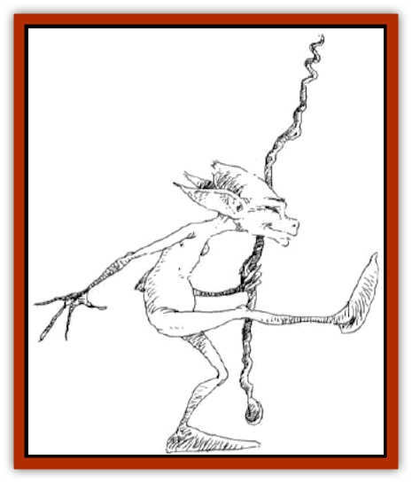

# Squeaker

| Statistic | **Squeaker** |
| --- | --- |
| **Activity Cycle:** | Any |
| **Alignment:** | Chaotic (Any) |
| **Armor Class:** | 10 |
| **Climate/Terrain:** | Any |
| **Damage/Attack:** | 1-4 |
| **Diet:** | Nil |
| **Frequency:** | Common |
| **Hit Dice:** | ½ |
| **Intelligence:** | Low (5-7) |
| **Magic Resistance:** | Nil |
| **Morale:** | Average (8-10) |
| **Movement:** | 12 |
| **No. Appearing:** | 2-40 |
| **No. of Attacks:** | 1 |
| **Organization:** | Tribe |
| **Size:** | S (1' tall) |
| **Special Attacks:** | None |
| **Special Defenses:** | None |
| **THAC0:** | 18 |
| **Treasure:** | Nil |
| **XP Value:** | 15 |

Squeakers were first encountered a few years ago. It is believed they were created by a wizard's spell gone bad. These small, humanoid creatures have disproportionately large heads and spindly bodies. They look vaguely [[Sprite|pixie]]-like, but they wear no clothes and display no gender.

**Combat:** Squeakers do not appear to attack for the purpose of killing. Rather, they attack to annoy and aggravate their prey. Why they do this is unknown, but they have successfully annoyed many an adventurer.

Their standard tactic is to stand several yards away and throw stones, rocks, branches, etc. at their target. When chased, they run away, usually leading the target into an ambush of the same nature. When using hurled weapons of this nature, they gain a +2 attack bonus due to their familiarity with such weapons.

They rarely stand in the open when attempting to annoy their targets, but use their missile weapons from behind cover. The best response to a squeaker attack, many have found, is a *fireball* placed in the general direction of the attacks.

Squeakers attack with no apparent strategy, aiming at those who are closest to them, whether this is a wizard, fighter, rogue, or priest. This has, more often than not, proven to be the downfall of several tribes. They do not concentrate on an individual seeking to bring it down, but rather spread their missiles over a larger area. Some surmise that they seek only to drive intruders from their area, while others speculate that the squeakers have some more sinister purpose in mind.

**Habitat/Society:** The squeakers have been encountered in every corner of the globe and at every temperate range. They do not appear to be affected by temperatures, although they appear to shun more extreme climates.

Squeaker society is unknown. They group together with no apparent leader and work together with almost ant-like organization to irritate those who pass through what they regard as their territory. This territory is usually no larger than one mile on a side, but the squeakers patrol it vigilantly and harass those who enter too far into it.

Squeakers speak their own language and no other. Their language consists, of course, of tiny grunts, squeaks, and whistles that seem random to any but those listening via magic. They speak of anything that enters their small minds, which vanishes from their thoughts as soon as they speak it. They make no attempt to conceal this speech, and those who hear it would be best advised to leave the area or suffer severe irritation.

**Ecology:** Since squeakers don't eat and do not appear to want anything of any real value from the environment, they have little impact on the local ecology. However, they reproduce rapidly, replenishing numbers lost to marauding animals, vengeful humanoids, and monsters.

---
## Discovery & Documentation

**Source Publication:** Dragon Mountain (1993)
**Campaign Setting:** Advanced Dungeons & Dragons 2nd Edition
**Author(s):** Colin McComb, Paul Arden Lidberg

### Other Creatures Found in This Source Book
   * [[Dragon-kin|Dragon-kin]]
   * [[Elemental_Earth_Kin_Earth_Weird|Elemental, Earth Kin, Earth Weird]]
   * [[Gnasher|Gnasher]]
   * [[Gnasher_Winged|Gnasher, Winged]]
   * [[Kobold_Dragon_Mountain|Kobold, Dragon Mountain]]
   * [[Living_Steel|Living Steel]]
   * [[Noran|Noran]]
   * [[Ophidian|Ophidian]]
   * [[Rautym|Rautym]]
   * [[Spider_Brain|Spider, Brain]]
   * [[Stone_Snake|Stone Snake]]
   * [[Suwyze|Suwyze]]
   * [[Tanar'ri_Greater_Wastrilith|Tanar'ri, Greater, Wastrilith]]
   * [[Undead_Dwarf|Undead Dwarf]]
