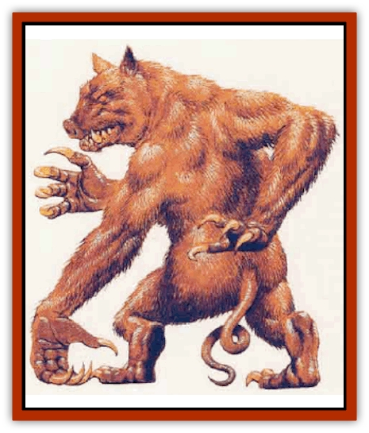

# Squealer

| Statistic | **Squealer** |
| --- | --- |
| **Activity Cycle:** | Day |
| **Alignment:** | Neutral |
| **Armor Class:** | 4 |
| **Climate/Terrain:** | Temperate forest, tropical jungle |
| **Damage/Attack:** | 1d6+6/1d4+1 (&times;3) |
| **Diet:** | Carnivore |
| **Frequency:** | Very rare |
| **Hit Dice:** | 10 |
| **Intelligence:** | Low (5-7) |
| **Magic Resistance:** | Nil |
| **Morale:** | Steady (11-i2) |
| **Movement:** | 9, Climb 15 |
| **No. Appearing:** | 1-4 |
| **No. of Attacks:** | 4 |
| **Organization:** | Solitary |
| **Size:** | L (8-9' tall) |
| **Special Attacks:** | Drop, hug, rear claws for 1d4+1 each |
| **Special Defenses:** | Camouflage |
| **THAC0:** | 11 |
| **Treasure:** | Nil (C) |
| **XP Value:** | 8,000 |

A squealer is a grotesque creature with a piggish dace and leathery skin over which a fine coat of green and brown fur forms variegated patterns. A squealer has two legs and three arms, all ending in claws. Two arms are 4 feet long, while the third, which sprouts from the predator's back, is 5 feet long.

In addition to the shrill cry which gives them their name, squealers have a highly developed range of vocalizations. The wily creatures can imitate the sounds of wounded animals, as well as those of humans and demihumans, such as screams of terror or the cries of a baby.

**Combat:** Squealers are crafty and prefer using their voices to lure prey into ambush. The squealer's coat makes it difficult to see in the trees; opponents receive a -2 penalty to surprise rolls. Once a victim is in range, the creature either drops on its prey or drags it into the trees. Dropping on a victim requires an attack roll and causes 5d4 points of damage.

When on the ground, or when using its legs to hang from a tree limb, the squealer attacks with its teeth and its three foreclaws. When a squealer hits with its third arm, it hauls its victim into the air and continues to bite and claw.

A squealer may instead use its third arm to hang from a tree, attacking with its teeth and other arms. If the squealer hits with both its other arms, it pulls the prey into a hug, then bites while raking with its rear claws. The hug causes 2d4 points of damage per round the prey is held.

A victim being held or hugged loses all Dexterity bonuses to Armor Class; held prey receives a -2 penalty to attack rolls, while a hugged victim is unable to attack unless already holding a small weapon. Held or hugged prey must make a successful bend bars roll in order to break free.

The squealer can carry up to 500 pounds, either with its third arm or clutched with the other two. Once a squealer has captured a victim, it will often climb higher to avoid competition. One of the squealer's favorite tactics is to take prey high into the trees and then drop them to the forest floor. It is especially likely to do this to a victim which causes it pain.

If intended prey eludes a squealer's initial trap, the predator will pursue tenaciously, staying in the trees. The squealer's five limbs allow it to climb quickly through the foliage. Squealers can also leap as far as 30 feet horizontally or 15 feet vertically. A squealer will end pursuit only if faced with numerous foes or foes which are much larger than the squealer itself.

If a squealer is not especially hungry when it catches prey, it may attempt to knock or throttle its victim uneonscious, then secure it to a tree trunk with vines.

**Habitat/Society:** Squealers inhabit only forests where trees are close enough for them to maneuver through the branches with ease. They make leaf and branch nests high above ground.

Squealers are solitary and mark their territory by clawing deep gashes into trees at the edge of the area they claim. However, during a brief mating season in the spring, pairs of squealers may be found together. At such times, the squealers' bloodlust runs high, and they are more likely to attack.

The female squealer is indistinguishable from the male. When ready to give birth, a female travels to the male's territory. After delivery, 2-5 infants are placed in a pouch in the male's abdomen. When they emerge several months later, they climb to the highest branches, venturing back down only to feed on their father's leftovers or bound victims. When fully grown (in about a year), they are driven from the area by their father.

A young squealer has the same Armor Class and Hit Dice as an adult, but has only 1 or 2 hit points per Hit Die. It cannot use its claws effechvely, but can bite for 1d4 points of damage.

**Ecology:** Squealers prefer fresh prey and sometimes save victims for a while. Some squealers even feed their captives, keeping them alive for days. They care little for treasure. However, since a squealer generally carries its prey to a place near its lair to feed, the ground below is often littered with valuable objects.

If infant squealers are removed from an adult's pouch, they will live only if kept warm and fed chewed meats. Young squealers can be trained as guards if raised from infancy. An untrained squealer is worth up to 3,000 gp, while a trained specimen could brmg as much as 10,000 gp. Trained squealers can learn several commands and are very loyal.

---
## Discovery & Documentation

**Source Publication:** Monstrous Compendium, 1995 Annual, Volume 2 (1995)
**Campaign Setting:** Advanced Dungeons & Dragons 2nd Edition
**Author(s):** Jon Pickens

### Other Creatures Found in This Source Book
   * [[Aboleth_Savant|Aboleth, Savant]]
   * [[Addazahr|Addazahr]]
   * [[Amiq_Rasol|Amiq Rasol]]
   * [[Arch-Shadow|Arch-Shadow]]
   * [[Automaton_Scaladar|Automaton, Scaladar]]
   * [[Automaton_Trobriand's|Automaton, Trobriand's]]
   * [[Bat_Sporebat|Bat, Sporebat]]
   * [[Beetle_Dragon|Beetle, Dragon]]
   * [[Bi-nou|Bi-nou]]
   * [[Boggle|Boggle]]
   * [[Brownie_Dobie|Brownie, Dobie]]
   * [[Brownie_Quickling|Brownie, Quickling]]
   * [[Cat_Crypt|Cat, Crypt]]
   * [[Cat_Great_Cath_Shee|Cat, Great, Cath Shee]]
   * [[Centaur-kin_Dorvesh|Centaur-kin, Dorvesh]]
   * [[Centaur-kin_Gnoat|Centaur-kin, Gnoat]]
   * [[Centaur-kin_Ha'pony|Centaur-kin, Ha'pony]]
   * [[Centaur-kin_Zebranaur|Centaur-kin, Zebranaur]]
   * [[Chronolily|Chronolily]]
   * [[Curst|Curst]]
   * [[Darktentacles|Darktentacles]]
   * [[Dinosaur_Aquatic|Dinosaur, Aquatic]]
   * [[Dinosaur_II|Dinosaur II]]
   * [[Dinosaur_III|Dinosaur III]]
   * [[Doppelganger_Greater|Doppelganger, Greater]]
   * [[Dragon_Brine|Dragon, Brine]]
   * [[Dragon_Half-|Dragon, Half-]]
   * [[Dragon-kin_Sea_Wyrm|Dragon-kin, Sea Wyrm]]
   * [[Dwarf_Wild|Dwarf, Wild]]
   * [[Ekimmu|Ekimmu]]
   * [[Elemental_Nature|Elemental, Nature]]
   * [[Elf_Winged|Elf, Winged]]
   * [[Fish_Great_Glacier|Fish (Great Glacier)]]
   * [[Fish_Subterranean|Fish, Subterranean]]
   * [[Fish_Toril|Fish (Toril)]]
   * [[Flareater|Flareater]]
   * [[Flumph|Flumph]]
   * [[Froghemoth|Froghemoth]]
   * [[Ghost_Casurua|Ghost, Casurua]]
   * [[Ghost_Ker|Ghost, Ker]]
   * [[Ghul|Ghul]]
   * [[Ghul-Kin|Ghul-Kin]]
   * [[Giant_Half-giant|Giant, Half-giant]]
   * [[Golem_Burning_Man|Golem, Burning Man]]
   * [[Golem_Phantom_Flyer|Golem, Phantom Flyer]]
   * [[Gulguthhydra|Gulguthhydra]]
   * [[Hakeashar|Hakeashar]]
   * [[Horse_Moon-|Horse, Moon-]]
   * [[Human_Dragonslayer|Human, Dragonslayer]]
   * [[Human_Vistana|Human, Vistana]]
   * [[Jellyfish_Giant|Jellyfish, Giant]]
   * [[Kalin|Kalin]]
   * [[Kholiathra|Kholiathra]]
   * [[Laerti|Laerti]]
   * [[Leucrotta_Greater|Leucrotta, Greater]]
   * [[Lich_Suel|Lich, Suel]]
   * [[Lurker_Shadow|Lurker, Shadow]]
   * [[Lycanthrope_Werepanther|Lycanthrope, Werepanther]]
   * [[Lycanthrope_Wereshark|Lycanthrope, Wereshark]]
   * [[Mammal_Herd_II|Mammal, Herd II]]
   * [[Marl|Marl]]
   * [[Meenlock|Meenlock]]
   * [[Mimic_Greater|Mimic, Greater]]
   * [[Mold_II|Mold II]]
   * [[Mummy_Creature|Mummy, Creature]]
   * [[Nyth|Nyth]]
   * [[Ooze_Slime_Jelly_Ghaunadan|Ooze/Slime/Jelly, Ghaunadan]]
   * [[Palimpsest|Palimpsest]]
   * [[Peltast|Peltast]]
   * [[Plant_Dangerous_II|Plant, Dangerous II]]
   * [[Pleistocene_Animal|Pleistocene Animal]]
   * [[Pudding_Subterranean|Pudding, Subterranean]]
   * [[Raggamoffyn|Raggamoffyn]]
   * [[Snake_Serpent|Snake, Serpent]]
   * [[Snake_Serpent_Vine|Snake, Serpent Vine]]
   * [[Sphinx_Draco-|Sphinx, Draco-]]
   * [[Sprite_Seelie_Faerie|Sprite, Seelie Faerie]]
   * [[Sprite_Unseelie_Faerie|Sprite, Unseelie Faerie]]
   * [[Turtle_Giant|Turtle, Giant]]
   * [[Umpleby|Umpleby]]
   * [[Vizier's_Turban|Vizier's Turban]]
   * [[Wall_Walker|Wall Walker]]
   * [[Webbird|Webbird]]
   * [[Yak-Man|Yak-Man]]
   * [[Zorbo|Zorbo]]
