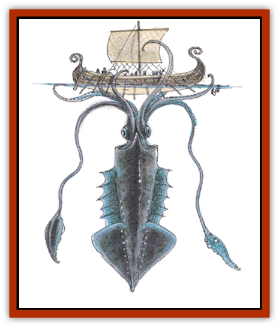

# Squid - Giant

| Statistic | **Giant Squid** | **Kraken** |
| --- | --- | --- |
| **Activity Cycle:** | Any | Any |
| **Alignment:** | Neutral | Neutral evil |
| **Armor Class:** | 7/3 | 5/0 |
| **Climate/Terrain:** | Any deep waters | Very deep oceans |
| **Damage/Attack:** | 1-6 (&times;8)/5-20 | 3-18 (&times;2)/2-12 (&times;6)/7-28 |
| **Diet:** | Carnivore | Carnivore |
| **Frequency:** | Rare | Very rare |
| **Hit Dice:** | 12 | 20 |
| **Intelligence:** | Non- (0) | Genius+ (19-20+) |
| **Magic Resistance:** | Nil | Nil |
| **Morale:** | Elite (13) | Fanatic (18) |
| **Movement:** | Sw 3, Jet 18 | Sw 3, Jet 21 |
| **No. Appearing:** | 1 | 1 |
| **No. of Attacks:** | 9 | 9 |
| **Organization:** | Solitary | Solitary |
| **Size:** | G (60'+ long) | G (90'+ long) |
| **Special Attacks:** | Constriction | See below |
| **Special Defenses:** | See below | See below |
| **THAC0:** | 9 | 1 |
| **Treasure:** | A | G,R,S (+A) |
| **XP Value:** | 5,000 | 14,000 |

Giant squids are huge varieties of the normal, peaceful, tentacled cephalopods (unshelled invertebrates).

They have ten long tentacles, two of which are always used to maintain stability when attacking or defending, and long, protected heads with two eyes. Their beak-like mouths are located where the tentacles meet the lower portion of their bodies.

**Combat:** Giant squids prefer to grab their opponents in their tentacles and constrict them, while they bring the thrashing victims into their huge jaws. As many as eight tentacles can attack one opponent, but only one at a time can constrict a man-sized opponent (the rest are free to attack anything else within reach). The rubbery tentacles are so strong they cannot be broken by force and must be severed. A giant squid's tentacles hit for 1d6 points of damage and constrict for 2d6 points of damage every round after the initial strike. The beak of a giant squid inflicts 5d4 points of damage.

Any character who is constricted may have one arm (01-25% left, or 26-50% right), no arms (51-75%), or both arms (76-100%) pinned. A constricted character cannot cast any spells, but he can grab a weapon and attack the tentacle (if only one arm is free, he attacks with a -3 penalty to the attack roll; if both arms are free, the penalty is -1). A giant squid's tentacle requires 12 points of damage from sharp or edged weapons to sever (these hit points are in addition to the hit points from Hit Dice).

If a giant squid has four or more tentacles severed, the monster is 80% likely to squirt out a cloud of jet-black ink 60 feet high by 60 feet wide and 80 feet long. The squid then jets away and retreats to its lair. The ink completely obscures the vision of all within the cloud.

A giant squid can drag ships of small size to the bottom and can halt the movement of larger ones in one turn of dragging. After six or more tentacles have squeezed the hull of the ship for three consecutive rounds, the vessel suffers damage as if it had been rammed and it begins to take on water and sink.

## Kraken

A kraken is a rare form of gargantuan squid. It is one of the most deadly monsters in existence.

**Combat:** Krakens attack as huge varieties of giant squid. Two of their tentacles are barbed and cause 3d6 points of damage when they hit. They then try to drag prey toward their gaping maws for a bite of 7d4 points of damage. The other six free tentacles inflict 2d6 points of damage when they hit and constrict for 3d6 points each round thereafter. A kraken's tentacle must suffer 18 points of damage from sharp or edged weapons to be severed (these hit points are in addition to those the kraken gets from its Hit Dice).

If three of more of its tentacles have been severed, the monster is 80% likely to retreat, leaving behind a cloud of ink to discourage pursuit. The kraken is 50% likely to retreat to its den if four or more of its tentacles have victims. It leaves behind an ink cloud in this case also. The ink cloud of a kraken is 80 feet high by 80 feet wide by 120 feet long and is poisonous (it dissipates in 2-5 rounds). Those within the cloud receive 2d4 points of damage every round they remain. Krakens jet away to their lairs at a movement rate 21.

Krakens can drag ships of 60 feet long down in the same way as normal giant squids attack. They have the innate power to cause *airy water* in a sphere 120 yards across or in a hemisphere 240 yards across (they can do this continuously). They can employ the following spell-like powers, one at a time, at will: *faerie fire* for up to eight hours, *control temperature* in a 40-yard radius continuously, *control winds* once per day, *weather summoning* once per day, and *animal summoning III* (fish only) three times per day (note that this spell does not grant control of the fish once summoned).

Krakens are not affected by the conch horns of [[Triton|tritons]].

**Habitat/Society:** Krakens have Intelligences of genius or higher and often control entire regions of the underwater world. Their lairs lie thousands of feet below the surface and they maintain huge complexes of caverns where they keep and breed human slaves to serve and feed them.

**Ecology:** Krakens can breathe either air or water and are aggressive hunters. Many tropical islands have been completely stripped of all inhabitants (animal and human) by krakens.

It is said that krakens retreated to the depths when the forces of good thwarted their attempt to rule the seas, but is also said that in the future krakens will rise again.

---
## Discovery & Documentation

**Source Publication:** MC2 Volume II (1993)
**Campaign Setting:** Advanced Dungeons & Dragons 2nd Edition
**Author(s):** Jay Batista, Scott Bennie, Grant Boucher, William W. Connors, Steve Gilbert, Heike Kubasch, James Lowder, David Edward Martin, Bruce Nesmith, Jean Rabe, Rick Swan, John J. Terra, Gary L. Thomas

### Other Creatures Found in This Source Book
   * [[Ant|Ant]]
   * [[Ant_Lion_Giant|Ant Lion, Giant]]
   * [[Ape_Carnivorous|Ape, Carnivorous]]
   * [[Baboon|Baboon]]
   * [[Badger|Badger]]
   * [[Barracuda|Barracuda]]
   * [[Beetle_Giant|Beetle, Giant]]
   * [[Bulette|Bulette]]
   * [[Bullywug|Bullywug]]
   * [[Dwarf_Duergar|Dwarf, Duergar]]
   * [[Dwarf_Gully|Dwarf, Gully]]
   * [[Eagle|Eagle]]
   * [[Eel|Eel]]
   * [[Elemental_Air_Kin|Elemental, Air Kin]]
   * [[Elemental_Water_Kin|Elemental, Water Kin]]
   * [[Elemental_Water_Kin_Water_Weird|Elemental, Water Kin, Water Weird]]
   * [[Firestar|Firestar]]
   * [[Firetail|Firetail]]
   * [[Fish_Giant|Fish, Giant]]
   * [[Frog|Frog]]
   * [[Gorgon|Gorgon]]
   * [[Hawk|Hawk]]
   * [[Heucuva|Heucuva]]
   * [[Hippocampus|Hippocampus]]
   * [[Hippogriff|Hippogriff]]
   * [[Kelpie|Kelpie]]
   * [[Kenku|Kenku]]
   * [[Killmoulis|Killmoulis]]
   * [[Kuo-Toa|Kuo-Toa]]
   * [[Lamia|Lamia]]
   * [[Lammasu|Lammasu]]
   * [[Lamprey|Lamprey]]
   * [[Leech|Leech]]
   * [[Leprechaun|Leprechaun]]
   * [[Leucrotta|Leucrotta]]
   * [[Locathah|Locathah]]
   * [[Lycanthrope_Wereboar|Lycanthrope, Wereboar]]
   * [[Lycanthrope_Werefox|Lycanthrope, Werefox]]
   * [[Mammal_Minimal|Mammal, Minimal]]
   * [[Mammal_Small|Mammal, Small]]
   * [[Mimic|Mimic]]
   * [[Morkoth|Morkoth]]
   * [[Muckdweller|Muckdweller]]
   * [[Myconid|Myconid]]
   * [[Naga|Naga]]
   * [[Obliviax|Obliviax]]
   * [[Octopus_Giant|Octopus, Giant]]
   * [[Otyugh|Otyugh]]
   * [[Piranha|Piranha]]
   * [[Plant_Dangerous_I|Plant, Dangerous I]]
   * [[Plant_Intelligent|Plant, Intelligent]]
   * [[Poltergeist|Poltergeist]]
   * [[Porcupine|Porcupine]]
   * [[Rat_Osquip|Rat, Osquip]]
   * [[Roc|Roc]]
   * [[Roper|Roper]]
   * [[Rot_Grub|Rot Grub]]
   * [[Rust_Monster|Rust Monster]]
   * [[Sahuagin|Sahuagin]]
   * [[Sea_Lion|Sea Lion]]
   * [[Sea_Horse_Giant|Sea Horse, Giant]]
   * [[Shambling_Mound|Shambling Mound]]
   * [[Shark|Shark]]
   * [[Sphinx|Sphinx]]
   * [[Stirge|Stirge]]
   * [[Swanmay|Swanmay]]
   * [[Tarrasque|Tarrasque]]
   * [[Tasloi|Tasloi]]
   * [[Triton|Triton]]
   * [[Troglodyte|Troglodyte]]
   * [[Urchin|Urchin]]
   * [[Urd|Urd]]
   * [[Weasel|Weasel]]
   * [[Wolverine|Wolverine]]
   * [[Yellow_Musk_Creeper|Yellow Musk Creeper]]
