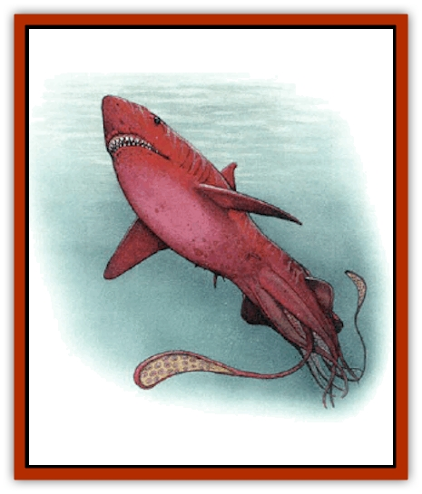

# Squid - Squark

| Statistic | **Squid, Squark** |
| --- | --- |
| **Activity Cycle:** | Any |
| **Alignment:** | Neutral evil |
| **Armor Class:** | 5/0 |
| **Climate/Terrain:** | Ocean (The Last Sea) |
| **Damage/Attack:** | 2-12 (&times;2)/1-6 (&times;6)/3-18 |
| **Diet:** | Carnivore |
| **Frequency:** | Very rare |
| **Hit Dice:** | 18 |
| **Intelligence:** | Very (12) |
| **Magic Resistance:** | Nil |
| **Morale:** | Champion (16) |
| **Movement:** | Sw 13, Jet 24 |
| **No. Appearing:** | 1 |
| **No. of Attacks:** | 9 |
| **Organization:** | Solitary |
| **Size:** | G (75' long) |
| **Special Attacks:** | Constriction, psionics |
| **Special Defenses:** | Ink, psionics |
| **THAC0:** | 5 |
| **Treasure:** | Nil |
| **XP Value:** | 15,000 |

**Psionics Summary**

| Level | Dis/Sci/Dev | Attack/Defense | Score | PSPs |
| --- | --- | --- | --- | --- |
| 20 | 3/3/9 | Pb,Ew/Mbk,Tw | 12 | 86 |

The squark is a legendary cross between a [[Squid_Giant|giant squid]] and a great white [[Shark|shark]]. The squark has the front half of an extremely large shark, but instead of the tail and fins one would expect to find at the rear of such a creature, there are instead 10 long tentacles which make up the bulk of the creature's 75' length. The creature is entirely a deep crimson red from its nose to the end of its longest tentacle, except for the pinkish suckers on the inside of its tentacles, and its flat black eyes.

**Combat:** The squark's head is full of a dozen rows of three-inch-long, razor-sharp teeth that bite for 3d6 points of damage. It can use these to rend a victim to shreds in mere seconds. The monster seems to favor this method of attack for its directness: This gets food into its mouth faster than any other way.

Two of the squark's tentacles are longer than the others. These are barbed and cause 2-12 points of damage when they hit. The other six do 1-6 points of damage each.

When the direct approach doesn't seem to work for whatever reason, the squark likes to grab a victim in its tentacles and constrict the pour soul while wrestling him into reach of its jaws. It can attack a single opponent with all eight of its tentacles at once, or it can constrict up to two foes at once with its larger tentacles, leaving the others free to attack normally.

Once a constricting tentacle hits, it squeezes for 2d6 points of damage every round thereafter; no attack roll is necessary. A constricted character may have one or more arms pinned (01-25% both pinned, 26-50% left arm, 51-75% right arm, or b76-100% both arms). Constricted characters cannot cast any spells, but they can use weapons to attack the tentacle holding them, if they have at least one arm free. If one arm is free, the character's attack rolls suffer a penalty of -3. If both arms are free, the attack roll suffers only a -1 penalty.

The squark can drag down a ship up to 40' long by simply wrapping its tremendous tentacles around the hapless craft and hauling it down. It can halt the movement of larger vessels with  only one turn of dragging on their hulls. After six or more tentacles have squeezed the ship for three consecutive rounds, the vessel suffers damage as if it had been rammed, and it begins to take on water and sink.

The squark's head is AC 0, and its tentacles are AC 5. It takes 15 points of damage to sever a tentacle, 20 for the larger ones. (These hit points are in addition to the hit points the creature gets from Hit Dice, and the tentacles will regenerate themselves entirely within two full weeks.) If four or more tentacles are severed, the monster will dive into the depths of the sea, squirting a cloud of ink behind it to cover its retreat. This ink cloud is 60 feet wide by 60 feet high and 80 feet long. The cloud is impossible to see through by any normal means.

In addition to all this, the squark is a psionic wild talent. It has 86 PSPs, and its power of phase permits it to avoid nearly all deadly attacks. It uses the following attacks: mind thrust, psionic blast, and psychic crush. It also has these defenses: mental barrier, mind blank, and tower of iron will.

**Habitat/Society:** The squark is a solitary, almost legendary creature, and might be unique. It hunts big game only rarely. It doesn't need much food, so it normally contents itself with the creatures that it finds on the bottom of the sea. The squark spends large amounts of time sleeping on the sea floor. Those who are unfortunate enough to somehow disturb its slumber can only hope that they will live to regret such a mistake.

**Ecology:** Most sailors know about squarks, or at least about where in the trackless sea their territories lie. Ships that cross the seas directly and regularly occasionally disappear without a trace. Sailor talk has it  that the squark hauls such wayward vessel down into its domain.

On Athas, the creature is unique in the Last Sea, trapped in Marnita when the Mind Lords closed the Barrier of Guardians. How old it was when this happened is unknown, but the squark must be at least nine millennia old. It is now content merely to live, respecting the power of the Mind Lords of the Last Sea, who are rumored to have communicated with it on occasion.

---
## Discovery & Documentation

**Source Publication:** Monstrous Compendium, 1997 Annual, Volume 4 (1995)
**Campaign Setting:** Advanced Dungeons & Dragons 2nd Edition
**Author(s):** Jon Pickens

### Other Creatures Found in This Source Book
   * [[Anemone_Giant_Sea|Anemone, Giant Sea]]
   * [[Asperii|Asperii]]
   * [[Bainligor|Bainligor]]
   * [[Beast_of_Chaos|Beast of Chaos]]
   * [[Blindheim|Blindheim]]
   * [[Bloodsipper_Far_Realm|Bloodsipper (Far Realm)]]
   * [[Bulette_Gohlbrorn|Bulette, Gohlbrorn]]
   * [[Child_of_the_Sea|Child of the Sea]]
   * [[Clockwork_Horror|Clockwork Horror]]
   * [[Clockwork_Swordsman|Clockwork Swordsman]]
   * [[Coral|Coral]]
   * [[Darklore|Darklore]]
   * [[Dharculus|Dharculus]]
   * [[Dolphin_Athas|Dolphin (Athas)]]
   * [[Dragon_Neutral_Moonstone|Dragon, Neutral, Moonstone]]
   * [[Dragon_Prismatic|Dragon, Prismatic]]
   * [[Dream_Stalker|Dream Stalker]]
   * [[Dragon-kin_Albino_Wyrm|Dragon-kin, Albino Wyrm]]
   * [[Echyan|Echyan]]
   * [[Firestar|Firestar]]
   * [[Firetail|Firetail]]
   * [[Fish_Ascallion|Fish, Ascallion]]
   * [[Fish_Deep_Ocean|Fish, Deep Ocean]]
   * [[Fish_Tropical|Fish, Tropical]]
   * [[Fish_Vurgens|Fish, Vurgens]]
   * [[Fogwarden|Fogwarden]]
   * [[Fraal|Fraal]]
   * [[Giant_Crag|Giant, Crag]]
   * [[Gibberling_Brood|Gibberling, Brood]]
   * [[Glutton_Sea|Glutton, Sea]]
   * [[Golden_Ammonite|Golden Ammonite]]
   * [[Golem_Brass_Minotaur|Golem, Brass Minotaur]]
   * [[Golem_Gemstone|Golem, Gemstone]]
   * [[Golem_Maggot|Golem, Maggot]]
   * [[Groundling|Groundling]]
   * [[Hermit_Sea|Hermit, Sea]]
   * [[Hound_of_Law|Hound of Law]]
   * [[Human_Amazon|Human, Amazon]]
   * [[Human_Pygmy|Human, Pygmy]]
   * [[Inquisitor|Inquisitor]]
   * [[Kercpa|Kercpa]]
   * [[Kreel|Kreel]]
   * [[Lycanthrope_Lythari|Lycanthrope, Lythari]]
   * [[Mercurial|Mercurial]]
   * [[Mold_Chromatic|Mold, Chromatic]]
   * [[Mummy_Bog|Mummy, Bog]]
   * [[Neh-thalggu|Neh-thalggu]]
   * [[Nymph_Grain|Nymph, Grain]]
   * [[Nymph_Unseelie|Nymph, Unseelie]]
   * [[Octopus_Octo-Jelly|Octopus, Octo-Jelly]]
   * [[Puddingfish|Puddingfish]]
   * [[Sea_Demon|Sea Demon]]
   * [[Shade|Shade]]
   * [[Shadowrath|Shadowrath]]
   * [[Shark_Athas|Shark (Athas)]]
   * [[Siren_Ravenloft|Siren (Ravenloft)]]
   * [[Skeleton_Variant|Skeleton, Variant]]
   * [[Skyfish|Skyfish]]
   * [[Spectral_Scion|Spectral Scion]]
   * [[Spyder_Fiend|Spyder Fiend]]
   * [[Tanar'ri_Lesser_Uridezu|Tanar'ri, Lesser, Uridezu]]
   * [[Troll_Mutate|Troll Mutate]]
   * [[Vaati|Vaati]]
   * [[Vampire_Cerebral|Vampire, Cerebral]]
   * [[Varkha|Varkha]]
   * [[Wizshade|Wizshade]]
   * [[Worm_Lukhorn|Worm, Lukhorn]]
   * [[Wyste|Wyste]]
   * [[Yugoloth_Lesser_Gacholoth|Yugoloth, Lesser, Gacholoth]]
   * [[Zombie_Mud|Zombie, Mud]]
