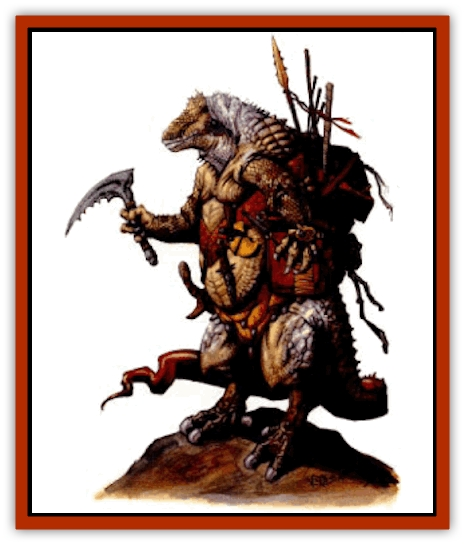

# Ssurran

| Statistic | **Ssurran** |
| --- | --- |
| **Activity Cycle:** | Any |
| **Alignment:** | Lawful neutral or lawful evil |
| **Armor Class:** | 4 |
| **Climate/Terrain:** | Any |
| **Damage/Attack:** | 1-8+4 or by weapon type |
| **Diet:** | Carnivore |
| **Frequency:** | Uncommon |
| **Hit Dice:** | 3 |
| **Intelligence:** | Average (10) |
| **Magic Resistance:** | Nil |
| **Morale:** | Average (9-10) |
| **Movement:** | 12 |
| **No. Appearing:** | 5-30 |
| **No. of Attacks:** | 1 |
| **Organization:** | Tribe |
| **Size:** | M (4-6' tall) |
| **Special Attacks:** | Bite (see below) |
| **Special Defenses:** | Half damage from fire-based attacks |
| **THAC0:** | 17 |
| **Treasure:** | R,S |
| **XP Value:** | Warrior: 270 / Shaman: 975 |

Ssurrans are nomadic, humanoid reptiles. Some are raiders while others are simple hunters. As [[Lizard_Man_Athas|lizard men]] of the desert, they have adapted to the heat of the Athasian day and are active even during the blazing mid-day heat.

Adult ssurrans are 4 to 6 feet tall, weighing from 180 to 225 pounds. There is little difference between males and females. Their skin tones range from light green to brown to red. Their faces are humanoid. but they have forked tongues. Ssurrans speak their own language that sounds like grunts, growls, and hissing. Their tails are 2 to 3 feet long and are not prehensile. Ssurrans typically dress in little more than loin cloths, bone jewelry, and armor. They usually carry weapons they have taken from past victims.

**Combat:** Ssurrans are fierce but disorganized fighters who prefer to outnumber their opponents in a fair fight. They ambush their intended victims and attack from behind as often as possible should their intended victims be greater in number than they wish to handle. They fight an opponent until that single opponent is dead, then they loot the body and mark it with their claw so they can claim it as their own food after the battle.

Ssurrans attack with either their weapons or their claws Because of their great strength and the sharpness of their claws, each claw causes 5-12 (1d8+4) points of damage. If they become desperate, they can also bite their opponents for 5-8 (1d4+4) points of damage.

For each group of 10 or more ssurrans encountered, one is a shaman/leader with maximum hit points and 3rd level clerical abilities. If 20 or more are encountered, there are two subleaders with 5 HD and 3rd level clerical abilities along with one leader with 8 HD and 6th level clerical abilties. The leader is 50% likely to be protected by 1-3 bodyguards with maximum hit points.

**Habitat/Society:** Ssurrans roam Athas, seeking shelter and food. There have been cases when multiple tribes have joined together against a common threat. These multitribal groups are led by a council of elders formed from the shaman/leaders of each tribe. There is a 50% chance that there is also one central leader who has 14 HD and 9th level clerical abilities. This leader is protected by 2-5 personal bodyguards.

Ssurrans are strict carnivores. They prefer the flesh of [[Halfling_Athas|halflings]], but prey upon any living thing they find. Ssurrans are nomadic creatures and they generally stay in one area for only a few weeks before moving on.

**Ecology:** Ssurrans have few natural enemies, but many required ones. They prey on human, demihuman and humanoid settlements whenever possible. If they capture a large number of these creatures, ssurrans hold a great feast and sacrifice the rest to their obscure gods.

Ssurran eggs are inedible, as is their flesh, but their skin is sometimes worked as scale armor (AC 6) that is resistant to heat.

**Civilized Ssurrans**

  Slavers and mercenaries often attack tribes of ssurrans in hopes of acquiring their young. Most tribes have about 25% their number in young. These young often tram as gladiators since they are exotic and their natural strength and fighting ability make them worthy combatants.

Some ssurrans earn or purchase their own freedom. They often become bodyguards to the wealthy, desert trackers, mercenaries, and even templars. The merchant houses highly seek their services as scouts because of their great survival instinct.

---
## Discovery & Documentation

**Source Publication:** Dark Sun Appendix II - Terrors Beyond Tyr (1991)
**Campaign Setting:** Dark Sun
**Author(s):** Jim Atkiss, Steve Brown, Timothy B. Brown, Andrew P. Morris, Bruce Nesmith, Wes Nicholson, Bill Slavicsek

### Other Creatures Found in This Source Book
   * [[Aarakocra_Athas|Aarakocra (Athas)]]
   * [[Animal_Domestic_Athas_II|Animal, Domestic (Athas) II]]
   * [[Aviarag|Aviarag]]
   * [[Baazrag|Baazrag]]
   * [[Baazrag_Boneclaw|Baazrag, Boneclaw]]
   * [[Bloodgrass|Bloodgrass]]
   * [[Cactus_Hunting|Cactus, Hunting]]
   * [[Cactus_Rock|Cactus, Rock]]
   * [[Cilops|Cilops]]
   * [[Crodlu|Crodlu]]
   * [[Dagorran|Dagorran]]
   * [[Dhaot|Dhaot]]
   * [[Drake_Lesser_Athas_General_Information|Drake, Lesser (Athas), General Information]]
   * [[Drake_Lesser_Athas_Magma|Drake, Lesser (Athas), Magma]]
   * [[Drake_Lesser_Athas_Rain|Drake, Lesser (Athas), Rain]]
   * [[Drake_Lesser_Athas_Silt|Drake, Lesser (Athas), Silt]]
   * [[Drake_Lesser_Athas_Sun|Drake, Lesser (Athas), Sun]]
   * [[Dray|Dray]]
   * [[Drik|Drik]]
   * [[Dune_Reaper|Dune Reaper]]
   * [[Dwarf_Athas|Dwarf (Athas)]]
   * [[Elemental_Beast_Athas_Air|Elemental Beast (Athas), Air]]
   * [[Elemental_Beast_Athas_Earth|Elemental Beast (Athas), Earth]]
   * [[Elemental_Beast_Athas_Fire|Elemental Beast (Athas), Fire]]
   * [[Elemental_Beast_Athas_Water|Elemental Beast (Athas), Water]]
   * [[Elf_Athas|Elf (Athas)]]
   * [[Fael|Fael]]
   * [[Feylaar|Feylaar]]
   * [[Fordorran|Fordorran]]
   * [[Giant_Half-giant|Giant, Half-giant]]
   * [[Giant_Shadow|Giant, Shadow]]
   * [[Golem_Athas_Magma|Golem (Athas), Magma]]
   * [[Golem_Athas_Salt|Golem (Athas), Salt]]
   * [[Golem_Athas_General_Information|Golem (Athas), General Information]]
   * [[Gorak|Gorak]]
   * [[Halfling_Athas|Halfling (Athas)]]
   * [[Human_Athas|Human (Athas)]]
   * [[Jhakar|Jhakar]]
   * [[Kaisharga|Kaisharga]]
   * [[Kes'trekel|Kes'trekel]]
   * [[Klar|Klar]]
   * [[Krag|Krag]]
   * [[Kragling|Kragling]]
   * [[Lirr|Lirr]]
   * [[Mastyrial|Mastyrial]]
   * [[Meorty|Meorty]]
   * [[Mul|Mul]]
   * [[Nikaal|Nikaal]]
   * [[Paraelemental_Beast_General_Information|Paraelemental Beast, General Information]]
   * [[Paraelemental_Beast_Magma|Paraelemental Beast, Magma]]
   * [[Paraelemental_Beast_Rain|Paraelemental Beast, Rain]]
   * [[Paraelemental_Beast_Silt|Paraelemental Beast, Silt]]
   * [[Paraelemental_Beast_Sun|Paraelemental Beast, Sun]]
   * [[Pakubrazi|Pakubrazi]]
   * [[Psionocus|Psionocus]]
   * [[Psurlon|Psurlon]]
   * [[Raaig|Raaig]]
   * [[Retriever_Obsidian|Retriever, Obsidian]]
   * [[Ruktoi|Ruktoi]]
   * [[Ruvoka_Athas|Ruvoka (Athas)]]
   * [[Sand_Howler|Sand Howler]]
   * [[Scorpion_Athas|Scorpion (Athas)]]
   * [[Seed_Brain|Seed, Brain]]
   * [[Silt_Horror_Black|Silt Horror, Black]]
   * [[Silt_Horror_Magma|Silt Horror, Magma]]
   * [[Silt_Horror_Red|Silt Horror, Red]]
   * [[Silt_Spawn|Silt Spawn]]
   * [[Slig|Slig]]
   * [[Spider_Athas|Spider (Athas)]]
   * [[Spinewyrm|Spinewyrm]]
   * [[Stalking_Horror|Stalking Horror]]
   * [[Tarek|Tarek]]
   * [[Tari|Tari]]
   * [[Thri-kreen|Thri-kreen]]
   * [[T'liz|T'liz]]
   * [[Tohr-kreen_II|Tohr-kreen II]]
   * [[Tohr-kreen_III|Tohr-kreen III]]
   * [[Trin|Trin]]
   * [[Tul'k|Tul'k]]
   * [[Undead_Athas_General_Information|Undead (Athas), General Information]]
   * [[Wraith_Athas|Wraith (Athas)]]
   * [[Xerichou|Xerichou]]
   * [[Zombie_Thinking|Zombie, Thinking]]
