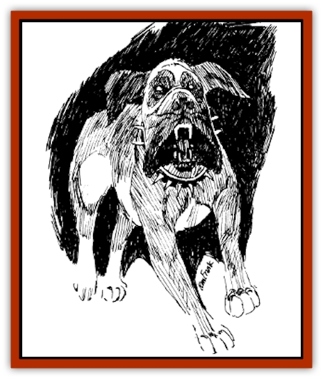

# Stalking Death

| Statistic | **Stalking Death** |
| --- | --- |
| **Activity Cycle:** | Any |
| **Alignment:** | Neutral |
| **Armor Class:** | 0 |
| **Climate/Terrain:** | Any |
| **Damage/Attack:** | 3d4/3d4/3d6 |
| **Diet:** | Carnivore |
| **Frequency:** | Very rare |
| **Hit Dice:** | 12 |
| **Intelligence:** | Genius (17-18) |
| **Magic Resistance:** | Nil |
| **Morale:** | Fearless (19-20) |
| **Movement:** | 20 |
| **No. Appearing:** | 1 |
| **No. of Attacks:** | 3 |
| **Organization:** | Solitary |
| **Size:** | L (7' long) |
| **Special Attacks:** | See below |
| **Special Defenses:** | See below |
| **THAC0:** | 9 |
| **Treasure:** | Nil |
| **XP Value:** | 4,000 |

The mere sight of this beast can freeze a man with fear. Its huge mastiff body covered with thick double coated fur is an abomination in its own right. It has been bred for the kill. It stops at nothing, until its prey is dead at its feet. Its many techniques may seem cowardly to some, but its genius dictates moves and tactics to throw its intelligent prey off guard. This beast shares many attributes with the [[Dog|dog]], but its size and jaws are more powerful than a giant croc and make its cousin much the lesser.

**Combat:** The beast, when it has been called to fight, traps its prey in a inter-dimensional space that appears to have no boundaries. The quarry cannot tell where the horizon is, where the sky starts, or where the floor ends. This off-white quasi-world is its arena. All weapons and magical items the prey may carry are brought with it into this space. There is no saving throw associated with this spacial transition. The prey hears the gut-rending roar of the stalking death's battle cry, and then sees it *blink* into existence about fifteen feet away. It immediately begins its attack.

The beast can *blink* whenever it wishes. Its genius intelligence and its excessive strength and dexterity make it an opponent none looks forward to. It has the ability to jump 30 feet straight up, or 30 feet to the side, or any combination it feels is necessary. It does not purposely jump onto an opponent from 30 feet away, if the opponent has any pole arms which might impale it. The creature's favorite attack sequence is to bite (3d6) and claw (3d4) one opponent, and then rake at another (3d4). If only one opponent is surviving, it aims all attacks at it.

If one opponent is down, it purposely stomps him for 3d8 points of damage, as it lunges for another. The DM has the option of ruling that the bones of the stomped body part are broken.

It often uses its ability to jump to keep its opponents from encircling it to attack from the back. It can jump once every other round. This beast has also been known to grab an opponent in its mouth and hold it there, causing 3d4+4 points of damage every round as it grinds its teeth into the nearly helpless prey. This may, on the DM's discretion, cause severe damage to bones, as well as a decrease in the opponent's charisma.

This creature causes itself to *blink* out of existence to view the characters for a few minutes, once its hit points are down to 70 or fewer. It *blinks* back in, once it has an opportunity it cannot pass up. It then attacks with complete surprise, attacking either the opponent's flank or its back.

The creature likes to separate its opponents into smaller groups to better its chances at defeating them. The logic behind this is that if there are fewer opponents in an area, there will be fewer strikes on him as he makes his attacks.

It sometimes leaps 30 feet away, and waits to see if its opponents attempt to charge it with a pole arm, hoping to run the beast through. It then leaps a few feet away, and immediately attacks the charger's flank. Every time it makes a kill, it takes a bite of the dead opponent, keeping all others in front of it. The beast then resumes the battle.

Once the stalking death is down to 30 or fewer hit points, it falls to the ground as though dead. It then *blinks* out of existence again, to watch its prey. If the opponents are confident in its defeat, it gains a temporary +2 to hit. After five minutes, it blinks back in at an advantageous spot, and attacks with a fury unmatched. At this point, its AC is raised from 0 to 4, but the beast gains an additional claw attack for the remainder of the battle. If the opponents manage to defeat the creature, it officially dies at -1 hit point, and the opponents are brought out of the inter-dimensional arena, back to where they started. To the opponents, the battle may have lasted a long time, but to any onlookers, they never left. Their wounds appeared suddenly, as if by magic; perhaps they even died, but of no apparent reason.

**Habitat/Society:** These creatures are so rare, no one has actually seen one and lived to tell it. The only information that can be found about these creatures is through various ancient times and from the alien wizards who inhabit Nehwon. These creatures seem to be the only known avatars of the Nehwon god Death. It is common knowledge among theological sages that Death has an avatar to do his bidding when he wishes to give his quota victims a slight chance to live. No one seems to know if there is one or more of these stalking deaths. It is assumed that if Death happened to send the stalking death for a kill, and it failed and died, he would merely create another. A few sages find this idea preposterousr claiming that it is impossible for a god of death to create life, so they believe Death raises these abominations himself.

A few sages and clerics believe the stalking death to be nothing more than a familiar for the god. They feel that the aspect of an avatar for Death is too horrid to comprehend. As one can tell, there are many theories about the relationship between Death and the stalking death. One thing everyone agrees on: there is a relationship, and both strike fear into the heads of all wise enough to know better.

---
## Discovery & Documentation

**Source Publication:** LNR1 Wonders of Lankhmar (1992)
**Campaign Setting:** Lankhmar
**Author(s):** Dale "Slade" Henson

### Other Creatures Found in This Source Book
   * [[Monolisk|Monolisk]]
   * [[Smog_Deadly|Smog, Deadly]]
   * [[Wolvern|Wolvern]]
