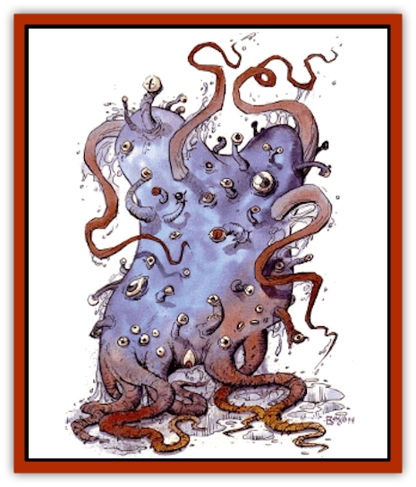

# Stalking Horror

| Statistic | **Stalking Horror** |
| --- | --- |
| **Activity Cycle:** | Night |
| **Alignment:** | Chaotic evil |
| **Armor Class:** | -3 |
| **Climate/Terrain:** | Any |
| **Damage/Attack:** | 2-16 (&times;7) |
| **Diet:** | Omnivore |
| **Frequency:** | Very rare |
| **Hit Dice:** | 18 |
| **Intelligence:** | Average (8-10) |
| **Magic Resistance:** | 25% |
| **Morale:** | Elite (15-16) |
| **Movement:** | 12 |
| **No. Appearing:** | 1 |
| **No. of Attacks:** | 7 |
| **Organization:** | Solitary |
| **Size:** | H (25' tall) |
| **Special Attacks:** | Psionics, spells, constriction, bite |
| **Special Defenses:** | +1 or better to hit, spell immunity, invisibility |
| **THAC0:** | 3 |
| **Treasure:** | Nil (E) |
| **XP Value:** | 12,000 |

**Psionics Summary**

| Level | Dis/Sci/Dev | Attack/Defense | Score | PSPs |
| --- | --- | --- | --- | --- |
| 23 | 4/6/17 | all/all | 16 | 75 |

**Psychokinesis -** *Sciences:* disintegrate, telekinesis; *Devotions:* control body, inertial barrier, molecular manipulation, opposite reaction.

**Psychometabolism -** *Science:* life detection; *Devotions:* body equilibrium, displacement, ectoplasmatic form.

**Psychoportation -** *Science:* summon planar creature; *Devotions:* astral projection, time shift, wrench.

**Telepathy -** *Sciences:* mind link, psionic blast; *Devotions:* contact, ego whip, id insinuation, mind bar, mind thrust, psionic crush, psionic drain.

The stalking horror, also known as the moonbeast, is one of the most feared creatures on Athas. Few have seen one and survived to describe it. Those who escape are usually so addlebrained that their words make little sense. The only reported sightings are on clear Athasian nights when the moons are in a specific alignment. The stalking horror is believed to be the result of some ancient summoning.

The moonbeast has a large octopoid bodv with at least 10 tentacles. Within the circle of tentacles lies its tooth-filled maw. Some witnesses report at least three rows of needle-sharp fangs inside. Its bulbous body is covered with 36 eye stalks, each a foot long. They give the beast 360-degree vision. It can retract the stalks to protect its eyes as it oozes through tight spaces.

The tentacles are lined with hooks that it uses to grip and rend. They provide the primary means of locomotion for the beast. It reaches ahead with several tentacles and pulls its bulbous body behind it.

Its skin is a mottled gray and is covered with a slimy secretion. Both the slime and its amorphous body allow the beast to pull itself through openings as small as a human-sized doorway. Its tentacles, which can be up to 20 feet long, have the strength to tear apart buildings.

**Combat:** These monsters are absolutely devastating in combat and have been known to destroy entire towns. The remains of herds of [[Animal_Domestic_Athas_I|kanks]], [[Erdland|erdland]], and even [[Animal_Domestic_Athas_I|mekillots]] have been found completely decimated by these voracious eaters.

Though the moon beast is usually invisible, its bulk causes a great deal of noise and vibrations, making surprise nearly impossible. The stalking horror always shows its true form before attacking.

In melee, the stalking horror has many attack forms available. The beast can use as many as 7 of its tentacles to attack during melee, each causing 2-16 (2d8) points of damage per strike. Any attack four or more greater than the THAC0 indicates that the victim has been grabbed by the tentacle. It can then constrict for an additional 1-10 (1d10) points of damage per round. Any creature caught in a tentacle has a chance of having at least one limb pinned. If a creature is grabbed, roll percentile dice. The results are as follows: one arm (1-25 left, 26-50 right), no arms (51-75), or both arms (76-100) pinned. A constricted character cannot cast spells, but can attack the tentacle (if only one hand is free the character attacks at -3). The vice-like grip of the tentacles is so strong that no creature can force them open, regardless of its strength. The tentacle must be severed to free the victim. Each tentacle must suffer 12 points of damage from a slashing or piercing weapon before it is severed.

The toothy mouth of these creatures is devastating in combat, capable of causing 3-30 (3d10) points of damage per attack. The beast can only bite creatures held in its tentacles. In this case the bite is in addition to other melee attacks. Also, the stalking horror has limited magic resistance (25%) and is immune to all spells less than 3rd level.

The stalking horror has the innate ability to use defiler magic. These magical abilities require no verbal, semantic, or material components. The creature can cast *wall of fog*, *fog cloud*, *mirror image*, *dispel magic*, *fireball*, *lightning bolt*, *spectral force*, *(Evard's) black tentacles*, *ice storm*, *cloudkill*, and *chain lightning* once per day. All spells cast from the creature should be considered as cast by a 12th-level defiler. They have the appropriate effect on the surrounding terrain.

The stalking horror constantly emits an aura of *fear*. All creatures within 60 feet of the moonbeast must make a successful save vs. paralyzation or be frozen in terror. This effect lasts for 2d6 rounds, during which the victim cannot run, attack, cast spells, or use psionics.

The stalking horror also has extraordinary psionic abilities. Among its favored psionic attack forms are life draining, phobia amplification, and time shift. Frequently, the moonbeast uses the phobia amplification to intensify the horror a victim feels when affected by the aura of *fear*. Any creature subject to both attack forms, provided they fail their initial save, must make a system shock roll. Failure means the victim goes into shock and babbles incoherently for 1-6 (1d6) weeks. After this time the victim remembers nothing of the encounter with the moonbeast.

**Habitat/Society:** The moonbeast remains dormant for months or even years at a time. But when the moons of Athas are in the right configuration, the beast awakens from its dormancy to feed on the creatures of Athas. The moonbeast leaves its lair only at night, only to feed, and does so invisibly.

When dormant, the moonbeast uses its psionic discipline to astral project itself to its home plane. It spends all its time projecting itself where it last remembers being "happy". The beast stops projecting long enough to rest and regain its PSPs, then returns to the Astral Plane. But when the moons are in the right configuration, it triggers something in the creature that brings it out of its trance to feed. It eats almost anything animal. Its diet, however, is very unusual: it eats only the bones of its victims, leaving the rest of the body behind. It wails its anger and frustration at having its physical form stranded with no means to take itself back home.

The stalking horror prefers to lair away from civilization in caves and ruins that have long been abandoned. This allows the creature the time to meditate and rest without being disturbed. Stalking horrors position their lairs in very defensible locations.

**Ecology:** While the stalking horror eats almost anything, it has no natural predators. Its flesh is unpalatable to beings on the Prime Material Plane. Eating the flesh of the moonbeast causes nausea and hallucinations that last 2d4 hours after which the consumer falls into a deep coma for 1d4 days. During that time the consumer has horrifying dreams of a gray and misty world with bizarre and mutated creatures that slither and crawl across the sparse landscape.

Though the flesh cannot be eaten, the hide of the creature makes excellent armor and shields. If properly treated, the hide can make leather armor with an effective AC 5. It also gives its wearer a +1 bonus on saving throws for all spells of 1st and 2nd level. Few merchants are aware of the value of the hide, since few moonbeasts have ever been killed.

**Moonbeast Magical Items**

  The moonbeast also stalks prey that have magical items strongly linked to the beast's summoning. Each horror has at least one item to which it is bonded. These items can range from jewelry to weapons to sculptures, but they have several things in common. First, each item has a gemstone of not less than 500 gp value as an element of its construction. Second, these items have at least one powerful magical property, such as *wall of fog*, *fog cloud*, *dispel magic*, *fireball*, *lightning bolt*, *(Evard's) black tentacles* or *cloudkill*. This power can be used once per day. The possessor of the item has 25% magic resistance. If the item is a weapon, it may have an enchantment of as much as +2. This item cannot harm the stalking horror to which it is linked. It may, however, be used against other stalking horrors.

These items also have some horrifying side effects. The owner of the item becomes very possessive of the item. The possessor attempts to stay in physical contact with the item at all times and becomes violent if it is forcibly removed. Anyone possessing such an item gradually becomes a creature of the night. After possessing the item for one continuous month, the possessor suffers a -1 penalty to all attack rolls, ability checks, and saving throws while in sunlight. The same rolls receive a +1 bonus if the character is bathed in the light of the full moon.

Characters possessing these items may carry them for years before they discover their deadly link to a moonbeast. Once the moonbeast has awakened and sated its appetite, it seeks out and attempts to destroy the individual possessing the item. If the moonbeast succeeds, it leaves the item for someone else to find. One sage has speculated that the moonbeast leaves the item, then returns to destroy its possessor as revenge for being summoned to Athas.

---
## Discovery & Documentation

**Source Publication:** Dark Sun Appendix II - Terrors Beyond Tyr (1991)
**Campaign Setting:** Dark Sun
**Author(s):** Jim Atkiss, Steve Brown, Timothy B. Brown, Andrew P. Morris, Bruce Nesmith, Wes Nicholson, Bill Slavicsek

### Other Creatures Found in This Source Book
   * [[Aarakocra_Athas|Aarakocra (Athas)]]
   * [[Animal_Domestic_Athas_II|Animal, Domestic (Athas) II]]
   * [[Aviarag|Aviarag]]
   * [[Baazrag|Baazrag]]
   * [[Baazrag_Boneclaw|Baazrag, Boneclaw]]
   * [[Bloodgrass|Bloodgrass]]
   * [[Cactus_Hunting|Cactus, Hunting]]
   * [[Cactus_Rock|Cactus, Rock]]
   * [[Cilops|Cilops]]
   * [[Crodlu|Crodlu]]
   * [[Dagorran|Dagorran]]
   * [[Dhaot|Dhaot]]
   * [[Drake_Lesser_Athas_General_Information|Drake, Lesser (Athas), General Information]]
   * [[Drake_Lesser_Athas_Magma|Drake, Lesser (Athas), Magma]]
   * [[Drake_Lesser_Athas_Rain|Drake, Lesser (Athas), Rain]]
   * [[Drake_Lesser_Athas_Silt|Drake, Lesser (Athas), Silt]]
   * [[Drake_Lesser_Athas_Sun|Drake, Lesser (Athas), Sun]]
   * [[Dray|Dray]]
   * [[Drik|Drik]]
   * [[Dune_Reaper|Dune Reaper]]
   * [[Dwarf_Athas|Dwarf (Athas)]]
   * [[Elemental_Beast_Athas_Air|Elemental Beast (Athas), Air]]
   * [[Elemental_Beast_Athas_Earth|Elemental Beast (Athas), Earth]]
   * [[Elemental_Beast_Athas_Fire|Elemental Beast (Athas), Fire]]
   * [[Elemental_Beast_Athas_Water|Elemental Beast (Athas), Water]]
   * [[Elf_Athas|Elf (Athas)]]
   * [[Fael|Fael]]
   * [[Feylaar|Feylaar]]
   * [[Fordorran|Fordorran]]
   * [[Giant_Half-giant|Giant, Half-giant]]
   * [[Giant_Shadow|Giant, Shadow]]
   * [[Golem_Athas_Magma|Golem (Athas), Magma]]
   * [[Golem_Athas_Salt|Golem (Athas), Salt]]
   * [[Golem_Athas_General_Information|Golem (Athas), General Information]]
   * [[Gorak|Gorak]]
   * [[Halfling_Athas|Halfling (Athas)]]
   * [[Human_Athas|Human (Athas)]]
   * [[Jhakar|Jhakar]]
   * [[Kaisharga|Kaisharga]]
   * [[Kes'trekel|Kes'trekel]]
   * [[Klar|Klar]]
   * [[Krag|Krag]]
   * [[Kragling|Kragling]]
   * [[Lirr|Lirr]]
   * [[Mastyrial|Mastyrial]]
   * [[Meorty|Meorty]]
   * [[Mul|Mul]]
   * [[Nikaal|Nikaal]]
   * [[Paraelemental_Beast_General_Information|Paraelemental Beast, General Information]]
   * [[Paraelemental_Beast_Magma|Paraelemental Beast, Magma]]
   * [[Paraelemental_Beast_Rain|Paraelemental Beast, Rain]]
   * [[Paraelemental_Beast_Silt|Paraelemental Beast, Silt]]
   * [[Paraelemental_Beast_Sun|Paraelemental Beast, Sun]]
   * [[Pakubrazi|Pakubrazi]]
   * [[Psionocus|Psionocus]]
   * [[Psurlon|Psurlon]]
   * [[Raaig|Raaig]]
   * [[Retriever_Obsidian|Retriever, Obsidian]]
   * [[Ruktoi|Ruktoi]]
   * [[Ruvoka_Athas|Ruvoka (Athas)]]
   * [[Sand_Howler|Sand Howler]]
   * [[Scorpion_Athas|Scorpion (Athas)]]
   * [[Seed_Brain|Seed, Brain]]
   * [[Silt_Horror_Black|Silt Horror, Black]]
   * [[Silt_Horror_Magma|Silt Horror, Magma]]
   * [[Silt_Horror_Red|Silt Horror, Red]]
   * [[Silt_Spawn|Silt Spawn]]
   * [[Slig|Slig]]
   * [[Spider_Athas|Spider (Athas)]]
   * [[Spinewyrm|Spinewyrm]]
   * [[Ssurran|Ssurran]]
   * [[Tarek|Tarek]]
   * [[Tari|Tari]]
   * [[Thri-kreen|Thri-kreen]]
   * [[T'liz|T'liz]]
   * [[Tohr-kreen_II|Tohr-kreen II]]
   * [[Tohr-kreen_III|Tohr-kreen III]]
   * [[Trin|Trin]]
   * [[Tul'k|Tul'k]]
   * [[Undead_Athas_General_Information|Undead (Athas), General Information]]
   * [[Wraith_Athas|Wraith (Athas)]]
   * [[Xerichou|Xerichou]]
   * [[Zombie_Thinking|Zombie, Thinking]]
