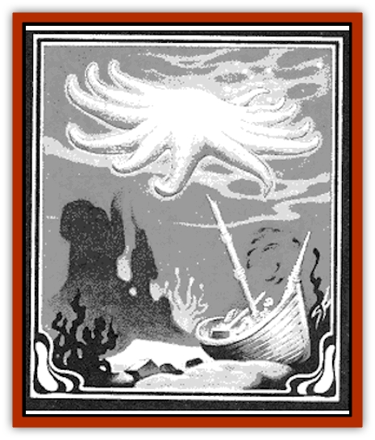
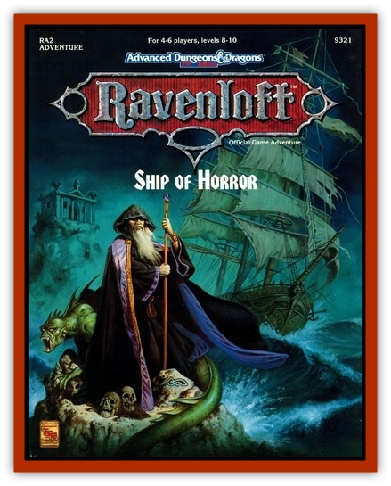

# Starfish - Giant

| Statistic | **Starfish, Giant** |
| --- | --- |
| **Activity Cycle:** | Any |
| **Alignment:** | Chaotic neutral |
| **Armor Class:** | 2 |
| **Climate/Terrain:** | Any saltwater |
| **Damage/Attack:** | 1-10 per ray |
| **Diet:** | Carnivore |
| **Frequency:** | Uncommon |
| **Hit Dice:** | 11 or 13 |
| **Intelligence:** | Low (5-7) |
| **Magic Resistance:** | Nil |
| **Morale:** | Steady (11-12) |
| **Movement:** | 6, Sw 30 |
| **No. Appearing:** | 1-2 |
| **No. of Attacks:** | 1-10 or 1-12 |
| **Organization:** | Solitary |
| **Size:** | G (20-75' across) |
| **Special Attacks:** | See below |
| **Special Defenses:** | Half damage from blunt weapons |
| **THAC0:** | 9 or 7 |
| **Treasure:** | Z |
| **XP Value:** | 2,000 |

The giant starfish is a cousin of the normal, ocean-dwelling starfish. It has a central body of ten or 12 rays radiating from the center, the undersides of which are covered with sticky suckers. Giant starfish have been reported in a wide variety of colors but seem to be limited to tan, orange, yellow, pink and red, ranging from pale pastel hues to vibrant, almost glowing colors.

Giant starfish have been sighted in all the large oceans of Oerth, Krynn, Toril and Ravenloft, as well as in many other worlds. A freshwater variety of giant starfish is rumored to inhabit large inland lakes on many worlds.

**Combat:** Upon sighting a ship, a giant starfish maneuvers itself to approach the ship from the bottom. The typically streamlined bottom surfaces of ships allow the starfish an acceptable surface to grapple and a relatively concealed approach. If necessary, a starfish will follow a ship for miles or maneuver hundreds of yards out of the path of the ship in orderto gain a satisfactory trajectory approach. As it closes, it assumes attack position and attempts to hit the ship.

If the attack is successful, the starfish has grappled the ship. There is a 50% chance that this grappling attack results in extreme damage to the ship as follows (roll 1d6): 1 = hole in deck, 2 = hole in hull above water line, 3 = hole in hull below water line, 4 = mast breaks (choose randomly), 5 = ship shaken (anyone not sitting down or tied down must roll a successful Dexterity check or be thrown to the deck), 6 = 1d4 crew knocked overboard.

Once a starfish has grappled a ship, it attempts to pry open the hull in search of food (any creatures) inside. The starfish begins to tear at the hull with all its rays. The DM should record the damage inflicted by each ray; any ray inflicting cumulative damage causes a result from the above list (roll 1d6 again).

The starfish's rubbery rays suffer normal damage from all attacks except blunt weapons, from which it suffers only half damage. Starfish with ten rays have 11 HD and starfish with 12 rays have 13 HD - one HD per ray and another for the center. When rolling hit points for a starfish, the DM should record seperately the number of hit points for each ray and the center.  If a character delcares that he is attempting to chop off a ray and has an appropriate slashing weapon (attacks from arrows or blunt weapons cannot sever a ray), the ray should be considered severed once it has lost all its hit points.  If attacks are made randomly, they strike the center and rays randomly.  If a ray loses all its hit points to attacks that do not sever it, that ray is considered dead - it hangs limp and can no longer attack.

A ten-ray starfish retreats if four of its rays are severed. A 12-ray starfish retreats if five of its rays are severed.

When the starfish retreats, it attempts to carry meals away with it. The starfish can carry one victim per still-functioning ray.

In addition to hull attacks, starfish are likely to choose to attack persons on deck. A starfish will someimes approach a ship without attacking, instead attempting to grab as many persons as possible and retreating with its catch.

**Habitat/Society:** Starfish wander the oceans in search of meals. They eat a variety of life forms, but they have learned that passing ships are almost always portable buffet tables holding a pleasing selection of tidbits. Ships, they have learned, almost always guarantee a meal and are worth the effort to capture. Starfish prefer ship-grazing to other hunting methods.

Giant starfish make their lairs in large caves and underwater trenches, storing any treasure or extra food in crevices and niches. Other underwater creatures tend to avoid these lairs, since giant starfish are efficient eating machines.

**Ecology:** Giant starfish exist in a manner similar to their smaller waterborne cousins. Ten- and 12-ray starfish never cross-breed. Rays that are lost are regenerated in 1d4 months. Other injuries heal normally.

---
## Discovery & Documentation

**Source Publication:** RA2 Ship of Horrors (1990)
**Campaign Setting:** Ravenloft
**Author(s):** Anne Brown, Mike Breault
