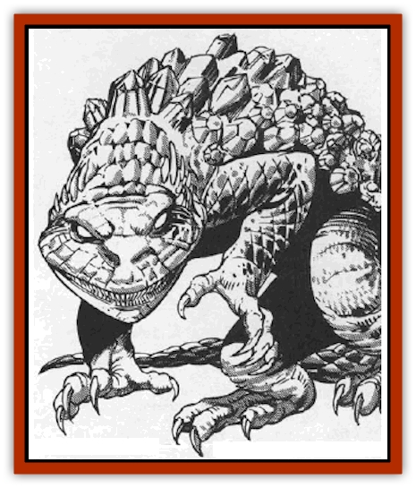

# Stargazer

| Statistic | **Stargazer** |
| --- | --- |
| **Activity Cycle:** | Diurnal |
| **Alignment:** | Chaotic neutral |
| **Armor Class:** | -2 (8) |
| **Climate/Terrain:** | Wildspace/asteroids |
| **Damage/Attack:** | 1d8/1d8/4d6 |
| **Diet:** | Carnivore |
| **Frequency:** | Uncommon |
| **Hit Dice:** | 6+2 |
| **Intelligence:** | Low (5-7) |
| **Magic Resistance:** | Nil |
| **Morale:** | Steady (12-13) |
| **Movement:** | 12, Roll 24 |
| **No. Appearing:** | 1-2 |
| **No. of Attacks:** | 3 (1) |
| **Organization:** | Solitary |
| **Size:** | L (18' tall) |
| **Special Attacks:** | Electric bolt (5d6&times;2) |
| **Special Defenses:** | Stone hide |
| **THAC0:** | 15 |
| **Treasure:** | See below |
| **XP Value:** | 3,000 |

The stargazer is a large, four-legged reptilian asteroid-dweller. Its rocky skin mimics crystalline outcroppings, giving it an AC of -2.

The stargazer is often mistaken for a large lump of precious stone amid a larger stone formation or on the ground. The stony, gemlike carapace hides a frog-like mouth lined with razor-sharp teeth, as well as four sharp claws which are kept folded under the stargazer's body.

The hide absorbs sunlight, both to warm the beast's body and to power the beast's main weapon, lightning discharges. Hides show a variety of colors and crystalline formations, but generally they are reddish or violet, suggesting deposits of ruby or amethyst. Citrine, emerald and sapphire varieties are also seen.

**Combat:** The stargazer uses its carapace as a blind, imitating an outcropping of precious stone. Wandering animals or greedy adventurers entranced with their find receive a "shocking" surprise.

When the stargazer senses prey (25' range), twin lightning bolts leap from its eyes, doing 6d6 electrical damage per bolt; the bolts can fire independently at different targets. It then raises itself from its shallow hiding space and lunges toward the victim, biting (4d6) and rending with claws (1d8). It can loose up to six lightning bolts, two per round, before stopping to recharge.

If the stargazer is losing a battle, it rolls itself into a ball, stone shell outward, protecting its soft underside (AC 8). It rolls in a random direction to escape its tormentor. Roll a 1d12 to determine the direction the beast escapes in; numbers on the die correspond to positions on a clock face. Those in the indicated direction must save vs. breath weapon. Those who fail the saving throw are run over. Victims caught by this rolling action suffer 4d6 crushing damage.

**Habitat/Society:** Stargazers live on the sunny sides of large asteroids, basking in the continual sunlight. They are solitary, mating quickly, hiding their eggs, and abandoning them. Stargazers are territorial, guarding a range of 1-3 square miles. Two stargazers may occupy opposite hemispheres of a single asteroid, establishing the opposite sides of the gravity plane as their "territory".

In mating season stargazers may duel to the death over territory, mates, and prey. If an area is overpopulated, the stargazer uses its powerful hind legs to leap from the asteroid. It then rolls into a ball, to drift through space in hibernation until caught by the gravity of another asteroid or a shipload of greedy spelljammers. The advent of spelljamming humanoids has enlarged their range.

**Ecology:** The stargazer is a voracious killer, prone to berserker rages against large opponents. The monster is its own treasure; specifically, the carapace is actually an organic form of the crystal that it most resembles. There is one drawback: Unless treated with a *permanency* spell, the carapace crumbles to dust 1d6 days after the stargazer's death. Jewelers can cut magically treated stargazer shells to produce 1d6 gems of (4d6+1)x1000 gp each.

---
## Discovery & Documentation

**Source Publication:** MC9 Spelljammer Appendix II (1991)
**Campaign Setting:** Planescape
**Author(s):** Scott Davis, Newton Ewell, John Terra

### Other Creatures Found in This Source Book
   * [[Alchemy_Plant|Alchemy Plant]]
   * [[Allura|Allura]]
   * [[Aperusa|Aperusa]]
   * [[Autognome|Autognome]]
   * [[Bionoid|Bionoid]]
   * [[Bloodsac|Bloodsac]]
   * [[Buzzjewel|Buzzjewel]]
   * [[Constellate|Constellate]]
   * [[Contemplator|Contemplator]]
   * [[Dohwar|Dohwar]]
   * [[Dragon_Moon|Dragon, Moon]]
   * [[Dragon_Stellar|Dragon, Stellar]]
   * [[Dragon_Sun|Dragon, Sun]]
   * [[Dreamslayer|Dreamslayer]]
   * [[Dweomerborn|Dweomerborn]]
   * [[Fal|Fal]]
   * [[Feesu|Feesu]]
   * [[Fire_Bat|Fire Bat]]
   * [[Firebird|Firebird]]
   * [[Firelich|Firelich]]
   * [[Flowfiend|Flowfiend]]
   * [[Gadabout|Gadabout]]
   * [[Gammaroid|Gammaroid]]
   * [[Gonn|Gonn]]
   * [[Gossamer|Gossamer]]
   * [[Grav|Grav]]
   * [[Great_Dreamer|Great Dreamer]]
   * [[Greatswan|Greatswan]]
   * [[Grell_Colonial|Grell, Colonial]]
   * [[Gullion|Gullion]]
   * [[Insectare|Insectare]]
   * [[Lhee|Lhee]]
   * [[Mercurial_Slime|Mercurial Slime]]
   * [[Meteorspawn|Meteorspawn]]
   * [[Monitor|Monitor]]
   * [[Owl_Space|Owl, Space]]
   * [[Pristatic|Pristatic]]
   * [[Scro|Scro]]
   * [[Selkie_Star|Selkie, Star]]
   * [[Silatic|Silatic]]
   * [[Skullbird|Skullbird]]
   * [[Sleek|Sleek]]
   * [[Sluk|Sluk]]
   * [[Space_Swine|Space Swine]]
   * [[Sphinx_Astro-|Sphinx, Astro-]]
   * [[Spirit_Warrior|Spirit Warrior]]
   * [[Starfly_Plant|Starfly Plant]]
   * [[Undead_Stellar|Undead, Stellar]]
   * [[Witchlight_Marauder|Witchlight Marauder]]
   * [[Xixchil|Xixchil]]
   * [[Yitsan|Yitsan]]
   * [[Zurchin|Zurchin]]
