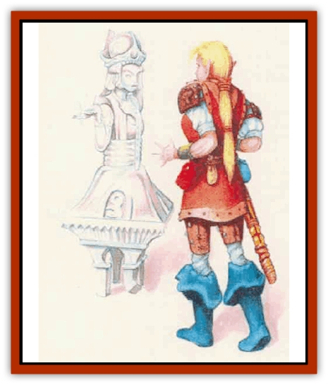

# Statue - Living

| Statistic | **Crystal** | **Iron** | **Jade** | **Rock/Ooze** | **Silver** | **Steel** |
| --- | --- | --- | --- | --- | --- | --- |
| **Activity Cycle:** | Any | Any | Any | Any | Any | Any |
| **Alignment:** | Neutral | Neutral | Neutral | Neutral | Neutral | Neutral |
| **Armor Class:** | 4 | 2 | 4 | 4 | 4 | 1 |
| **Climate/Terrain:** | Any | Any | Any | Any | Any | Any |
| **Damage/Attack:** | 1d6 (fist)/1d6 (fist) | 1d8 (fist)/1d8 (fist) | 1d6 (fist)/1d6 (fist) | 2d6 fist)/2d6 (fist) | 2d4 (bite) | 1d8 (fist)/1d8 (fist) |
| **Diet:** | Nil | Nil | Nil | Nil | Nil | Nil |
| **Frequency:** | Very rare | Very rare | Very rare | Very rare | Very rare | Very rare |
| **Hit Dice:** | 3 | 4 | 3+1 | 5 | 1+1 | 5 |
| **Intelligence:** | Low (5-7) | Low (5-7) | Low (5-7) | Low (5-7) | Low (5-7) | Low (5-7) |
| **Magic Resistance:** | Nil | Nil | Nil | Nil | Nil | Nil |
| **Morale:** | Fearless (20) | Fearless (20) | Fearless (20) | Fearless (20) | Fearless (20) | Fearless (20) |
| **Movement:** | 9 | 3 | 6 | 6 | 12 | 3 |
| **No. Appearing:** | 1d6 | 1d4 | 1d6 | 1d8 | 2d6 | 1d4 |
| **No. of Attacks:** | 2 | 2 | 2 | 2 | 1 | 2 |
| **Organization:** | Solitary | Solitary | Solitary | Solitary | Solitary | Solitary |
| **Size:** | M (6' tall) | L (8-10' tall) | M (6' tall) | L (9' tall) | T (1' tall) | M (6' tall) |
| **Special Attacks:** | Nil | Nil | Nil | Squirt | Nil | Nil |
| **Special Defenses:** | See below | See below | See below | See below | See below | See below |
| **THAC0:** | 17 | 17 | 17 | 15 | 19 | 15 |
| **Treasure:** | Nil | Nil | Nil | Nil | Nil | Nil |
| **XP Value:** | 120 | 420 | 270 | Rock: 420 / Ooze: 650 | 120 | 650 |

The living statues of Mystara are magically created and animated creatures similar to the enchanted [[Golem_General_Information|golems]] found on other worlds.

Living statues are almost always made in humanoid form, though other forms are possible. Unless it moves, a living statue looks just like a normal statue made from stone, crystal or metal.

**Combat:** Living statues are immune to *charm*, *sleep* and *hold* spells. They cannot be poisoned and are impervious to disease and suffocation.

Living statues are not brilliant thinkers or tacticians; however, their modest intelligence allows them to fight sensibly and effectively. Left to their own wits, living statues usually stand stock still, pretending to be normal statues until they have a chance to ambush unwary opponents. Most statues recognize spellcasters and try to neutralize them first. Living statues also are capable of following reasonably complex orders and using their intelligence to alter them if the circumstances warrant. Most living statues unse their fists to batter opponents. They are not dexterous enough to use weapons effectively but can be ordered to employ some implements if such are required to complete a task. A group of living statues guarding a castle entrance, for example, might dump a barrel of flammable oil, light it, lower the castle's portcullis, and sound an alarm gong if attacked.

*Crystal:* Crystal living statues are the weakest of the living statues. Note that crystal living statues are magical constructs; and as such are not subject to damage from shatter spells.

*Iron:* Iron living statues have bodies that can absorb metal. They take full damage from normal weapons, but if they are struck with a nonmagical metal weapon then that weapon becomes stuck in the statue unless the attacker makes a successful saving throw vs. spell. The weapon can be removed only if the statue is killed. Weapons left in a statue are absorbed during the next 1d4 days, and any of the weapon's nonmetallic parts are expelled.

*Jade:* Jade living statues make all their saving throws as if they were 10th-level fighters. They are immune to nonmagical weapons and even magical weapons confer no bonuses to attack or damage rolls when used against them. When destroyed in combat, they crumble to worthless dust.

*Rock:* Rock living statues are hollow. A rock living statue is filled with fiery magma which it squirts from its fingertips (range 5/10/15). The living statue makes a normal attack roll for the magma, which it can use on one victim per round; anyone hit by the magma takes 2d6 points of damage. When destroyed, a rock living statue splits open, forming a pool of magma 30 feet across. Creatures caught in the pool suffer 2d6 points of damage (half that if they can make a successful saving throw vs. breath weapon).

*Ooze:* Ooze living statues are hollow and filled with [[Ooze_Slime_Jelly_II|gray ooze]] which the statue squirts in the same fashion as a rock living statue does its magma. When the ooze hits, it forms a small, immobile blob with 4 hit points and an Armor Class of 8. Each blob inflicts 2d4 point of damage to the victim each round until the blob is killed. A blob can dissolve metal, just like a normal gray ooze, destroying chain mail in one round and plate mail in two; magical armor lasts one additional round for each point of magical protection it offers. When killed, a ooze living statue splits open, releasing a gray ooze with 3 Hit Dice and all the normal gray ooze abilities.

*Silver:* SiIver living statues are immune to nonmagical weapons and normal fire. They take half damage from enchanted slashing or piercing (type S or P) weapons and are immune to nonmetal weapons, enchanted or not. Since their tiny fists are ineffective as weapons, silver living statues attack by biting.

*Steel:* Steel living statues are immune to nonmagical iron or steel weapons; such a weapon striking a steel living statue automatically becomes stuck in it. On the following round, the statue absorbs the weapon, regaining 1d4+1 lost hit points in the process. Enchanted weapons of all types are immune to the statue's absorption power and cause normal damage; however, the weapon still sticks and the attacker must make an open doors roll to free the weapon quickly. If the roll fails, the attacker recovers the weapon but loses any further attacks that might have been possible that round and suffers a +2 initiative penalty during the next round.

**Habitat/Society:** Living statues can be found anywhere there are (or were) spell casters to create them. Generally, they are found in castles or ruins where they serve as guards or servants. As magical constructs, living statues have no society. They exist only to serve their creators. Though they have no treasure of their own, they often serve as untiring guardians for tombs or hidden treasure caches.

**Ecology:** Living statues have no need to eat, drink, breathe, or sleep. Like golems, they are created from an artificial body which has been animated with an elemental spirit. Any spell caster of 9th level or higher can create a living statue, provided that the proper spells and materials are available. Even though some of the required spells are beyond the capabilities of any 9th-level character, such a character can still create a living statue if the necessary spells are available on scrolls. Basic construction times and costs are given on the table below:

| Statue | Construction Time | Cost |
| --- | --- | --- |
| Crystal | Three months | 7,500 |
| Iron | Five months | 10,000 |
| Jade | Four months | 8,000 |
| Ooze | Five months | 12,500 |
| Rock | Four months | 12,500 |
| Silver | Two months | 3,000 |
| Steel | Six months | 10,000 |

To construct a living statue, a wizard or priest must hire a skilled sculptor or metalsmith to create an image suitable for enchantment. During construction, the character must cast several spells over the work. A wizard must cast *geas*, *conjure elemental*, *fabricate*, *friends*, and *suggestion*. A priest must cast *quest*, *animate object*, *prayer*, *raise dead*, and *command*. In all cases, materials used in the statue must be genuine; magically created materials will not work.

*Crystal:* Although rare and valuable crystals such as diamond can be used, the statue can be constructed from quartz or other common crystal. The crystal must be free from obvious flaws and cracks. A single, human-sized slab is required.

*Iron:* The statues must be forged from pure wrought iron made from newly smelted ore.

*Jade:* Though gem-quality jade can be used, it is not necessary. A single, human sized slab of common stone free from obvious flaws is all that is required.

*Rock/Ooze:* The sculptor must create seven sections - two arms, two legs, a head, a back piece, and a breast piece - and fit them together. The magma or gray ooze is held in the hollow body and flows through channels cut in the arms.

To complete the construct, the character must supply 10 pounds of maema taken from the heart of a volcano or a live gray ooze, depending on which type of construct is being attempted.

*Silver:* The finished construct has a thick skin of pure silver (worth 50 gold pieces) that can be recovered if the creature is killed.

*Steel:* The metal for the construct must be the finest quality steel, including the steel from at least one steel weapon that has been blodied (used to kill an opponent) in combat.

---
## Discovery & Documentation

**Source Publication:** Mystara Appendix (1994)
**Campaign Setting:** Mystara
**Author(s):** John Nephew, Teeuwynn Woodruff, John Terra, Skip Williams

### Other Creatures Found in This Source Book
   * [[Actaeon|Actaeon]]
   * [[Agarat|Agarat]]
   * [[Ash_Crawler|Ash Crawler]]
   * [[Baldandar|Baldandar]]
   * [[Bargda|Bargda]]
   * [[Bhut|Bhut]]
   * [[Bird_Mystara|Bird (Mystara)]]
   * [[Blackball|Blackball]]
   * [[Choker|Choker]]
   * [[Coltpixie|Coltpixie]]
   * [[Crone_of_Chaos|Crone of Chaos]]
   * [[Darkhood|Darkhood]]
   * [[Darkwing|Darkwing]]
   * [[Decapus|Decapus]]
   * [[Deep_Glaurant|Deep Glaurant]]
   * [[Diabolus|Diabolus]]
   * [[Dimensional_Warper|Dimensional Warper]]
   * [[Dragon_Mystara_Crystalline|Dragon (Mystara), Crystalline]]
   * [[Dragon_Mystara_Jade|Dragon (Mystara), Jade]]
   * [[Dragon_Mystara_Onyx|Dragon (Mystara), Onyx]]
   * [[Dragon_Mystara_Ruby|Dragon (Mystara), Ruby]]
   * [[Drake_Mystara|Drake (Mystara)]]
   * [[Dragonfly|Dragonfly]]
   * [[Dusanu|Dusanu]]
   * [[Elemental_of_Chaos_Air_Earth|Elemental of Chaos, Air/Earth]]
   * [[Elemental_of_Chaos_Fire_Water|Elemental of Chaos, Fire/Water]]
   * [[Elemental_of_Law_Air_Earth|Elemental of Law, Air/Earth]]
   * [[Elemental_of_Law_Fire_Water|Elemental of Law, Fire/Water]]
   * [[Familiar_Mystara|Familiar (Mystara)]]
   * [[Frost_Salamander|Frost Salamander]]
   * [[Fundamental_Air_Earth|Fundamental, Air/Earth]]
   * [[Fundamental_Fire_Water|Fundamental, Fire/Water]]
   * [[Gargantua_Mystara|Gargantua (Mystara)]]
   * [[Geonid|Geonid]]
   * [[Ghostly_Horde|Ghostly Horde]]
   * [[Giant_Athach|Giant, Athach]]
   * [[Giant_Hephaeston|Giant, Hephaeston]]
   * [[Golem_Drolem|Golem, Drolem]]
   * [[Golem_Mystara_I|Golem (Mystara) I]]
   * [[Golem_Mystara_II|Golem (Mystara) II]]
   * [[Golem_Mystara_III|Golem (Mystara) III]]
   * [[Gray_Philosopher|Gray Philosopher]]
   * [[Guardian_Warrior|Guardian Warrior]]
   * [[Gyerian|Gyerian]]
   * [[Herex|Herex]]
   * [[Hivebrood|Hivebrood]]
   * [[Horde|Horde]]
   * [[Hsiao|Hsiao]]
   * [[Huptzeen|Huptzeen]]
   * [[Hutaakan|Hutaakan]]
   * [[Imp_Mystara|Imp (Mystara)]]
   * [[Jellyfish_Giant_Mystara|Jellyfish, Giant (Mystara)]]
   * [[Kna|Kna]]
   * [[Kopru|Kopru]]
   * [[Lizard_Mystara|Lizard (Mystara)]]
   * [[Lizard-kin_Mystara|Lizard-kin (Mystara)]]
   * [[Lupin|Lupin]]
   * [[Lycanthrope_Werejaguar_Mystara|Lycanthrope, Werejaguar (Mystara)]]
   * [[Lycanthrope_Wereswine|Lycanthrope, Wereswine]]
   * [[Magen|Magen]]
   * [[Manikin|Manikin]]
   * [[Mek|Mek]]
   * [[Mujina|Mujina]]
   * [[Nagpa|Nagpa]]
   * [[Neh-thalggu|Neh-thalggu]]
   * [[Nightshade_Mystara|Nightshade (Mystara)]]
   * [[Nuckalavee|Nuckalavee]]
   * [[Pegataur|Pegataur]]
   * [[Phanaton|Phanaton]]
   * [[Plant_Dangerous_Mystara|Plant, Dangerous (Mystara)]]
   * [[Plasm|Plasm]]
   * [[Rakasta|Rakasta]]
   * [[Rock_Man|Rock Man]]
   * [[Sabreclaw|Sabreclaw]]
   * [[Sacrol|Sacrol]]
   * [[Scamille|Scamille]]
   * [[Shapeshifter|Shapeshifter]]
   * [[Shargugh|Shargugh]]
   * [[Shark-kin|Shark-kin]]
   * [[Sollux|Sollux]]
   * [[Spectral_Death|Spectral Death]]
   * [[Spectral_Hound|Spectral Hound]]
   * [[Spider-kin|Spider-kin]]
   * [[Spirit_Mystara|Spirit (Mystara)]]
   * [[Surtaki|Surtaki]]
   * [[Tabi|Tabi]]
   * [[Thoul|Thoul]]
   * [[Thunderhead|Thunderhead]]
   * [[Tiger_Ebon|Tiger, Ebon]]
   * [[Topi|Topi]]
   * [[Tortle|Tortle]]
   * [[Vampire_Velya|Vampire, Velya]]
   * [[White_Fang|White Fang]]
   * [[Worm_Mystara|Worm (Mystara)]]
   * [[Wyrd|Wyrd]]
   * [[Yowler|Yowler]]
   * [[Zombie_Lightning|Zombie, Lightning]]
