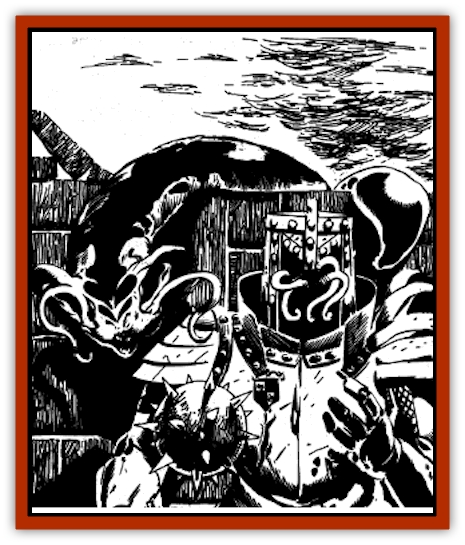

# Steel Shadow

| Statistic | **Steel Shadow** |
| --- | --- |
| **Activity Cycle:** | Any |
| **Alignment:** | Chaotic neutral |
| **Armor Class:** | 7 (2) |
| **Climate/Terrain:** | Any |
| **Damage/Attack:** | 2-5 |
| **Diet:** | Carnivore |
| **Frequency:** | Rare |
| **Hit Dice:** | 4+4 |
| **Intelligence:** | High (13-14) |
| **Magic Resistance:** | Nil |
| **Morale:** | Elite (13) |
| **Movement:** | 14 |
| **No. Appearing:** | 1-12 |
| **No. of Attacks:** | 5 + special |
| **Organization:** | Solitary or pack |
| **Size:** | S (2½-4') |
| **Special Attacks:** | Animated metal |
| **Special Defenses:** | Immunity to lightning; metal merge |
| **THAC0:** | 17 |
| **Treasure:** | Special (animated metal) |
| **XP Value:** | 975 |

Although they look rather like giant planarian worms, equally at home on land and under water, they are rarely seen in their true forms. They *merge with metal* to enter and animate metal items. Steel shadows use these metal shells as both homes and weapons, their presence betrayed only by a dark patch or "shadow" on the surface of the metal - hence their name. Steel shadows can remain inside metal indefinitely without harm. They can see through, and out of, metal with 80' infravision.

**Combat:** A Steel shadow has two harmless, barbel-like feelers projecting from its mouth. Its expandable body, however, contains five retractable, barbed, sucking tentacles which can be extended up to six feet away. Once a tentacle hits, it does 2-5 damage per round automatically until it is severed or the shadow voluntarily withdraws it. A tentacle is always AC7 and can be severed by dealing it 6 or more points of damage.

Steel shadows can *merge with metal* at will. Such merging or emerging takes one round, during which the shadow is AC7 and cannot launch any physical attacks. It can fully merge into any piece of metal larger in volume than a longsword - a shield, suit of armor, battle axe, or the like. While inside any metal, the shadow is AC2, and subject to the effects of all attacks on the metal; it takes half damage from physical attacks on the metal, suffers no ill effects if the metal saves against an attack, and gets its own saving throw if the metal's save fails. Disintegration of the metal housing it forces the shadow out of the metal, but does not harm it. Steel shadows within metal worn by a being can automatically hit with all tentacles on the round after they merge. Shadows cannot merge into metal items bearing magical dweomers such as enchanted swords or armor.

A shadow can animate any metal it contacts, using any metal items to fly, move, and attack. Animated weapons do their usual damage, and strike with the shadow's THAC0. Shields and suits of armor, which the shadow can animate as a unit, can ram for 1d4+1 damage. A shadow crawling along a ledge or the floor can "fire" arrows with metal heads, or hurl coins lying there - a handful of coins does one point of damage when striking, can knock over light objects and force fragile items to make saving throws. Animated missiles have ranges of 10'/20'/30' with respective range penalties. Animated objects move with the shadow's rate of speed if it accompanies them or if they are larger than it; otherwise, they are MV 21.

All animated metal attacks are additional special attacks. A favorite shadow tactic is to animate an empty suit of armor, or one containing a skeleton or corpse - making opponents think they face undead - and lunge forward to embrace human prey. The shadow's tentacles then spring out of the helm to strike at the face of their opponent. Each round, the shadow and the grasped prey each roll a d20; if the prey rolls higher, it breaks free. If it loses, the shadow holds on for another round. The DM must judge what weapons a grasped character can wield, and what spells can or cannot be cast.

**Habitat/Society:** Steel shadows can be found anywhere, from the wrecks of ships in the ocean depths to ancient tombs locked in glacial ice in the high mountains, as long as metal of any sort is nearby.

**Ecology:** Steel shadows are immune to all electrical (lightning) attacks. *Heat metal* spells cast on metal they are merged with act as *heal* spells, curing the same number of hit points of damage as they would normally inflict.

[[Rust_Monster|Rust monster]] attacks on metal containing a steel shadow immediately force the shadow out, and do it 4d6 damage per striking rust monster tentacle. Once free of the metal, the shadow takes no further damage from rust monster tentacles.

Steel shadow ichor is highly prized by alchemists and wizards as an ingredient in potions, spell inks, and magical item enchantments concerned with animating, heating, and passing through metal. Its skin, properly prepared, contains magic that protects against or lessens lightning and energy damage.

---
## Discovery & Documentation

**Source Publication:** Ruins of Undermountain I (1994)
**Campaign Setting:** Forgotten Realms
**Author(s):** Ed Greenwood

### Other Creatures Found in This Source Book
   * [[Automaton_Scaladar|Automaton, Scaladar]]
   * [[Beholder-kin_Death_Kiss|Beholder-kin, Death Kiss]]
   * [[Beholder_Elder_Orb|Beholder, Elder Orb]]
   * [[Darktentacles|Darktentacles]]
   * [[Ibrandlin|Ibrandlin]]
   * [[Sharn|Sharn]]
   * [[Slithermorph|Slithermorph]]
   * [[Snake_Flying|Snake, Flying]]
   * [[Watchghost|Watchghost]]
