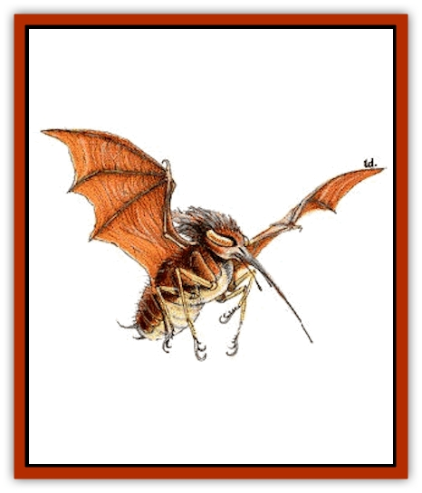

# Stirge

| Statistic | **Stirge** |
| --- | --- |
| **Activity Cycle:** | Night |
| **Alignment:** | Nil |
| **Armor Class:** | 8 |
| **Climate/Terrain:** | Forests or subterranean |
| **Damage/Attack:** | 1-3 |
| **Diet:** | Blood |
| **Frequency:** | Uncommon |
| **Hit Dice:** | 1+1 |
| **Intelligence:** | Animal (1) |
| **Magic Resistance:** | Nil |
| **Morale:** | Average (8) |
| **Movement:** | 3, Fl 18 (C) |
| **No. Appearing:** | 3-30 |
| **No. of Attacks:** | 1 |
| **Organization:** | Clusters |
| **Size:** | S (2' wingspan) |
| **Special Attacks:** | Blood drain |
| **Special Defenses:** | Nil |
| **THAC0:** | 17 |
| **Treasure:** | D |
| **XP Value:** | 175 |

Stirges are [[Bird|bird]]-like creatures that drink the blood of their victims for sustenance. They have four small, pincer-like legs that they use to clamp onto the necks of their victims. They are rusty-red to reddish brown in color, and their eyes and feet are yellowish. The dangling proboscises of stirges are pink at the tip, fading to gray at the base (near their heads).

**Combat:** Due to an instinctive ability to find and attack weak points, stirges attack as 4-Hit Die creatures, rather than 1+1. Their long proboscis inflicts 1-3 points of damage when it hits, and drains 1d4 points of blood every round thereafter. When a stirge drains a total of 12 points of blood from a victim, it becomes bloated and flies off to digest its protein-rich meal.

Stirges must be killed to be removed, due to their strong grip. If an attack against an attached stirge misses, make another attack roll against the victim's Armor Class to see if the attack hits the victim instead. Caution is advisable when attempting to remove an attached stirge.

**Habitat/Society:** Stirges form nest-like colonies in attics, dungeons, and copses of trees. Although they resemble birds, they hang upside down when sleeping, indicating that stirges may be closely related to [[Bat|vampire bats]].

Stirges can breed in captivity, but a constant supply of blood is needed. Stirges mostly kill low-level humans, animals and children, so the arrival of these predators in any civilized territory is always a cause for alarm. Fortunately, even a low-level group of adventurers or town militia is usually capable of ending the menace with little or no loss of life.

**Ecology:** Stirges have an acute sense of smell, can see in the dark, and can sense heat sources within 200 feet. These senses keep stirges informed when living creatures enter their habitat. Creatures with a natural AC of 3 or better are usually immune to a stirge's blood draining attack, since their hides are too thick to penetrate. As a consequence, huge nests of stirges live symbiotically with some evil [[Dragon_General_Information|dragons]].

Characters who protect their entire bodies with special leather or better armor (this special armor costs two to three times more than normal armor) can safely approach a stirge. Even the slightest gap in the protection is seen and smelled by the creature, and a successful attack roll means the creature has broken through the weakness and locked on.

After a stirge has gorged itself by draining blood, it sleeps for one day, plus one day for every 2 points of blood it drank (the maximum sleep period is after drinking 12 points of blood - seven days). During this period of rest, silent attackers can impose a -2 penalty to the stirges' surprise roll, as the beasts wake slowly and remain drowsy for a few moments. They are most vulnerable at this time. While certain species of stirges prefer to dine on human blood, most are content with any large mammal, like cows, moose, and deer. Experienced druids and rangers usually recognize the traces of a stirge colony by the occurrences of mysteriously drained and dead animals in the vicinity.

A stirge colony's territory extends for only a mile in diameter, so stirges move around a lot after they've drained a region of the available blood. Often, the presence of stirges is only discovered long after the colony has departed, making it very difficult to track them.

**Jungle Stirges**

  There are rumored to be exceptionally large varieties of stirges deep in the densest tropical jungles. Though they are only 2+2 Hit Die creatures, they attack as 8 Hit Die monsters. Purportedly, they have a paralyzing poison in the tips of their sharp snouts that is highly prized by local tribesmen. Jungle stirges have been known to mingle with giant vampire bats. None of these larger versions have ever been captured or examined by sages, so nothing else is known about their strengths or weaknesses. What little of them is known came from the cannibals and head hunters of the jungle regions.

---
## Discovery & Documentation

**Source Publication:** MC2 Volume II (1993)
**Campaign Setting:** Advanced Dungeons & Dragons 2nd Edition
**Author(s):** Jay Batista, Scott Bennie, Grant Boucher, William W. Connors, Steve Gilbert, Heike Kubasch, James Lowder, David Edward Martin, Bruce Nesmith, Jean Rabe, Rick Swan, John J. Terra, Gary L. Thomas

### Other Creatures Found in This Source Book
   * [[Ant|Ant]]
   * [[Ant_Lion_Giant|Ant Lion, Giant]]
   * [[Ape_Carnivorous|Ape, Carnivorous]]
   * [[Baboon|Baboon]]
   * [[Badger|Badger]]
   * [[Barracuda|Barracuda]]
   * [[Beetle_Giant|Beetle, Giant]]
   * [[Bulette|Bulette]]
   * [[Bullywug|Bullywug]]
   * [[Dwarf_Duergar|Dwarf, Duergar]]
   * [[Dwarf_Gully|Dwarf, Gully]]
   * [[Eagle|Eagle]]
   * [[Eel|Eel]]
   * [[Elemental_Air_Kin|Elemental, Air Kin]]
   * [[Elemental_Water_Kin|Elemental, Water Kin]]
   * [[Elemental_Water_Kin_Water_Weird|Elemental, Water Kin, Water Weird]]
   * [[Firestar|Firestar]]
   * [[Firetail|Firetail]]
   * [[Fish_Giant|Fish, Giant]]
   * [[Frog|Frog]]
   * [[Gorgon|Gorgon]]
   * [[Hawk|Hawk]]
   * [[Heucuva|Heucuva]]
   * [[Hippocampus|Hippocampus]]
   * [[Hippogriff|Hippogriff]]
   * [[Kelpie|Kelpie]]
   * [[Kenku|Kenku]]
   * [[Killmoulis|Killmoulis]]
   * [[Kuo-Toa|Kuo-Toa]]
   * [[Lamia|Lamia]]
   * [[Lammasu|Lammasu]]
   * [[Lamprey|Lamprey]]
   * [[Leech|Leech]]
   * [[Leprechaun|Leprechaun]]
   * [[Leucrotta|Leucrotta]]
   * [[Locathah|Locathah]]
   * [[Lycanthrope_Wereboar|Lycanthrope, Wereboar]]
   * [[Lycanthrope_Werefox|Lycanthrope, Werefox]]
   * [[Mammal_Minimal|Mammal, Minimal]]
   * [[Mammal_Small|Mammal, Small]]
   * [[Mimic|Mimic]]
   * [[Morkoth|Morkoth]]
   * [[Muckdweller|Muckdweller]]
   * [[Myconid|Myconid]]
   * [[Naga|Naga]]
   * [[Obliviax|Obliviax]]
   * [[Octopus_Giant|Octopus, Giant]]
   * [[Otyugh|Otyugh]]
   * [[Piranha|Piranha]]
   * [[Plant_Dangerous_I|Plant, Dangerous I]]
   * [[Plant_Intelligent|Plant, Intelligent]]
   * [[Poltergeist|Poltergeist]]
   * [[Porcupine|Porcupine]]
   * [[Rat_Osquip|Rat, Osquip]]
   * [[Roc|Roc]]
   * [[Roper|Roper]]
   * [[Rot_Grub|Rot Grub]]
   * [[Rust_Monster|Rust Monster]]
   * [[Sahuagin|Sahuagin]]
   * [[Sea_Lion|Sea Lion]]
   * [[Sea_Horse_Giant|Sea Horse, Giant]]
   * [[Shambling_Mound|Shambling Mound]]
   * [[Shark|Shark]]
   * [[Sphinx|Sphinx]]
   * [[Squid_Giant|Squid, Giant]]
   * [[Swanmay|Swanmay]]
   * [[Tarrasque|Tarrasque]]
   * [[Tasloi|Tasloi]]
   * [[Triton|Triton]]
   * [[Troglodyte|Troglodyte]]
   * [[Urchin|Urchin]]
   * [[Urd|Urd]]
   * [[Weasel|Weasel]]
   * [[Wolverine|Wolverine]]
   * [[Yellow_Musk_Creeper|Yellow Musk Creeper]]
