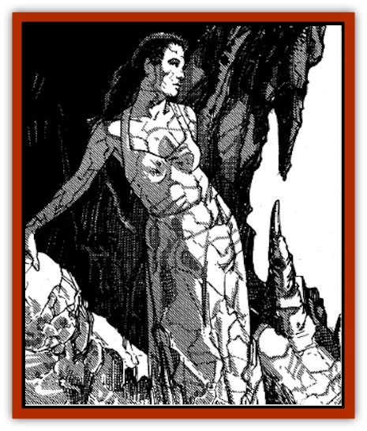

# Stone Maiden

| Statistic | **Stone Maiden** |
| --- | --- |
| **Activity Cycle:** | Any |
| **Alignment:** | Neutral good |
| **Armor Class:** | 8 |
| **Climate/Terrain:** | Any stone (near desert) |
| **Damage/Attack:** | By weapon type or spell |
| **Diet:** | Omnivore |
| **Frequency:** | Very rare |
| **Hit Dice:** | 5 |
| **Intelligence:** | High (13-14) |
| **Magic Resistance:** | 40% |
| **Morale:** | Steady (12) |
| **Movement:** | 12 |
| **No. Appearing:** | 1 or 1-4 |
| **No. of Attacks:** | 1 |
| **Organization:** | Solitary |
| **Size:** | M (5'tall) |
| **Special Attacks:** | Suggestion |
| **Special Defenses:** | See below |
| **THAC0:** | 15 |
| **Treasure:** | D |
| **XP Value:** | 5,000 |

Stone maidens are exquisitely beautiful damsels that dwell in rock formations, standing stones, and the walls of secluded caverns and caves.

A stone maiden is said to have a face like the moon, eyes like a gazelle, and lips like rose petals. She looks like a beautiful human or [[Elf|elven]] female, wearing simple, loose fitting robes and veils. She favors garments that reflect the kind of stone she inhabits. A stone maiden dwelling in a sandstone might wear dusty red, while one living in a basalt cave would favor black.

**Combat:** Like a gazelle, stone maidens are shy, peaceful, and quick to flee. If angered or provoked, however, they become dangerous opponents. They can fight with any weapon provided, but almost always prefer to use magic. Stone maidens can cast the following spells at 14th level of ability, once per round, three times/day: *animate rock*, *meld into stone*, *spike stones*, *stone shape*, *stone tell*, and *suggestion*.

If confronted with hostile adversaries, a stone maiden's first action will be to use her powerful *suggestion* (-3 on saves) and attempt to convince the adversaries to leave. Failing that, she will escape by casting an improved version of *meld into stone*, which allows her to step into any rock formation and remain there indefinitely. Using this improved version of the spell, she can use her other magical abilities as desired while safely enclosed in the protective rock.

A stone maiden's most powerful attack is her ability to *animate rock*, which causes a man-sized stone to move at up to 60 feet per round and attack her adversaries (AC 1, HD 11, hp 28-84 (28d3), THAC0 15, Dmg 14-28 (14d2). If a man-sized stone is not available for animating, she can create one using *stone shape*. She will only use this attack if seriously threatened (by a group with mining tools, for instance).

Finally, a stone maiden will use her *stone tell* ability to gather information about potential visitors to her lair, casting *spike stones* to hinder their approach should they be manifestly evil creatures.

Because of their powerful bond with the Elemental Plane of Earth, stone maidens are not harmed by earth-affecting magic.

**Habitat/Society:** Stone maidens have a mystic bond with the particular rock formation or standing stone of which they are (literally) a part. They will never stray more than a quarter mile from this stone; if forcibly removed they lose 1 hit point per turn until they perish.

Over the years, stone maidens may acquire treasure, either as booty from evil creatures driven from the proximity of their lairs or as suggested gifts from rude or pushy desert nomads, some of whom consider it a great accomplishment to have a former stone maiden to add to their collection of wives.

Many stone maidens have lairs near gold or gem deposits and use their magical talents to gather and shape treasure into pleasing shapes and sizes. They will keep their cache hidden inside a stone near their lair, enclosing the treasure in solid rock using their stone-shaping ability.

According to some legends, stone maidens are the ancestors of a desert priestess who was stolen from her tribe and imprisoned in stone by an evil [[Genie|dao]]. The stone maidens are thus thought to be searching for a way to remove their curse and return to their former nomadic existence. But, while some stone maidens appear melancholy (supporting the desert nomads. legends), there are just as many who are content, assertive, and self reliant, manifesting no apparent need to be "rescued" from any curse.

The task of freeing a stone maiden is described in legends as a monumental undertaking, usually involving the recovery of one of the maiden's personal possessions (a veil, for instance) from a powerful dao or [[Genie|genie]]. Should the token be returned, the stone maiden's link with the Elemental Plane of Earth would be broken, and she would lose all spell-like abilities forever, becoming a normal woman.

**Ecology:** Stone maidens sometimes act as protectors for the lands and desert in a quarter-mile radius of their lair. More often than not, however, these withdrawn creatures play little or no part in Zakhara's ecology.

---
## Discovery & Documentation

**Source Publication:** MC13 Al-Qadim Appendix (1992)
**Campaign Setting:** Al-Qadim (Forgotten Realms)
**Author(s):** C. Terry Phillips

### Other Creatures Found in This Source Book
   * [[Ammut|Ammut]]
   * [[Ashira|Ashira]]
   * [[Asuras|Asuras]]
   * [[Black_Cloud_of_Vengeance|Black Cloud of Vengeance]]
   * [[Buraq|Buraq]]
   * [[Camel|Camel]]
   * [[Camel_of_the_Pearl|Camel of the Pearl]]
   * [[Centaur_Desert|Centaur, Desert]]
   * [[Copper_Automaton|Copper Automaton]]
   * [[Debbi|Debbi]]
   * [[Elephant_Bird|Elephant Bird]]
   * [[Gen|Gen]]
   * [[Genie_Noble_Dao|Genie, Noble Dao]]
   * [[Genie_Noble_Djinni|Genie, Noble Djinni]]
   * [[Genie_Noble_Efreeti|Genie, Noble Efreeti]]
   * [[Genie_Noble_Marid|Genie, Noble Marid]]
   * [[Genie_Tasked_Architect_Builder|Genie, Tasked, Architect/Builder]]
   * [[Genie_Tasked_Artist|Genie, Tasked, Artist]]
   * [[Genie_Tasked_Guardian|Genie, Tasked, Guardian]]
   * [[Genie_Tasked_Herdsman|Genie, Tasked, Herdsman]]
   * [[Genie_Tasked_Slayer|Genie, Tasked, Slayer]]
   * [[Genie_Tasked_Warmonger|Genie, Tasked, Warmonger]]
   * [[Genie_Tasked_Winemaker|Genie, Tasked, Winemaker]]
   * [[Ghost_Mount|Ghost Mount]]
   * [[Ghul|Ghul]]
   * [[Giant_Desert|Giant, Desert]]
   * [[Giant_Jungle|Giant, Jungle]]
   * [[Giant_Reef|Giant, Reef]]
   * [[Giant_Zakhara_General_Information|Giant (Zakhara), General Information]]
   * [[Hama|Hama]]
   * [[Heway|Heway]]
   * [[Living_Idol|Living Idol]]
   * [[Lycanthrope_Werehyena|Lycanthrope, Werehyena]]
   * [[Lycanthrope_Werelion|Lycanthrope, Werelion]]
   * [[Markeen|Markeen]]
   * [[Maskhi|Maskhi]]
   * [[Mason_Wasp_Giant|Mason Wasp, Giant]]
   * [[Nasnas|Nasnas]]
   * [[Pahari|Pahari]]
   * [[Rom|Rom]]
   * [[Sabu_Lord|Sabu Lord]]
   * [[Sakina|Sakina]]
   * [[Serpent_Lord|Serpent Lord]]
   * [[Serpent_Winged|Serpent, Winged]]
   * [[Silat|Silat]]
   * [[Simurgh|Simurgh]]
   * [[Vishap|Vishap]]
   * [[Zaratan|Zaratan]]
   * [[Zin|Zin]]
