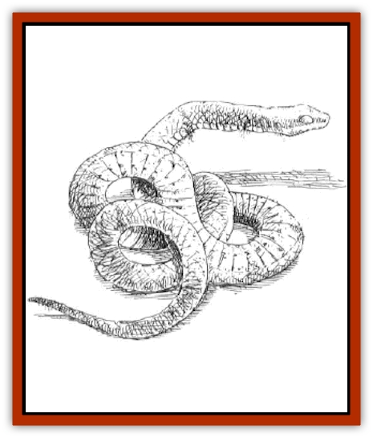

# Stone Snake

| Statistic | **Stone Snake** |
| --- | --- |
| **Activity Cycle:** | Any |
| **Alignment:** | Nil |
| **Armor Class:** | -2 |
| **Climate/Terrain:** | Subterranean |
| **Damage/Attack:** | 2-20 or 1-8 |
| **Diet:** | Minerals |
| **Frequency:** | Rare |
| **Hit Dice:** | 8 |
| **Intelligence:** | Animal (1) |
| **Magic Resistance:** | Nil |
| **Morale:** | Steady (11) |
| **Movement:** | 9 |
| **No. Appearing:** | 1-2 |
| **No. of Attacks:** | 1 |
| **Organization:** | Solitary |
| **Size:** | H (20-25' long) |
| **Special Attacks:** | Poison |
| **Special Defenses:** | Immune to fire, poison; � damage by edged and piercing weapons |
| **THAC0:** | 13 |
| **Treasure:** | Q&times;5 |
| **XP Value:** | 3,000 |

The stone [[Snake|snake]] is similar to its more mundane cousins, except that its body is made up of segments of a stony mineral that resembles granite. It is this hard outer body covering that provides the stone snake with its exceptional Armor Class. A stone snake's diet consists of mineral substances, but its prefered meal is any creature that it has petrified with its special poison.

A stone snake's color ranges generally from eggshell to rosy pink, with striations of mauve to black, similar to most colors of granite.

**Combat:** The stone snake attacks with a lightning-quick jab of its blunt, stony snout, causing 2d10 points of bludgeoning damage. Alternatively, the stone snake can make a bite attack, causing 1d8 points of damage and injecting a virulent poison into its victim, who must make a successful saving throw vs. petrification with a -6 penalty. If the saving throw is failed, the poison takes effect, slowly petrifying the victim over 5 rounds.

Because the stone snake's body is so hard, it can withstand the blows of most weapons fairly well, hence its low Armor Class. Edged and piercing weapons cause only one-quarter damage to a stone snake.

**Habitat/Society:** Stone snakes are always found individually or in mated pairs. The female stone snake lays 1-6 eggs in the early fall, and then watches over them while the male scavenges for food for the both of them. The eggs themselves are very similar in color to the parents, and roughly 16 to 18 inches long. When the young hatch, they are white in color, slowly developing camouflaging hues over the first six months, at which point they are driven from the nest to survive on their own. A stone snake yearling is typically 10 to 12 feet long and its poisonous bite is somewhat weaker; the saving throw penalty for these younger specimens is only -2. Stone snakes of this age typically hunt smaller creatures such as giant [[Rat|rats]] and [[Beetle_Giant|beetles]].

Even though the main diet of a stone snake consists of mineral matter, certain types of gems seem to be undigestable by it, and these are typically found in the lair among the refuse. Gems that are not digested iclude diamonds, garnets, tanzanite, and zircons. Beyond this treasure, any items that would not have remained tucked away on a victim's body (a dropped weapon or shield) can sometimes be found near a stone snake's lair.

**Ecology:** The stone snake consumes mineral matter that it scavenges, usually in subterranean areas with lots of crystalline formations. When a stone snake has petrified a victim, it drags the prey off to its lair for safety and then slowly swallows it whole, digesting the meal over the course of several days, depended on the size of the victim. During this digestion period, the stone snake seems to go into a hibernation stage, so it does not move and is much easier to kill. Stone snake egg yolk is a prized ingredient for the ink used to inscribe the wizard spell *stoneskin* onto a scroll.

---
## Discovery & Documentation

**Source Publication:** Dragon Mountain (1993)
**Campaign Setting:** Advanced Dungeons & Dragons 2nd Edition
**Author(s):** Colin McComb, Paul Arden Lidberg

### Other Creatures Found in This Source Book
   * [[Dragon-kin|Dragon-kin]]
   * [[Elemental_Earth_Kin_Earth_Weird|Elemental, Earth Kin, Earth Weird]]
   * [[Gnasher|Gnasher]]
   * [[Gnasher_Winged|Gnasher, Winged]]
   * [[Kobold_Dragon_Mountain|Kobold, Dragon Mountain]]
   * [[Living_Steel|Living Steel]]
   * [[Noran|Noran]]
   * [[Ophidian|Ophidian]]
   * [[Rautym|Rautym]]
   * [[Spider_Brain|Spider, Brain]]
   * [[Squeaker|Squeaker]]
   * [[Suwyze|Suwyze]]
   * [[Tanar'ri_Greater_Wastrilith|Tanar'ri, Greater, Wastrilith]]
   * [[Undead_Dwarf|Undead Dwarf]]
