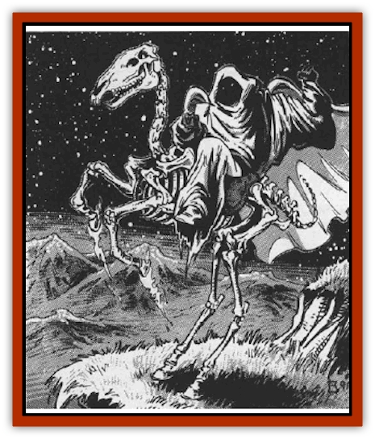

# Strahd's Skeletal Steed

| Statistic | **Strahd's Skeletal Steed** |
| --- | --- |
| **Activity Cycle:** | Night |
| **Alignment:** | Neutral |
| **Armor Class:** | 7 |
| **Climate/Terrain:** | Barovia |
| **Damage/Attack:** | 1d6/1d6/1d4 |
| **Diet:** | Nil |
| **Frequency:** | Very rare |
| **Hit Dice:** | 3+1 |
| **Intelligence:** | Non- (0) |
| **Magic Resistance:** | Nil |
| **Morale:** | Fearless (19-20) |
| **Movement:** | 18 |
| **No. Appearing:** | 1-10 |
| **No. of Attacks:** | 3 |
| **Organization:** | Solitary |
| **Size:** | L (8' tall) |
| **Special Attacks:** | See below |
| **Special Defenses:** | See below |
| **THAC0:** | 17 |
| **Treasure:** | Nil |
| **XP Value:** | 270 |

Strahd's [[Skeleton|skeletal]] steeds are magically animated undead [[Horse|horses]], created as guardians and warriors by the master [[Vampire_General_Information|vampire]] Strahd Von Zarovich.

Completely stripped of flesh, skeletal steeds are held together by magic. They wear the tattered remains of whatever saddle or blankets may have been on them when they died. Thus, many will wear nothing at all while rare individuals might actually wear the remnants of barding (improving their armor class accordingly). Any horse shoes they may have had in life are still on their hooves; however, the enchantment that raised these creatures from the dead gives those shoes a magical aura that causes illusionary flames to flicker around the steed's hooves when it breaks into a gallop.

Unlike normal, living horses, which are rarely still and always shifting and twitching, Strahd's skeletal steeds are completely motionless until they need to act. Many times they are encountered as a mere pile of dusty horse bones. If given a command by Strahd or upon the animation of some trigger magic, they can rise up and assemble. The mere sight of this is enough to require those viewing it to make a horror check.

They have no strong odor, other than a faint trace of dust and mold. They sound hollow and light when in motion and the clatter of their hooves sounds more like a rattle of sticks than the pounding of horses.

**Combat:** Strahd's skeletal steeds fight like normal war horses. Each round, the creature rears up and can both strike with its hooves and bite. On the second round of combat, and every other round thereafter, they can breathe a cloud of noxious gas in an area five feet wide and deep in front of them. Anyone caught in it must save vs. breath weapon or be frozen to the spot for 2-8 (2d4) rounds.

Like all undead, they are immune to *sleep*, *charm*, *hold*, and other mind-controlling spells. Piercing weapons such as spears and arrows do no damage to them for they just slide between the bones. Edged weapons, like swords and axes, will inflict only half damage, while blunt weapons (including polearms and the like used as quarterstaves) can inflict normal damage.

Strahd's skeletal steeds are totally immune to cold- or fire-based attacks, but take full damage from lightning and electricity-based spells. Further, their creator has greatly strengthened their ties to the negative plane. This makes them harder to turn (they are turned as wraiths), but also makes them vulnerable to the damaging effects of a *negative plane protection* spell.

**Habitat/Society:** Strahd's skeletal steeds are found in the dark catacombs beneath Barovia's surface, on old battlefields, or anywhere within Castle Ravenloft. Strahd has been known to post them as sentries throughout Barovia. He never uses them as mounts, but has been known to use them as couriers. Thus, such a creature might well be encountered while on an important mission to deliver some vital message or object for the Lord of Barovia.

As mindless undead creatures, skeletal steeds have no society. They obey any orders given to them by Strahd. The commands must be simple, a single sentence of no more than a few words. They only obey Strahd Von Zarovich unless some magical means (like a *control undead* spell) is used to usurp command of a specific creature. In this case, however, Strahd will know at once that something has happened to one of his steeds.

**Ecology:** As undead things, Strahd's skeletal steeds are not a part of nature. Further, only Strahd Von Zarovich knows the arcane ritual necessary to make them. He can make them only from horaw skeletons where 90% of the bones and the skull are present. It is not know if other animals can be animated from the same spell, but given the power of the Lord of Barovia, and his ties to the evil forces of necromancy, this seems probable.

---
## Discovery & Documentation

**Source Publication:** MC10 Ravenloft Appendix I (1989)
**Campaign Setting:** Planescape
**Author(s):** William W. Connors

### Other Creatures Found in This Source Book
   * [[Bastellus|Bastellus]]
   * [[Bat_Ravenloft|Bat (Ravenloft)]]
   * [[Bowlyn|Bowlyn]]
   * [[Broken_One|Broken One]]
   * [[Bussengeist|Bussengeist]]
   * [[Darkling|Darkling]]
   * [[Doom_Guard|Doom Guard]]
   * [[Doppelganger_Plant|Doppelganger Plant]]
   * [[Elemental_Ravenloft|Elemental (Ravenloft)]]
   * [[Ermordenung|Ermordenung]]
   * [[Ghoul_Lord|Ghoul Lord]]
   * [[Goblyn|Goblyn]]
   * [[Golem_III|Golem III]]
   * [[Golem_IV|Golem IV]]
   * [[Golem_Ravenloft|Golem (Ravenloft)]]
   * [[Grim_Reaper|Grim Reaper]]
   * [[Human_Abber_Nomad|Human, Abber Nomad]]
   * [[Human_Ravenloft|Human (Ravenloft)]]
   * [[Imp_Assassin|Imp, Assassin]]
   * [[Impersonator|Impersonator]]
   * [[Lycanthrope_Werebat|Lycanthrope, Werebat]]
   * [[Lycanthrope_Wereraven|Lycanthrope, Wereraven]]
   * [[Mist_Horror|Mist Horror]]
   * [[Mummy_Greater|Mummy, Greater]]
   * [[Quevari|Quevari]]
   * [[Quickwood|Quickwood]]
   * [[Ravenkin|Ravenkin]]
   * [[Reaver|Reaver]]
   * [[Scarecrow_Ravenloft|Scarecrow (Ravenloft)]]
   * [[Shadow_Fiend|Shadow Fiend]]
   * [[Skeleton_Giant|Skeleton, Giant]]
   * [[Treant_Evil|Treant, Evil]]
   * [[Treant_Undead|Treant, Undead]]
   * [[Valpurgeist|Valpurgeist]]
   * [[Vampire_Dwarf|Vampire, Dwarf]]
   * [[Vampire_Elf|Vampire, Elf]]
   * [[Vampire_Gnome|Vampire, Gnome]]
   * [[Vampire_Halfling|Vampire, Halfling]]
   * [[Vampire_General_Information|Vampire, General Information]]
   * [[Vampire_Kender|Vampire, Kender]]
   * [[Vampyre|Vampyre]]
   * [[Widow_Red|Widow, Red]]
   * [[Wolfwere_Greater|Wolfwere, Greater]]
   * [[Zombie_Lord|Zombie Lord]]
