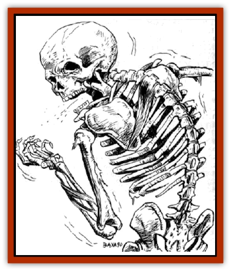

# Strahd Skeleton

| Statistic | **Strahd Skeleton** |
| --- | --- |
| **Activity Cycle:** | Night |
| **Alignment:** | Neutral |
| **Armor Class:** | 7 |
| **Climate/Terrain:** | Barovia |
| **Damage/Attack:** | 1-6 (weapon) |
| **Diet:** | Nil |
| **Frequency:** | Very rare |
| **Hit Dice:** | 2 |
| **Intelligence:** | Non- (0) |
| **Magic Resistance:** | 20% |
| **Morale:** | Special |
| **Movement:** | 12 |
| **No. Appearing:** | 2-20 (2d10) |
| **No. of Attacks:** | 3/2 |
| **Organization:** | Pack |
| **Size:** | M (6' tall) |
| **Special Attacks:** | Nil |
| **Special Defenses:** | Turn as wights |
| **THAC0:** | 19 |
| **Treasure:** | Nil |
| **XP Value:** | 420 |

Strahd skeletons are magically animated undead monsters, created as guardians or warriors by Count Strahd Von Zarovich, the [[Vampire_General_Information|vampire]] lord of Barovia.

Unlike common [[Skeleton|skeletons]], Strahd's creatures still bear bits of leathery flesh, as well as shreds of clothing. Otherwise, they are nothing but bones. Their motions are swift but jerky. In the blink of an eye, they can attain full speed from a dead stop. They have no odor other than the faint suggestions of dust and freshly dug earth.

Strahd skeletons cannot make vocal sounds, but when they move. their bones clatter softly.

**Combat:** Strahd skeletons always wield a weapon of some sort, even if it is just a table leg for a club. Regardless of the weapon, they can only inflict 1d6 points of damage per attack. They have long since forgotten their fighting skills, but their unusual speed does allow them three attacks every two rounds.

Piercing weapons, such as spears or arrows, slide harmlessly between the bones of these creatures, inflicting no damage. Polearms, spears, and such can be used like a quarterstaff. Edged weapons and blunt, smashing weapons are effective against these creatures, but they only do half damage. Any magical blunt weapon inflicts full normal damage.

These monsters can detect invisible creatures within 30 feet. The highly magical nature of Strahd skeletons gives them a 20% magic resistance. Like all undead, they are immune to *sleep*, *charm*, *hold*, and other mind control spells. Being Strahd's creatures, they are as difficult to turn as wights. They have no flesh to speak of, so cold-based attacks cannot harm them.

**Habitat/Society:** Strahd skeletons lurk in dungeons, graveyards, or anywhere in Castle Ravenloft. The Count has been known to post them anywhere in Barovia where they may be of service. A band of skeletons supposedly lies in waiting somewhere beneath the surface of the River Ivlis.

As mindless undead, these creatures have no society. They obey any orders given to them by their master. These commands must be simple - a single sentence of no more than a dozen words.

While in Barovia, they can report back to Strahd if it is a part of their orders. It takes a full turn to establish communication, assuming he bothers to respond. They can only communicate a simple feeling of success or failure.

**Ecology:** Strahd skeletons are not a part of nature. Only Strabd Von Zarovich knows the arcane ritual that brings about their creation. For raw material, he requires human skeletons that still include the skull and 90% of the bones. What other foul components might be required are known only to the dread master of Ravenloft.

---
## Discovery & Documentation

**Source Publication:** Ravenloft Campaign Setting, 1st Ed. ("Realm of Terror") (1994)
**Campaign Setting:** Ravenloft
**Author(s):** Bruce Nesmith and Andria Hayday

### Other Creatures Found in This Source Book
   * [[Geist|Geist]]
   * [[Gremishka|Gremishka]]
   * [[Lycanthrope_Loup-garou|Lycanthrope, Loup-garou]]
   * [[Odem|Odem]]
   * [[Strahd_Zombie|Strahd Zombie]]
   * [[Vampire_Nosferatu|Vampire, Nosferatu]]
