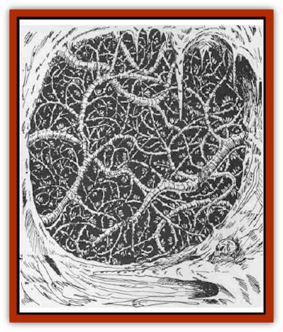

# Strangleweed

| Statistic | **Strangleweed** |
| --- | --- |
| **Activity Cycle:** | Any |
| **Alignment:** | Neutral |
| **Armor Class:** | Special |
| **Climate/Terrain:** | Temperate |
| **Damage/Attack:** | 1-8 |
| **Diet:** | Carnivore |
| **Frequency:** | Uncommon |
| **Hit Dice:** | 1 |
| **Intelligence:** | Non- (0) |
| **Magic Resistance:** | Nil |
| **Morale:** | Nil |
| **Movement:** | 0 |
| **No. Appearing:** | 12-? |
| **No. of Attacks:** | 1 |
| **Organization:** | Clusters, Patches, Groves |
| **Size:** | L (15-20' long) |
| **Special Attacks:** | See below |
| **Special Defenses:** | See below |
| **THAC0:** | Special |
| **Treasure:** | Special |
| **XP Value:** | 175 per 10' square |

Strangleweed appears as a long, clinging vine, usually growing inside caves. The vine is black and covered with short, fine spines, and the triangular leaves and thorns are usually shiny black. The edges of the leaves are razor-sharp, and the spines easily catch in clothing, fur, and skin. The spines cause no damage, but there is a 50% chance that a creature touching the vines (even brushing past them counts as touching) will suffer from spines embedded in skin. Only exposed skin is subject to the spines; fur, armor, and clothing prevent the spines from contacting the skin and subsequently embedding.

When spines embed in skin, there is a 25% chance that a victim will develop a red, itchy rash. If the spines are removed (a delicate procedure since they are no thicker than a human hair), the rash will clear in 24 hours, with the symptoms gradually lessening. If the spines cannot be removed, *cure disease* will remove all ill effects. *Cure* spells will do nothing for the symptoms.

**Combat:** Strangleweed behaves like many carnivorous plants, sensing motion as a signal that a "meal" may be present. Any creature that disturbs the strangleweed vines will trigger an attack. If the vines are disturbed by breezes, they will not attack; a solid object must contact the vines in order to initiate the attacks.

Strangleweed spends much of its time "waiting" for prey. When a victim brushes against the vines, the strangleweed ripples, brushing into adjacent vines and sending a signal that food is near. On the round following the initial contact, the vine begins to entangle its prey, wrapping around its limbs and neck in an attempt to prevent the escape of the victim. Once the vines have a firm hold of the victim, they begin to tighten, choking the victim into unconsciousness and eventual death.

Any creature who ventures more than two feet into a patch of strangleweed will automatically be grappled by the weed. If a character has less than two feet of weed on any side of him (tunnel walls do not count for this purpose) and can attempt to leap to safety can make a Dexterity check on the initial round of attack to avoid being grappled. After the first round, a character has no chance to escape the weed unless he kills enough to clear his path or is pulled to safety by his comrades. Rescuers suffer attacks similar to the person they are trying to save.

As the vines entangle the victim, the leaves cut into the skin or clothing of the unfortunate prey. The leaves do not affect any articles of metal, including armor, and merely scratch leather and wood. Fur-bearing creatures or creatures wearing fur clothing will escape the first 10 points of damage caused by the leaves; the leaves will cut through the fur before reaching the skin. Normal clothing will suffer 6 points of damage before it is torn to shreds and the skin is exposed.

When the leaves and thorns contact skin, they impart 1-8 points of damage per round. The DM should adjust this damage based on the clothing of the victim. The weed will tighten its grip on its victim in an attempt to strangle, and if the victim becomes still, the strangleweed will drop the victim in 1-6 rounds, "storing" it for later consumption.

Victims tangled in this weed must make a Dexterity check to maintain their holds on held items. Entangled victims may not cast spells and their chances to hit an enemy (including the weed) are made at -4.

Strangleweed is immune to the effects of blunt weapons. Hits made by edged weapons are made at -3 due to the swaying of the weed, but normal damage is caused. Each individual vine has 1 HD and AC 9, and when a vine takes its maximum amount of damage, it is severed and can no longer attack. Severed vines will eventually replant themselves and continue to grow.

Strangleweed is affected normally by all magical effects. Setting the weeds on fire requires 1-6 rounds unless lighted by a *fireball* or first doused with oil or other flammable liquid. Once in flames, the weed creates acrid, stinging smoke that will drive PCs at least 100 feet from the flames. The smoke will settle in 1-3 turns.

Strangleweed has no treasure of its own except for any items dropped by its victims. When encountering this weed, adventurers will always find an assortment of skeletons and items on the ground below the weeds.

**Ecology:** This noxious weed is capable of growing almost anywhere damp conditions exist. It requires no light to live or grow, which has caused heated debate among sages to its classification as plant or [[Fungus|fungus]]. Strangleweed contains no chlorophyll, adding to the confusion of the status of this growth.

---
## Discovery & Documentation

**Source Publication:** WGA2 Falconmaster (1990)
**Campaign Setting:** Greyhawk
**Author(s):** Richard W and Anne Brown

### Other Creatures Found in This Source Book
   * [[Weisshund|Weisshund]]
   * [[Yphoz|Yphoz]]
