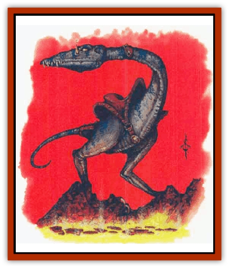

# Strider - Giant

| Statistic | **Strider, Giant** |
| --- | --- |
| **Activity Cycle:** | Any |
| **Alignment:** | Neutral evil |
| **Armor Class:** | 4 |
| **Climate/Terrain:** | Hot, volcanic regions |
| **Damage/Attack:** | 1d4/1d10 |
| **Diet:** | Carnivore |
| **Frequency:** | Rare |
| **Hit Dice:** | 2 |
| **Intelligence:** | Animal (1) |
| **Magic Resistance:** | Nil |
| **Morale:** | Steadv (11-12) |
| **Movement:** | 15 |
| **No. Appearing:** | 1-6 |
| **No. of Attacks:** | 2 |
| **Organization:** | Flock |
| **Size:** | L (8' tall) |
| **Special Attacks:** | Fireball |
| **Special Defenses:** | See below |
| **THAC0:** | 19 |
| **Treasure:** | Nil |
| **XP Value:** | 270 |

These large, featherless, flightless [[Bird|birds]] are used as mounts by [[Firenewt|firenewts]]. The giant strider is about the size of an [[Bird_Toril|ostrich]]. It has a bumpy, dusky red hide and dully-glowing red eyes. It is often mistaken for a [[Lizard|lizard]].

**Combat:** The giant strider attacks to its front with a bite that inflicts Id8 points of damage. It can also attack to the rear with a kick that causes 1d10 points of damage. It cannot use both attacks in the same round; it generally attacks in whatever direction the last attack against it came from.

It can emit a small *fireball* from the duct that lies next to either eye. Each *fireball* has a range of 20 yards and a burst radius of 10 feet. Anyone caught by the blast must roll a successful saving throw vs. breath weapon or suffer 1d6 points of damage. The giant strider can generate one *fireball* per eye per hour.

Giant striders are immune to magical fire. In addition, they gain a +2 bonus to saving throws against any magical attack. Intense heat and flame actually act as *cure light wounds* spells on giant striders. This effect can occur only once every three rounds. *Fireballs* and other intense, fiery attacks have this effect immediately.

Conversely, cold-based attacks inflict an additional 1d6+1 points of damage and water acts as a poison if they drink it. Any cold liquid poured on their bodies does some damage, usually 1-2 points (at the discretion of the DM).

Giant striders are generally fearless and gain a +4 bonus to their morale.

**Habitat/Society:** Giant striders are completely adapted to life in hot, volcanic regions. Their meager diet consists of the few animals and plants that share their hot realm. They are able to directly metabolize the heat of their surroundings, and they use this to fuel their own bodily functions. Without this extra heat, the giant strider grows chilled and sluggish.

Their physiology is so modified that normal conditions are dangerous to them. They are poisoned by ingested water and harmed by cold weather or frigid attacks.

Despite their abnormal natue, giant striders' behavior is similar to that of other flightless birds. Mating season occurs in the spring. Cocks compete for mates by elaborate dances punctuated by the explosions of *fireballs*. The hens lay 1d4 eggs in a simple nest, usually a pit scratched in the ground. The chicks hatch in five to six weeks and stand about 6 inches high. They grow swiftly, adding 6 inches per month. They can begin to emit flame after six months. Giant striders mature in one year.

Giant striders are the primary mounts of firenewts. A firenewt tribe might keep a herd of up to 100 giant striders. Giant striders are fitted with a saddle atop the hips. The firenewts control these mounts by kicking their sides or hitting them with spears (the giant striders' sharp teeth would saw through any bridle).

**Ecology:** Wild striders have a potential lifespan of 10 to 20 years, although the struggle for survival usually shortens this. Striders domesticated by firenewts are usually killed and eaten after 15 years.

---
## Discovery & Documentation

**Source Publication:** Monstrous Compendium, 1996 Annual, Volume 3 (1995)
**Campaign Setting:** Advanced Dungeons & Dragons 2nd Edition
**Author(s):** Jon Pickens

### Other Creatures Found in This Source Book
   * [[Alaghi|Alaghi]]
   * [[Alhoon|Alhoon]]
   * [[Aranea_Savage_Coast|Aranea (Savage Coast)]]
   * [[Arcane_Head|Arcane Head]]
   * [[Banedead|Banedead]]
   * [[Banelich|Banelich]]
   * [[Bat_Bonebat|Bat, Bonebat]]
   * [[Beetle|Beetle]]
   * [[Belgoi|Belgoi]]
   * [[Bladeling|Bladeling]]
   * [[Braxat|Braxat]]
   * [[Bunyip|Bunyip]]
   * [[Burbur|Burbur]]
   * [[Bvanen|Bvanen]]
   * [[Cat_Great_Snow_Tiger|Cat, Great, Snow Tiger]]
   * [[Chosen_One|Chosen One]]
   * [[Chronovoid|Chronovoid]]
   * [[Cildabrin|Cildabrin]]
   * [[Coffer_Corpse|Coffer Corpse]]
   * [[Disenchanter|Disenchanter]]
   * [[Dog_Temporal|Dog, Temporal]]
   * [[Dragon_Cerilia|Dragon (Cerilia)]]
   * [[Dragon_Ghost|Dragon, Ghost]]
   * [[Dragon_Lesser_Undead|Dragon, Lesser Undead]]
   * [[Dragon_Neutral_Amber|Dragon, Neutral, Amber]]
   * [[Dread_Warrior|Dread Warrior]]
   * [[Dreamweaver|Dreamweaver]]
   * [[Dream_Spawn_Greater_Ennui|Dream Spawn, Greater, Ennui]]
   * [[Dream_Spawn_Lesser_Morph|Dream Spawn, Lesser, Morph]]
   * [[Dwarf_Arctic|Dwarf, Arctic]]
   * [[Dwarf_Urdunnir|Dwarf, Urdunnir]]
   * [[Eel_Giant_Moray|Eel, Giant Moray]]
   * [[Elemental_Fire_Kin_Tome_Guardian|Elemental, Fire Kin, Tome Guardian]]
   * [[Elf_Rockseer|Elf, Rockseer]]
   * [[Ethyk|Ethyk]]
   * [[Faerie_Faerie_Fiddler|Faerie, Faerie Fiddler]]
   * [[Faerie_Petty_Bramble|Faerie, Petty, Bramble]]
   * [[Faerie_Petty_Gorse|Faerie, Petty, Gorse]]
   * [[Faerie_Petty|Faerie, Petty]]
   * [[Firenewt|Firenewt]]
   * [[Formian|Formian]]
   * [[Gargoyle_II|Gargoyle II]]
   * [[Giant_Cerilia|Giant (Cerilia)]]
   * [[Goblin_Cerilia|Goblin (Cerilia)]]
   * [[Golem_Magic|Golem, Magic]]
   * [[Golem_Shaboath|Golem, Shaboath]]
   * [[Hag_Bheur|Hag, Bheur]]
   * [[Hamadryad|Hamadryad]]
   * [[Hound_of_Ill-Omen|Hound of Ill-Omen]]
   * [[Human_Cerilia|Human (Cerilia)]]
   * [[Hybsil|Hybsil]]
   * [[Ibrandlin|Ibrandlin]]
   * [[Imp_Chaos|Imp, Chaos]]
   * [[Ixitxachitl_Ixzan|Ixitxachitl, Ixzan]]
   * [[Jabberwock|Jabberwock]]
   * [[Kyton|Kyton]]
   * [[Kyuss_Son_of|Kyuss, Son of]]
   * [[Lillend|Lillend]]
   * [[Life-Shaped_Creation_Guardian|Life-Shaped Creation, Guardian]]
   * [[Life-Shaped_Creation_Transport|Life-Shaped Creation, Transport]]
   * [[Lycanthrope_Werecrocodile|Lycanthrope, Werecrocodile]]
   * [[Lycanthrope_Werespider|Lycanthrope, Werespider]]
   * [[Magedoom|Magedoom]]
   * [[Manotaur|Manotaur]]
   * [[Mastiff_Shadow|Mastiff, Shadow]]
   * [[Meazel|Meazel]]
   * [[Mist_Scarlet_Dancer|Mist, Scarlet Dancer]]
   * [[Needleman|Needleman]]
   * [[Orc_Neo-Orog|Orc, Neo-Orog]]
   * [[Orc_Ondonti|Orc, Ondonti]]
   * [[Owlbear_II|Owlbear II]]
   * [[Pegataur|Pegataur]]
   * [[Phaerimm|Phaerimm]]
   * [[Reggelid|Reggelid]]
   * [[Render|Render]]
   * [[Saurial|Saurial]]
   * [[Scalamagdrion|Scalamagdrion]]
   * [[Sharn|Sharn]]
   * [[Snake_Messenger|Snake, Messenger]]
   * [[Spirit_Forest_Uthraki|Spirit, Forest, Uthraki]]
   * [[Spirit_Forest_Wood_Man|Spirit, Forest, Wood Man]]
   * [[Spirit_Ice_Orglash|Spirit, Ice, Orglash]]
   * [[Spirit_Rock_Thomil|Spirit, Rock, Thomil]]
   * [[Tembo|Tembo]]
   * [[Temporal_Glider|Temporal Glider]]
   * [[Temporal_Stalker|Temporal Stalker]]
   * [[Tether_Beast|Tether Beast]]
   * [[Thessalmonster|Thessalmonster]]
   * [[Time_Dimensional|Time Dimensional]]
   * [[Tomb_Tapper|Tomb Tapper]]
   * [[Undead_Dragon_Slayer|Undead Dragon Slayer]]
   * [[Unicorn_Black_Toril|Unicorn, Black (Toril)]]
   * [[Vaath|Vaath]]
   * [[Vortex_Spider|Vortex Spider]]
   * [[Weredragon|Weredragon]]
   * [[Zhentarim_Spirit|Zhentarim Spirit]]
