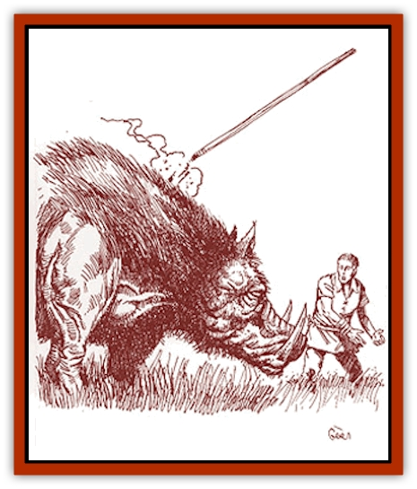

# Succulus

| Statistic | **Succulus** |
| --- | --- |
| **Activity Cycle:** | Day |
| **Alignment:** | Neutral |
| **Armor Class:** | 2 |
| **Climate/Terrain:** | Any land |
| **Damage/Attack:** | 3d4 |
| **Diet:** | Omnivore/Metalavore |
| **Frequency:** | Rare |
| **Hit Dice:** | 5 |
| **Intelligence:** | Semi- (2-4) |
| **Magic Resistance:** | Nil |
| **Morale:** | Average (8-10) |
| **Movement:** | 15 |
| **No. Appearing:** | 1d12 |
| **No. of Attacks:** | 1 |
| **Organization:** | Family |
| **Size:** | S (3' at shoulder) |
| **Special Attacks:** | Eats metal, Legacies |
| **Special Defenses:** | Nil |
| **THAC0:** | 15 |
| **Treasure:** | Nil |
| **XP Value:** | 420 |

The succulus, also known as the red steel cruncher, closely resembles a wild [[Boar|boar]] in appearance. The succulus is similar to a [[Rust_Monster|rust monster]], except that it feeds on *red steel*, *cinnabryl*, and *steel seed*. The creature was first discovered in caves beneath the forests of Robrenn. Since then it has spread throughout the cursed areas of the Savage Coast, much to the consternation of boar-hunters throughout the area. Some suspect that the Robrenn druids had something to do with its rapid spread, because of their known bias against materials that have "never lived", such as metal and stone.

The succulus is grayish-black, with short, woolly hair interspersed with bristles that form a mane along the spine. The lower teeth grow into formidable, curved tusks, which grow up to 12 inches long. The succulus has small eyes that are a deep rust-red color.

**Combat:** The succulus can smell *cinnabryl*, *red steel*, and *steel seed* up to 90 feet away. If the succulus touches any of these metals (determined by a successful attack roll), the metal immediately disintegrates into a powder which is easily consumed by the creature. Magical weapons have a chance of being unaffected equal to 10% for each plus the weapon has. (A +2 weapon or armor has a 20% chance of not being affected.) Metal weapons striking a succulus are affected just as if the creature had touched them. Nonweapon magical items made from *cinnabryl*, *red steel*, or *steel seed* count as +2 magical weapons for purposes of determining whether or not they disintegrate.

The succulus is a fairly intelligent creature. As such, it cannot be distracted by the old "throw out some *red steel* spikes" trick. It will attack anyone carrying an item made of *red steel* or *cinnabryl*. A succulus frequently charges such persons while activating its Spike Legacy, hoping that the victim will strike at them with the weapon or item.

Feeding time always takes one round regardless of the size of the metal meal.

**Habitat/Society:** A succulus is nearly always found in the company of a group of wild [[Boar|swine]]. During any encounter with a succulus, there is also a 5% chance of encountering a single offspring, which counts as a half-strength succulus. The red steel cruncher searches far and wide for supplies of fresh metals. It will eat raw ore, but prefers the refined, forged metal.

**Ecology:** The flesh of the succulus is not edible since it is thoroughly impregnated with heavy metals.

A herd of wild boars will recognize that a succulus is different but will usually let it join the herd anyway. The succulus excavates vast holes when it roots for *cinnabryl* and usually digs up all sorts of roots and tubers and things that the boars like to eat.

If two red steel crunchers mate, the offspring will be red steel crunchers. If a succulus mates with a wild swine, the offspring have a 5% chance of being red steel crunchers.

The hide of a succulus can be cured into a very tough, metal-impregnated leather. The leather can be made into armor equivalent to studded leather armor (AC 7).

If captured young and carefully trained, a succulus could serve as a *cinnabryl* deposit indicator, but it would be very expensive to feed.

---
## Discovery & Documentation

**Source Publication:** Monstrous Compendium Savage Coast Appendix (Online Exclusive) (1995)
**Campaign Setting:** Mystara
**Author(s):** Loren L Coleman, Ted James, Thomas Zuvich, Cindi M. Rice

### Other Creatures Found in This Source Book
   * [[Aranea_Savage_Coast|Aranea (Savage Coast)]]
   * [[Arashaeem|Arashaeem]]
   * [[Batracine|Batracine]]
   * [[Cat_Marine|Cat, Marine]]
   * [[Cinnavixen|Cinnavixen]]
   * [[Clockwork_Swordsman|Clockwork Swordsman]]
   * [[Critter_Temple|Critter, Temple]]
   * [[Cursed_One|Cursed One]]
   * [[Deathmare|Deathmare]]
   * [[Dragon_Savage_Coast_Crimson|Dragon (Savage Coast), Crimson]]
   * [[Dragon_Savage_Coast_Red_Hawk|Dragon (Savage Coast), Red Hawk]]
   * [[Echyan|Echyan]]
   * [[Ee'aar|Ee'aar]]
   * [[Enduk|Enduk]]
   * [[Fachan_Savage_Coast|Fachan (Savage Coast)]]
   * [[Feliquine|Feliquine]]
   * [[Fiend_Narvaezan|Fiend, Narvaezan]]
   * [[Frelôn|Frelôn]]
   * [[Ghriest|Ghriest]]
   * [[Glutton_Sea|Glutton, Sea]]
   * [[Goatman|Goatman]]
   * [[Golem_Naâruk|Golem, Naâruk]]
   * [[Golem_Savage_Coast|Golem (Savage Coast)]]
   * [[Grudgling|Grudgling]]
   * [[Heraldic_Servant_I|Heraldic Servant I]]
   * [[Heraldic_Servant_II|Heraldic Servant II]]
   * [[Heraldic_Servant_III|Heraldic Servant III]]
   * [[Heraldic_Servant_IV|Heraldic Servant IV]]
   * [[Heraldic_Servant_V|Heraldic Servant V]]
   * [[Heraldic_Servant_General_Information|Heraldic Servant, General Information]]
   * [[Hermit_Sea|Hermit, Sea]]
   * [[Jorri|Jorri]]
   * [[Juhrion|Juhrion]]
   * [[Kla'a-tah|Kla'a-tah]]
   * [[Leech_Legacy|Leech, Legacy]]
   * [[Lich_Inheritor|Lich, Inheritor]]
   * [[Lizard_Kin_Savage_Coast|Lizard Kin (Savage Coast)]]
   * [[Lupasus|Lupasus]]
   * [[Lupin|Lupin]]
   * [[Lyra_Bird_Saragón|Lyra Bird, Saragón]]
   * [[Malfera|Malfera]]
   * [[Manscorpion_Nimmurian|Manscorpion, Nimmurian]]
   * [[Mythuínn_Folk|Mythuínn Folk]]
   * [[Neshezu|Neshezu]]
   * [[Nikt'oo|Nikt'oo]]
   * [[Nosferatu|Nosferatu]]
   * [[Omm-wa|Omm-wa]]
   * [[Omshirim|Omshirim]]
   * [[Parasite_Savage_Coast|Parasite (Savage Coast)]]
   * [[Phanaton|Phanaton]]
   * [[Plant_Savage_Coast|Plant (Savage Coast)]]
   * [[Pudding_Vermilion|Pudding, Vermilion]]
   * [[Rakasta|Rakasta]]
   * [[Ray_Forest|Ray, Forest]]
   * [[Shedu_Greater_Savage_Coast|Shedu, Greater (Savage Coast)]]
   * [[Shimmerfish|Shimmerfish]]
   * [[Skinwing|Skinwing]]
   * [[Spawn_of_Nimmur|Spawn of Nimmur]]
   * [[Spider-spy|Spider-spy]]
   * [[Spirit_Heroic|Spirit, Heroic]]
   * [[Spirit_Walleran|Spirit, Walleran]]
   * [[Swampmare|Swampmare]]
   * [[Symbiont_Shadow|Symbiont, Shadow]]
   * [[Tortle|Tortle]]
   * [[Troll_Legacy|Troll, Legacy]]
   * [[Trosip|Trosip]]
   * [[Tyminid|Tyminid]]
   * [[Utukku|Utukku]]
   * [[Voat|Voat]]
   * [[Voat_Herathian|Voat, Herathian]]
   * [[Vulturehound|Vulturehound]]
   * [[Wallara|Wallara]]
   * [[Wurmling|Wurmling]]
   * [[Wynzet|Wynzet]]
   * [[Yeshom|Yeshom]]
   * [[Zombie_Red|Zombie, Red]]
