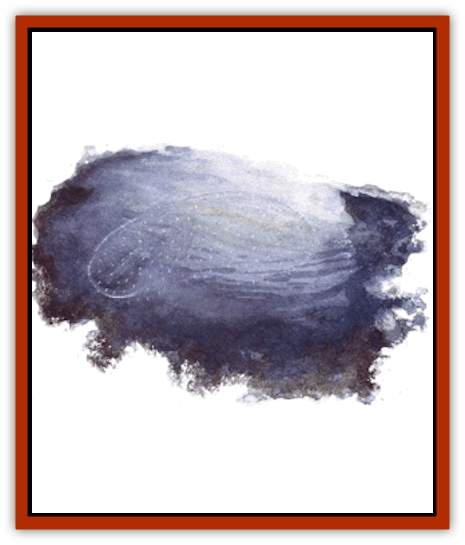

# Suisseen

| Statistic | **Suisseen** |
| --- | --- |
| **Activity Cycle:** | Any |
| **Alignment:** | Neutral (evil) |
| **Armor Class:** | 3 (membrane), 0 (water) |
| **Climate/Terrain:** | Elemental Plane of Water |
| **Damage/Attack:** | 1d4+1 or 2d8+2 |
| **Diet:** | Omnivorous |
| **Frequency:** | Common |
| **Hit Dice:** | 8 |
| **Intelligence:** | Low (5-7) |
| **Magic Resistance:** | Nil |
| **Morale:** | Elite (13-14) |
| **Movement:** | Sw 15 |
| **No. Appearing:** | 1 |
| **No. of Attacks:** | 1 |
| **Organization:** | None |
| **Size:** | L (10' long) |
| **Special Attacks:** | Drowning |
| **Special Defenses:** | Immune to fire |
| **THAC0:** | 13 |
| **Treasure:** | Nil |
| **XP Value:** | 2,000 |

On the Elemental Plane of Water swim the suisseen, creatures that're little more than thin, transparent membranes filled with water. Because they're suspended in the element, with water inside and without, it's unclear as to exactly what is the suisseen and what is not. Sure, the membrane is part of the creature, but apparently, some of the water outside and some or all of the fluid inside contributes to its existence as well.

Somehow, this semielemental beast exists both as [[Aballin|living water]] and as a gelatinous substance containing and yet shaped by the liquid within and around it. Its membrane is perforated with flutelike tubes through which water pumps to give the suisseen locomotion. This act of siphoning and expelling water also serves as the creature's means of consumption, digestion, defecation, and even communication. But a body's got to keep in mind that the water in question is an actual part of the monster, not just the medium in which it survives.

**Combat:** The membranous portion of the suisseen is slightly caustic, and therefore able to break down things the creature can use as nutrients - like flesh. Any sod who touches the membrane or is struck by it sustains a burning wound that causes 1d4+1 points of damage. But that's not the beast's main mode of attack. Like a true [[Elemental_Fire_Water|water elemental]], it uses its watery mass like a powerful wave to crush and batter opponents, inflicting 2d8+2 points of damage.

If summoned out of its native environment, a suisseen can also drown creatures that don't breathe water. This special assault requires an attack roll (and can accompany a normal pummeling attack). If the roll succeeds, the victim must make a Constitution check. A sod who fails the check becomes immobilized. unable to act, and suffers 2d6+2 points or damage as the suisseen forces water down his throat. Each round thereafter, he must make another Constitution check, suffering the same result if he fails. If one of the victim's checks succeeds, he spends that round freeing himself from the suisseen's fluid grasp, and he need make no more Constitution checks (unless, of course, the monster makes another successful "drown attack" against him).

When attacking a suisseen, a basher's got to state in advance whether he's striking at the membrane or the surrounding watery mass. The liquid area around the beast has an Armor Class of 0 and can be harmed only by weapons of +1 or greater enchantment. The membrane has an AC of 3 and is vulnerable to ordinary (nonmagical) weapons. 'Course, a berk who tries to strike the membrane in melee must get close to the suisseen - close enough to be within the creature's watery exterior. That means he's subjecting himself to an attack by the beast - fact is, the suisseen gets a chance to strike the sod even if it's already made its attack for that round.

The suisseen suffers no harm from fire-based attacks, but those based on lightning or cold inflict twice their normal damage.

**Habitat/Society:** A cult known as the Mayestri - a group of humans, [[Sahuagin|sahuagin]], and [[Merman|mermen]] - reveres the suisseen as a link to the true water elementals they worship. It might be more accurate to say *worshiped*, however, since all of the Mayestri's attention is currently focused on the suisseen, which they call "the door and the way". Thc evil members of this strange religion believe that water (as an element) can multiply life force, so by sacrificing victims to it, they hope to increase their power and lengthen their lives. Some folks think the cult believes in only one single suisseen, a being they consider their god, but that's nothing but wash - the group knows that the watery creatures are many.

Oddly enough, most suisseen don't realize that they're worshiped by the cult, as it operates primarily on the Prime Material Plane (though it has a few adherents in the strange depths of the plane of Water). The Mayestri use a special summoning spell to call a suisseen and then offer it living sacrifices, which it gladly accepts as food. The evil cultists believe that this gives them power, but by most accounts, they're deluded (or just barmy). Nevertheless, suisseen that've been summoned a few times have grown to like the attention - and especially the sacrifices. These beasts gradually change from neutral to neutral evil and begin to hunt humans and other intelligent prey.

After being called to the Prime, these evil suisseen often try to make agreements with their summoners so they can remain there and seek food as long as possible. However, unless the cult members use magic, communication's a problem - no one seems able to understand or speak the creatures' fluting, gurgling language. Once they return to the Elemental Plane of Water, the neutral evil suisseen attack merpeople, [[Triton|tritons]], sahuagin, or whatever else is available. They also try to kill others of their own kind, which they suddenly see as competitors.

Normal suisseen - that is. those that haven't been tainted by the Mayestri's sacrifices - congregate in small groups on the plane of Water. Their mating and reproductive capabilities remain dark, as does the structure of whatever small society they have.

**Ecology:** Graybeards just don't know what to make or the suisseen. Are they magical combinations of water elementals and other creatures - perhaps even [[Ooze_Slime_Jelly_II|gelatinous cubes]] or similar beasts? It's possible, but unlikely. The suisseen appear more closely related to the [[Elemental_Grue_Varrdig|varrdig]] (also known as the water grue), an elemental-like scavenger that roams the plane of Water seeking territories to claim and defend.

---
## Discovery & Documentation

**Source Publication:** Planescape III (1996)
**Campaign Setting:** Planescape
**Author(s):** Monte Cook

### Other Creatures Found in This Source Book
   * [[Animental|Animental]]
   * [[Archomental_Evil|Archomental, Evil]]
   * [[Archomental_Good|Archomental, Good]]
   * [[Belker|Belker]]
   * [[Bzastra|Bzastra]]
   * [[Chososion|Chososion]]
   * [[Darklight|Darklight]]
   * [[Devete|Devete]]
   * [[Devourer_Planescape|Devourer (Planescape)]]
   * [[Dharum_Suhn|Dharum Suhn]]
   * [[Egarus|Egarus]]
   * [[Elemental_Athas_Lesser_Air_Earth|Elemental (Athas), Lesser, Air/Earth]]
   * [[Elemental_Athas_Lesser_Fire_Water|Elemental (Athas), Lesser, Fire/Water]]
   * [[Elemental_Fire_Kin_Salamander_II|Elemental, Fire Kin, Salamander II]]
   * [[Entrope|Entrope]]
   * [[Facet|Facet]]
   * [[Frost_Salamander|Frost Salamander]]
   * [[Fundamental_Air_Earth|Fundamental, Air/Earth]]
   * [[Fundamental_Fire_Water|Fundamental, Fire/Water]]
   * [[Fundamental_All_Elements|Fundamental, All Elements]]
   * [[Garmorm|Garmorm]]
   * [[Homunculus_Elemental|Homunculus, Elemental]]
   * [[Immoth|Immoth]]
   * [[Khargra|Khargra]]
   * [[Klyndes|Klyndes]]
   * [[Magran|Magran]]
   * [[Menglis|Menglis]]
   * [[Nathri|Nathri]]
   * [[Ooze_Sprite|Ooze Sprite]]
   * [[Paraelemental|Paraelemental]]
   * [[Phirblas|Phirblas]]
   * [[Psurlon|Psurlon]]
   * [[Quasielemental_Negative|Quasielemental, Negative]]
   * [[Quasielemental_Positive|Quasielemental, Positive]]
   * [[Rast|Rast]]
   * [[Ravid|Ravid]]
   * [[Ruvoka|Ruvoka]]
   * [[Scile|Scile]]
   * [[Shad|Shad]]
   * [[Shocker|Shocker]]
   * [[Sislan|Sislan]]
   * [[Terithran|Terithran]]
   * [[Thoqqua|Thoqqua]]
   * [[Trilloch|Trilloch]]
   * [[Tsnng|Tsnng]]
   * [[Ungulosin|Ungulosin]]
   * [[Vacuous|Vacuous]]
   * [[Wavefire|Wavefire]]
   * [[Xag-Ya_Xeg-Yi|Xag-Ya/Xeg-Yi]]
   * [[Xill|Xill]]
