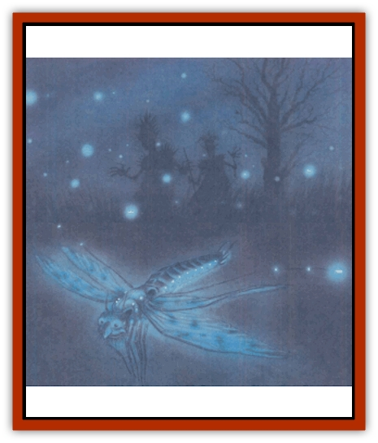

# Sunfly

| Statistic | **Sunfly** |
| --- | --- |
| **Activity Cycle:** | Day |
| **Alignment:** | Chaotic good |
| **Armor Class:** | 6 |
| **Climate/Terrain:** | Any Upper Plane |
| **Damage/Attack:** | 1 |
| **Diet:** | Omnivore |
| **Frequency:** | Uncommon |
| **Hit Dice:** | 1+1 |
| **Intelligence:** | Semi- (2-4) |
| **Magic Resistance:** | None |
| **Morale:** | Unsteady (5-7) |
| **Movement:** | 3, Fl 30 (B) |
| **No. Appearing:** | 5-50 |
| **No. of Attacks:** | 1 |
| **Organization:** | Cloud |
| **Size:** | T (1' body) |
| **Special Attacks:** | Dazzle |
| **Special Defenses:** | Sundance |
| **THAC0:** | 19 |
| **Treasure:** | None |
| **XP Value:** | 120 |

Sunflies are tiny creatures native to the planes of good. They're occasionally used as messengers or couriers by the local [[Archon|archons]], [[Aasimon_General_Information|aasimon]], or petitioners. Sunflies also make excellent sentries and scouts, since there are a lot of 'em and they can cover a lot of ground quickly. However, for the most part sunflies have no desires or impulses other than creating wonderful dances of light and song, spreading joy and beauty wherever they go.

A sunfly resembles a large, golden [[Dragonfly|dragonfly]] with an eldritch, other-worldly quality. Their legs are long and spindly, their eyes are bright and rainbow-colored, and their wings are gossamer-thin. They also have mothlike antennae that catch sunlight like dew-coated spidersilk. Humans who might otherwise be alarmed by the sight of such a large insect instead find the sunfly to be a beautiful, inoffensive, and fragile creature. By daylight, the sunfly's golden carapace and silvery wings reflect the light in a dazzling array of color. At dusk, the insects release light they've stored all day long in a soft faerie glow. A sunfly's wings produce a soothing hum or song in flight, changing pitch with each maneuver or shift of the wind.

Sunflies aren't truly intelligent, but they're highly empathic and have a sense for a creature's alignment. Evil persons or monsters will be tormented unceasingly - sunflies are smart enough to go get a more powerful servant of good to deal with the intruders.

**Combat:** Sunflies resort to physical attacks only under the direst conditions. They'd much rather avoid conflict, and their high speed and maneuverability usually guarantee a quick escape. A really angry sunfly can bite for 1 point of damage.

Sunflies are capable of creating a dazzling burst of light once per hour. The victims must be looking at the sunfly and must be within 10 feet. If they fail saving throws versus spell, they're blinded for 2d4 rounds. The sunfly prefers to use its physical attack against an opponent handicapped by dazzled vision. A cloud of sunflies often surrounds a party of intruders and flashes together to ensure that all of the possible targets are affected at once.

If there are 12 or more sunflies together, they can choose to perform a sundance instead of attacking or dazzling. By flying in a circular pattern, weaving and singing, the sunflies protect themselves and anything inside the pattern with a double-strength *protection from evil*. Sunflies can use this ability to trap evil creatures who can't penetrate a *protection from evil* by weaving the sundance around them, preventing them from moving. The area protected by a sundance is one foot in diameter for each fly in the cloud, so a group of 25 sunflies can create a circle of protection 25 feet in diameter.

**Habitat/Society:** Sunflies are nomadic creatures, moving from place to place constantly. In a typical day a cloud of sunflies'll migrate 15 or 20 miles. By night, the insects find a tree or bush to sleep in, curling up among the branches and dimming their lights to a faint gleam.

The more sunflies in a cloud, the more intelligent they seem to be. A large cloud can assign pickets or scouts to look for evil intruders, dispatch messengers to seek reinforcements, and use its collective dazzle and sundance ability to contain and confuse opponents until help arrives. The dances and songs performed by the sunflies grow more beautiful and intricate with each additional insect. As noted before, sunflies seem to have rudimentary *know alignment* and *empathy* abilities, and they can communicate surprisingly well by performing songs and dances for onlookers. The observer'll pick up on a message of welcome, a warning of danger, or an invitation to play without even realizing that he's deciphered the meaning of the display.

A sunfly cloud has no specific leaders. Decisions seem to be made by consensus. Sunflies are insatiably curious and may follow interesting people for hours, just to see what they're doing.

Sunflies are prized for their beauty by the residents of the Upper Planes. It's not uncommon for all work to stop in an Elysian town as the citizens gather in a nearby field to watch the sunflies dance at dusk. Any person familiar with sunflies knows that they keep their beauty only so long as they're free; caging a sunfly brings about its death in a matter of hours.

**Ecology:** Sunflies live on small, mundane insects, fruit, and nuts or berries. Some sages speculate that their diets may be supplemented by an ability to derive nourishment from sunshine, just as plants do. Whether or not this's true, it's a fact that sunflies can't be awakened at night - with one and only one significant exception.

Sunflies mate once a year, on midsummer eve or its closest equivalent in their current plane. The longest night of the summer is the only night of the year in which sunflies can remain awake, and they perform breathtaking dances from dusk to dawn. Sunflies always lay just one egg for each member of the cloud, concealing them on the topside of sunny leaves high in trees. The eggs hatch in 2 to 20 days, and the youg sunflies emerge as tiny golden moths - they never go through a larval stage. Sunflies grow to their full size in about 2 months, and can live for up to 10 years.

---
## Discovery & Documentation

**Source Publication:** Planescape II (1996)
**Campaign Setting:** Planescape
**Author(s):** Rich Baker, Karen S. Boomgarden

### Other Creatures Found in This Source Book
   * [[Aasimar|Aasimar]]
   * [[Abrian|Abrian]]
   * [[Arcane|Arcane]]
   * [[Balaena|Balaena]]
   * [[Beholder-kin_Observer|Beholder-kin, Observer]]
   * [[Bloodthorn|Bloodthorn]]
   * [[Bonespear|Bonespear]]
   * [[Darkweaver|Darkweaver]]
   * [[Demarax|Demarax]]
   * [[Dhour|Dhour]]
   * [[Eater_of_Knowledge|Eater of Knowledge]]
   * [[Eladrin_Greater_Firre|Eladrin, Greater, Firre]]
   * [[Eladrin_Greater_Ghaele|Eladrin, Greater, Ghaele]]
   * [[Eladrin_Greater_Tulani|Eladrin, Greater, Tulani]]
   * [[Eladrin_Lesser_Bralani|Eladrin, Lesser, Bralani]]
   * [[Eladrin_Lesser_Coure|Eladrin, Lesser, Coure]]
   * [[Eladrin_Lesser_Noviere|Eladrin, Lesser, Noviere]]
   * [[Eladrin_Lesser_Shiere|Eladrin, Lesser, Shiere]]
   * [[Fhorge|Fhorge]]
   * [[Ghostlight|Ghostlight]]
   * [[Guardinal_Avoral|Guardinal, Avoral]]
   * [[Guardinal_Cervidal|Guardinal, Cervidal]]
   * [[Guardinal_General_Information|Guardinal, General Information]]
   * [[Guardinal_Equinal|Guardinal, Equinal]]
   * [[Guardinal_Leonal|Guardinal, Leonal]]
   * [[Guardinal_Lupinal|Guardinal, Lupinal]]
   * [[Guardinal_Ursinal|Guardinal, Ursinal]]
   * [[Hollyphant|Hollyphant]]
   * [[Incantifer|Incantifer]]
   * [[Ironmaw|Ironmaw]]
   * [[Keeper|Keeper]]
   * [[Khaasta|Khaasta]]
   * [[Leomarh|Leomarh]]
   * [[Monster_of_Legend|Monster of Legend]]
   * [[Mortai|Mortai]]
   * [[Noctral|Noctral]]
   * [[Quill|Quill]]
   * [[Razorvine|Razorvine]]
   * [[Reave|Reave]]
   * [[Retriever|Retriever]]
   * [[Rilmani_Abiorach|Rilmani, Abiorach]]
   * [[Rilmani_General_Information|Rilmani, General Information]]
   * [[Rilmani_Argenach|Rilmani, Argenach]]
   * [[Rilmani_Aurumach|Rilmani, Aurumach]]
   * [[Rilmani_Cuprilach|Rilmani, Cuprilach]]
   * [[Rilmani_Ferrumach|Rilmani, Ferrumach]]
   * [[Rilmani_Plumach|Rilmani, Plumach]]
   * [[Shadowdrake|Shadowdrake]]
   * [[Spellhaunt|Spellhaunt]]
   * [[Spider_Hook|Spider, Hook]]
   * [[Sword_Spirit|Sword Spirit]]
   * [[Tanar'ri_Lesser_Bulezau|Tanar'ri, Lesser, Bulezau]]
   * [[Tanar'ri_Lesser_Maurezhi|Tanar'ri, Lesser, Maurezhi]]
   * [[Tanar'ri_Lesser_Yochlol|Tanar'ri, Lesser, Yochlol]]
   * [[Tanar'ri_General_Information|Tanar'ri, General Information]]
   * [[Tanar'ri_True_Alkilith|Tanar'ri, True, Alkilith]]
   * [[Terlen|Terlen]]
   * [[Tso|Tso]]
   * [[T'uen-rin|T'uen-rin]]
   * [[Vaporighu|Vaporighu]]
   * [[Vorr|Vorr]]
   * [[Wastrel|Wastrel]]
   * [[Wraithworm|Wraithworm]]
   * [[Yugoloth_Lesser_Canoloth|Yugoloth, Lesser, Canoloth]]
   * [[Zoveri|Zoveri]]
