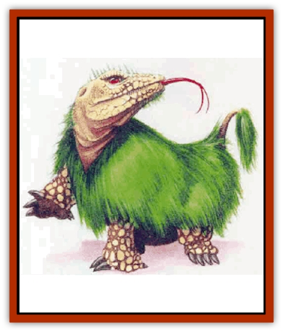

# Surtaki

| Statistic | **Surtaki** |
| --- | --- |
| **Activity Cycle:** | Any |
| **Alignment:** | Chaotic evil |
| **Armor Class:** | 6 |
| **Climate/Terrain:** | Open hills, badlands |
| **Damage/Attack:** | 1d10 (hoof)/1d10 (hoof)/1d6 (bite) |
| **Diet:** | Carnivore |
| **Frequency:** | Very rare |
| **Hit Dice:** | 6 |
| **Intelligence:** | Semi- (2-4) |
| **Magic Resistance:** | Nil |
| **Morale:** | Elite (13) |
| **Movement:** | 12 |
| **No. Appearing:** | 1d3 |
| **No. of Attacks:** | 3 |
| **Organization:** | Solitary |
| **Size:** | L (5' at the shoulder) |
| **Special Attacks:** | Charge |
| **Special Defenses:** | Quills, disease |
| **THAC0:** | 15 |
| **Treasure:** | Nil |
| **XP Value:** | 650 |

The origin of these ravenous beasts is unknown; as usual the mad wizard's experiment is suspected, although they may be the spawn of some twisted, inimical power. In any case, they are nightmarish creatures the size of a large bull, with a giant serpent's head, tortoise feet, thick green fur, and a horse's tail.

**Combat:** A surtaki's shaggy fur conceals dozens of barbed quills, similar to those of a [[Porcupine|giant porcupine]]. Any creature that strikes a surtaki in melee combat must make a successful saving throw vs. wand to avoid the quills. If the save fails, the attacker suffers 1d6 points of damage and must make a second saving throw, this time against poison. If that saving throw fails, the attacker contracts a rotting disease that causes one point of damage each round thereafter. The disease also prevents normal and magical healing and regeneration. A *cure disease* spell halts its effects. Characters who die from this disease can be recovered only hy a *wish* or *resurrection*.

When hunting, surtakis usually lie in wait for their prey, hiding behind the crest of a hill or in dense undergrowth and charging at anything that comes within 100 yards, as long as it isn't bigger that the surtaki itself. This charge attack gives the surraki the standard penalties and bonuses as explained in the *Player's Handbook*: a +2 bonus to the attack roll and a +1 penalty to Armor Class; opponents being charged receive a -2 bonus tn initiative and can inflict double damage with weapons set for a charge.

Surtakis soend about two-thirds of their time snoozing to conserve energy. They never really fall into a deep sleep, however, and their keen senses of hearing and smell usually alert them when prey or danger is at hand.

**Habitat/Society:** Surtakis are territorial hunters that inhabit mountain foothills, badlands, and other rough but fairly open country. Most adults tolerate each other only at mating time. Juveniles, however, tend to stick together for a year or two until they can carve out territodes for themselves. If two surtakis are encountered together they will be a mated pair (50%) or a pair of clutch mates (50%). Groups of three surtakis are always clutch mates, usually (75%) the same sex and always the same age.

**Ecology:** Surtaki are always hungry and will eat anything they can catch. They eat only meat but will scavenge if the opportunity presents itself.

Most surtaki live 35 to 40 years, attain their full growth in about five years, and mature sexually in about 10 years. A female surtaki mates every two years. After a year, she scrapes out a shallow nest on a sunny hillside and lays a clutch of 2d12 eggs, which hatch in 4d4+4 weeks. The mother keeps watch over the nest during this time and fearlessly attacks (morale 20) anything that comes near. Curiously enough, she takes no interest in the hatchlings when they appear and may eat them herself if she is hungry. Typically, only 1d6 hatchlings survive the first six weeks, and only 1d3 sulvive the first year.

Freshly-laid surtaki eggs are considered a great delicacy in some parts of Mystara, and sell for 2d4 gold pieces each. Tastes, however, vary widely, and many Mystarans find the eggs, fresh or otherwise, disgusting in the extreme. Surtaki hatchlings also have some value (1d4x10 gold pieces each), but they are hard to handle, as their spines harden and become dangerous within 30 minutes of hatching. Hatchlings would fetch higher prices were they not virtually untrainable. They are sometimes used as guard beast - their bizarre appearance can make a big impression - but they are untlustworthy and usually are used only if they can be released into an unused area where they are free to attack anything that enters, or if they can be *charmed* so that they will obey commands.

---
## Discovery & Documentation

**Source Publication:** Mystara Appendix (1994)
**Campaign Setting:** Mystara
**Author(s):** John Nephew, Teeuwynn Woodruff, John Terra, Skip Williams

### Other Creatures Found in This Source Book
   * [[Actaeon|Actaeon]]
   * [[Agarat|Agarat]]
   * [[Ash_Crawler|Ash Crawler]]
   * [[Baldandar|Baldandar]]
   * [[Bargda|Bargda]]
   * [[Bhut|Bhut]]
   * [[Bird_Mystara|Bird (Mystara)]]
   * [[Blackball|Blackball]]
   * [[Choker|Choker]]
   * [[Coltpixie|Coltpixie]]
   * [[Crone_of_Chaos|Crone of Chaos]]
   * [[Darkhood|Darkhood]]
   * [[Darkwing|Darkwing]]
   * [[Decapus|Decapus]]
   * [[Deep_Glaurant|Deep Glaurant]]
   * [[Diabolus|Diabolus]]
   * [[Dimensional_Warper|Dimensional Warper]]
   * [[Dragon_Mystara_Crystalline|Dragon (Mystara), Crystalline]]
   * [[Dragon_Mystara_Jade|Dragon (Mystara), Jade]]
   * [[Dragon_Mystara_Onyx|Dragon (Mystara), Onyx]]
   * [[Dragon_Mystara_Ruby|Dragon (Mystara), Ruby]]
   * [[Drake_Mystara|Drake (Mystara)]]
   * [[Dragonfly|Dragonfly]]
   * [[Dusanu|Dusanu]]
   * [[Elemental_of_Chaos_Air_Earth|Elemental of Chaos, Air/Earth]]
   * [[Elemental_of_Chaos_Fire_Water|Elemental of Chaos, Fire/Water]]
   * [[Elemental_of_Law_Air_Earth|Elemental of Law, Air/Earth]]
   * [[Elemental_of_Law_Fire_Water|Elemental of Law, Fire/Water]]
   * [[Familiar_Mystara|Familiar (Mystara)]]
   * [[Frost_Salamander|Frost Salamander]]
   * [[Fundamental_Air_Earth|Fundamental, Air/Earth]]
   * [[Fundamental_Fire_Water|Fundamental, Fire/Water]]
   * [[Gargantua_Mystara|Gargantua (Mystara)]]
   * [[Geonid|Geonid]]
   * [[Ghostly_Horde|Ghostly Horde]]
   * [[Giant_Athach|Giant, Athach]]
   * [[Giant_Hephaeston|Giant, Hephaeston]]
   * [[Golem_Drolem|Golem, Drolem]]
   * [[Golem_Mystara_I|Golem (Mystara) I]]
   * [[Golem_Mystara_II|Golem (Mystara) II]]
   * [[Golem_Mystara_III|Golem (Mystara) III]]
   * [[Gray_Philosopher|Gray Philosopher]]
   * [[Guardian_Warrior|Guardian Warrior]]
   * [[Gyerian|Gyerian]]
   * [[Herex|Herex]]
   * [[Hivebrood|Hivebrood]]
   * [[Horde|Horde]]
   * [[Hsiao|Hsiao]]
   * [[Huptzeen|Huptzeen]]
   * [[Hutaakan|Hutaakan]]
   * [[Imp_Mystara|Imp (Mystara)]]
   * [[Jellyfish_Giant_Mystara|Jellyfish, Giant (Mystara)]]
   * [[Kna|Kna]]
   * [[Kopru|Kopru]]
   * [[Lizard_Mystara|Lizard (Mystara)]]
   * [[Lizard-kin_Mystara|Lizard-kin (Mystara)]]
   * [[Lupin|Lupin]]
   * [[Lycanthrope_Werejaguar_Mystara|Lycanthrope, Werejaguar (Mystara)]]
   * [[Lycanthrope_Wereswine|Lycanthrope, Wereswine]]
   * [[Magen|Magen]]
   * [[Manikin|Manikin]]
   * [[Mek|Mek]]
   * [[Mujina|Mujina]]
   * [[Nagpa|Nagpa]]
   * [[Neh-thalggu|Neh-thalggu]]
   * [[Nightshade_Mystara|Nightshade (Mystara)]]
   * [[Nuckalavee|Nuckalavee]]
   * [[Pegataur|Pegataur]]
   * [[Phanaton|Phanaton]]
   * [[Plant_Dangerous_Mystara|Plant, Dangerous (Mystara)]]
   * [[Plasm|Plasm]]
   * [[Rakasta|Rakasta]]
   * [[Rock_Man|Rock Man]]
   * [[Sabreclaw|Sabreclaw]]
   * [[Sacrol|Sacrol]]
   * [[Scamille|Scamille]]
   * [[Shapeshifter|Shapeshifter]]
   * [[Shargugh|Shargugh]]
   * [[Shark-kin|Shark-kin]]
   * [[Sollux|Sollux]]
   * [[Spectral_Death|Spectral Death]]
   * [[Spectral_Hound|Spectral Hound]]
   * [[Spider-kin|Spider-kin]]
   * [[Spirit_Mystara|Spirit (Mystara)]]
   * [[Statue_Living|Statue, Living]]
   * [[Tabi|Tabi]]
   * [[Thoul|Thoul]]
   * [[Thunderhead|Thunderhead]]
   * [[Tiger_Ebon|Tiger, Ebon]]
   * [[Topi|Topi]]
   * [[Tortle|Tortle]]
   * [[Vampire_Velya|Vampire, Velya]]
   * [[White_Fang|White Fang]]
   * [[Worm_Mystara|Worm (Mystara)]]
   * [[Wyrd|Wyrd]]
   * [[Yowler|Yowler]]
   * [[Zombie_Lightning|Zombie, Lightning]]
