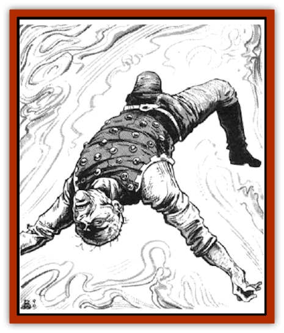

# Survivor

| Statistic | **Survivor** |
| --- | --- |
| **Activity Cycle:** | Any |
| **Alignment:** | Neutral good |
| **Armor Class:** | 10 |
| **Climate/Terrain:** | Phlogiston |
| **Damage/Attack:** | 1-4 |
| **Diet:** | Omnivore |
| **Frequency:** | Very rare |
| **Hit Dice:** | 10+ |
| **Intelligence:** | Exceptional (15-16) |
| **Magic Resistance:** | 30% |
| **Morale:** | Fearless (20) |
| **Movement:** | 0 |
| **No. Appearing:** | 1 |
| **No. of Attacks:** | 1 |
| **Organization:** | Solitary |
| **Size:** | M or S |
| **Special Attacks:** | Mind control |
| **Special Defenses:** | None |
| **THAC0:** | 20 |
| **Treasure:** | W |
| **XP Value:** | 3,000 |

Survivors are high-level, intelligent humans, demihumans, or humanoids who have been trapped in a state of suspended animation and drifting in the phlogiston for many years - often centuries, sometimes even longer. Such extreme exposure to the exotic vapors of the phlogiston works changes in the minds of the survivors, making them both more, and less, human.

When found, a survivor is in the unusual state of suspended animation induced by the phlogiston. Its skin is gray and stony. Its clothes are at least several decades, if not centuries, out of fashion. Aside from this, it looks just like any other person would after drifting in the phlogiston for any period of time. The only remarkable thing about it is that the survivor does not awaken from its phlogiston-induced coma for more than a few minutes or hours at a time. Its flesh returns to normal within hours after exposure to air. Wen conscious, it accepts food and drink (soup, water, ale, etc.), but it is extremely weak and unable to stand or speak above a whisper.

**Combat:** A survivor does not engage in normal melee or magical combat. Instead, it gradually takes over the minds of crew members aboard the spelljamming vessel that had the misfortune to rescue it. It takes over one crew member every day (24 hours), starting with the weakest or least intelligent and working its way up to more powerful and more useful slaves. Humans, demihumans, and humanoids are all targets. The character who is being attacked this way is allowed a saving throw vs. spells, but because the process is so gradual (stretching over the full 24-hour period), there is a -2 penalty to the die roll. A character who rolls an unmodified 20 saves automatically and also becomes vaguely aware that something is amiss. Other characters who save successfully without rolling a 20 may complain of headaches, but they blame these on foul air or bad food.

Once a character is controlled, the survivor can make full use of that character's senses. It can see, hear, taste, smell, and feel anything the character can. As it acquires more slaves, it can make use of any or all of their sensory input.

At first, controlled characters don't act any differently than before. Gradually (within a week), they become sullen and withdrawn, going about their work with no humor or enthusiasm. The more slaves the survivor has, the more sullen and withdrawn they all become.

Eventually, the survivor tries to seize control of the ship. If it controls everyone aboard, this is quite easy. If it becomes aware that someone aboard is getting suspicious and it feels that its chances are good, or it senses that it may be attacked, it stages a mutiny, using whatever slaves it has to take the ship by force. Its slaves still have the full use of all their powers and abilities, and the survivor uses these as intelligently as possible during a mutiny. (If, for example, the survivor controls the ship's captain and crew, but it believes that a group of PC passengers is getting suspicious, it may simply have the captain try to calm their fears and explain that this sort of sullen behavior is common toward the end of a long voyage, thereby buying more time in which to try enslaving the PCs.)

The effect of the survivor's enslavement can be removed by the 5th-level priest spell *dispel evil*, the 3rd-level wizard spell *dispel magic* (the survivor is considered a 10th-level wizard for purposes of *dispelling* its control), or a *wish* or *limited wish*. Once released from the survivor's control, a former slave knows that he feels better, but doesn't know why.

**Habitat/Society:** The survivor has no social structure. It is almost always entirely solitary. More than one may be encountered if the DM wants to challenge an especially powerful group of PCs, but this should be reserved for extreme cases. (They may have been a pair of criminals who were lashed together and thrown overboard, for example, explaining how they managed to stay together through the years.)

Once the survivor takes control of a ship, its only goal is to acquire more slaves. The survivor can control a number of slaves equal to 10 times its Intelligence score. If it reaches a port, it may have its slaves move it ashore, where it could conceivably enslave an entire small town. Or, it may continue operating the spelljammer, taking on unsuspecting passengers at every port.

**Ecology:** The survivor's only desire is sensory input, which it has been starved of for so long, and it will do anything to get it.

---
## Discovery & Documentation

**Source Publication:** MC7 Spelljammer Appendix I (1990)
**Campaign Setting:** Advanced Dungeons & Dragons 2nd Edition
**Author(s):** various

### Other Creatures Found in This Source Book
   * [[Aartuk|Aartuk]]
   * [[Albari|Albari]]
   * [[Ancient_Mariner|Ancient Mariner]]
   * [[Argos|Argos]]
   * [[Beholder_Abomination_Astereater|Beholder (Abomination), Astereater]]
   * [[Blazozoid|Blazozoid]]
   * [[Chattur|Chattur]]
   * [[Chevall|Chevall]]
   * [[Clockwork_Horror|Clockwork Horror]]
   * [[Colossus|Colossus]]
   * [[Delphinid|Delphinid]]
   * [[Dizantar|Dizantar]]
   * [[Dog|Dog]]
   * [[Dog_Bog_Hound|Dog, Bog Hound]]
   * [[Esthetic|Esthetic]]
   * [[Focoid|Focoid]]
   * [[Fractine|Fractine]]
   * [[Giant_Spacesea|Giant, Spacesea]]
   * [[Golem_Furnace|Golem, Furnace]]
   * [[Golem_Radiant|Golem, Radiant]]
   * [[Gravislayer|Gravislayer]]
   * [[Grommam|Grommam]]
   * [[Hadozee|Hadozee]]
   * [[Hamster_Giant_Space|Hamster, Giant Space]]
   * [[Jammer_Leech|Jammer Leech]]
   * [[Lakshu|Lakshu]]
   * [[Lumineaux|Lumineaux]]
   * [[Lutum|Lutum]]
   * [[Mimic_Space|Mimic, Space]]
   * [[Misi|Misi]]
   * [[Moon_Rogue|Moon, Rogue]]
   * [[Mortiss|Mortiss]]
   * [[Murderoid|Murderoid]]
   * [[Nay-Churr|Nay-Churr]]
   * [[Phlog-Crawler|Phlog-Crawler]]
   * [[Plasman|Plasman]]
   * [[Plasmoid_DeGleash|Plasmoid, DeGleash]]
   * [[Plasmoid_DelNoric|Plasmoid, DelNoric]]
   * [[Plasmoid_General_Information|Plasmoid, General Information]]
   * [[Plasmoid_Ontalak|Plasmoid, Ontalak]]
   * [[Puffer|Puffer]]
   * [[Q'nidar|Q'nidar]]
   * [[Rastipede|Rastipede]]
   * [[Reigar|Reigar]]
   * [[Rock_Hopper|Rock Hopper]]
   * [[Slinker|Slinker]]
   * [[Spider_Asteroid|Spider, Asteroid]]
   * [[Spiritjam|Spiritjam]]
   * [[Syllix|Syllix]]
   * [[Symbiont_Power|Symbiont, Power]]
   * [[Vine_Infinity|Vine, Infinity]]
   * [[Wiggle|Wiggle]]
   * [[Wizshade|Wizshade]]
   * [[Wryback|Wryback]]
   * [[Zard|Zard]]
   * [[Zodar|Zodar]]
