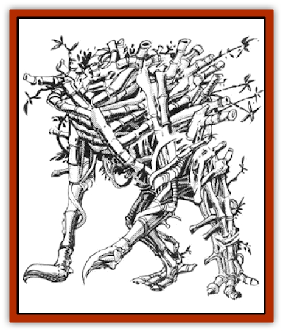

# Sussurus

| Statistic | **Sussurus** |
| --- | --- |
| **Activity Cycle:** | Any |
| **Alignment:** | Neutral |
| **Armor Class:** | 3 |
| **Climate/Terrain:** | Tropical or subtropical land |
| **Damage/Attack:** | 3-18/3-18 |
| **Diet:** | Omnivore |
| **Frequency:** | Very rare |
| **Hit Dice:** | 10 |
| **Intelligence:** | Low (5-7) |
| **Magic Resistance:** | See below |
| **Morale:** | Elite (15-16) |
| **Movement:** | 15 |
| **No. Appearing:** | 1 |
| **No. of Attacks:** | 2 |
| **Organization:** | Solitary |
| **Size:** | L (7-12' tall) |
| **Special Attacks:** | Impalement |
| **Special Defenses:** | See below |
| **THAC0:** | 11 |
| **Treasure:** | X (P) |
| **XP Value:** | 7,000 |

Sussuri are distant cousins to the creatures known as [[Shambling_Mound|shambling mounds]]. They appear as headless humanoid piles of rotting bamboo, moving about on all four limbs.

**Combat:** A sussurus is a deadly adversary and does not idly challenge [[Shambling_Mound|shamblers]] for the title of "most deadly form of plant life known". Its "forepaws" end in wickedly sharp bamboo claws, which inflict 3d6 points of piercing damage each time they hit. Even more terrifying is the fact that anyone unfortunate enough to be struck by both forepaws in the same round is crushed onto the bamboo spikes which cover the sussurus' exoskeleton. Victims suffer an additional 3d8 points of damage from this "hug".

The interior of a sussurus is covered by an exoskeleton made of several layers of decaying bamboo. This provides the creature with a formidable AC of 3. All weapons which strike a sussurus successfully only cause half the normal damage as the force of the blows is reduced by passing through the various layers of rotting material.

Lightning does not harm sussuri but, unlike shambling mounds, such attacks do not give the creature additional power either. Fire and cold-based attacks against sussuri cause half or no damage, depending upon whether or not the sussurus' saving throw was successful. Sussuri loathe fire and will immediately attack anyone carrying a porch or lantern. Spellcasters who make obvious use of fire-based magics are likewise assaulted.

Sussuri are suxeptible to spells that affect plants, but with a +2 bonus to their saving throws against such magics. It has been reported, although never confirmed, that sussuri are also vulnerable to *warp wood* spells (causing 3d10 points of damage).

A sussurus is able to inhale and exhale air through the numerous tubes of bamboo which cover its surface. Such activity causes the characteristic "dronesong" associated with the creature. This weird and eerie melody can have dire consequences for unwary adventurers. Those hearing the dronesong must save versus spells or fall into a deep sleep for 3d4 hours or until they are physically attacked. Even certain types of undead creatures (those with 4 HD or less) are affected by this strange music. This phenomenon is known as "the sleep of the dead". While "asleep" the undead cannot be turned or destroyed, but will awaken to defend themselves if attacked physically.

Sussuri are believed to have a lifespan of over 1,000 years, provided they are able to find sufficient food to sustain them. A sussurus has no brain or vital organs to speak of. Its meager intelligence and other life components are spread throughout a decentralized system located deep within its exoskeleton. Therefore, amputating wounds do not harm a sussurus at all. As one "limb" is lost, the remaining mass of the creature joins together to form a new limb by the next combat round. Only when enough damage has penetrated through the tough exoskeleton will a sussurus die. Even then, if its remains are left in a collective heap, a sussurus will return to life in 2d6 hours. Such sussuri are extremely weak (1d8 hit points) and will seek to return to their dank lairs, there to heal and nurse their rage.

A sussurus "sees" and "hears" by detecting air disturbances through its tube-riddled exoskeleton. Therefore, a sussurus is immune to all forms of magic which affect or rely upon sight or hearing. Sussuri can also detect the presence of invisible objects or beings in this manner.

Sussuri are nearly invisible (-3 penalty to an opponent's surprise rolls) within clumps of bamboo or large growths of reeds. Sussuri wait in such places for other creatures to come near. They will then either rush out for a direct assault or begin their dronesong in an effort to first subdue the beings. Many a party has perished for choosing a camp site too close to the lair of a sussurus.

**Habitat/Society:** Similar to their shambler cousins, sussuri are only found in warm regions of heavy rainfall and vegetation. Dense clumps of bamboo or other reed-like plants are the favored lairs of a sussurus.

Despite their solitary nature, sussuri have been known to communicate to each other by means of slight and subtle variations in their dronesong. However, it is only very rarely that two or more sussuri are close enough to communicate in this manner.

**Ecology:** Sussuri often compete with shambling mounds for territory and prey, thus most sussuri attack shamblers on sight.

---
## Discovery & Documentation

**Source Publication:** MC14 Fiend Folio Appendix (1992)
**Campaign Setting:** Fiends Folio
**Author(s):** Don Bingle, John Terra, Wes Nicholson, Tim Beach, Steve Hardinger, Kris Hardinger, Rob Nicholls, Greg Swedberg, Al Boyce, Vince Garcia, Norm Ritchie

### Other Creatures Found in This Source Book
   * [[Aballin|Aballin]]
   * [[Achaierai|Achaierai]]
   * [[Adherer|Adherer]]
   * [[Algoid|Algoid]]
   * [[Al-Mi'raj|Al-Mi'raj]]
   * [[Apparition|Apparition]]
   * [[Caterwaul|Caterwaul]]
   * [[Coffer_Corpse|Coffer Corpse]]
   * [[Crabman|Crabman]]
   * [[Dark_Creeper|Dark Creeper]]
   * [[Dark_Stalker|Dark Stalker]]
   * [[Darter|Darter]]
   * [[Denzelian|Denzelian]]
   * [[Dune_Stalker|Dune Stalker]]
   * [[Dwarf_Urdunnir|Dwarf, Urdunnir]]
   * [[Falcon_Fire|Falcon, Fire]]
   * [[Faux_Faerie|Faux Faerie]]
   * [[Flawder|Flawder]]
   * [[Fyrefly|Fyrefly]]
   * [[Gambado|Gambado]]
   * [[Garbug|Garbug]]
   * [[Giant_Fhoimorien|Giant, Fhoimorien]]
   * [[Gibberling|Gibberling]]
   * [[Gorbel|Gorbel]]
   * [[Grimlock|Grimlock]]
   * [[Hellcat|Hellcat]]
   * [[Ice_Lizard|Ice Lizard]]
   * [[Iron_Cobra|Iron Cobra]]
   * [[Khargra|Khargra]]
   * [[Mantari|Mantari]]
   * [[Penanggalan|Penanggalan]]
   * [[Pernicon|Pernicon]]
   * [[Phantom_Stalker|Phantom Stalker]]
   * [[Retriever|Retriever]]
   * [[Ruve|Ruve]]
   * [[Scathe|Scathe]]
   * [[Sheet_Ghoul_Sheet_Phantom|Sheet Ghoul/Sheet Phantom]]
   * [[Shocker|Shocker]]
   * [[Spanner|Spanner]]
   * [[Stwinger|Stwinger]]
   * [[Symbiotic_Jelly|Symbiotic Jelly]]
   * [[Terithran|Terithran]]
   * [[Thunder_Children|Thunder Children]]
   * [[Troll_Ice|Troll, Ice]]
   * [[Tween|Tween]]
   * [[Umpleby|Umpleby]]
   * [[Volt|Volt]]
   * [[Xill|Xill]]
   * [[Xvart|Xvart]]
   * [[Zygraat|Zygraat]]
