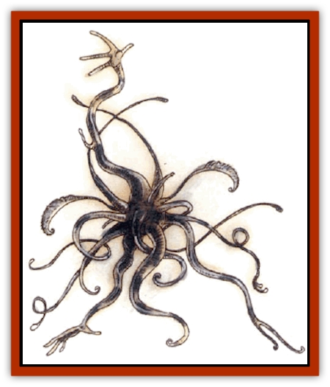

# Suwyze

| Statistic | **Suwyze** |
| --- | --- |
| **Activity Cycle:** | Any |
| **Alignment:** | Neutral |
| **Armor Class:** | 4 |
| **Climate/Terrain:** | Any subterranean |
| **Damage/Attack:** | 1d6 |
| **Diet:** | Omnivore |
| **Frequency:** | Very rare |
| **Hit Dice:** | 4+4 |
| **Intelligence:** | Exceptional (15-16) |
| **Magic Resistance:** | Nil |
| **Morale:** | Steady (11-12) |
| **Movement:** | 12, Cl 12 |
| **No. Appearing:** | 1 |
| **No. of Attacks:** | 8 |
| **Organization:** | Solitary |
| **Size:** | H (20' diameter) |
| **Special Attacks:** | Spells, tendrils |
| **Special Defenses:** | Never surprised |
| **THAC0:** | 15 |
| **Treasure:** | I |
| **XP Value:** | 975 |

The suwyze seems to be composed entirely of feathery antennae, wispy tendrils, and long feelers - a huge mass of sensory organs. Though it takes up a large volume, most of the creature is composed of its appendages, and only its central body has much mass. The suwyze is a watching sort of beast, favorite among mages and others who require security without a great bother. Suwyze can learn a burbling, garbled version of Common, though few masters teach it to them. They move in a rippling, flowing motion, and they can cling to most surfaces well enough to climb walls, but not cling to ceilings.

**Combat:** The suwyze can see danger coming from a distance, as its feelers and tendrils allow it to sense light, heat. faint odors, winds, magical auras, strong good or evil creatures, and even subtle pressure changes that might indicate opening and closing doors. Suwyze sleep fitfully, and some of their feelers are active even then. When something triggers their sense of danger, they become instantly alert, so a suwyze can never be surprised. The typical response is to tell the master and hide.

The suwyze can use each of the following spell-like abilities three times per day: *clairaudience*, *clairvoyance*, *detect good*, *detect evil*, *detect magic*, *invisibility*, *shout*, and *wizard eye*. It uses these to track even difficult opponents throughout an area. Its powers of perception also grant the suwyze a +2 bonus to saving throws against all illusion-based magic.

If forced into melee, a suwyze attacks with its feeding tendrils, each a 10-foot-long whiplike appendage covered with coarse, sandpapery skin. These abrasive whips cause 1d6 points of damage when each strikes. A more important ability is indulging magical double vision in their opponents as a play for sympathy: Unless the victim rolls a successful save vs. spell, the attacker begins seeing the combat from the suwyze's point of view, in a somewhat doctored form. This disoriente lion imposes a -3 penalty upon all attack rolls. Hearing the piteous cries of the suwyze and seeing the magically exaggerated effects of each blow are so eerie that opponents suffer a -1 penalty to damage rolls as well. If this ability fails, a suwyze magically shouts for help, blasting opponents in the process.

A suwyze can use rings and bracers on its tendrils, and a favored beast may be granted these items by a gracious master.

**Habitat/Society:** The suwyze is a curious beast, one probably too clever for its own good. It views its guard duties as a diversion, something that it is good at but that it didn't take entirely seriously. Suwyze consider themselves philosophers, endlessly ruminating on the nature of perception or simply taking it all in. They are cowards as well, quick to warn of danger and prone to false alarms rather than ignoring a potential danger. They are spooked by odd noises, unfamiliar smells, strangers, or other new things in their environment.

The suwyze favors certain scents, colors, and textures, and over time its tastes harden. Older suwyze may object to being housed anywhere except in an area specifically designed to meet their needs. These preferences make them difficult to transfer from one area to another; they are good watchers, but they become entrenched in their habits.

Some suwyze are said to have distant contact with independent colonies established by progressive, independent suwyze who are free of any duties to masters or owaers. Given how vulnerable these creatures can be, these "contacts" are probably merely the fancies of the suwyze's hyperactive senses.

**Ecology:** The suwyze almost always lives in a symbiotic relationship with other underground creatures. It may serve as a watchdog for a subterranean [[Dragon_General_Information|dragon]], evil races, or others - the suwyze doesn't care as long as it is fed well and often. Because of its extensive sensory powers, the suwyze must eat much more than other creatures of its size. Also, it requires more meat than most underground creatures.

---
## Discovery & Documentation

**Source Publication:** Dragon Mountain (1993)
**Campaign Setting:** Advanced Dungeons & Dragons 2nd Edition
**Author(s):** Colin McComb, Paul Arden Lidberg

### Other Creatures Found in This Source Book
   * [[Dragon-kin|Dragon-kin]]
   * [[Elemental_Earth_Kin_Earth_Weird|Elemental, Earth Kin, Earth Weird]]
   * [[Gnasher|Gnasher]]
   * [[Gnasher_Winged|Gnasher, Winged]]
   * [[Kobold_Dragon_Mountain|Kobold, Dragon Mountain]]
   * [[Living_Steel|Living Steel]]
   * [[Noran|Noran]]
   * [[Ophidian|Ophidian]]
   * [[Rautym|Rautym]]
   * [[Spider_Brain|Spider, Brain]]
   * [[Squeaker|Squeaker]]
   * [[Stone_Snake|Stone Snake]]
   * [[Tanar'ri_Greater_Wastrilith|Tanar'ri, Greater, Wastrilith]]
   * [[Undead_Dwarf|Undead Dwarf]]
