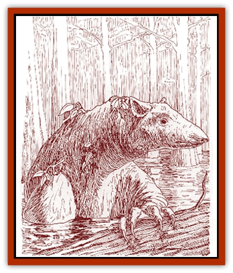

# Swampmare

| Statistic | **Swampmare** |
| --- | --- |
| **Activity Cycle:** | Day |
| **Alignment:** | Neutral |
| **Armor Class:** | 5 |
| **Climate/Terrain:** | Any swamp or rain forest |
| **Damage/Attack:** | 1d4/1d4/1d8 |
| **Diet:** | Herbivore |
| **Frequency:** | Uncommon |
| **Hit Dice:** | 3+1 |
| **Intelligence:** | Animal (1) |
| **Magic Resistance:** | Nil |
| **Morale:** | Average (8-10) |
| **Movement:** | 6, Sw 12 |
| **No. Appearing:** | 3d4 |
| **No. of Attacks:** | 3 (claw/claw/bite) |
| **Organization:** | Solitary |
| **Size:** | L (6-8' long) |
| **Special Attacks:** | Forefeet (1d6) |
| **Special Defenses:** | Plant form |
| **THAC0:** | 17 |
| **Treasure:** | Nil |
| **XP Value:** | 175 |

Swampmares are large, water-loving creatures related to tapirs. The [[Lizard_Kin_Savage_Coast|gurrash]] of the Bayou use them as war mounts, beasts of burden, and occasionally as food. The swampmare is just big enough to carry a single gurrash rider. Swampmares can swim and walk through water, swamp muck, and the overgrown swamp jungle.

All swampmares have tough, leathery skin with a greenish coloration. They also have webbed, clawed feet to aid them in swimming through deep swamp muck. Its head is characterized by a short snout, beady eyes, and short ears.

**Combat:** Swampmares may take the form of a bald cypress tree. A swampmare in cypress-tree form is indistinguishable from a real cypress. The ability to transform into a tree provides the swampmare with an excellent defense mechanism against large, meat-loving predators. Swampmares found in rain forests transform into more appropriate tree forms.

In combat, the swampmare delivers a vicious bite. In the water, the swampmare can also lash out with its clawed forefeet, using all four of its attacks.

If a swampmare fails a morale check during combat and fleeing appears to be impossible, it turns into a tree and attempts to wait out the trouble. The transformation process takes one round. The tree form, while not invulnerable, is considerably tougher. Treat the cypress-tree form as AC 0. Weapon attacks to the tree-form do a maximum of 1 point of damage per round. This plant form does not bleed or otherwise reveal that it is an animal in plant form.

In areas with thick vegetation, the swampmare's coloration allows it to blend into the background, giving the swampmare a 30% chance to hide in shadows.

**Habitat/Society:** Swampmares live in dense rain forests and swamps. When threatened, they squeal and flee to the water for safety; their squeal seems to be a means of communication with other members of the family group.

The swampmares used by the gurrash are domestic, carefully bred strains.

**Ecology:** A swampmare can remain in tree form for up to six hours per day. As a swampmare ages, it spends more and more time in cypress-tree form. Finally, when a swampmare succumbs to old age, it usually simply transforms itself into a tree and never changes back.

Swampmares feed primarily on leaves, fruit, and other vegetation. They need a minimum of two hours of sunlight per day in order to stay healthy. Also, a swampmare that spends three or more hours in tree-form in strong sunlight gathers enough energy to "feed" itself for a day. The gurrash often take advantage of this ability during times of war. They simply encourage their swampmare mounts to turn into trees for a few hours each day, eliminating their need for food.

Bald cypress trees are deciduous and have massive trunks that can be as much as 170 feet high. The roots of the bald cypress form natural crooks or knees that extend above the water. The knees are frequently used for the construction of wooden boats. The bald cypress is a valuable timber tree, and the gurrash could probably make a considerable profit from timber sales if they were willing to trade.

---
## Discovery & Documentation

**Source Publication:** Monstrous Compendium Savage Coast Appendix (Online Exclusive) (1995)
**Campaign Setting:** Mystara
**Author(s):** Loren L Coleman, Ted James, Thomas Zuvich, Cindi M. Rice

### Other Creatures Found in This Source Book
   * [[Aranea_Savage_Coast|Aranea (Savage Coast)]]
   * [[Arashaeem|Arashaeem]]
   * [[Batracine|Batracine]]
   * [[Cat_Marine|Cat, Marine]]
   * [[Cinnavixen|Cinnavixen]]
   * [[Clockwork_Swordsman|Clockwork Swordsman]]
   * [[Critter_Temple|Critter, Temple]]
   * [[Cursed_One|Cursed One]]
   * [[Deathmare|Deathmare]]
   * [[Dragon_Savage_Coast_Crimson|Dragon (Savage Coast), Crimson]]
   * [[Dragon_Savage_Coast_Red_Hawk|Dragon (Savage Coast), Red Hawk]]
   * [[Echyan|Echyan]]
   * [[Ee'aar|Ee'aar]]
   * [[Enduk|Enduk]]
   * [[Fachan_Savage_Coast|Fachan (Savage Coast)]]
   * [[Feliquine|Feliquine]]
   * [[Fiend_Narvaezan|Fiend, Narvaezan]]
   * [[Frelôn|Frelôn]]
   * [[Ghriest|Ghriest]]
   * [[Glutton_Sea|Glutton, Sea]]
   * [[Goatman|Goatman]]
   * [[Golem_Naâruk|Golem, Naâruk]]
   * [[Golem_Savage_Coast|Golem (Savage Coast)]]
   * [[Grudgling|Grudgling]]
   * [[Heraldic_Servant_I|Heraldic Servant I]]
   * [[Heraldic_Servant_II|Heraldic Servant II]]
   * [[Heraldic_Servant_III|Heraldic Servant III]]
   * [[Heraldic_Servant_IV|Heraldic Servant IV]]
   * [[Heraldic_Servant_V|Heraldic Servant V]]
   * [[Heraldic_Servant_General_Information|Heraldic Servant, General Information]]
   * [[Hermit_Sea|Hermit, Sea]]
   * [[Jorri|Jorri]]
   * [[Juhrion|Juhrion]]
   * [[Kla'a-tah|Kla'a-tah]]
   * [[Leech_Legacy|Leech, Legacy]]
   * [[Lich_Inheritor|Lich, Inheritor]]
   * [[Lizard_Kin_Savage_Coast|Lizard Kin (Savage Coast)]]
   * [[Lupasus|Lupasus]]
   * [[Lupin|Lupin]]
   * [[Lyra_Bird_Saragón|Lyra Bird, Saragón]]
   * [[Malfera|Malfera]]
   * [[Manscorpion_Nimmurian|Manscorpion, Nimmurian]]
   * [[Mythuínn_Folk|Mythuínn Folk]]
   * [[Neshezu|Neshezu]]
   * [[Nikt'oo|Nikt'oo]]
   * [[Nosferatu|Nosferatu]]
   * [[Omm-wa|Omm-wa]]
   * [[Omshirim|Omshirim]]
   * [[Parasite_Savage_Coast|Parasite (Savage Coast)]]
   * [[Phanaton|Phanaton]]
   * [[Plant_Savage_Coast|Plant (Savage Coast)]]
   * [[Pudding_Vermilion|Pudding, Vermilion]]
   * [[Rakasta|Rakasta]]
   * [[Ray_Forest|Ray, Forest]]
   * [[Shedu_Greater_Savage_Coast|Shedu, Greater (Savage Coast)]]
   * [[Shimmerfish|Shimmerfish]]
   * [[Skinwing|Skinwing]]
   * [[Spawn_of_Nimmur|Spawn of Nimmur]]
   * [[Spider-spy|Spider-spy]]
   * [[Spirit_Heroic|Spirit, Heroic]]
   * [[Spirit_Walleran|Spirit, Walleran]]
   * [[Succulus|Succulus]]
   * [[Symbiont_Shadow|Symbiont, Shadow]]
   * [[Tortle|Tortle]]
   * [[Troll_Legacy|Troll, Legacy]]
   * [[Trosip|Trosip]]
   * [[Tyminid|Tyminid]]
   * [[Utukku|Utukku]]
   * [[Voat|Voat]]
   * [[Voat_Herathian|Voat, Herathian]]
   * [[Vulturehound|Vulturehound]]
   * [[Wallara|Wallara]]
   * [[Wurmling|Wurmling]]
   * [[Wynzet|Wynzet]]
   * [[Yeshom|Yeshom]]
   * [[Zombie_Red|Zombie, Red]]
